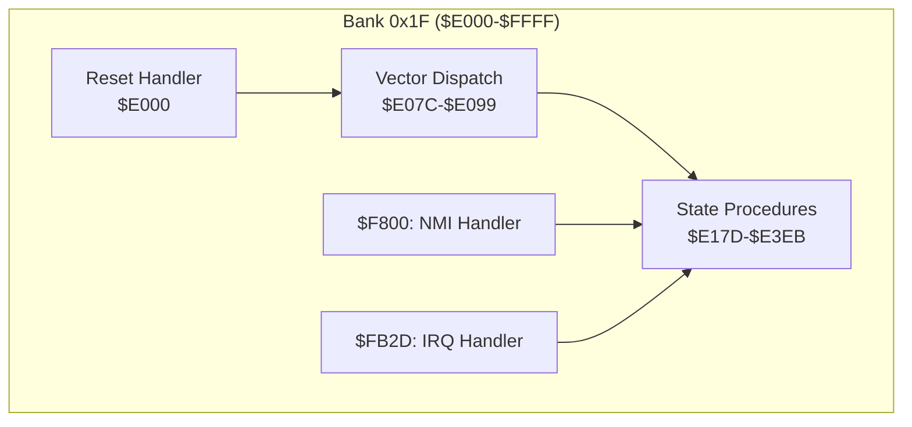
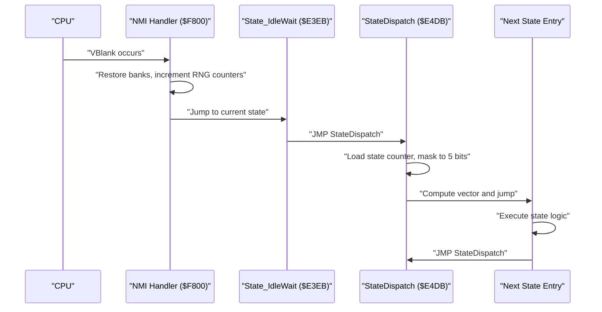
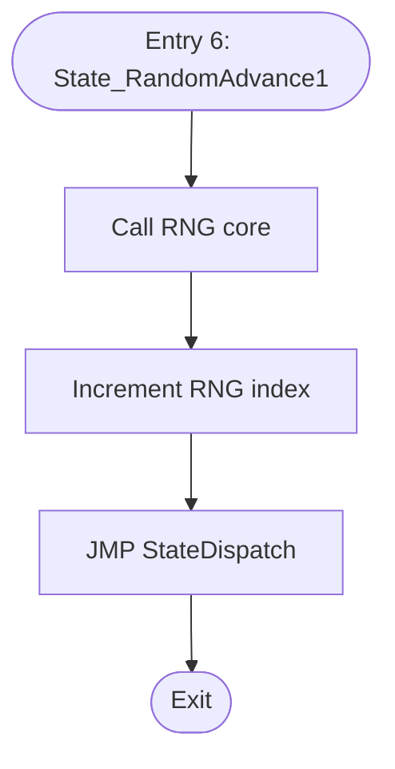
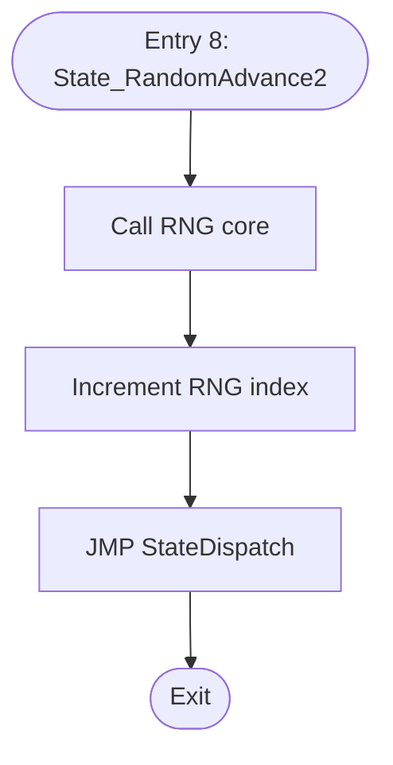
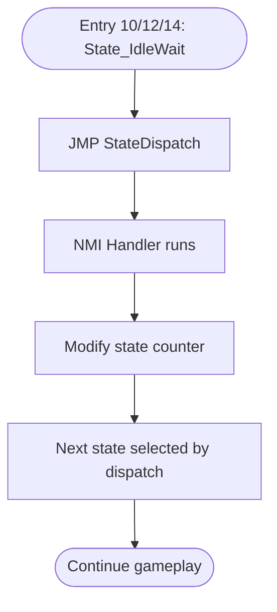
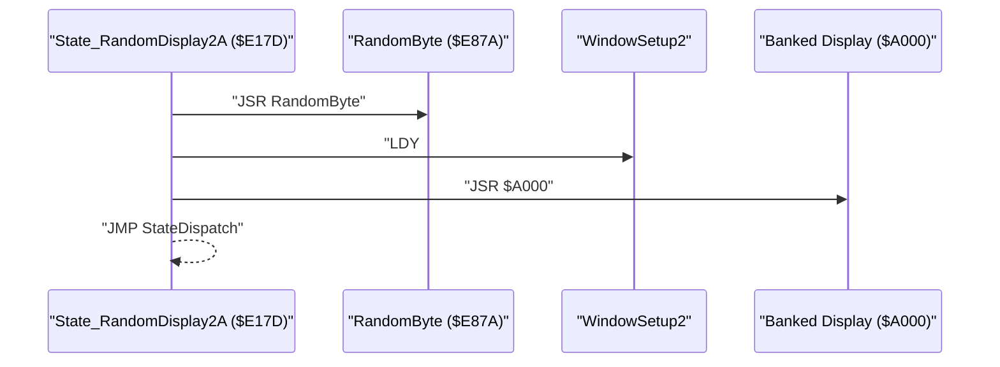
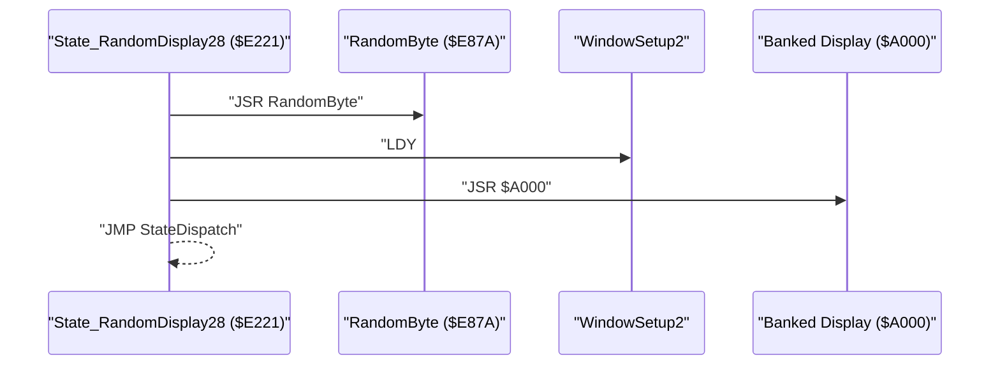
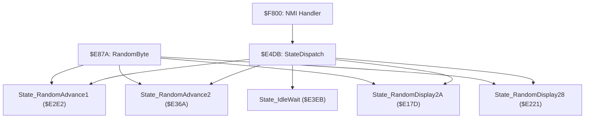

# Auxiliary States

<cite>
**Referenced Files in This Document**
- [bank_1f_analysis.md](file://code/bank_1f_analysis.md)
- [bank_1f_function_table.md](file://code/bank_1f_function_table.md)
- [bank_1f_plan.md](file://code/bank_1f_plan.md)
- [prg_1f.asm](file://asm/banks/prg_1f.asm)
- [prg_1f.asm.bak](file://asm/banks/prg_1f.asm.bak)
- [bank_1f_raw.asm](file://code/bank_1f_raw.asm)
</cite>

## Table of Contents
1. [Introduction](#introduction)
2. [Project Structure](#project-structure)
3. [Core Components](#core-components)
4. [Architecture Overview](#architecture-overview)
5. [Detailed Component Analysis](#detailed-component-analysis)
6. [Dependency Analysis](#dependency-analysis)
7. [Performance Considerations](#performance-considerations)
8. [Troubleshooting Guide](#troubleshooting-guide)
9. [Conclusion](#conclusion)

## Introduction
This document focuses on the auxiliary and support states in the game's state machine, specifically:
- State_RandomAdvance1 and State_RandomAdvance2 (entries 6 and 8) for random number seeding
- State_IdleWait (entries 10, 12, 14) for wait states and frame pacing
- State_RandomDisplay2A and State_RandomDisplay28 (entries 2 and 4) for display initialization sequences

These states are intentionally lightweight and serve as glue logic to maintain stable frame timing, seed randomness deterministically, and orchestrate display transitions between major gameplay phases. They minimize processing overhead and memory footprint while ensuring predictable performance and stability.

## Project Structure
The state machine resides in Bank 0x1F ($E000-$FFFF), which serves as the boot bank containing the reset handler, state dispatch, NMI/IRQ handlers, and supporting utilities. The relevant state implementations are located in the PRG 1F assembly source under the "State_" procedures.

**Diagram sources**
- [prg_1f.asm:2554-2658](file://asm/banks/prg_1f.asm#L2554-L2658)
- [bank_1f_analysis.md:54-76](file://code/bank_1f_analysis.md#L54-L76)

**Section sources**
- [bank_1f_analysis.md:1-100](file://code/bank_1f_analysis.md#L1-L100)
- [bank_1f_plan.md:1-50](file://code/bank_1f_plan.md#L1-L50)

## Core Components
- State_RandomAdvance1 ($E2E2): Advances the RNG by calling the RNG core and immediately returns to dispatch. No display operations occur.
- State_RandomAdvance2 ($E36A): Identical to State_RandomAdvance1, providing another RNG seeding opportunity before a display-heavy state.
- State_IdleWait ($E3EB): A null state that immediately jumps back to the dispatch routine. The NMI handler modifies the game state counter to exit the idle loop and continue the frame cycle.
- State_RandomDisplay2A ($E17D): Generates a random byte, prepares a display mode (Y=$2A), invokes a bank-switched display function, then returns to dispatch.
- State_RandomDisplay28 ($E221): Similar to State_RandomDisplay2A but uses Y=$28 for a different display content.

These states collectively:
- Provide deterministic RNG seeding points before critical gameplay decisions
- Offer controlled frame pacing via idle waits synchronized with NMI
- Enable minimal-cost transitions between major screens with display preparation

**Section sources**
- [bank_1f_function_table.md:8-23](file://code/bank_1f_function_table.md#L8-L23)
- [bank_1f_analysis.md:301-361](file://code/bank_1f_analysis.md#L301-L361)
- [bank_1f_analysis.md:406-413](file://code/bank_1f_analysis.md#L406-L413)
- [bank_1f_analysis.md:163-174](file://code/bank_1f_analysis.md#L163-L174)
- [bank_1f_analysis.md:229-240](file://code/bank_1f_analysis.md#L229-L240)

## Architecture Overview
The state machine uses a vector-based dispatch mechanism. Each state procedure performs its minimal work and then jumps back to the shared dispatch routine, which reads the current game state counter, masks it to 5 bits, computes a 16-bit vector, and jumps to the next state entry. The NMI handler runs once per frame and can modify the state counter to break idle loops and drive the main game flow.

**Diagram sources**
- [prg_1f.asm:2554-2658](file://asm/banks/prg_1f.asm#L2554-L2658)
- [prg_1f.asm:738-749](file://asm/banks/prg_1f.asm#L738-L749)
- [bank_1f_analysis.md:406-413](file://code/bank_1f_analysis.md#L406-L413)

## Detailed Component Analysis

### State_RandomAdvance1 (Entry 6)
Purpose:
- Advance the RNG without performing any display operations
- Provides a deterministic seed point before entering a state that depends on random values

Processing logic:
- Calls the RNG core to consume the next random byte from the pre-computed table
- Increments the RNG index in RAM
- Jumps back to the shared dispatch routine

Minimal processing characteristics:
- Single JSR to RNG core
- Single unconditional jump
- No PPU, sound, or controller operations

Memory usage:
- Uses the RNG index at a small RAM location to track progress through the table
- No additional heap allocations or persistent buffers

**Diagram sources**
- [prg_1f.asm:483-486](file://asm/banks/prg_1f.asm#L483-L486)
- [bank_1f_analysis.md:301-308](file://code/bank_1f_analysis.md#L301-L308)

**Section sources**
- [bank_1f_function_table.md:16](file://code/bank_1f_function_table.md#L16)
- [bank_1f_analysis.md:301-308](file://code/bank_1f_analysis.md#L301-L308)

### State_RandomAdvance2 (Entry 8)
Purpose:
- Duplicate of State_RandomAdvance1 for additional RNG seeding before another display state

Processing logic:
- Identical to State_RandomAdvance1: advances RNG and returns to dispatch

**Diagram sources**
- [prg_1f.asm:555-558](file://asm/banks/prg_1f.asm#L555-L558)
- [bank_1f_analysis.md:353-361](file://code/bank_1f_analysis.md#L353-L361)

**Section sources**
- [bank_1f_function_table.md:18](file://code/bank_1f_function_table.md#L18)
- [bank_1f_analysis.md:353-361](file://code/bank_1f_analysis.md#L353-L361)

### State_IdleWait (Entries 10, 12, 14)
Purpose:
- Provide a frame pacing mechanism using NMI-driven state transitions
- Allow the system to wait until the NMI handler decides to advance the game state

Behavior:
- Immediately jumps back to the shared dispatch routine
- The NMI handler increments RNG counters and restores bank registers each frame
- The NMI handler can modify the state counter to break out of the idle loop

**Diagram sources**
- [prg_1f.asm:624-625](file://asm/banks/prg_1f.asm#L624-L625)
- [bank_1f_analysis.md:406-413](file://code/bank_1f_analysis.md#L406-L413)
- [prg_1f.asm:2554-2658](file://asm/banks/prg_1f.asm#L2554-L2658)

**Section sources**
- [bank_1f_function_table.md:21](file://code/bank_1f_function_table.md#L21)
- [bank_1f_analysis.md:406-413](file://code/bank_1f_analysis.md#L406-L413)

### State_RandomDisplay2A (Entry 2)
Purpose:
- Generate a random byte and prepare a display mode before transitioning to a new screen
- Often used as a brief transitional state (e.g., dice roll or splash screen)

Processing logic:
- Calls the RNG core to produce a random byte
- Prepares a display mode parameter (Y=$2A)
- Invokes a bank-switched display function
- Returns to dispatch

**Diagram sources**
- [prg_1f.asm:281-287](file://asm/banks/prg_1f.asm#L281-L287)
- [bank_1f_analysis.md:163-174](file://code/bank_1f_analysis.md#L163-L174)

**Section sources**
- [bank_1f_function_table.md:9](file://code/bank_1f_function_table.md#L9)
- [bank_1f_analysis.md:163-174](file://code/bank_1f_analysis.md#L163-L174)

### State_RandomDisplay28 (Entry 4)
Purpose:
- Same as State_RandomDisplay2A but uses a different display mode parameter (Y=$28)
- Provides variety in transitional visuals or effects

Processing logic:
- Identical to State_RandomDisplay2A with the mode parameter changed to Y=$28

**Diagram sources**
- [prg_1f.asm:370-376](file://asm/banks/prg_1f.asm#L370-L376)
- [bank_1f_analysis.md:229-240](file://code/bank_1f_analysis.md#L229-L240)

**Section sources**
- [bank_1f_function_table.md:11](file://code/bank_1f_function_table.md#L11)
- [bank_1f_analysis.md:229-240](file://code/bank_1f_analysis.md#L229-L240)

## Dependency Analysis
The auxiliary states depend on:
- RNG core ($E87A) for randomization
- Shared dispatch routine ($E4DB) for state transitions
- NMI handler ($F800) for frame pacing and state counter updates
- Banked display functions for rendering during transitional states

**Diagram sources**
- [prg_1f.asm:483-486](file://asm/banks/prg_1f.asm#L483-L486)
- [prg_1f.asm:555-558](file://asm/banks/prg_1f.asm#L555-L558)
- [prg_1f.asm:281-287](file://asm/banks/prg_1f.asm#L281-L287)
- [prg_1f.asm:370-376](file://asm/banks/prg_1f.asm#L370-L376)
- [prg_1f.asm:738-749](file://asm/banks/prg_1f.asm#L738-L749)
- [prg_1f.asm:2554-2658](file://asm/banks/prg_1f.asm#L2554-L2658)

**Section sources**
- [bank_1f_analysis.md:54-76](file://code/bank_1f_analysis.md#L54-L76)
- [bank_1f_analysis.md:406-413](file://code/bank_1f_analysis.md#L406-L413)

## Performance Considerations
- Minimal CPU cycles: Each auxiliary state performs only a few operations (JSR, load immediate, jump), keeping overhead negligible.
- Predictable frame timing: Idle states are driven by NMI, ensuring consistent frame pacing regardless of CPU workload.
- Low memory footprint: These states use minimal RAM and no dynamic allocation, reducing memory pressure during gameplay.
- Deterministic RNG: RNG advances occur at known points, enabling reproducible gameplay behavior and simplifying debugging.

## Troubleshooting Guide
Common issues and checks:
- Idle state not exiting: Verify that the NMI handler increments the RNG counters and modifies the state counter appropriately. The idle loop relies on external state changes to break.
- Incorrect RNG sequencing: Ensure State_RandomAdvance1 and State_RandomAdvance2 are placed before states that rely on random values. Confirm the RNG index is advancing as expected.
- Display transition glitches: For State_RandomDisplay2A and State_RandomDisplay28, confirm the correct Y parameter is used and the banked display function is reachable.

**Section sources**
- [bank_1f_analysis.md:406-413](file://code/bank_1f_analysis.md#L406-L413)
- [bank_1f_analysis.md:301-308](file://code/bank_1f_analysis.md#L301-L308)
- [bank_1f_analysis.md:353-361](file://code/bank_1f_analysis.md#L353-L361)

## Conclusion
The auxiliary states—State_RandomAdvance1/2, State_IdleWait, and State_RandomDisplay2A/28—are intentionally minimal and efficient. They provide deterministic RNG seeding, precise frame pacing, and smooth transitions between major gameplay screens. Their design ensures low CPU and memory overhead while maintaining stability and predictability across frames, contributing significantly to the overall performance and reliability of the game flow.