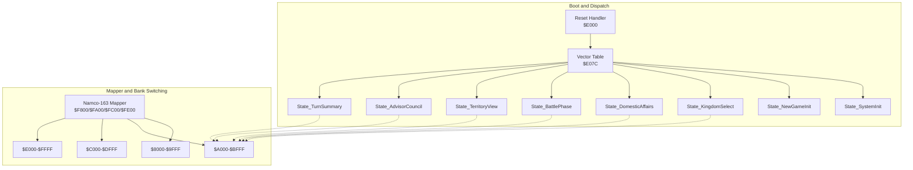
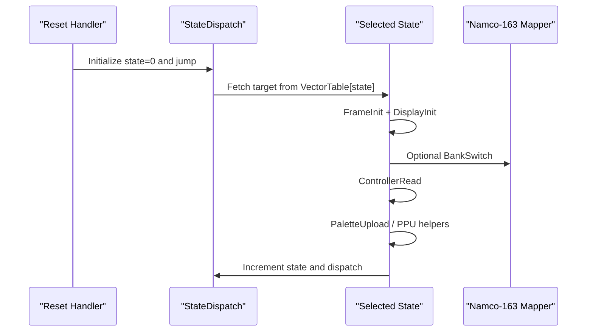
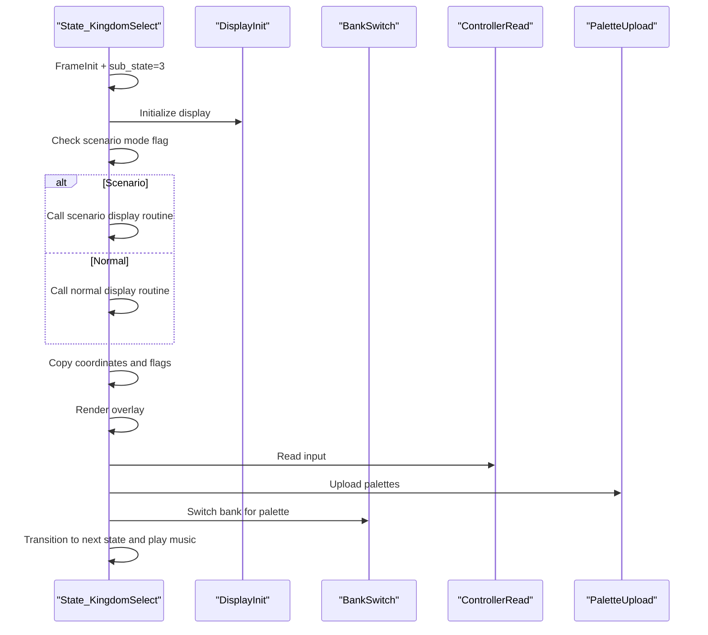
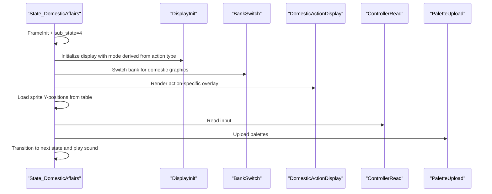
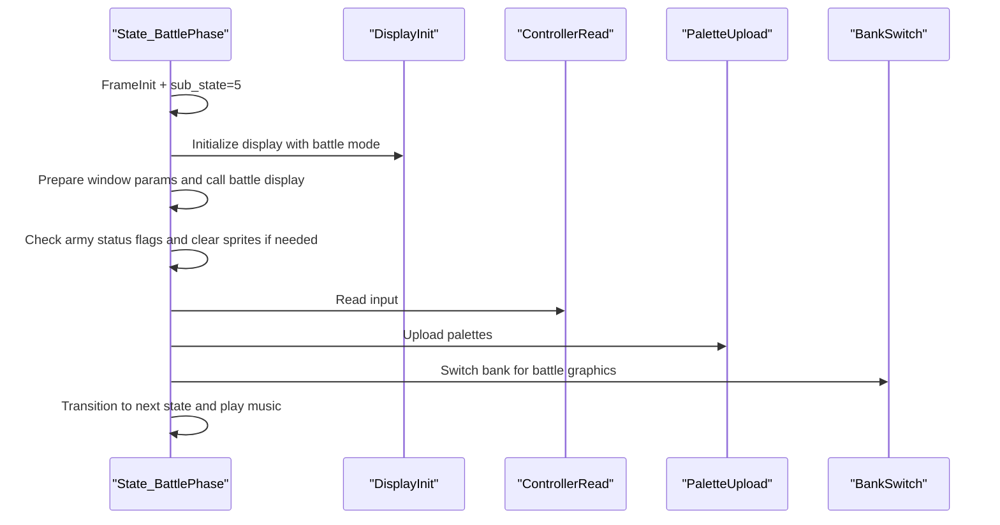
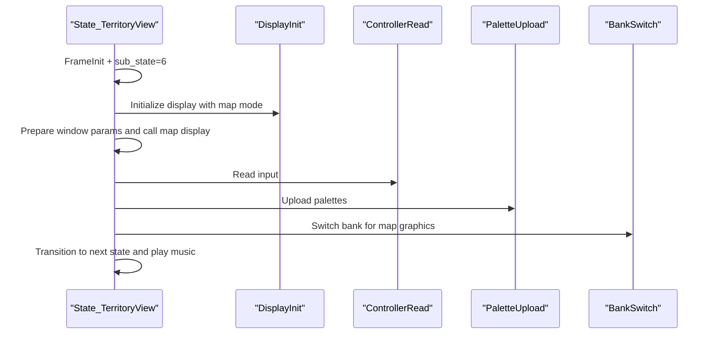
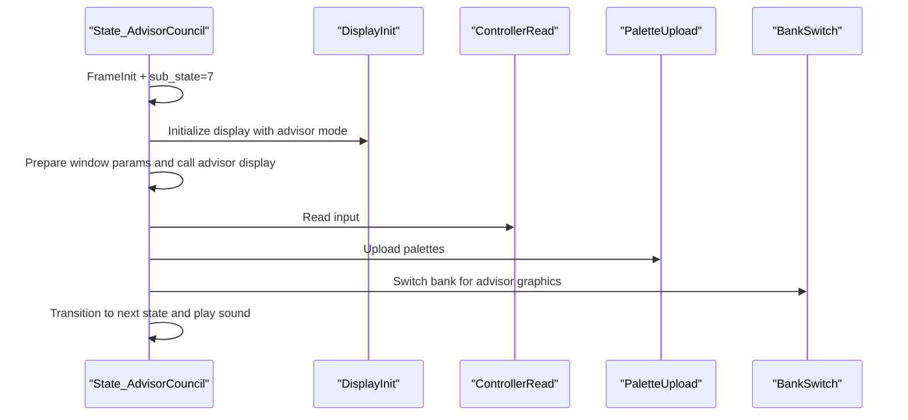
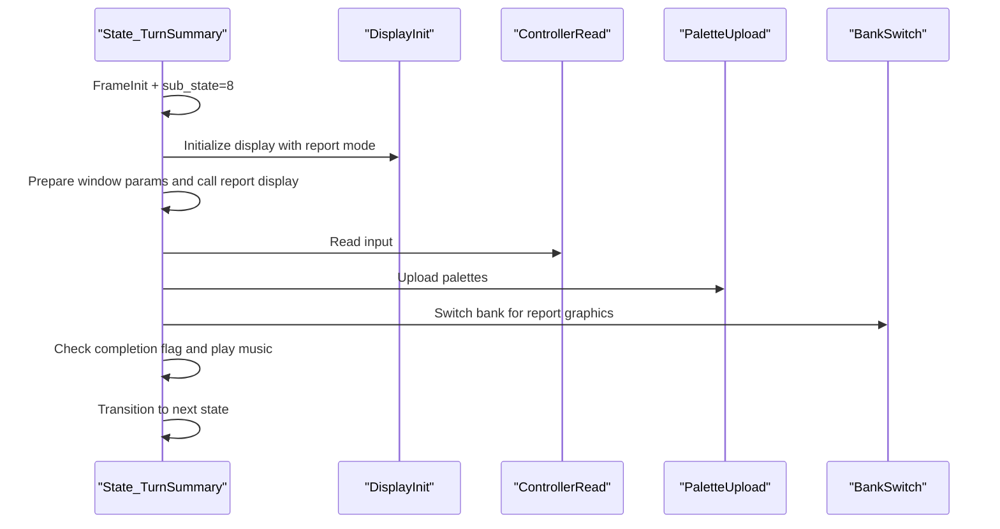
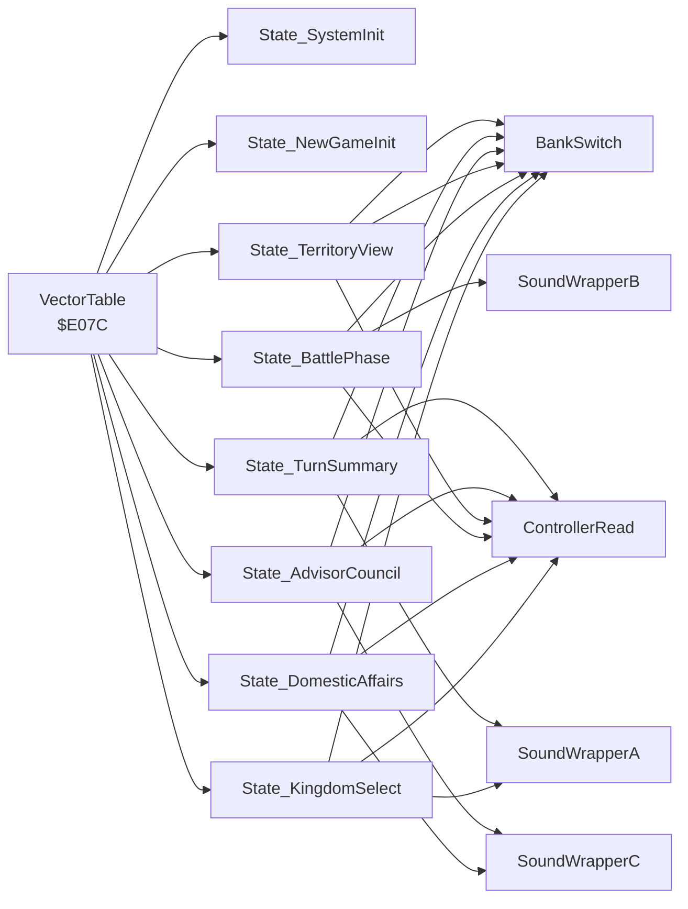

# Gameplay States

<cite>
**Referenced Files in This Document**
- [PROJECT.md](file://PROJECT.md)
- [main.asm](file://asm/main.asm)
- [namco163.h](file://include/namco163.h)
- [prg_1f.asm](file://asm/banks/prg_1f.asm)
- [key_functions_analysis.md](file://code/key_functions_analysis.md)
- [bank_1f_raw.asm](file://code/bank_1f_raw.asm)
</cite>

## Table of Contents
1. [Introduction](#introduction)
2. [Project Structure](#project-structure)
3. [Core Components](#core-components)
4. [Architecture Overview](#architecture-overview)
5. [Detailed Component Analysis](#detailed-component-analysis)
6. [Dependency Analysis](#dependency-analysis)
7. [Performance Considerations](#performance-considerations)
8. [Troubleshooting Guide](#troubleshooting-guide)
9. [Conclusion](#conclusion)

## Introduction
This document explains the core gameplay states of the game as implemented in Bank 0x1F, focusing on the entry points and mechanics for:
- State_KingdomSelect (entry 3): Territory selection and scenario mode handling
- State_DomesticAffairs (entry 5): Administrative actions with sprite positioning
- State_BattlePhase (entry 7): Combat sequences with army status management
- State_TerritoryView (entry 9): Map viewing and scrolling
- State_AdvisorCouncil (entry 11): Advisor interactions and dialogue systems
- State_TurnSummary (entry 13): Turn reporting and victory conditions

It also documents the state dispatch mechanism, bank switching requirements, audio triggers, controller handling, and display modes for each state.

## Project Structure
The game uses a fixed boot bank (0x1F) mapped to $E000-$FFFF and a vector table at $E07C that dispatches to state handlers. Each state performs frame initialization, display setup, optional bank switching, controller input, and transitions to the next state. The mapper is Namco-163 (19), with PRG slots $8000-$FFFF controlled via write-only registers.

**Diagram sources**
- [prg_1f.asm:740-749](file://asm/banks/prg_1f.asm#L740-L749)
- [prg_1f.asm:153-168](file://asm/banks/prg_1f.asm#L153-L168)
- [namco163.h:10-14](file://include/namco163.h#L10-L14)

**Section sources**
- [PROJECT.md:84-117](file://PROJECT.md#L84-L117)
- [main.asm:115-121](file://asm/main.asm#L115-L121)
- [prg_1f.asm:153-168](file://asm/banks/prg_1f.asm#L153-L168)

## Core Components
- State dispatch: A vector table indexed by the global game state counter selects the current state routine.
- Frame initialization: Each state begins with a frame initializer that clears buffers, resets display parameters, and prepares PPU/mapper state.
- Display helpers: States call display initialization routines and window setup helpers to configure rendering and bank-switched graphics.
- Bank switching: Many states switch PRG banks to load graphics and logic routines from different banks.
- Audio: States trigger music/sound via wrapper functions that select and play sound IDs.
- Controller: Input is sampled via a dedicated routine that computes edge-triggered and raw states.
- Scrolling: Display modes and scroll calculations are derived from state parameters and global display mode.

**Section sources**
- [prg_1f.asm:740-749](file://asm/banks/prg_1f.asm#L740-L749)
- [prg_1f.asm:755-779](file://asm/banks/prg_1f.asm#L755-L779)
- [prg_1f.asm:564-569](file://asm/banks/prg_1f.asm#L564-L569)
- [prg_1f.asm:785-817](file://asm/banks/prg_1f.asm#L785-L817)
- [prg_1f.asm:999-1015](file://asm/banks/prg_1f.asm#L999-L1015)
- [prg_1f.asm:1040-1055](file://asm/banks/prg_1f.asm#L1040-L1055)
- [prg_1f.asm:2832-2855](file://asm/banks/prg_1f.asm#L2832-L2855)

## Architecture Overview
The runtime architecture centers on the reset handler and dispatch loop. The reset handler initializes PPU/APU, mapper, and clears RAM, then jumps into the dispatch loop. The dispatch loop reads the current state index, masks it to a small range, computes a word index, fetches the target address from the vector table, and jumps to it. Each state routine performs its own frame initialization, display setup, optional bank switching, input sampling, and transitions to the next state.

**Diagram sources**
- [prg_1f.asm:74-148](file://asm/banks/prg_1f.asm#L74-L148)
- [prg_1f.asm:740-749](file://asm/banks/prg_1f.asm#L740-L749)

**Section sources**
- [prg_1f.asm:74-148](file://asm/banks/prg_1f.asm#L74-L148)
- [prg_1f.asm:740-749](file://asm/banks/prg_1f.asm#L740-L749)

## Detailed Component Analysis

### State_KingdomSelect (entry 3)
- Purpose: Allow player to choose a kingdom and mode (scenario vs normal). Handles scenario mode branching and sets up display parameters for subsequent steps.
- Mechanics:
  - Frame initialization and sub-state set.
  - Display initialization with a specific display mode.
  - Branches to scenario mode if a scenario flag is set; otherwise uses normal mode.
  - Copies selected coordinates and flags into working RAM for later use.
  - Renders overlay and palette upload.
  - Bank switches to a specific bank for palette and graphics.
  - Transitions to the next state and triggers music.
- Data structures:
  - Mode flag and coordinate pair stored in RAM for later use.
  - Display mode parameter set for rendering.
- Controller handling: Reads input to confirm selection.
- Audio: Plays a specific music track.
- Bank switching: Calls a bank switch routine to load palette and graphics.
- Display modes: Uses a display mode parameter to select rendering behavior.

**Diagram sources**
- [prg_1f.asm:295-365](file://asm/banks/prg_1f.asm#L295-L365)
- [prg_1f.asm:564-569](file://asm/banks/prg_1f.asm#L564-L569)
- [prg_1f.asm:785-817](file://asm/banks/prg_1f.asm#L785-L817)
- [prg_1f.asm:1040-1055](file://asm/banks/prg_1f.asm#L1040-L1055)
- [prg_1f.asm:999-1015](file://asm/banks/prg_1f.asm#L999-L1015)

**Section sources**
- [prg_1f.asm:295-365](file://asm/banks/prg_1f.asm#L295-L365)
- [prg_1f.asm:564-569](file://asm/banks/prg_1f.asm#L564-L569)
- [prg_1f.asm:785-817](file://asm/banks/prg_1f.asm#L785-L817)
- [prg_1f.asm:1040-1055](file://asm/banks/prg_1f.asm#L1040-L1055)
- [prg_1f.asm:999-1015](file://asm/banks/prg_1f.asm#L999-L1015)

### State_DomesticAffairs (entry 5)
- Purpose: Presents administrative actions and updates sprite positions based on action type.
- Mechanics:
  - Frame initialization and sub-state set.
  - Determines display mode based on action type and loads bank accordingly.
  - Renders the base domestic display and overlays a specific action display.
  - Loads sprite Y-position indices from a table and stores them into sprite buffers.
  - Reads controller input and renders overlay.
  - Uploads palettes and transitions to next state with audio cue.
- Data structures:
  - Action type determines which graphics and base data to use.
  - Sprite index table maps action type to sprite Y positions.
- Controller handling: Reads input for user selection.
- Audio: Plays a specific sound effect.
- Bank switching: Switches to a bank for domestic graphics and overlays.
- Display modes: Uses a display mode parameter for rendering.

**Diagram sources**
- [prg_1f.asm:383-433](file://asm/banks/prg_1f.asm#L383-L433)
- [prg_1f.asm:441-466](file://asm/banks/prg_1f.asm#L441-L466)
- [prg_1f.asm:477-478](file://asm/banks/prg_1f.asm#L477-L478)
- [prg_1f.asm:564-569](file://asm/banks/prg_1f.asm#L564-L569)
- [prg_1f.asm:785-817](file://asm/banks/prg_1f.asm#L785-L817)
- [prg_1f.asm:1040-1055](file://asm/banks/prg_1f.asm#L1040-L1055)
- [prg_1f.asm:1017-1024](file://asm/banks/prg_1f.asm#L1017-L1024)

**Section sources**
- [prg_1f.asm:383-433](file://asm/banks/prg_1f.asm#L383-L433)
- [prg_1f.asm:441-466](file://asm/banks/prg_1f.asm#L441-L466)
- [prg_1f.asm:477-478](file://asm/banks/prg_1f.asm#L477-L478)
- [prg_1f.asm:564-569](file://asm/banks/prg_1f.asm#L564-L569)
- [prg_1f.asm:785-817](file://asm/banks/prg_1f.asm#L785-L817)
- [prg_1f.asm:1040-1055](file://asm/banks/prg_1f.asm#L1040-L1055)
- [prg_1f.asm:1017-1024](file://asm/banks/prg_1f.asm#L1017-L1024)

### State_BattlePhase (entry 7)
- Purpose: Runs battle sequences and manages army status visuals.
- Mechanics:
  - Frame initialization and sub-state set.
  - Sets a specific display mode for battle rendering.
  - Prepares window parameters and calls the battle display routine.
  - Reads army status flags and clears corresponding sprites if armies are marked inactive.
  - Uploads palettes and transitions to next state with audio cue.
- Data structures:
  - Army status flags indicate whether armies are active; used to hide sprites.
- Controller handling: Reads input during the phase.
- Audio: Plays a specific music track.
- Bank switching: Switches to a bank for battle graphics.
- Display modes: Uses a display mode parameter for rendering.

**Diagram sources**
- [prg_1f.asm:493-550](file://asm/banks/prg_1f.asm#L493-L550)
- [prg_1f.asm:564-569](file://asm/banks/prg_1f.asm#L564-L569)
- [prg_1f.asm:1040-1055](file://asm/banks/prg_1f.asm#L1040-L1055)
- [prg_1f.asm:785-817](file://asm/banks/prg_1f.asm#L785-L817)
- [prg_1f.asm:1008-1015](file://asm/banks/prg_1f.asm#L1008-L1015)

**Section sources**
- [prg_1f.asm:493-550](file://asm/banks/prg_1f.asm#L493-L550)
- [prg_1f.asm:564-569](file://asm/banks/prg_1f.asm#L564-L569)
- [prg_1f.asm:1040-1055](file://asm/banks/prg_1f.asm#L1040-L1055)
- [prg_1f.asm:785-817](file://asm/banks/prg_1f.asm#L785-L817)
- [prg_1f.asm:1008-1015](file://asm/banks/prg_1f.asm#L1008-L1015)

### State_TerritoryView (entry 9)
- Purpose: Allows viewing and scrolling the map.
- Mechanics:
  - Frame initialization and sub-state set.
  - Sets a specific display mode for map rendering.
  - Prepares window parameters and calls the map display routine.
  - Reads controller input for navigation.
  - Uploads palettes and transitions to next state with audio cue.
- Data structures:
  - Display mode parameter controls rendering.
- Controller handling: Reads input for navigation.
- Audio: Plays a specific music track.
- Bank switching: Switches to a bank for map graphics.
- Display modes: Uses a display mode parameter for rendering.

**Diagram sources**
- [prg_1f.asm:575-619](file://asm/banks/prg_1f.asm#L575-L619)
- [prg_1f.asm:564-569](file://asm/banks/prg_1f.asm#L564-L569)
- [prg_1f.asm:1040-1055](file://asm/banks/prg_1f.asm#L1040-L1055)
- [prg_1f.asm:785-817](file://asm/banks/prg_1f.asm#L785-L817)
- [prg_1f.asm:1008-1015](file://asm/banks/prg_1f.asm#L1008-L1015)

**Section sources**
- [prg_1f.asm:575-619](file://asm/banks/prg_1f.asm#L575-L619)
- [prg_1f.asm:564-569](file://asm/banks/prg_1f.asm#L564-L569)
- [prg_1f.asm:1040-1055](file://asm/banks/prg_1f.asm#L1040-L1055)
- [prg_1f.asm:785-817](file://asm/banks/prg_1f.asm#L785-L817)
- [prg_1f.asm:1008-1015](file://asm/banks/prg_1f.asm#L1008-L1015)

### State_AdvisorCouncil (entry 11)
- Purpose: Presents advisor interactions and dialogue.
- Mechanics:
  - Frame initialization and sub-state set.
  - Sets a specific display mode for advisor rendering.
  - Prepares window parameters and calls the advisor display routine.
  - Reads controller input for advancing dialogue.
  - Uploads palettes and transitions to next state with audio cue.
- Data structures:
  - Display mode parameter controls rendering.
- Controller handling: Reads input for dialogue progression.
- Audio: Plays a specific sound effect.
- Bank switching: Switches to a bank for advisor graphics.
- Display modes: Uses a display mode parameter for rendering.

**Diagram sources**
- [prg_1f.asm:630-680](file://asm/banks/prg_1f.asm#L630-L680)
- [prg_1f.asm:564-569](file://asm/banks/prg_1f.asm#L564-L569)
- [prg_1f.asm:1040-1055](file://asm/banks/prg_1f.asm#L1040-L1055)
- [prg_1f.asm:785-817](file://asm/banks/prg_1f.asm#L785-L817)
- [prg_1f.asm:1017-1024](file://asm/banks/prg_1f.asm#L1017-L1024)

**Section sources**
- [prg_1f.asm:630-680](file://asm/banks/prg_1f.asm#L630-L680)
- [prg_1f.asm:564-569](file://asm/banks/prg_1f.asm#L564-L569)
- [prg_1f.asm:1040-1055](file://asm/banks/prg_1f.asm#L1040-L1055)
- [prg_1f.asm:785-817](file://asm/banks/prg_1f.asm#L785-L817)
- [prg_1f.asm:1017-1024](file://asm/banks/prg_1f.asm#L1017-L1024)

### State_TurnSummary (entry 13)
- Purpose: Displays turn summary and handles victory conditions.
- Mechanics:
  - Frame initialization and sub-state set.
  - Sets a specific display mode for report rendering.
  - Prepares window parameters and calls the report display routine.
  - Reads controller input for dismissal.
  - Uploads palettes and transitions to next state with audio cue.
  - Plays normal music for non-victory or victory music for victory condition.
- Data structures:
  - Completion flag indicates victory/non-victory.
- Controller handling: Reads input for dismissal.
- Audio: Plays either normal or victory music depending on flag.
- Bank switching: Switches to a bank for report graphics.
- Display modes: Uses a display mode parameter for rendering.

**Diagram sources**
- [prg_1f.asm:686-735](file://asm/banks/prg_1f.asm#L686-L735)
- [prg_1f.asm:564-569](file://asm/banks/prg_1f.asm#L564-L569)
- [prg_1f.asm:1040-1055](file://asm/banks/prg_1f.asm#L1040-L1055)
- [prg_1f.asm:785-817](file://asm/banks/prg_1f.asm#L785-L817)
- [prg_1f.asm:999-1015](file://asm/banks/prg_1f.asm#L999-L1015)

**Section sources**
- [prg_1f.asm:686-735](file://asm/banks/prg_1f.asm#L686-L735)
- [prg_1f.asm:564-569](file://asm/banks/prg_1f.asm#L564-L569)
- [prg_1f.asm:1040-1055](file://asm/banks/prg_1f.asm#L1040-L1055)
- [prg_1f.asm:785-817](file://asm/banks/prg_1f.asm#L785-L817)
- [prg_1f.asm:999-1015](file://asm/banks/prg_1f.asm#L999-L1015)

## Dependency Analysis
- State dispatch depends on the global state counter and vector table.
- Each state depends on frame initialization and display helpers.
- Bank switching is invoked by states that require banked graphics or logic.
- Audio wrappers depend on sound note player and channel tables.
- Controller input is centralized and used by most states.
- Scrolling depends on display mode and calculation helpers.

**Diagram sources**
- [prg_1f.asm:153-168](file://asm/banks/prg_1f.asm#L153-L168)
- [prg_1f.asm:740-749](file://asm/banks/prg_1f.asm#L740-L749)
- [prg_1f.asm:785-817](file://asm/banks/prg_1f.asm#L785-L817)
- [prg_1f.asm:999-1024](file://asm/banks/prg_1f.asm#L999-L1024)
- [prg_1f.asm:1040-1055](file://asm/banks/prg_1f.asm#L1040-L1055)

**Section sources**
- [prg_1f.asm:153-168](file://asm/banks/prg_1f.asm#L153-L168)
- [prg_1f.asm:740-749](file://asm/banks/prg_1f.asm#L740-L749)
- [prg_1f.asm:785-817](file://asm/banks/prg_1f.asm#L785-L817)
- [prg_1f.asm:999-1024](file://asm/banks/prg_1f.asm#L999-L1024)
- [prg_1f.asm:1040-1055](file://asm/banks/prg_1f.asm#L1040-L1055)

## Performance Considerations
- Bank switching occurs infrequently and only when a state requires banked resources. It is performed after display initialization to minimize frame time impact.
- Display helpers and palette uploads are batched per frame to reduce overhead.
- Controller polling uses a single routine to avoid redundant reads.
- The vector dispatch loop is lightweight and avoids unnecessary work outside of state routines.

## Troubleshooting Guide
- If a state appears stuck or does not transition, verify the state counter and vector table indexing. Ensure the state increments after each frame.
- If graphics are missing or corrupted, check the bank switch configuration and ensure the correct bank is loaded before calling banked routines.
- If audio does not play, verify the sound wrapper call and ensure the sound note player is properly initialized.
- If input is not detected, confirm the controller read routine executes and that edge-triggered flags are checked correctly.

**Section sources**
- [prg_1f.asm:740-749](file://asm/banks/prg_1f.asm#L740-L749)
- [prg_1f.asm:785-817](file://asm/banks/prg_1f.asm#L785-L817)
- [prg_1f.asm:999-1024](file://asm/banks/prg_1f.asm#L999-L1024)
- [prg_1f.asm:1040-1055](file://asm/banks/prg_1f.asm#L1040-L1055)

## Conclusion
The gameplay state system is a compact, dispatch-driven loop centered on a vector table in Bank 0x1F. Each state performs minimal preparation, invokes display and banked routines, samples input, and transitions cleanly. Bank switching, audio, and controller handling are standardized, enabling consistent behavior across states. The documented states—Kingdom Selection, Domestic Affairs, Battle Phase, Territory View, Advisor Council, and Turn Summary—follow this pattern and collectively form the core gameplay flow.