# Initialization States

<cite>
**Referenced Files in This Document**
- [PROJECT.md](file://PROJECT.md)
- [linker.cfg](file://linker.cfg)
- [asm/main.asm](file://asm/main.asm)
- [include/6502_registers.h](file://include/6502_registers.h)
- [include/namco163.h](file://include/namco163.h)
- [include/macros.h](file://include/macros.h)
- [asm/banks/prg_1f.asm](file://asm/banks/prg_1f.asm)
- [asm/banks/prg_00.asm](file://asm/banks/prg_00.asm)
- [code/bank_1f_analysis.md](file://code/bank_1f_analysis.md)
</cite>

## Table of Contents
1. [Introduction](#introduction)
2. [Project Structure](#project-structure)
3. [Core Components](#core-components)
4. [Architecture Overview](#architecture-overview)
5. [Detailed Component Analysis](#detailed-component-analysis)
6. [Dependency Analysis](#dependency-analysis)
7. [Performance Considerations](#performance-considerations)
8. [Troubleshooting Guide](#troubleshooting-guide)
9. [Conclusion](#conclusion)

## Introduction
This document explains the initialization states and boot sequence for the game, focusing on:
- State_SystemInit (entry 0) for boot sequence setup
- State_NewGameInit (entry 1) for new game creation and SRAM initialization
- State_RandomDisplay2A/B (entries 2&4) for random number generation and display initialization

It covers the reset handler, vector dispatch, PPU initialization, APU setup, mapper configuration, RAM clearing, and the transition flow from system initialization to active gameplay states. It also documents register initialization, palette setup, and hardware warm-up sequences.

## Project Structure
The project uses a banked PRG layout with the reset handler located in bank 0x1F at $E000–$FFFF. The linker config defines four PRG slots ($8000–$FFFF), with bank 0x1F fixed to PRG slot 3 at boot. Interrupt vectors are placed at $FFFA–$FFFF.

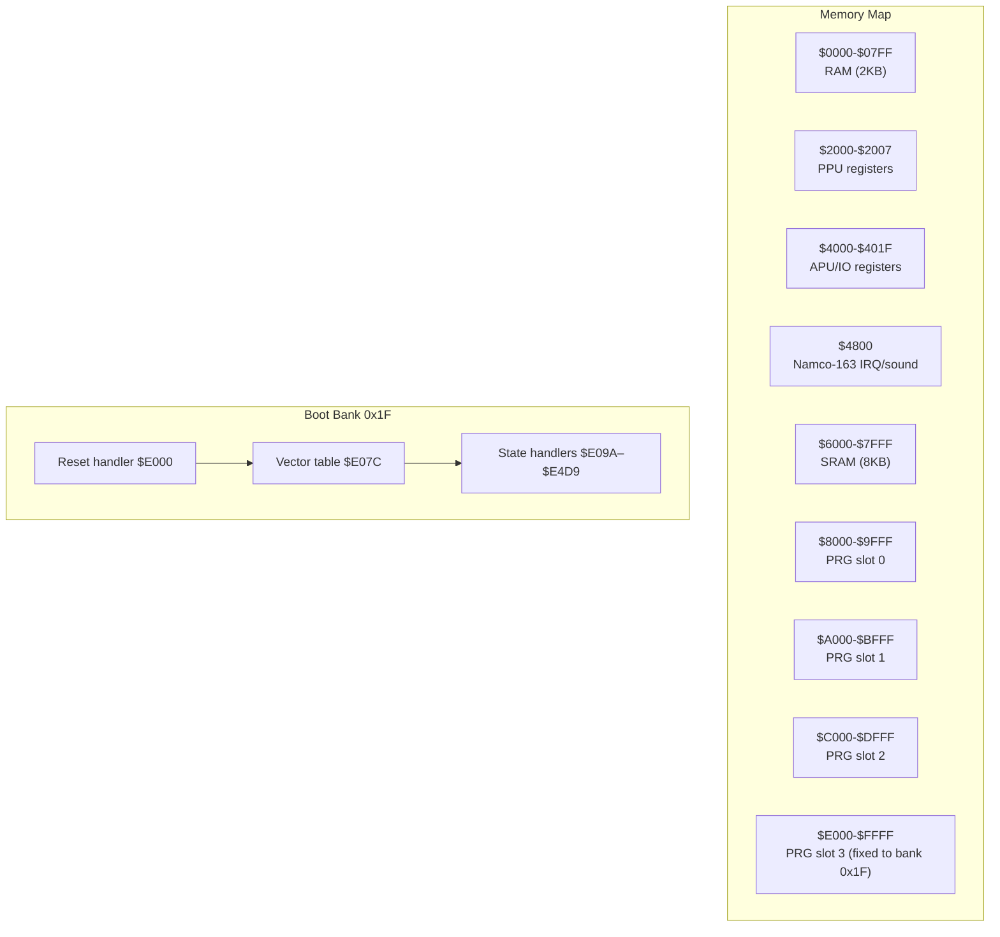

**Diagram sources**
- [PROJECT.md:70-83](file://PROJECT.md#L70-L83)
- [linker.cfg:18-30](file://linker.cfg#L18-L30)
- [asm/banks/prg_1f.asm:1-10](file://asm/banks/prg_1f.asm#L1-L10)

**Section sources**
- [PROJECT.md:70-117](file://PROJECT.md#L70-L117)
- [linker.cfg:18-30](file://linker.cfg#L18-L30)

## Core Components
- Reset handler: Performs CPU init, PPU warm-up, APU init, RAM clear, mapper init, state counter reset, and dispatch to the first state.
- Vector dispatch: A 15-entry table indexed by the game state counter, selecting the next state routine.
- State handlers: Each entry performs a specific boot/init phase (system init, new game init, random displays, etc.).
- Mapper and bank switching: Uses Namco-163 registers to switch PRG banks dynamically during runtime.
- PPU/APU initialization: Sets registers for rendering, audio, and NMI/IRQ behavior.

**Section sources**
- [asm/banks/prg_1f.asm:72-148](file://asm/banks/prg_1f.asm#L72-L148)
- [asm/banks/prg_1f.asm:153-169](file://asm/banks/prg_1f.asm#L153-L169)
- [include/namco163.h:10-17](file://include/namco163.h#L10-L17)
- [include/6502_registers.h:6-13](file://include/6502_registers.h#L6-L13)

## Architecture Overview
The boot sequence begins at the reset vector in bank 0x1F. After CPU and PPU warm-up, the system initializes APU registers, clears RAM, configures the mapper, resets the state counter, and dispatches to the first state via the vector table.

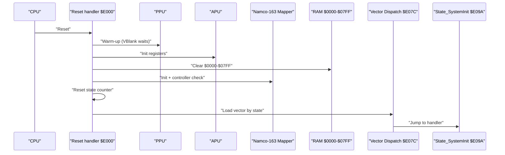

**Diagram sources**
- [asm/banks/prg_1f.asm:72-148](file://asm/banks/prg_1f.asm#L72-L148)
- [asm/banks/prg_1f.asm:153-169](file://asm/banks/prg_1f.asm#L153-L169)

**Section sources**
- [asm/banks/prg_1f.asm:72-148](file://asm/banks/prg_1f.asm#L72-L148)
- [PROJECT.md:101-117](file://PROJECT.md#L101-L117)

## Detailed Component Analysis

### Reset Handler and Boot Sequence
- CPU initialization: disables interrupts, clears decimal mode, sets stack pointer.
- PPU warm-up: waits for multiple VBlanks to stabilize the PPU.
- APU initialization: writes to APU registers to silence channels and configure frame sequencer.
- RAM clearing: zeros the 2KB system RAM region.
- Mapper init + controller check: configures mapper registers and validates controller ports.
- State counter reset: initializes the game state to 0.
- Dispatch: reads the vector table and jumps to the selected state handler.

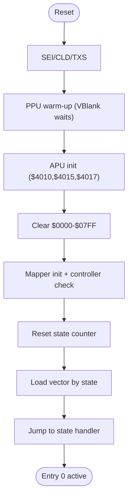

**Diagram sources**
- [asm/banks/prg_1f.asm:72-148](file://asm/banks/prg_1f.asm#L72-L148)

**Section sources**
- [asm/banks/prg_1f.asm:72-148](file://asm/banks/prg_1f.asm#L72-L148)
- [PROJECT.md:101-117](file://PROJECT.md#L101-L117)

### State_SystemInit (Entry 0)
Purpose: Establish the initial boot environment, prepare PPU/APU, initialize palette buffers, and transition to the next state.

Key steps:
- Read PPU status and wait for VBlank.
- Disable PPU rendering.
- Perform bank+PPU init and palette buffer fill.
- Patch a JMP instruction into RAM and mapper register.
- Switch to bank config 0.
- Enable NMI and disable rendering.
- Set next state to 9 (Idle/Wait) and return to dispatch.

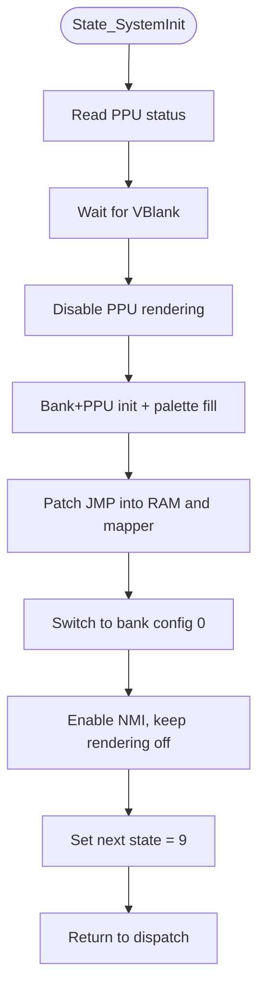

**Diagram sources**
- [asm/banks/prg_1f.asm:174-202](file://asm/banks/prg_1f.asm#L174-L202)

**Section sources**
- [asm/banks/prg_1f.asm:174-202](file://asm/banks/prg_1f.asm#L174-L202)
- [code/bank_1f_analysis.md:80-111](file://code/bank_1f_analysis.md#L80-L111)

### State_NewGameInit (Entry 1)
Purpose: Initialize new game parameters, set up display modes, handle controller input, and initialize SRAM for kingdom data.

Key steps:
- Frame initialization (clear working RAM, set sentinel values).
- Set sub-state to 2 and display mode 0.
- Configure window and display parameters.
- Show initial content via bank-switched display functions.
- Read controller input and check for a specific button press to set SRAM flags.
- Initialize SRAM with kingdom parameters.
- Switch to bank config 0 and play music.
- Transition to next state and return to dispatch.

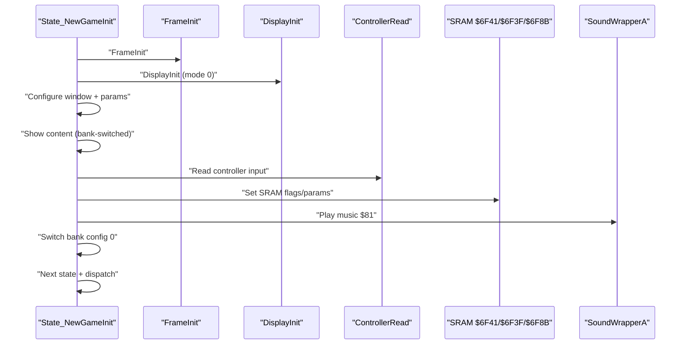

**Diagram sources**
- [asm/banks/prg_1f.asm:210-276](file://asm/banks/prg_1f.asm#L210-L276)

**Section sources**
- [asm/banks/prg_1f.asm:210-276](file://asm/banks/prg_1f.asm#L210-L276)
- [code/bank_1f_analysis.md:114-160](file://code/bank_1f_analysis.md#L114-L160)

### State_RandomDisplay2A and State_RandomDisplay28 (Entries 2 and 4)
Purpose: Generate a random byte and display content associated with specific window modes.

Entry 2 (Y=$2A):
- Generate random byte via RNG core.
- Set window mode Y=$2A.
- Call bank-switched display function.
- Return to dispatch.

Entry 4 (Y=$28):
- Same pattern as entry 2 but uses Y=$28.

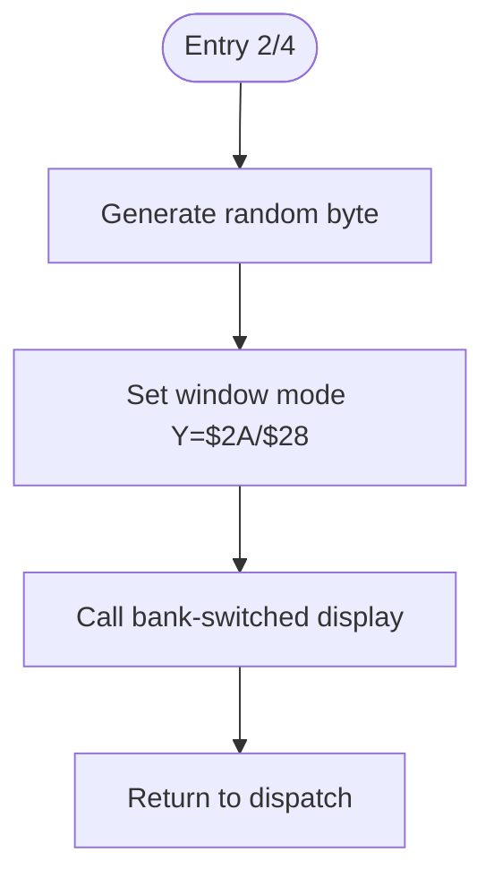

**Diagram sources**
- [asm/banks/prg_1f.asm:281-287](file://asm/banks/prg_1f.asm#L281-L287)
- [asm/banks/prg_1f.asm:370-376](file://asm/banks/prg_1f.asm#L370-L376)

**Section sources**
- [asm/banks/prg_1f.asm:281-287](file://asm/banks/prg_1f.asm#L281-L287)
- [asm/banks/prg_1f.asm:370-376](file://asm/banks/prg_1f.asm#L370-L376)
- [code/bank_1f_analysis.md:163-174](file://code/bank_1f_analysis.md#L163-L174)
- [code/bank_1f_analysis.md:229-239](file://code/bank_1f_analysis.md#L229-L239)

### Vector Dispatch Mechanism
The vector table at $E07C contains 15 entries (2 bytes each). The current state counter is masked to 0–31 and multiplied by 2 to form a word index. The resulting pointer is loaded into a temporary indirect jump target and executed.

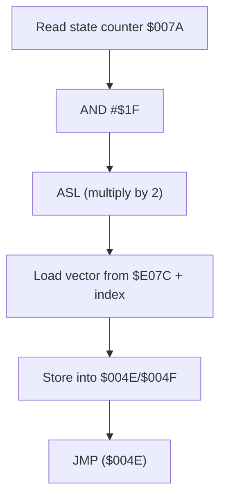

**Diagram sources**
- [asm/banks/prg_1f.asm:139-147](file://asm/banks/prg_1f.asm#L139-L147)
- [asm/banks/prg_1f.asm:153-169](file://asm/banks/prg_1f.asm#L153-L169)

**Section sources**
- [asm/banks/prg_1f.asm:139-147](file://asm/banks/prg_1f.asm#L139-L147)
- [asm/banks/prg_1f.asm:153-169](file://asm/banks/prg_1f.asm#L153-L169)
- [code/bank_1f_analysis.md:54-77](file://code/bank_1f_analysis.md#L54-L77)

### Bank Switching and Mapper Configuration
Bank switching uses the Namco-163 mapper registers. The bank switching routine loads an 8-byte configuration from a table and writes the first four bytes to mapper registers $C000/$C800/$D000/$D800 (PRG bank switching). The last four bytes are stored in RAM for later restoration.

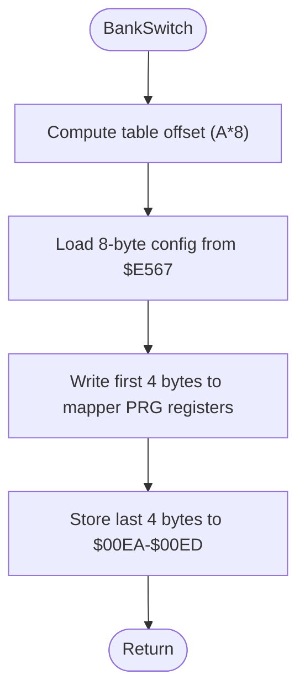

**Diagram sources**
- [asm/banks/prg_1f.asm:785-817](file://asm/banks/prg_1f.asm#L785-L817)
- [asm/banks/prg_1f.asm:824-828](file://asm/banks/prg_1f.asm#L824-L828)

**Section sources**
- [asm/banks/prg_1f.asm:785-817](file://asm/banks/prg_1f.asm#L785-L817)
- [asm/banks/prg_1f.asm:824-828](file://asm/banks/prg_1f.asm#L824-L828)
- [include/namco163.h:10-17](file://include/namco163.h#L10-L17)

### PPU and APU Initialization
- PPU initialization: disables NMI and rendering, resets scroll and address latches.
- APU initialization: silences pulse/noise channels, sets frame sequencer, and configures DMC registers.
- Palette upload: copies palette data to PPU palette memory ($3F00).
- NMI/IRQ helpers: enable NMI, manage sub-dispatch flags, and handle scroll updates.

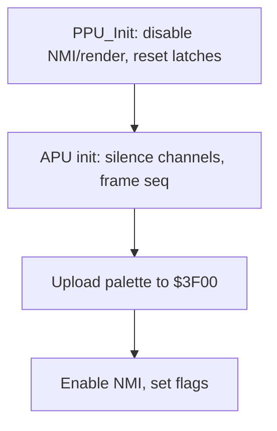

**Diagram sources**
- [asm/main.asm:104-110](file://asm/main.asm#L104-L110)
- [asm/banks/prg_1f.asm:1071-1084](file://asm/banks/prg_1f.asm#L1071-L1084)
- [asm/banks/prg_1f.asm:1090-1113](file://asm/banks/prg_1f.asm#L1090-L1113)

**Section sources**
- [asm/main.asm:104-110](file://asm/main.asm#L104-L110)
- [asm/banks/prg_1f.asm:1071-1084](file://asm/banks/prg_1f.asm#L1071-L1084)
- [asm/banks/prg_1f.asm:1090-1113](file://asm/banks/prg_1f.asm#L1090-L1113)

### Interrupt Vectors and Handlers
- Vectors: NMI at $FFFA, RESET at $FFFC, IRQ at $FFFE.
- NMI handler: restores CHR banks, applies scroll, performs OAM DMA, and sub-dispatches based on sub-state.
- IRQ handler: dispatches by a sub-state register to perform mid-frame raster effects and bank switching.

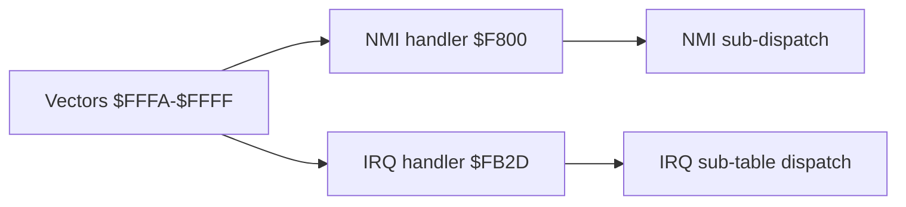

**Diagram sources**
- [asm/banks/prg_1f.asm:2866-L1F](file://asm/banks/prg_1f.asm#L2866-L1F)
- [asm/banks/prg_1f.asm:2559-L1F](file://asm/banks/prg_1f.asm#L2559-L1F)
- [asm/banks/prg_1f.asm:2733-L1F](file://asm/banks/prg_1f.asm#L2733-L1F)

**Section sources**
- [asm/banks/prg_1f.asm:2866-L1F](file://asm/banks/prg_1f.asm#L2866-L1F)
- [asm/banks/prg_1f.asm:2559-L1F](file://asm/banks/prg_1f.asm#L2559-L1F)
- [asm/banks/prg_1f.asm:2733-L1F](file://asm/banks/prg_1f.asm#L2733-L1F)

## Dependency Analysis
- State_SystemInit depends on PPU/APU initialization and bank switching to set up the environment.
- State_NewGameInit depends on display helpers and controller input to finalize new game setup.
- State_RandomDisplay2A/B depend on the RNG core and window/display helpers.
- Bank switching depends on the mapper configuration table and RAM storage of extended bank settings.
- Vector dispatch depends on the state counter and the vector table entries.

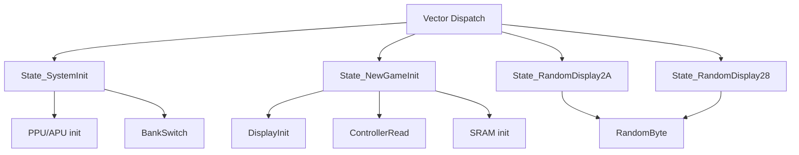

**Diagram sources**
- [asm/banks/prg_1f.asm:174-202](file://asm/banks/prg_1f.asm#L174-L202)
- [asm/banks/prg_1f.asm:210-276](file://asm/banks/prg_1f.asm#L210-L276)
- [asm/banks/prg_1f.asm:281-287](file://asm/banks/prg_1f.asm#L281-L287)
- [asm/banks/prg_1f.asm:370-376](file://asm/banks/prg_1f.asm#L370-L376)
- [asm/banks/prg_1f.asm:139-147](file://asm/banks/prg_1f.asm#L139-L147)

**Section sources**
- [asm/banks/prg_1f.asm:174-202](file://asm/banks/prg_1f.asm#L174-L202)
- [asm/banks/prg_1f.asm:210-276](file://asm/banks/prg_1f.asm#L210-L276)
- [asm/banks/prg_1f.asm:281-287](file://asm/banks/prg_1f.asm#L281-L287)
- [asm/banks/prg_1f.asm:370-376](file://asm/banks/prg_1f.asm#L370-L376)
- [asm/banks/prg_1f.asm:139-147](file://asm/banks/prg_1f.asm#L139-L147)

## Performance Considerations
- VBlank waits: Multiple VBlank polls ensure stable PPU/APU initialization before proceeding.
- Bank switching cost: Frequent bank switches occur during display routines; batching operations can reduce overhead.
- Palette upload: Copying 32 bytes to palette memory is lightweight but occurs frequently during state transitions.
- RNG: Sequential table lookup is fast and deterministic, suitable for boot-time randomization.

[No sources needed since this section provides general guidance]

## Troubleshooting Guide
- PPU not initializing: Verify VBlank waits and PPU status reads before enabling NMI and rendering.
- APU silent: Confirm APU registers are written and frame sequencer is configured.
- Mapper not responding: Ensure mapper registers are written in the correct order and bank config table is valid.
- Controller not detected: Check controller strobe and read-back logic; the mapper init routine includes a validation loop.
- SRAM not initialized: Confirm SRAM write addresses and values during new game init.

**Section sources**
- [asm/banks/prg_1f.asm:2477-L1F](file://asm/banks/prg_1f.asm#L2477-L1F)
- [asm/banks/prg_1f.asm:210-276](file://asm/banks/prg_1f.asm#L210-L276)

## Conclusion
The initialization states establish a robust boot sequence that warms up PPU/APU, configures the mapper, clears RAM, and transitions through a series of state handlers. State_SystemInit prepares the environment, State_NewGameInit finalizes new game setup and SRAM initialization, and State_RandomDisplay2A/B provide randomized content and display initialization. The vector dispatch mechanism ensures predictable state progression, while bank switching and interrupt handlers support dynamic content loading and frame synchronization.