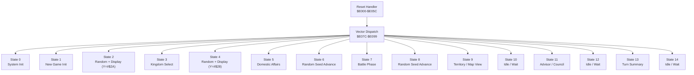
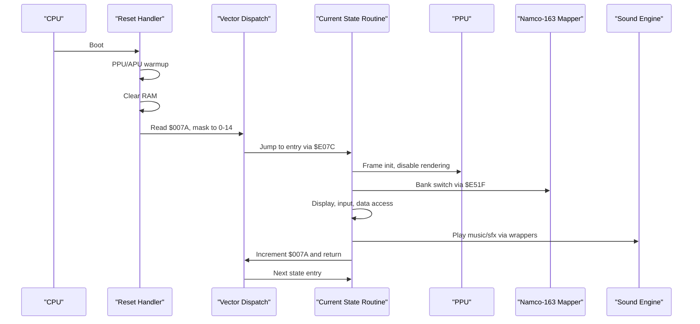
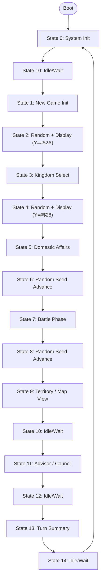
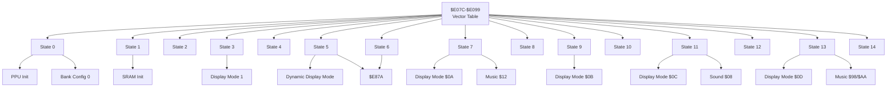

# Major Game States

<cite>
**Referenced Files in This Document**
- [PROJECT.md](file://PROJECT.md)
- [bank_1f_analysis.md](file://code/bank_1f_analysis.md)
- [key_functions_analysis.md](file://code/key_functions_analysis.md)
- [namco163.h](file://include/namco163.h)
- [main.asm](file://asm/main.asm)
- [prg_1f.asm](file://asm/banks/prg_1f.asm)
</cite>

## Table of Contents
1. [Introduction](#introduction)
2. [Project Structure](#project-structure)
3. [Core Components](#core-components)
4. [Architecture Overview](#architecture-overview)
5. [Detailed Component Analysis](#detailed-component-analysis)
6. [Dependency Analysis](#dependency-analysis)
7. [Performance Considerations](#performance-considerations)
8. [Troubleshooting Guide](#troubleshooting-guide)
9. [Conclusion](#conclusion)

## Introduction
This document describes the 15 major game states of Sangokushi 2 (三國志II 覇王の大陸) as implemented in Bank 0x1F. Each state corresponds to a distinct phase of gameplay and is dispatched through a vector table at reset. The states cover system initialization, new game creation, random display sequences, kingdom selection, administrative actions, random number advancement, combat, map viewing, advisor interactions, turn summaries, and idle/wait states. For each state, we explain purpose, key operations, data structures accessed, typical duration, display modes, bank switching requirements, and audio/music triggers. We also describe state-specific data storage locations and inter-state communication via shared memory areas.

## Project Structure
The game uses a fixed-boot bank (0x1F mapped to $E000-$FFFF) and a vector dispatch mechanism to select the current state routine. The reset handler initializes PPU/APU, clears RAM, and reads a vector table at $E07C to jump to the state entry point. The state counter at $007A determines which entry is executed modulo 15.

**Diagram sources**
- [bank_1f_analysis.md:22-51](file://code/bank_1f_analysis.md#L22-L51)
- [bank_1f_analysis.md:54-76](file://code/bank_1f_analysis.md#L54-L76)

**Section sources**
- [PROJECT.md:70-117](file://PROJECT.md#L70-L117)
- [bank_1f_analysis.md:22-51](file://code/bank_1f_analysis.md#L22-L51)
- [bank_1f_analysis.md:54-76](file://code/bank_1f_analysis.md#L54-L76)

## Core Components
- State vector table: 15 entries at $E07C-$E099, each a 2-byte pointer into Bank 0x1F. Index is masked to 0-14; index 15+ reads code bytes as vector data.
- State counter: $007A holds the current state index; incremented by state routines to move to the next state.
- Frame initialization helper: $E4DA performs per-frame PPU/APU setup, clearing working RAM and preparing display buffers.
- Bank switching: $E51F loads 8-byte configurations into mapper registers $C000/$C800/$D000/$D800 and RAM mirrors $00E6-$00ED. Configurations 0, 1, 2 are used across states.
- Random number generator: $E87A advances a table index and returns a byte from a pre-computed random table at $E8BA.
- Sound wrappers: $E673/$E67B/$E683 wrap a common note player to trigger music/sounds with IDs passed in A.

**Section sources**
- [bank_1f_analysis.md:54-76](file://code/bank_1f_analysis.md#L54-L76)
- [bank_1f_analysis.md:477-495](file://code/bank_1f_analysis.md#L477-L495)
- [bank_1f_analysis.md:499-533](file://code/bank_1f_analysis.md#L499-L533)
- [bank_1f_analysis.md:560-579](file://code/bank_1f_analysis.md#L560-L579)
- [bank_1f_analysis.md:548-554](file://code/bank_1f_analysis.md#L548-L554)

## Architecture Overview
The game runs a tight loop controlled by the state vector table. Each state routine performs its operations, may switch banks, update display modes, and increment the state counter to transition to the next phase. The NMI/IRQ handlers coordinate PPU timing and mid-frame effects, while the sound engine triggers music/sfx via wrapper functions.

**Diagram sources**
- [bank_1f_analysis.md:22-51](file://code/bank_1f_analysis.md#L22-L51)
- [bank_1f_analysis.md:54-76](file://code/bank_1f_analysis.md#L54-L76)
- [bank_1f_analysis.md:477-495](file://code/bank_1f_analysis.md#L477-L495)
- [bank_1f_analysis.md:499-533](file://code/bank_1f_analysis.md#L499-L533)
- [bank_1f_analysis.md:548-554](file://code/bank_1f_analysis.md#L548-L554)

## Detailed Component Analysis

### State 0: System Init
- Purpose: Initialize PPU/APU, set up bank switching and palette, and transition to the idle/wait state.
- Key operations:
  - PPU warmup and mask disable.
  - Bank switch setup and PPU init.
  - Fill sprite palette buffer ($0100-$011F) with $0F.
  - Patch a JMP opcode into RAM and mapper registers.
  - Switch to bank config 0.
  - Transition to state 9 (Idle/Wait).
- Data structures accessed:
  - PPU registers ($2000-$2007), palette buffer ($0100-$011F).
  - Bank config table at $E567 (config 0).
- Typical duration: Very brief (single frame).
- Display mode: None (initialization).
- Bank switching: Config 0 via $E51F.
- Audio/music: None.
- Shared memory: $007A set to 9; $004E/$004F used for indirect jump.

**Section sources**
- [bank_1f_analysis.md:80-111](file://code/bank_1f_analysis.md#L80-L111)
- [bank_1f_analysis.md:499-533](file://code/bank_1f_analysis.md#L499-L533)

### State 1: New Game Init
- Purpose: Initialize new game parameters, display intro content, read input, and initialize SRAM kingdom parameters.
- Key operations:
  - Frame init.
  - Set sub-state 2 and display mode 0.
  - Window setup and bank-switched display.
  - Read controller input; if button $0D pressed, set SRAM flag at $6F8B.
  - Initialize SRAM kingdom parameters at $6F41 and $6F3F.
  - Play music $81.
  - Transition to state 2.
- Data structures accessed:
  - SRAM at $6F3F/$6F41/$6F8B.
  - Controller input at $0400.
  - Bank-switched display functions at $A003/$A009.
- Typical duration: Single frame plus input wait.
- Display mode: Mode 0; windowed content.
- Bank switching: Config 0 via $E51F.
- Audio/music: Music $81 via wrapper $E673.
- Shared memory: $007A incremented; $0078 holds sub-state.

**Section sources**
- [bank_1f_analysis.md:114-159](file://code/bank_1f_analysis.md#L114-L159)
- [bank_1f_analysis.md:548-554](file://code/bank_1f_analysis.md#L548-L554)

### State 2: Random + Display (Y=#$2A)
- Purpose: Brief transition state to show random-related content with a specific window parameter.
- Key operations:
  - Generate random byte via $E87A.
  - Call window/display function with Y=$2A.
  - Invoke bank-switched display function.
  - Return to dispatch.
- Data structures accessed: Random table at $E8BA.
- Typical duration: Single frame.
- Display mode: Mode selected by window function with Y=$2A.
- Bank switching: None.
- Audio/music: None.
- Shared memory: None.

**Section sources**
- [bank_1f_analysis.md:163-174](file://code/bank_1f_analysis.md#L163-L174)

### State 3: Kingdom Select
- Purpose: Allow player to choose a kingdom to play as; load kingdom coordinates and data pointers.
- Key operations:
  - Frame init; set sub-state 3; display mode 1.
  - Determine game mode from $0500: scenario mode ($A006) vs normal mode ($A003).
  - Load kingdom position data ($0510-$0513) into $0090/$0091/$008E/$008F.
  - Set pointer $0068/$0069 to $AF70 (territory data).
  - Bank switch config 1; play music $1D.
  - Transition to state 4.
- Data structures accessed:
  - Mode flag at $0500; position data at $0510-$0513.
  - Pointer $0068/$0069 to $AF70.
  - Bank-switched functions for scenario/normal display.
- Typical duration: Single frame plus input wait.
- Display mode: Mode 1; scenario vs normal variant.
- Bank switching: Config 1 via $E51F.
- Audio/music: Music $1D via wrapper $E673.
- Shared memory: $0078 sub-state; $007A incremented.

**Section sources**
- [bank_1f_analysis.md:177-226](file://code/bank_1f_analysis.md#L177-L226)

### State 4: Random + Display (Y=#$28)
- Purpose: Another brief random display transition with a different window parameter.
- Key operations: Same as State 2 but with Y=$28.
- Data structures accessed: Random table at $E8BA.
- Typical duration: Single frame.
- Display mode: Mode selected by window function with Y=$28.
- Bank switching: None.
- Audio/music: None.
- Shared memory: None.

**Section sources**
- [bank_1f_analysis.md:229-240](file://code/bank_1f_analysis.md#L229-L240)

### State 5: Domestic Affairs
- Purpose: Present administrative action selection screen; display indicators and handle input.
- Key operations:
  - Frame init; set sub-state 4; compute display mode from $0544 (action type + 2).
  - Bank switch config 2; window/display setup.
  - Load sprite positions from table $E2DE using indices $0563/$0562.
  - Read controller input; play sound $0D via wrapper $E683.
  - Transition to state 6.
- Data structures accessed:
  - Action type at $0544; sprite indices at $0562/$0563.
  - Sprite position table at $E2DE.
  - Bank-switched display function for action graphics.
- Typical duration: Single frame plus input wait.
- Display mode: Dynamic mode derived from action type.
- Bank switching: Config 2 via $E51F.
- Audio/music: Sound $0D via wrapper $E683.
- Shared memory: $0078 sub-state; $007A incremented.

**Section sources**
- [bank_1f_analysis.md:243-298](file://code/bank_1f_analysis.md#L243-L298)
- [bank_1f_analysis.md:273-290](file://code/bank_1f_analysis.md#L273-L290)

### State 6: Random Seed Advance
- Purpose: Refresh the RNG without displaying content.
- Key operations:
  - Generate random byte via $E87A.
  - Return to dispatch.
- Data structures accessed: Random table at $E8BA.
- Typical duration: Single frame.
- Display mode: None.
- Bank switching: None.
- Audio/music: None.
- Shared memory: None.

**Section sources**
- [bank_1f_analysis.md:301-309](file://code/bank_1f_analysis.md#L301-L309)

### State 7: Battle Phase
- Purpose: Display combat screen; handle army status and play battle music.
- Key operations:
  - Frame init; set sub-state 5; display mode $0A.
  - Set pointer to battle data at $8400.
  - Read army status flags $04AB/$04AC; clear sprites if army=1.
  - Play battle music $12 via wrapper $E67B.
  - Transition to state 8.
- Data structures accessed:
  - Army status flags at $04AB/$04AC.
  - Battle data pointer at $000A/$000B.
  - Bank-switched display function for army graphics.
- Typical duration: Single frame plus input wait.
- Display mode: Mode $0A.
- Bank switching: Config 2 via $E51F.
- Audio/music: Music $12 via wrapper $E67B.
- Shared memory: $0078 sub-state; $007A incremented.

**Section sources**
- [bank_1f_analysis.md:312-350](file://code/bank_1f_analysis.md#L312-L350)

### State 8: Random Seed Advance
- Purpose: Another RNG refresh without display.
- Key operations: Same as State 6.
- Data structures accessed: Random table at $E8BA.
- Typical duration: Single frame.
- Display mode: None.
- Bank switching: None.
- Audio/music: None.
- Shared memory: None.

**Section sources**
- [bank_1f_analysis.md:353-361](file://code/bank_1f_analysis.md#L353-L361)

### State 9: Territory / Map View
- Purpose: Display the game map and territories.
- Key operations:
  - Frame init; set sub-state 6; display mode $0B.
  - Set pointer to map data at $9A90.
  - Perform screen update and render; bank switch config 2.
  - Transition to state 10.
- Data structures accessed:
  - Map data pointer at $000A/$000B.
  - Bank-switched display function for map view.
- Typical duration: Single frame plus input wait.
- Display mode: Mode $0B.
- Bank switching: Config 2 via $E51F.
- Audio/music: None.
- Shared memory: $0078 sub-state; $007A incremented.

**Section sources**
- [bank_1f_analysis.md:378-403](file://code/bank_1f_analysis.md#L378-L403)

### State 10: Idle / Wait
- Purpose: Immediate return to dispatch; NMI handler typically modifies $007A to exit the loop.
- Key operations:
  - Jump immediately to dispatch.
- Data structures accessed: None.
- Typical duration: Single frame.
- Display mode: None.
- Bank switching: None.
- Audio/music: None.
- Shared memory: None.

**Section sources**
- [bank_1f_analysis.md:406-413](file://code/bank_1f_analysis.md#L406-L413)

### State 11: Advisor / Council
- Purpose: Display advisor dialogue and handle input.
- Key operations:
  - Frame init; set sub-state 7; display mode $0C.
  - Set pointer to advisor data at $9AE3.
  - Invoke bank-switched advisor dialogue function.
  - Play sound $08 via wrapper $E683.
  - Transition to state 12.
- Data structures accessed:
  - Advisor data pointer at $000A/$000B.
  - Bank-switched advisor function at $A018.
- Typical duration: Single frame plus input wait.
- Display mode: Mode $0C.
- Bank switching: Config 2 via $E51F.
- Audio/music: Sound $08 via wrapper $E683.
- Shared memory: $0078 sub-state; $007A incremented.

**Section sources**
- [bank_1f_analysis.md:416-442](file://code/bank_1f_analysis.md#L416-L442)

### State 12: Idle / Wait
- Purpose: Same as State 10; immediate return to dispatch.
- Key operations: Same as State 10.
- Data structures accessed: None.
- Typical duration: Single frame.
- Display mode: None.
- Bank switching: None.
- Audio/music: None.
- Shared memory: None.

**Section sources**
- [bank_1f_analysis.md:406-413](file://code/bank_1f_analysis.md#L406-L413)

### State 13: Turn Summary
- Purpose: Display end-of-turn report; play appropriate music based on completion flag.
- Key operations:
  - Frame init; set sub-state 8; display mode $0D.
  - Set pointer to report data at $9B92.
  - Check completion flag at $0541: if nonzero, play victory music $AA via wrapper $E67B; else play normal music $98 via wrapper $E673.
  - Transition to state 14.
- Data structures accessed:
  - Report data pointer at $000A/$000B.
  - Completion flag at $0541.
- Typical duration: Single frame plus input wait.
- Display mode: Mode $0D.
- Bank switching: Config 2 via $E51F.
- Audio/music: Music $98 or $AA via wrapper $E673/$E67B.
- Shared memory: $0078 sub-state; $007A incremented.

**Section sources**
- [bank_1f_analysis.md:445-474](file://code/bank_1f_analysis.md#L445-L474)

### State 14: Idle / Wait
- Purpose: Same as States 10 and 12; immediate return to dispatch.
- Key operations: Same as State 10.
- Data structures accessed: None.
- Typical duration: Single frame.
- Display mode: None.
- Bank switching: None.
- Audio/music: None.
- Shared memory: None.

**Section sources**
- [bank_1f_analysis.md:406-413](file://code/bank_1f_analysis.md#L406-L413)

### Conceptual Overview
The state machine cycles through phases in a predictable order, with brief idle states used for frame synchronization and RNG refresh. Bank switching is orchestrated centrally via $E51F, and display modes are set per state. Audio/music is triggered through wrapper functions that accept a sound ID in A.

[No sources needed since this diagram shows conceptual workflow, not actual code structure]

## Dependency Analysis
- State dispatch depends on:
  - Vector table at $E07C-$E099.
  - State counter at $007A.
  - Indirect jump via $004E/$004F.
- Frame initialization depends on:
  - PPU status read and VBlank wait.
  - Bank switch + PPU init.
  - Clearing working RAM and setting sentinel values.
- Bank switching depends on:
  - $E51F reads 8-byte configs from $E567 and writes to mapper registers $C000/$C800/$D000/$D800 and RAM mirrors $00E6-$00ED.
  - Configurations 0, 1, 2 are used across states.
- RNG depends on:
  - Sequential table lookup at $E8BA with index at $0050.
- Sound depends on:
  - Wrapper functions $E673/$E67B/$E683 invoking a common note player with IDs in A.
- Data access functions depend on:
  - Bank-switched memory; address computation via multiply/add patterns or pointer tables.

**Diagram sources**
- [bank_1f_analysis.md:54-76](file://code/bank_1f_analysis.md#L54-L76)
- [bank_1f_analysis.md:477-495](file://code/bank_1f_analysis.md#L477-L495)
- [bank_1f_analysis.md:499-533](file://code/bank_1f_analysis.md#L499-L533)
- [bank_1f_analysis.md:560-579](file://code/bank_1f_analysis.md#L560-L579)
- [bank_1f_analysis.md:548-554](file://code/bank_1f_analysis.md#L548-L554)

**Section sources**
- [bank_1f_analysis.md:54-76](file://code/bank_1f_analysis.md#L54-L76)
- [bank_1f_analysis.md:477-495](file://code/bank_1f_analysis.md#L477-L495)
- [bank_1f_analysis.md:499-533](file://code/bank_1f_analysis.md#L499-L533)
- [bank_1f_analysis.md:560-579](file://code/bank_1f_analysis.md#L560-L579)
- [bank_1f_analysis.md:548-554](file://code/bank_1f_analysis.md#L548-L554)

## Performance Considerations
- Bank switching cost: Each bank switch via $E51F writes four mapper registers and updates RAM mirrors. Minimizing unnecessary switches improves frame pacing.
- Display mode selection: Using dynamic display modes (e.g., State 5) avoids redundant bank switches by computing the mode from existing data.
- RNG usage: Sequential table lookup is fast and deterministic; avoid frequent advances unless needed for fairness.
- PPU/APU setup: Centralized frame init ($E4DA) clears working RAM and prepares display buffers; reuse these helpers to reduce overhead.
- Idle states: States 10, 12, 14 are minimal; rely on NMI to modify $007A to exit waits efficiently.

[No sources needed since this section provides general guidance]

## Troubleshooting Guide
- State dispatch anomalies:
  - Ensure $007A is properly masked to 0-14; index 15+ reads code bytes as vector data.
  - Verify indirect jump via $004E/$004F is correctly computed.
- Bank switching issues:
  - Confirm $E51F is called with the intended config index; check RAM mirrors $00E6-$00ED reflect the desired bank numbers.
  - Validate mapper registers $C000/$C800/$D000/$D800 are written in the correct order.
- Display problems:
  - Check display mode parameters are set before calling display helpers.
  - Ensure palette upload occurs when required (e.g., State 0).
- Audio/music mismatches:
  - Verify wrapper functions receive the correct ID in A.
  - Confirm music/sound IDs align with the intended tracks.
- Input handling:
  - Controller reads occur in several states; ensure input checks are performed consistently.
- SRAM corruption:
  - New game initialization writes to SRAM at $6F3F/$6F41/$6F8B; confirm flags are set only when intended.

**Section sources**
- [bank_1f_analysis.md:54-76](file://code/bank_1f_analysis.md#L54-L76)
- [bank_1f_analysis.md:499-533](file://code/bank_1f_analysis.md#L499-L533)
- [bank_1f_analysis.md:548-554](file://code/bank_1f_analysis.md#L548-L554)
- [bank_1f_analysis.md:114-159](file://code/bank_1f_analysis.md#L114-L159)

## Conclusion
The 15-state system in Bank 0x1F orchestrates Sangokushi 2’s gameplay flow with a clean dispatch mechanism, centralized frame initialization, and consistent bank switching. Each state has a focused purpose, minimal overhead, and clear data access patterns. Proper use of display modes, bank configs, and audio wrappers ensures smooth transitions and reliable behavior across all phases of the game.