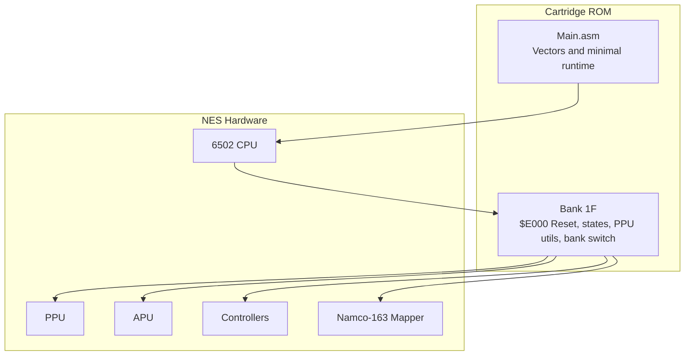
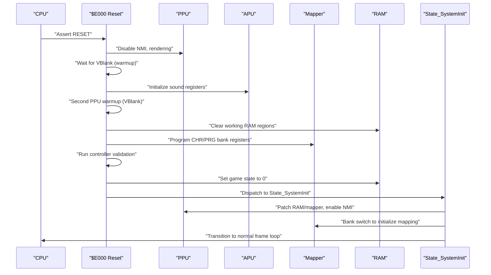
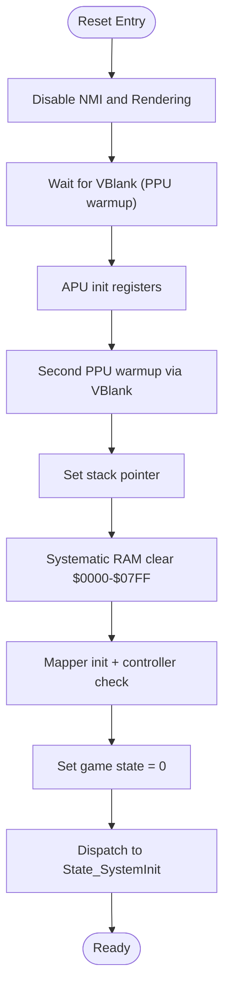
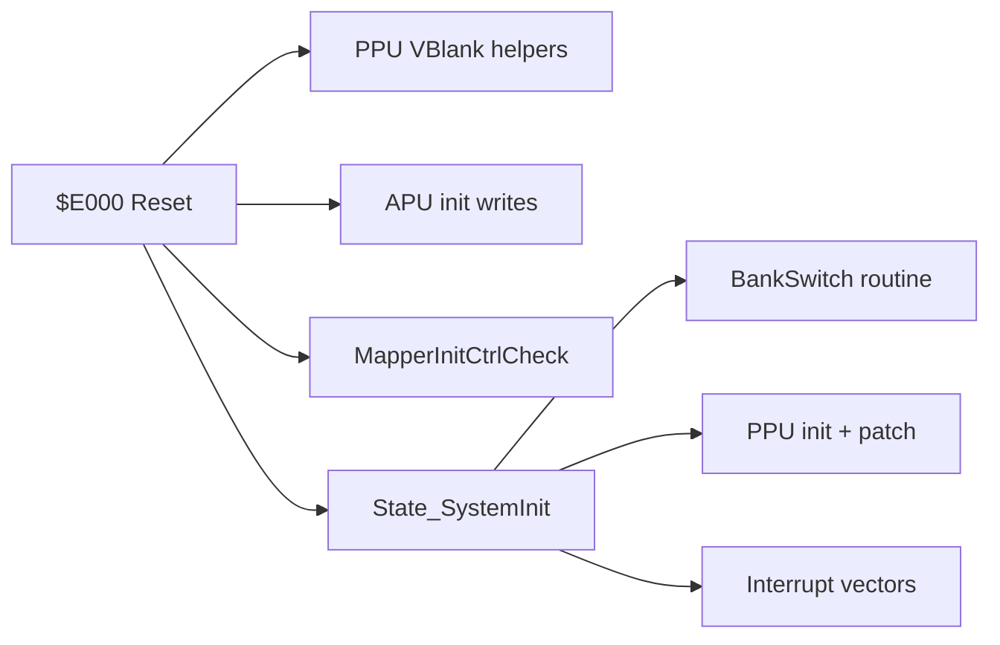

# Reset Handler and Initialization

<cite>
**Referenced Files in This Document**
- [prg_1f.asm](file://asm/banks/prg_1f.asm)
- [main.asm](file://asm/main.asm)
- [bank_1f_analysis.md](file://code/bank_1f_analysis.md)
- [disasm_bank_1f.py](file://tools/disasm_bank_1f.py)
- [bank_1f_raw.asm](file://code/bank_1f_raw.asm)
</cite>

## Table of Contents
1. [Introduction](#introduction)
2. [Project Structure](#project-structure)
3. [Core Components](#core-components)
4. [Architecture Overview](#architecture-overview)
5. [Detailed Component Analysis](#detailed-component-analysis)
6. [Dependency Analysis](#dependency-analysis)
7. [Performance Considerations](#performance-considerations)
8. [Troubleshooting Guide](#troubleshooting-guide)
9. [Conclusion](#conclusion)

## Introduction
This document explains the reset handler and system initialization process located at $E000 in bank 1F. It covers the complete boot sequence including APU initialization, PPU warmup cycles synchronized to VBlank, RAM clearing routines, mapper/controller checks, dual PPU initialization for stability, stack pointer setup, and the transition to State_SystemInit. It also documents the controller input check routine, timing-critical PPU initialization, mapper register patching, bank switching to establish proper memory mapping, and troubleshooting guidance for common initialization failures.

## Project Structure
The reset handler and initialization logic reside in bank 1F of the ROM. The relevant files include:
- Assembly source for bank 1F containing the Reset handler, state dispatch, PPU utilities, bank switching, and interrupt vectors
- Main assembly entry points and vectors for the cartridge
- Disassembly and analysis artifacts that describe function boundaries and bank switching tables

**Diagram sources**
- [prg_1f.asm:71-148](file://asm/banks/prg_1f.asm#L71-L148)
- [main.asm:134-141](file://asm/main.asm#L134-L141)

**Section sources**
- [prg_1f.asm:5-10](file://asm/banks/prg_1f.asm#L5-L10)
- [main.asm:134-141](file://asm/main.asm#L134-L141)

## Core Components
- Reset handler at $E000: Performs early hardware setup, waits for PPU stabilization via VBlank, initializes APU, runs a second PPU warmup, clears RAM, runs mapper/controller checks, sets state, and dispatches to State_SystemInit.
- PPU initialization helpers: Provide deterministic PPU state and VBlank synchronization utilities used during reset and later frames.
- Mapper/controller initialization: Programs mapper registers for CHR/PRG banking and validates controller connectivity.
- Bank switching: Uses a table-driven mechanism to set PRG bank registers and maintain copies in RAM for restoration.
- Interrupt vectors: Pointers to NMI/IRQ handlers and Reset entry.

Key implementation references:
- Reset handler and dispatch: [prg_1f.asm:71-148](file://asm/banks/prg_1f.asm#L71-L148)
- PPU utilities and VBlank helpers: [prg_1f.asm:1097-1121](file://asm/banks/prg_1f.asm#L1097-L1121)
- Mapper/controller init: [prg_1f.asm:2477-2506](file://asm/banks/prg_1f.asm#L2477-L2506)
- Bank switching: [bank_1f_raw.asm:1103-1176](file://code/bank_1f_raw.asm#L1103-L1176)
- Interrupt vectors: [prg_1f.asm:2864-2870](file://asm/banks/prg_1f.asm#L2864-L2870)

**Section sources**
- [prg_1f.asm:71-148](file://asm/banks/prg_1f.asm#L71-L148)
- [prg_1f.asm:1097-1121](file://asm/banks/prg_1f.asm#L1097-L1121)
- [prg_1f.asm:2477-2506](file://asm/banks/prg_1f.asm#L2477-L2506)
- [bank_1f_raw.asm:1103-1176](file://code/bank_1f_raw.asm#L1103-L1176)
- [prg_1f.asm:2864-2870](file://asm/banks/prg_1f.asm#L2864-L2870)

## Architecture Overview
The reset sequence orchestrates hardware initialization and state transitions:

**Diagram sources**
- [prg_1f.asm:71-148](file://asm/banks/prg_1f.asm#L71-L148)
- [prg_1f.asm:174-202](file://asm/banks/prg_1f.asm#L174-L202)
- [prg_1f.asm:2477-2506](file://asm/banks/prg_1f.asm#L2477-L2506)
- [bank_1f_raw.asm:1103-1176](file://code/bank_1f_raw.asm#L1103-L1176)

## Detailed Component Analysis

### Reset Handler ($E000)
The reset handler performs:
- Disable interrupts and clear decimal mode
- Disable PPU NMI and rendering
- Wait for VBlank twice for PPU stabilization
- Initialize APU registers
- Set stack pointer
- Clear working RAM ($0000-$07FF) systematically
- Run mapper initialization and controller validation
- Initialize game state and dispatch to State_SystemInit

**Diagram sources**
- [prg_1f.asm:71-148](file://asm/banks/prg_1f.asm#L71-L148)

**Section sources**
- [prg_1f.asm:71-148](file://asm/banks/prg_1f.asm#L71-L148)

### APU Initialization
The reset handler writes to APU registers to disable DMC IRQs, silence sound channels, and configure frame sequencer behavior. This ensures a clean audio state prior to normal gameplay.

References:
- [prg_1f.asm:90-96](file://asm/banks/prg_1f.asm#L90-L96)

**Section sources**
- [prg_1f.asm:90-96](file://asm/banks/prg_1f.asm#L90-L96)

### PPU Warmup and Dual Initialization Pattern
The reset handler performs two PPU warmup cycles synchronized to VBlank:
- First warmup: disables NMI and rendering, waits for VBlank onset and negation
- Second warmup: repeats the same pattern to further stabilize PPU state

This dual warmup pattern reduces the risk of undefined PPU behavior immediately after reset, ensuring reliable operation of subsequent PPU operations.

References:
- [prg_1f.asm:80-111](file://asm/banks/prg_1f.asm#L80-L111)

**Section sources**
- [prg_1f.asm:80-111](file://asm/banks/prg_1f.asm#L80-L111)

### Stack Pointer Setup
After PPU warmup, the reset handler sets the stack pointer to the top of the zero page, preparing the runtime for subroutine calls and local variable storage.

References:
- [prg_1f.asm:112-114](file://asm/banks/prg_1f.asm#L112-L114)

**Section sources**
- [prg_1f.asm:112-114](file://asm/banks/prg_1f.asm#L112-L114)

### RAM Clearing Routine ($0000-$07FF)
The reset handler systematically clears working RAM regions to ensure deterministic state before entering the first game state. The clearing uses indexed zero-page addressing to iterate across pages and avoid relying on uninitialized memory.

References:
- [prg_1f.asm:116-130](file://asm/banks/prg_1f.asm#L116-L130)

**Section sources**
- [prg_1f.asm:116-130](file://asm/banks/prg_1f.asm#L116-L130)

### Mapper and Controller Checks
The mapper/controller initialization routine:
- Programs CHR and PRG bank registers to fixed or sequential banks
- Validates controller connectivity by writing test patterns and reading back through the controller ports
- Iterates a fixed number of steps to ensure robust detection

References:
- [prg_1f.asm:2477-2506](file://asm/banks/prg_1f.asm#L2477-L2506)

**Section sources**
- [prg_1f.asm:2477-2506](file://asm/banks/prg_1f.asm#L2477-L2506)

### Transition to State_SystemInit
After initialization, the reset handler sets the game state to 0 and dispatches to State_SystemInit. This state performs final PPU/mapper patching, enables NMI, switches banks, and transitions into the normal frame loop.

References:
- [prg_1f.asm:134-148](file://asm/banks/prg_1f.asm#L134-L148)
- [prg_1f.asm:174-202](file://asm/banks/prg_1f.asm#L174-L202)

**Section sources**
- [prg_1f.asm:134-148](file://asm/banks/prg_1f.asm#L134-L148)
- [prg_1f.asm:174-202](file://asm/banks/prg_1f.asm#L174-L202)

### State_SystemInit Details
State_SystemInit:
- Waits for VBlank, disables rendering
- Initializes PPU and patches RAM and mapper registers
- Performs bank switching to finalize memory mapping
- Enables NMI and advances state to Idle/Wait

References:
- [prg_1f.asm:174-202](file://asm/banks/prg_1f.asm#L174-L202)
- [bank_1f_raw.asm:1103-1176](file://code/bank_1f_raw.asm#L1103-L1176)

**Section sources**
- [prg_1f.asm:174-202](file://asm/banks/prg_1f.asm#L174-L202)
- [bank_1f_raw.asm:1103-1176](file://code/bank_1f_raw.asm#L1103-L1176)

### Interrupt Vectors and Runtime Entry
The vectors at $FFFA point to NMI, Reset, and IRQ handlers. The Reset vector targets the Reset handler in bank 1F, while NMI/IRQ handlers are defined in the same bank.

References:
- [prg_1f.asm:2864-2870](file://asm/banks/prg_1f.asm#L2864-L2870)

**Section sources**
- [prg_1f.asm:2864-2870](file://asm/banks/prg_1f.asm#L2864-L2870)

## Dependency Analysis
The reset handler depends on several subsystems and helper routines:

**Diagram sources**
- [prg_1f.asm:71-148](file://asm/banks/prg_1f.asm#L71-L148)
- [prg_1f.asm:174-202](file://asm/banks/prg_1f.asm#L174-L202)
- [prg_1f.asm:2477-2506](file://asm/banks/prg_1f.asm#L2477-L2506)
- [bank_1f_raw.asm:1103-1176](file://code/bank_1f_raw.asm#L1103-L1176)

**Section sources**
- [prg_1f.asm:71-148](file://asm/banks/prg_1f.asm#L71-L148)
- [prg_1f.asm:174-202](file://asm/banks/prg_1f.asm#L174-L202)
- [prg_1f.asm:2477-2506](file://asm/banks/prg_1f.asm#L2477-L2506)
- [bank_1f_raw.asm:1103-1176](file://code/bank_1f_raw.asm#L1103-L1176)

## Performance Considerations
- VBlank synchronization is essential for PPU initialization because PPU registers and internal state are reset asynchronously; waiting for VBlank ensures the PPU is in a known state before proceeding.
- The dual PPU warmup cycle increases robustness against timing variations in PPU reset behavior.
- Bank switching and mapper register programming occur during reset to minimize overhead in the frame loop.
- Clearing RAM systematically avoids reliance on uninitialized memory, reducing potential nondeterministic behavior.

[No sources needed since this section provides general guidance]

## Troubleshooting Guide
Common initialization failures and diagnostic indicators:
- Symptoms: Garbage graphics or screen corruption after reset
  - Causes: Insufficient PPU warmup or incorrect PPU state
  - Actions: Verify VBlank waits and ensure PPU registers are cleared before enabling rendering
  - References: [prg_1f.asm:80-111](file://asm/banks/prg_1f.asm#L80-L111)

- Symptoms: No audio after reset
  - Causes: APU registers not initialized
  - Actions: Confirm APU init writes are executed
  - References: [prg_1f.asm:90-96](file://asm/banks/prg_1f.asm#L90-L96)

- Symptoms: Controller input appears random or invalid
  - Causes: Controller validation failure
  - Actions: Review controller validation loop and ensure sufficient iterations; confirm mapper registers are programmed before controller reads
  - References: [prg_1f.asm:2477-2506](file://asm/banks/prg_1f.asm#L2477-L2506)

- Symptoms: RAM anomalies or inconsistent behavior
  - Causes: Incomplete RAM clearing
  - Actions: Verify the systematic clearing routine covers all intended pages
  - References: [prg_1f.asm:116-130](file://asm/banks/prg_1f.asm#L116-L130)

- Symptoms: Incorrect memory mapping or missing data
  - Causes: Mapper registers not patched or bank switching not applied
  - Actions: Confirm mapper register writes and bank switching sequence
  - References: [prg_1f.asm:174-202](file://asm/banks/prg_1f.asm#L174-L202), [bank_1f_raw.asm:1103-1176](file://code/bank_1f_raw.asm#L1103-L1176)

**Section sources**
- [prg_1f.asm:80-111](file://asm/banks/prg_1f.asm#L80-L111)
- [prg_1f.asm:90-96](file://asm/banks/prg_1f.asm#L90-L96)
- [prg_1f.asm:116-130](file://asm/banks/prg_1f.asm#L116-L130)
- [prg_1f.asm:174-202](file://asm/banks/prg_1f.asm#L174-L202)
- [prg_1f.asm:2477-2506](file://asm/banks/prg_1f.asm#L2477-L2506)
- [bank_1f_raw.asm:1103-1176](file://code/bank_1f_raw.asm#L1103-L1176)

## Conclusion
The reset handler at $E000 establishes a reliable foundation for the system by synchronizing with VBlank, initializing the APU and PPU, clearing RAM, validating the controller, and preparing the mapper for proper memory mapping. The dual PPU warmup and careful sequencing of operations ensure deterministic behavior. State_SystemInit finalizes the setup and transitions into the normal frame loop, where NMI-driven updates manage display and gameplay.

[No sources needed since this section summarizes without analyzing specific files]