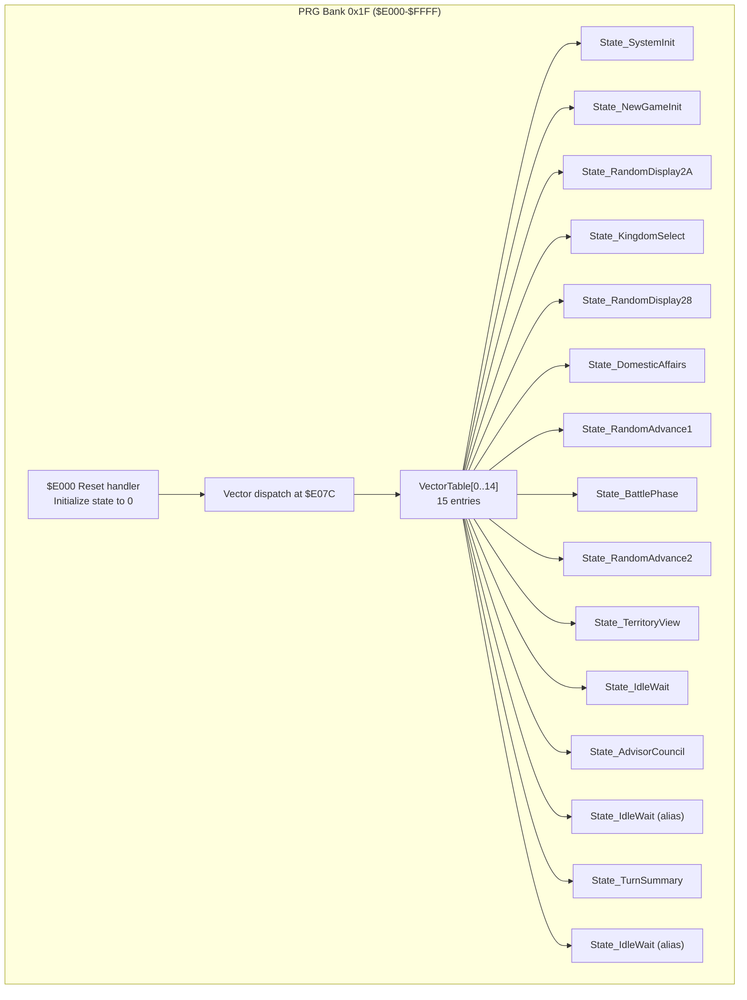
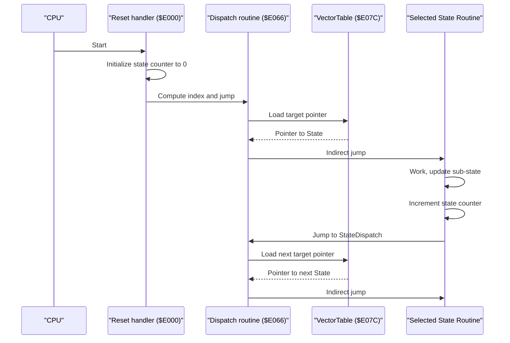
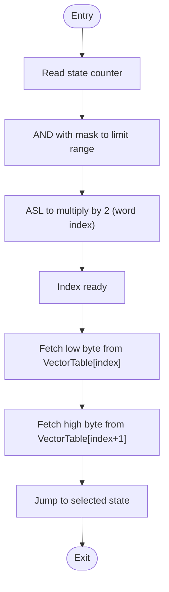
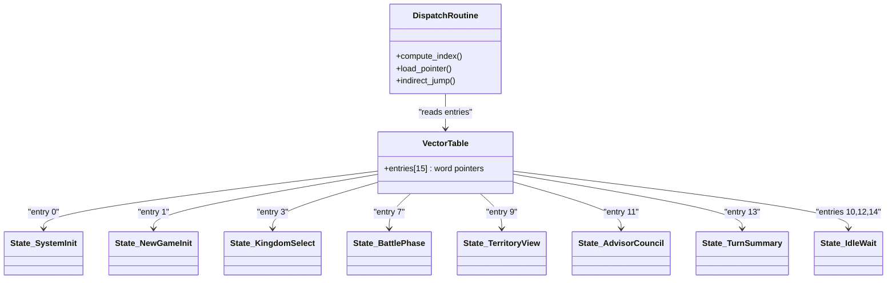
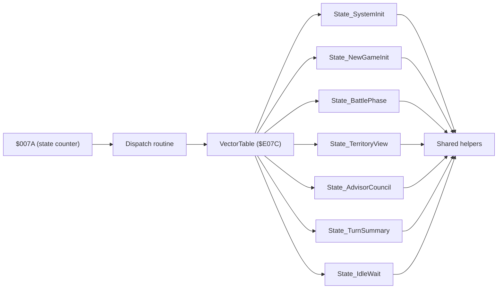

# State Machine Architecture

<cite>
**Referenced Files in This Document**
- [PROJECT.md](file://PROJECT.md)
- [main.asm](file://asm/main.asm)
- [prg_1f.asm](file://asm/banks/prg_1f.asm)
- [bank_1f_raw.asm](file://code/bank_1f_raw.asm)
</cite>

## Table of Contents
1. [Introduction](#introduction)
2. [Project Structure](#project-structure)
3. [Core Components](#core-components)
4. [Architecture Overview](#architecture-overview)
5. [Detailed Component Analysis](#detailed-component-analysis)
6. [Dependency Analysis](#dependency-analysis)
7. [Performance Considerations](#performance-considerations)
8. [Troubleshooting Guide](#troubleshooting-guide)
9. [Conclusion](#conclusion)

## Introduction
This document explains the 15-state system and vector dispatch mechanism used by the game’s runtime control flow. It focuses on how the state counter at a fixed zero-page address selects one of 15 logical states, how the vector table at a fixed address serves as the central dispatch, and how each state corresponds to a distinct game phase. It also documents the state numbering scheme (0–14), the relationship between major states and sub-states, the mathematical operations used for state selection, and how modular .proc organization cleanly separates state logic. Finally, it highlights the efficiency of this approach for 6502 assembly and how it minimizes branching overhead.

## Project Structure
The state machine resides in the boot bank (PRG bank 0x1F) mapped to $E000–$FFFF. The reset handler initializes global state and performs the initial dispatch via the vector table. The vector table itself is located at a fixed address and contains 15 entries, each pointing to a state routine. The state counter is stored at a fixed zero-page location and is incremented by individual states to move to the next phase.

**Diagram sources**
- [prg_1f.asm:72-148](file://asm/banks/prg_1f.asm#L72-L148)
- [prg_1f.asm:150-168](file://asm/banks/prg_1f.asm#L150-L168)

**Section sources**
- [PROJECT.md:70-116](file://PROJECT.md#L70-L116)
- [prg_1f.asm:15-25](file://asm/banks/prg_1f.asm#L15-L25)
- [prg_1f.asm:138-148](file://asm/banks/prg_1f.asm#L138-L148)

## Core Components
- State counter: A single byte at a fixed zero-page address holds the current state index (0–14). States increment this counter to transition to the next logical phase.
- Vector table: A fixed-size table at a fixed address containing 15 word-sized pointers. Each pointer targets a state routine.
- Dispatch routine: A small routine that masks the state counter, scales it for word indexing, fetches the target pointer from the vector table, and jumps indirectly to the selected state.
- Modular state routines: Each state is implemented as a separate .proc block with a consistent entry point and exit pattern, enabling clean separation of concerns.

Key memory and addressing constants:
- State counter: fixed zero-page address
- Vector table: fixed address
- Dispatch pointer: fixed zero-page addresses for low/high bytes
- StateDispatch: reusable dispatch entry used by states after work is done

**Section sources**
- [prg_1f.asm:21-25](file://asm/banks/prg_1f.asm#L21-L25)
- [prg_1f.asm:138-148](file://asm/banks/prg_1f.asm#L138-L148)
- [prg_1f.asm:738-749](file://asm/banks/prg_1f.asm#L738-L749)

## Architecture Overview
The runtime follows a simple, deterministic cycle:
1. Reset handler initializes the state counter to 0 and dispatches to the first state.
2. Each state performs its work, updates sub-state if needed, and increments the state counter.
3. After completing per-frame initialization, states call the shared dispatch routine to jump to the next state based on the updated counter.
4. The vector table ensures O(1) dispatch with minimal overhead.

**Diagram sources**
- [prg_1f.asm:72-148](file://asm/banks/prg_1f.asm#L72-L148)
- [prg_1f.asm:138-148](file://asm/banks/prg_1f.asm#L138-L148)
- [prg_1f.asm:738-749](file://asm/banks/prg_1f.asm#L738-L749)

## Detailed Component Analysis

### State Counter and Selection
- The state counter is a single byte stored at a fixed zero-page address. Its value determines which entry in the vector table is executed.
- The selection process uses a mask and shift to compute a word-aligned index:
  - AND with a mask to constrain the index to 0–31 (covering 15 states with padding).
  - Arithmetic shift left multiplies the index by 2 to convert byte offset into word offset.
  - The resulting index is used to fetch two bytes from the vector table (low and high), forming the target address.
- The counter is incremented by states to advance the game flow.

**Diagram sources**
- [prg_1f.asm:138-148](file://asm/banks/prg_1f.asm#L138-L148)

**Section sources**
- [prg_1f.asm:21-25](file://asm/banks/prg_1f.asm#L21-L25)
- [prg_1f.asm:138-148](file://asm/banks/prg_1f.asm#L138-L148)

### Vector Table and Dispatch Mechanism
- The vector table is a fixed-size array of 15 word-sized pointers located at a fixed address. Each entry corresponds to a state routine.
- The table explicitly lists all 15 states, including aliases (multiple states sharing the same routine).
- The dispatch routine loads the computed pointer pair into a fixed pair of zero-page addresses and performs an indirect jump to the selected state.

**Diagram sources**
- [prg_1f.asm:150-168](file://asm/banks/prg_1f.asm#L150-L168)
- [prg_1f.asm:138-148](file://asm/banks/prg_1f.asm#L138-L148)

**Section sources**
- [prg_1f.asm:150-168](file://asm/banks/prg_1f.asm#L150-L168)
- [prg_1f.asm:138-148](file://asm/banks/prg_1f.asm#L138-L148)

### State Numbering Scheme and Phases
- States are numbered 0–14. The vector table explicitly assigns each number to a state routine.
- Some entries alias to the same routine (e.g., idle wait states), reducing duplication.
- Typical progression includes system initialization, new game initialization, random displays, kingdom selection, domestic affairs, battle phase, random seed advances, territory view, advisor council, turn summary, and idle waits.

Examples of state-specific behaviors:
- System initialization: prepares PPU, patches mapper, configures display, and advances to a later state.
- New game initialization: sets up display modes, windowing, overlays, reads controller input, writes SRAM flags, and advances to the next state.
- Battle phase: renders battle graphics, handles army status flags, triggers music, and advances to the next state.
- Territory view: renders map/territory display, handles input, updates palettes, and advances to the next state.
- Advisor council: renders advisor dialogue, handles input, updates palettes, triggers music, and advances to the next state.
- Turn summary: renders turn report, selects music based on completion flag, and advances to the next state.
- Idle wait: minimal work, immediately dispatches to the next state.

**Section sources**
- [prg_1f.asm:174-202](file://asm/banks/prg_1f.asm#L174-L202)
- [prg_1f.asm:210-276](file://asm/banks/prg_1f.asm#L210-L276)
- [prg_1f.asm:493-550](file://asm/banks/prg_1f.asm#L493-L550)
- [prg_1f.asm:575-619](file://asm/banks/prg_1f.asm#L575-L619)
- [prg_1f.asm:630-680](file://asm/banks/prg_1f.asm#L630-L680)
- [prg_1f.asm:686-735](file://asm/banks/prg_1f.asm#L686-L735)
- [prg_1f.asm:624-625](file://asm/banks/prg_1f.asm#L624-L625)

### Major States vs Sub-states
- Major state: the primary phase represented by the state counter (0–14).
- Sub-state: a secondary index within a state used to manage internal sub-phases or modes. It is commonly initialized at the start of a state and updated as needed.
- Example: many states set the sub-state to a constant at entry, then branch internally based on sub-state for different actions or views.

**Section sources**
- [prg_1f.asm:21-23](file://asm/banks/prg_1f.asm#L21-L23)
- [prg_1f.asm:210-216](file://asm/banks/prg_1f.asm#L210-L216)
- [prg_1f.asm:497-499](file://asm/banks/prg_1f.asm#L497-L499)
- [prg_1f.asm:577](file://asm/banks/prg_1f.asm#L577)
- [prg_1f.asm:632](file://asm/banks/prg_1f.asm#L632)
- [prg_1f.asm:689](file://asm/banks/prg_1f.asm#L689)

### State Transitions and Incrementing the Counter
- Each state routine increments the state counter before dispatching to the next state. This ensures deterministic forward progression.
- The increment occurs at the end of each state’s work, after per-frame initialization and any necessary setup.
- The shared dispatch routine re-reads the counter, computes the new index, and jumps to the next state.

**Section sources**
- [prg_1f.asm:199](file://asm/banks/prg_1f.asm#L199)
- [prg_1f.asm:270](file://asm/banks/prg_1f.asm#L270)
- [prg_1f.asm:427](file://asm/banks/prg_1f.asm#L427)
- [prg_1f.asm:544](file://asm/banks/prg_1f.asm#L544)
- [prg_1f.asm:615](file://asm/banks/prg_1f.asm#L615)
- [prg_1f.asm:674](file://asm/banks/prg_1f.asm#L674)
- [prg_1f.asm:722](file://asm/banks/prg_1f.asm#L722)
- [prg_1f.asm:740-749](file://asm/banks/prg_1f.asm#L740-L749)

### Modular .proc Organization and Clean Separation
- Each state is implemented as a separate .proc block with a consistent entry and exit pattern.
- Shared helpers (frame initialization, palette upload, PPU control/mask helpers, controller read, bank switching) are reused across states.
- This organization makes it straightforward to replace stubs with real code, maintain modularity, and reason about each state independently.

**Section sources**
- [prg_1f.asm:174-202](file://asm/banks/prg_1f.asm#L174-L202)
- [prg_1f.asm:210-276](file://asm/banks/prg_1f.asm#L210-L276)
- [prg_1f.asm:493-550](file://asm/banks/prg_1f.asm#L493-L550)
- [prg_1f.asm:575-619](file://asm/banks/prg_1f.asm#L575-L619)
- [prg_1f.asm:630-680](file://asm/banks/prg_1f.asm#L630-L680)
- [prg_1f.asm:686-735](file://asm/banks/prg_1f.asm#L686-L735)
- [prg_1f.asm:755-779](file://asm/banks/prg_1f.asm#L755-L779)
- [prg_1f.asm:1040-1065](file://asm/banks/prg_1f.asm#L1040-L1065)
- [prg_1f.asm:1071-1085](file://asm/banks/prg_1f.asm#L1071-L1085)
- [prg_1f.asm:1090-1113](file://asm/banks/prg_1f.asm#L1090-L1113)

## Dependency Analysis
The state machine exhibits low coupling and high cohesion:
- Low coupling: The dispatch routine depends only on the vector table and fixed zero-page addresses. States depend only on shared helpers and the dispatch routine.
- Cohesion: Each state encapsulates a single logical phase with its own .proc, promoting readability and maintainability.
- Fixed addresses: Using fixed addresses for the state counter, vector table, and dispatch pointer simplifies the dispatch logic and reduces indirection overhead.

**Diagram sources**
- [prg_1f.asm:21-25](file://asm/banks/prg_1f.asm#L21-L25)
- [prg_1f.asm:138-148](file://asm/banks/prg_1f.asm#L138-L148)
- [prg_1f.asm:150-168](file://asm/banks/prg_1f.asm#L150-L168)
- [prg_1f.asm:738-749](file://asm/banks/prg_1f.asm#L738-L749)

**Section sources**
- [prg_1f.asm:21-25](file://asm/banks/prg_1f.asm#L21-L25)
- [prg_1f.asm:138-148](file://asm/banks/prg_1f.asm#L138-L148)
- [prg_1f.asm:150-168](file://asm/banks/prg_1f.asm#L150-L168)
- [prg_1f.asm:738-749](file://asm/banks/prg_1f.asm#L738-L749)

## Performance Considerations
- O(1) dispatch: The vector table lookup avoids loops or branches, minimizing overhead on the 6502.
- Minimal arithmetic: Only masking and shifting are used to compute the index, keeping instruction count low.
- Indirect jump: The shared dispatch routine centralizes the jump logic, avoiding repeated code.
- Zero-page addressing: Fixed zero-page addresses reduce instruction length and improve speed.
- Modularity: Reusing helpers reduces code size and improves maintainability without sacrificing performance.

[No sources needed since this section provides general guidance]

## Troubleshooting Guide
Common issues and checks:
- Incorrect state transitions: Verify that each state increments the state counter before dispatching.
- Vector table misalignment: Ensure the vector table entries are word-aligned and ordered 0–14.
- Dispatch pointer corruption: Confirm that the dispatch routine writes both low and high bytes of the target pointer.
- Sub-state misuse: Ensure sub-state is initialized at the start of a state and updated only as needed.
- Idle wait loops: If stuck in idle, confirm the state increments the counter and the vector table points to a different routine.

**Section sources**
- [prg_1f.asm:199](file://asm/banks/prg_1f.asm#L199)
- [prg_1f.asm:270](file://asm/banks/prg_1f.asm#L270)
- [prg_1f.asm:427](file://asm/banks/prg_1f.asm#L427)
- [prg_1f.asm:544](file://asm/banks/prg_1f.asm#L544)
- [prg_1f.asm:615](file://asm/banks/prg_1f.asm#L615)
- [prg_1f.asm:674](file://asm/banks/prg_1f.asm#L674)
- [prg_1f.asm:722](file://asm/banks/prg_1f.asm#L722)
- [prg_1f.asm:138-148](file://asm/banks/prg_1f.asm#L138-L148)
- [prg_1f.asm:738-749](file://asm/banks/prg_1f.asm#L738-L749)

## Conclusion
The 15-state system with vector dispatch provides a compact, efficient, and maintainable control flow for the game. By storing the state counter at a fixed zero-page address and using a fixed vector table, the design achieves predictable, O(1) dispatch with minimal branching overhead. The modular .proc organization cleanly separates state logic, while shared helpers keep code reuse high. Together, these patterns enable reliable progression across game phases and simplify future development and verification.