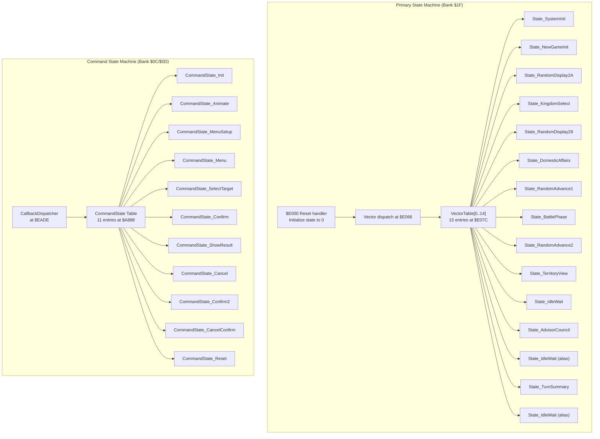
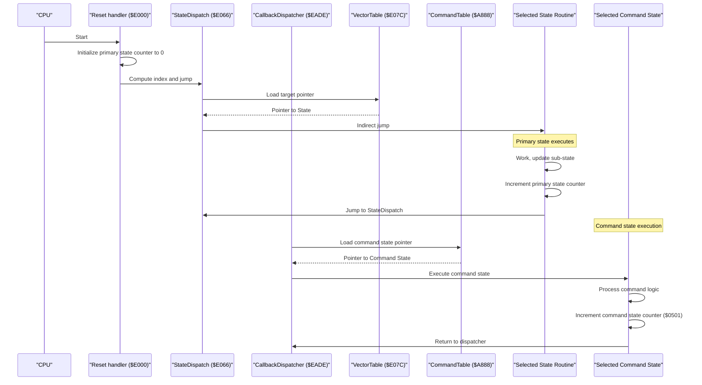
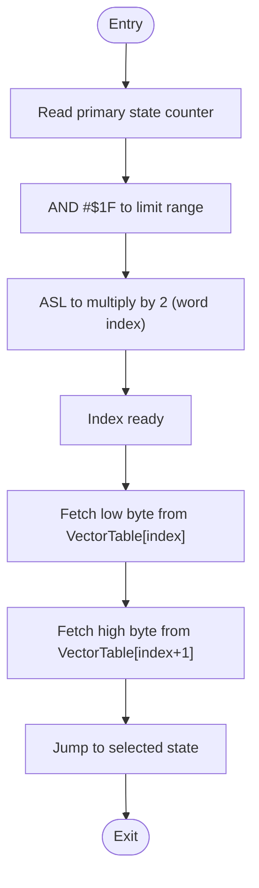
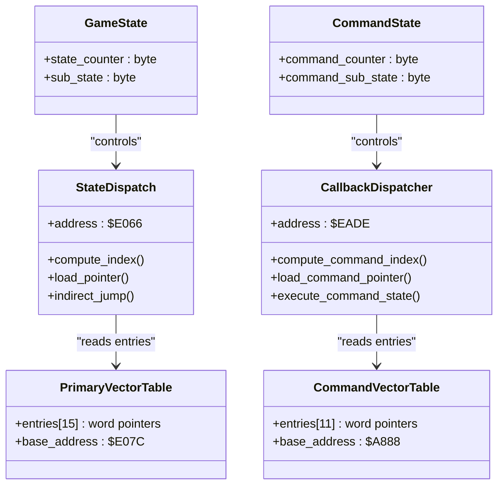
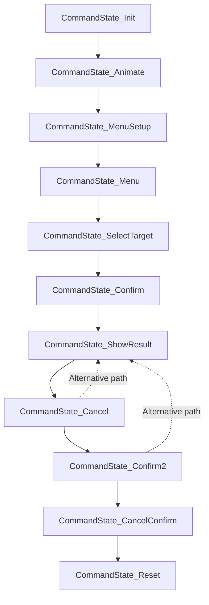
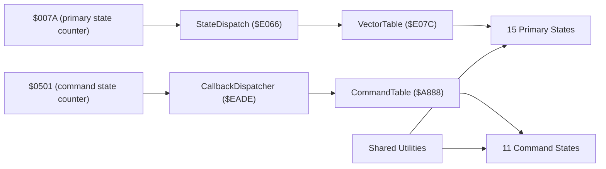

# State Machine Architecture

<cite>
**Referenced Files in This Document**
- [PROJECT.md](file://PROJECT.md)
- [main.asm](file://asm/main.asm)
- [prg_1f.asm](file://asm/banks/prg_1f.asm)
- [prg_0c_0d.asm](file://asm/banks/prg_0c_0d.asm)
- [bank_1f_raw.asm](file://code/bank_1f_raw.asm)
- [functions.h](file://include/functions.h)
</cite>

## Update Summary
**Changes Made**
- Updated state machine architecture documentation to reflect the new CommandState_* naming convention that replaced ActionState_* states
- Enhanced documentation for officer command processing system in PRG bank $0C/$0D
- Added detailed explanation of the 11-entry callback dispatcher table and its relationship to the main 15-state system
- Improved semantic clarity documentation for the command processing state machine

## Table of Contents
1. [Introduction](#introduction)
2. [Project Structure](#project-structure)
3. [Core Components](#core-components)
4. [Architecture Overview](#architecture-overview)
5. [Detailed Component Analysis](#detailed-component-analysis)
6. [Officer Command Processing System](#officer-command-processing-system)
7. [Dependency Analysis](#dependency-analysis)
8. [Performance Considerations](#performance-considerations)
9. [Troubleshooting Guide](#troubleshooting-guide)
10. [Conclusion](#conclusion)

## Introduction
This document explains the dual-layer state machine architecture used by the game's runtime control flow. The primary system consists of a 15-state system with vector dispatch mechanism, while the secondary system handles officer command processing through an 11-state command state machine. It focuses on how the state counter at a fixed zero-page address selects one of 15 logical states, how the vector table at a fixed address serves as the central dispatch, and how each state corresponds to a distinct game phase. The document also covers the enhanced CommandState_* naming convention that provides improved semantic clarity for officer command processing within PRG bank $0C/$0D.

## Project Structure
The state machines reside across multiple PRG banks:
- **Primary State Machine**: Located in boot bank (PRG bank 0x1F) mapped to $E000–$FFFF
- **Command State Machine**: Located in PRG bank $0C/$0D for officer command processing
- **Support Systems**: Various utility functions and helper routines distributed across other banks

The reset handler initializes global state and performs the initial dispatch via the vector table. Both state machines use similar patterns but serve different purposes in the game's overall architecture.

**Diagram sources**
- [prg_1f.asm:239-255](file://asm/banks/prg_1f.asm#L239-L255)
- [prg_0c_0d.asm:1153-1164](file://asm/banks/prg_0c_0d.asm#L1153-L1164)
- [functions.h:25-45](file://include/functions.h#L25-L45)

**Section sources**
- [prg_1f.asm:239-255](file://asm/banks/prg_1f.asm#L239-L255)
- [prg_0c_0d.asm:1153-1164](file://asm/banks/prg_0c_0d.asm#L1153-L1164)
- [functions.h:25-45](file://include/functions.h#L25-L45)

## Core Components
- **Primary State Counter**: A single byte at a fixed zero-page address holds the current state index (0–14) for the main game loop
- **Primary Vector Table**: A fixed-size table at $E07C containing 15 word-sized pointers for main game states
- **Command State Counter**: Separate counter ($0501) for officer command processing states
- **Command Vector Table**: Fixed-size table at $A888 containing 11 word-sized pointers for command states
- **Dispatch Routines**: Two separate dispatch mechanisms - B1F_StateDispatch for primary states and B1F_CallbackDispatcher for command states
- **Modular State Routines**: Each state is implemented as a separate .proc block with consistent entry/exit patterns

Key memory and addressing constants:
- Primary state counter: fixed zero-page address
- Primary vector table: $E07C
- Command state counter: $0501
- Command vector table: $A888
- B1F_StateDispatch: $E066
- B1F_CallbackDispatcher: $EADE

**Section sources**
- [prg_1f.asm:239-255](file://asm/banks/prg_1f.asm#L239-L255)
- [prg_0c_0d.asm:1153-1164](file://asm/banks/prg_0c_0d.asm#L1153-L1164)
- [functions.h:25-45](file://include/functions.h#L25-L45)

## Architecture Overview
The runtime follows two parallel but coordinated cycles:

### Primary Game Loop Cycle:
1. Reset handler initializes the primary state counter to 0 and dispatches to the first state
2. Each primary state performs its work, updates sub-state if needed, and increments the state counter
3. After completing per-frame initialization, states call the shared dispatch routine to jump to the next state
4. The vector table ensures O(1) dispatch with minimal overhead

### Command Processing Cycle:
1. Command states are invoked through the CallbackDispatcher mechanism
2. Each command state processes specific aspects of officer commands (menu selection, target validation, confirmation dialogs)
3. States increment the command state counter ($0501) to progress through the command workflow
4. The command vector table provides efficient dispatch between command states

**Diagram sources**
- [prg_1f.asm:239-255](file://asm/banks/prg_1f.asm#L239-L255)
- [prg_0c_0d.asm:1153-1164](file://asm/banks/prg_0c_0d.asm#L1153-L1164)
- [functions.h:25-45](file://include/functions.h#L25-L45)

## Detailed Component Analysis

### Primary State Counter and Selection
- The primary state counter is a single byte stored at a fixed zero-page address. Its value determines which entry in the vector table is executed.
- The selection process uses masking and shifting to compute a word-aligned index:
  - AND with #$1F mask to constrain the index to 0–31 (covering 15 states with padding)
  - Arithmetic shift left multiplies the index by 2 to convert byte offset into word offset
  - The resulting index is used to fetch two bytes from the vector table (low and high), forming the target address
- The counter is incremented by states to advance the game flow deterministically

**Diagram sources**
- [prg_1f.asm:239-255](file://asm/banks/prg_1f.asm#L239-L255)

**Section sources**
- [prg_1f.asm:239-255](file://asm/banks/prg_1f.asm#L239-L255)
- [functions.h:25-45](file://include/functions.h#L25-L45)

### Command State Counter and Selection
- The command state counter ($0501) manages the 11 command states for officer processing
- Uses the same mathematical operations as the primary state machine for efficiency
- Integrated with the broader game state management system through shared utilities

**Section sources**
- [prg_0c_0d.asm:1153-1164](file://asm/banks/prg_0c_0d.asm#L1153-L1164)

### Vector Tables and Dispatch Mechanisms
- **Primary Vector Table**: Fixed-size array of 15 word-sized pointers at $E07C, each corresponding to a game state routine
- **Command Vector Table**: Fixed-size array of 11 word-sized pointers at $A888, each corresponding to a command state routine
- **Primary Dispatch**: B1F_StateDispatch at $E066 handles main game state transitions
- **Command Dispatch**: B1F_CallbackDispatcher at $EADE handles command state transitions

**Diagram sources**
- [prg_1f.asm:239-255](file://asm/banks/prg_1f.asm#L239-L255)
- [prg_0c_0d.asm:1153-1164](file://asm/banks/prg_0c_0d.asm#L1153-L1164)
- [functions.h:25-45](file://include/functions.h#L25-L45)

**Section sources**
- [prg_1f.asm:239-255](file://asm/banks/prg_1f.asm#L239-L255)
- [prg_0c_0d.asm:1153-1164](file://asm/banks/prg_0c_0d.asm#L1153-L1164)
- [functions.h:25-45](file://include/functions.h#L25-L45)

### State Numbering Scheme and Phases
- **Primary States**: Numbered 0–14 with clear game phase progression
- **Command States**: Numbered 0–10 with specific command processing phases
- Some primary states alias to the same routine (e.g., idle wait states at indices 10, 12, 14), reducing code duplication

Examples of primary state-specific behaviors:
- System initialization: prepares PPU, patches mapper, configures display, advances to territory view
- New game initialization: sets up display modes, windowing, overlays, reads controller input, writes SRAM flags
- Battle phase: renders battle graphics, handles army status flags, triggers music
- Territory view: renders map/territory display, handles input, updates palettes
- Advisor council: renders advisor dialogue, handles input, updates palettes, triggers music
- Turn summary: renders turn report, selects music based on completion flag
- Idle wait: minimal work, immediately dispatches to next state

**Section sources**
- [prg_1f.asm:239-255](file://asm/banks/prg_1f.asm#L239-L255)

### Major States vs Sub-states
- **Major State**: The primary phase represented by the state counter (0–14 for main game, 0–10 for commands)
- **Sub-state**: Secondary index within a state used to manage internal sub-phases or modes
- Example: many states set the sub-state to a constant at entry, then branch internally based on sub-state for different actions

**Section sources**
- [prg_1f.asm:239-255](file://asm/banks/prg_1f.asm#L239-L255)

### State Transitions and Counter Management
- Each state routine increments its respective counter before dispatching to the next state
- Primary states increment the main game state counter
- Command states increment the command state counter ($0501)
- Shared dispatch routines re-read counters, compute new indices, and jump to next states

**Section sources**
- [prg_1f.asm:239-255](file://asm/banks/prg_1f.asm#L239-L255)
- [prg_0c_0d.asm:1153-1164](file://asm/banks/prg_0c_0d.asm#L1153-L1164)

### Modular .proc Organization and Clean Separation
- Each state is implemented as a separate .proc block with consistent entry and exit patterns
- Shared helpers (frame initialization, palette upload, PPU control/mask helpers, controller read, bank switching) are reused across states
- Command states follow the same modular pattern with clear separation of concerns

**Section sources**
- [prg_1f.asm:239-255](file://asm/banks/prg_1f.asm#L239-L255)
- [prg_0c_0d.asm:1153-1164](file://asm/banks/prg_0c_0d.asm#L1153-L1164)

## Officer Command Processing System

### CommandState_* Naming Convention
The officer command processing system uses the enhanced CommandState_* naming convention that provides improved semantic clarity compared to the previous ActionState_* naming scheme. This change reflects better understanding of the command processing workflow and makes the code more maintainable.

### Command State Functions
The 11 command states handle different aspects of officer command processing:

1. **CommandState_Init**: Initializes command processing context and copies data buffers
2. **CommandState_Animate**: Handles animation sequences during command execution
3. **CommandState_MenuSetup**: Sets up menu interfaces for command selection
4. **CommandState_Menu**: Processes menu interactions and item selection
5. **CommandState_SelectTarget**: Validates and selects targets for commands
6. **CommandState_Confirm**: Handles confirmation dialogs for command execution
7. **CommandState_ShowResult**: Displays results of command execution
8. **CommandState_Cancel**: Manages command cancellation workflows
9. **CommandState_Confirm2**: Secondary confirmation for complex commands
10. **CommandState_CancelConfirm**: Confirmation for cancel operations
11. **CommandState_Reset**: Resets command processing state

### Command State Workflow
Each command state follows a consistent pattern:
1. Process input and UI updates
2. Validate command parameters and targets
3. Execute command logic or transition to next state
4. Increment command state counter ($0501) for progression
5. Call CallbackDispatcher for next command state

**Diagram sources**
- [prg_0c_0d.asm:1167-1579](file://asm/banks/prg_0c_0d.asm#L1167-L1579)

**Section sources**
- [prg_0c_0d.asm:1153-1164](file://asm/banks/prg_0c_0d.asm#L1153-L1164)
- [prg_0c_0d.asm:1167-1579](file://asm/banks/prg_0c_0d.asm#L1167-L1579)

## Dependency Analysis
The dual-layer state machine architecture exhibits low coupling and high cohesion:

### Primary State Machine Dependencies
- Low coupling: The primary dispatch routine depends only on the vector table and fixed zero-page addresses
- High cohesion: Each primary state encapsulates a single logical game phase
- Fixed addresses: Using fixed addresses for the state counter, vector table, and dispatch pointer simplifies the dispatch logic

### Command State Machine Dependencies  
- Independent operation: Command states operate independently of the primary state machine
- Shared utilities: Both systems share common helper functions for PPU, sound, and memory operations
- Coordinated timing: Command states integrate with the primary game loop through careful timing coordination

**Diagram sources**
- [prg_1f.asm:239-255](file://asm/banks/prg_1f.asm#L239-L255)
- [prg_0c_0d.asm:1153-1164](file://asm/banks/prg_0c_0d.asm#L1153-L1164)
- [functions.h:25-45](file://include/functions.h#L25-L45)

**Section sources**
- [prg_1f.asm:239-255](file://asm/banks/prg_1f.asm#L239-L255)
- [prg_0c_0d.asm:1153-1164](file://asm/banks/prg_0c_0d.asm#L1153-L1164)
- [functions.h:25-45](file://include/functions.h#L25-L45)

## Performance Considerations
Both state machines are optimized for 6502 performance:

### Primary State Machine Optimization
- O(1) dispatch: The vector table lookup avoids loops or branches, minimizing overhead
- Minimal arithmetic: Only masking and shifting are used to compute indices
- Indirect jump: The shared dispatch routine centralizes the jump logic
- Zero-page addressing: Fixed zero-page addresses reduce instruction length and improve speed

### Command State Machine Optimization
- Efficient dispatcher: CallbackDispatcher uses return address calculation for fast dispatch
- Compact tables: 11-entry command table fits efficiently in available memory
- Consistent patterns: Command states follow predictable execution patterns for optimization

### Shared Optimizations
- Modularity: Reusing helpers reduces code size and improves maintainability
- Predictable timing: Both systems use deterministic state progression for reliable timing
- Memory efficiency: Careful memory layout minimizes access overhead

## Troubleshooting Guide
Common issues and checks for both state machines:

### Primary State Machine Issues
- Incorrect state transitions: Verify that each state increments the state counter before dispatching
- Vector table misalignment: Ensure the vector table entries are word-aligned and ordered 0–14
- Dispatch pointer corruption: Confirm that the dispatch routine writes both low and high bytes of the target pointer
- Sub-state misuse: Ensure sub-state is initialized at the start of a state and updated only as needed

### Command State Machine Issues
- Command counter problems: Verify command state counter ($0501) increments correctly
- Command table alignment: Ensure command table entries are properly aligned and ordered
- Dispatcher integration: Check that command states properly interact with CallbackDispatcher
- State progression: Verify command states follow the expected workflow sequence

### Common Debugging Techniques
- Use memory breakpoints on state counters to verify progression
- Trace dispatch calls to ensure correct state transitions
- Monitor command state counter for proper increment behavior
- Verify vector table contents match expected state mappings

**Section sources**
- [prg_1f.asm:239-255](file://asm/banks/prg_1f.asm#L239-L255)
- [prg_0c_0d.asm:1153-1164](file://asm/banks/prg_0c_0d.asm#L1153-L1164)

## Conclusion
The dual-layer state machine architecture provides a robust, efficient, and maintainable control flow system for the game. The primary 15-state system handles core game phases with predictable O(1) dispatch, while the secondary 11-state command system manages officer command processing with the enhanced CommandState_* naming convention for improved semantic clarity. 

By storing state counters at fixed zero-page addresses and using fixed vector tables, both systems achieve predictable dispatch with minimal branching overhead. The modular .proc organization cleanly separates state logic, while shared helpers keep code reuse high. Together, these patterns enable reliable progression across game phases and simplify future development and verification of the complex interaction between game states and command processing.

The architectural separation between primary game states and command states allows for independent development and debugging, while the consistent patterns across both systems provide familiarity and maintainability for developers working on either layer of the state machine architecture.