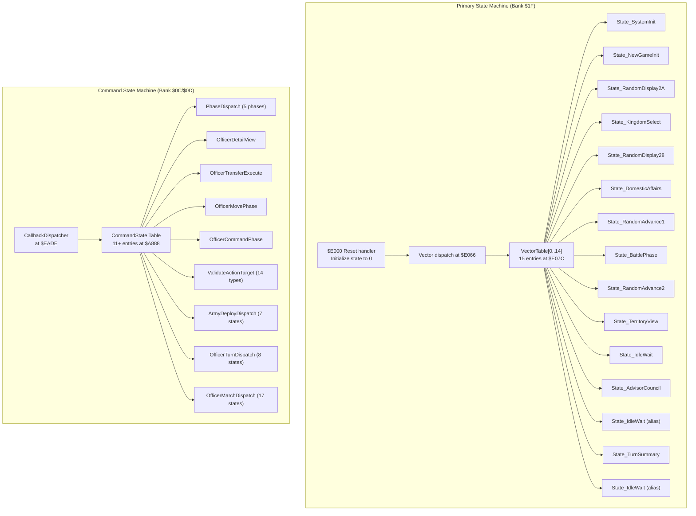
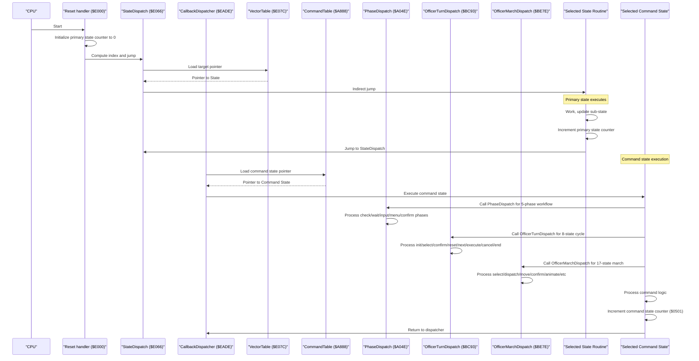
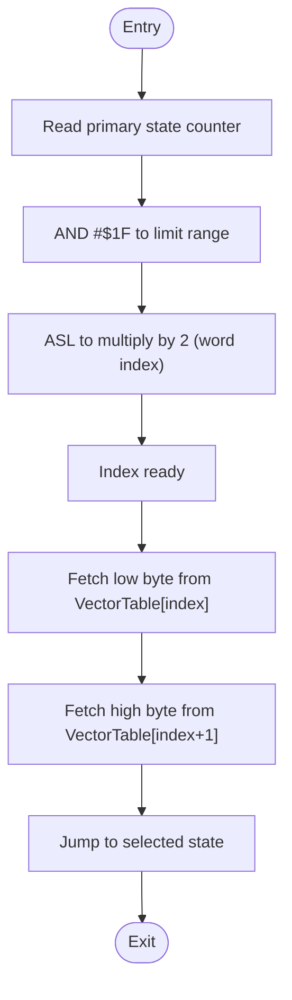
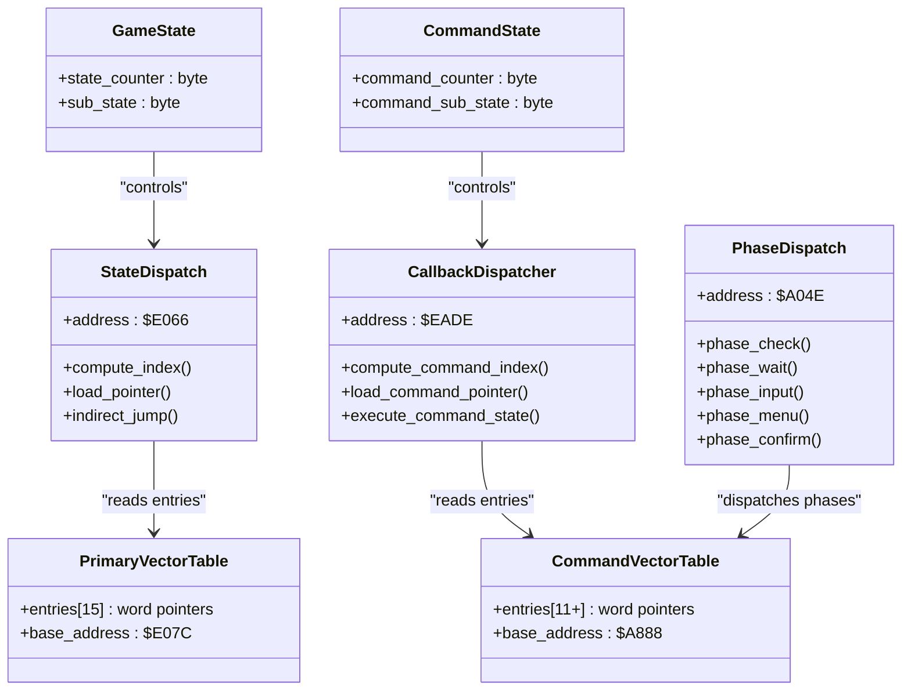
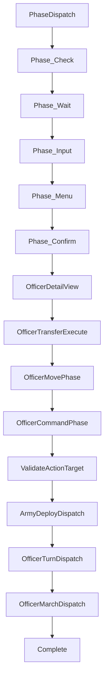
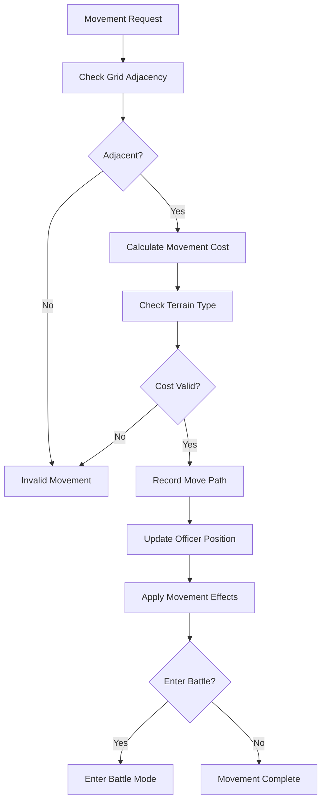
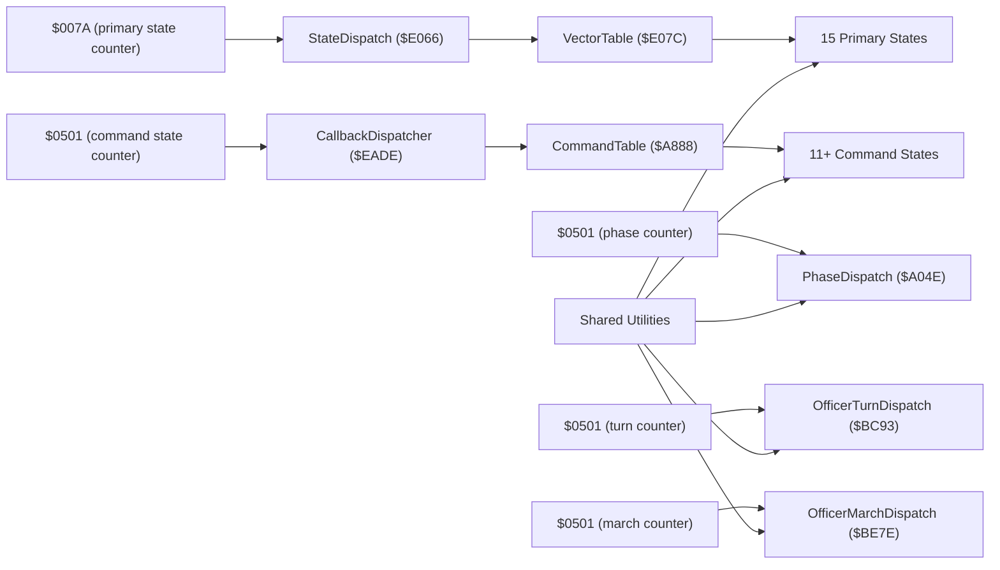

# State Machine Architecture

<cite>
**Referenced Files in This Document**
- [PROJECT.md](file://PROJECT.md)
- [main.asm](file://asm/main.asm)
- [prg_1f.asm](file://asm/banks/prg_1f.asm)
- [prg_0c_0d.asm](file://asm/banks/prg_0c_0d.asm)
- [bank_1f_raw.asm](file://code/bank_1f_raw.asm)
- [functions.h](file://include/functions.h)
</cite>

## Update Summary
**Changes Made**
- Updated state machine architecture documentation to reflect the comprehensive officer command processing system with enhanced state machine architecture
- Added detailed documentation for PhaseDispatch (5 phases), OfficerDetailView, OfficerTransferExecute, OfficerMovePhase, OfficerCommandPhase, and ValidateActionTarget (14 action types)
- Documented ArmyDeployDispatch (7 sub-states), OfficerTurnDispatch (8 states), and OfficerMarchDispatch (17 sub-states)
- Added complete hexagonal map grid movement system with pathfinding and distance calculations
- Enhanced documentation of the dual-layer state machine system with 15-state primary system and expanded command processing subsystem

## Table of Contents
1. [Introduction](#introduction)
2. [Project Structure](#project-structure)
3. [Core Components](#core-components)
4. [Architecture Overview](#architecture-overview)
5. [Detailed Component Analysis](#detailed-component-analysis)
6. [Officer Command Processing System](#officer-command-processing-system)
7. [Hexagonal Map Grid Movement System](#hexagonal-map-grid-movement-system)
8. [Dependency Analysis](#dependency-analysis)
9. [Performance Considerations](#performance-considerations)
10. [Troubleshooting Guide](#troubleshooting-guide)
11. [Conclusion](#conclusion)

## Introduction
This document explains the dual-layer state machine architecture used by the game's runtime control flow. The primary system consists of a 15-state system with vector dispatch mechanism, while the secondary system handles officer command processing through an enhanced command state machine with 11+ states. The system now includes comprehensive hexagonal map grid movement with pathfinding capabilities, supporting complex officer management operations including transfers, commands, and strategic movements across the game world.

The architecture features sophisticated state management with multiple dispatch mechanisms: PhaseDispatch for 5-phase exchange flows, OfficerTurnDispatch for 8-state turn cycles, OfficerMarchDispatch for 17-state army movements, and ArmyDeployDispatch for 7-state deployment operations. Each component uses efficient vector-based dispatching with minimal branching overhead.

## Project Structure
The state machines reside across multiple PRG banks with specialized functionality:
- **Primary State Machine**: Located in boot bank (PRG bank 0x1F) mapped to $E000–$FFFF with 15 main game states
- **Command State Machine**: Located in PRG bank $0C/$0D for comprehensive officer command processing
- **Support Systems**: Various utility functions and helper routines distributed across other banks

The reset handler initializes global state and performs the initial dispatch via the vector table. Both state machines use similar patterns but serve different purposes in the game's overall architecture, with the command system providing deep interaction capabilities for officer management.

**Diagram sources**
- [prg_1f.asm:239-255](file://asm/banks/prg_1f.asm#L239-L255)
- [prg_0c_0d.asm:239-255](file://asm/banks/prg_0c_0d.asm#L239-L255)
- [functions.h:896-932](file://include/functions.h#L896-L932)

**Section sources**
- [prg_1f.asm:239-255](file://asm/banks/prg_1f.asm#L239-L255)
- [prg_0c_0d.asm:239-255](file://asm/banks/prg_0c_0d.asm#L239-L255)
- [functions.h:896-932](file://include/functions.h#L896-L932)

## Core Components
- **Primary State Counter**: A single byte at fixed zero-page address holds the current state index (0–14) for the main game loop
- **Primary Vector Table**: Fixed-size table at $E07C containing 15 word-sized pointers for main game states
- **Command State Counter**: Separate counter ($0501) for officer command processing states with expanded functionality
- **Command Vector Table**: Fixed-size table at $A888 containing 11+ word-sized pointers for command states
- **Multiple Dispatch Routines**: B1F_StateDispatch for primary states, B1F_CallbackDispatcher for command states, plus specialized dispatchers for each major subsystem
- **Modular State Routines**: Each state is implemented as a separate .proc block with consistent entry/exit patterns

Key memory and addressing constants:
- Primary state counter: fixed zero-page address
- Primary vector table: $E07C
- Command state counter: $0501
- Command vector table: $A888
- B1F_StateDispatch: $E066
- B1F_CallbackDispatcher: $EADE
- Exchange state counter: $0500
- Exchange phase counter: $0501

**Section sources**
- [prg_1f.asm:239-255](file://asm/banks/prg_1f.asm#L239-L255)
- [prg_0c_0d.asm:239-255](file://asm/banks/prg_0c_0d.asm#L239-L255)
- [functions.h:896-932](file://include/functions.h#L896-L932)

## Architecture Overview
The runtime follows two parallel but coordinated cycles with enhanced complexity:

### Primary Game Loop Cycle:
1. Reset handler initializes the primary state counter to 0 and dispatches to the first state
2. Each primary state performs its work, updates sub-state if needed, and increments the state counter
3. After completing per-frame initialization, states call the shared dispatch routine to jump to the next state
4. The vector table ensures O(1) dispatch with minimal overhead

### Enhanced Command Processing Cycle:
1. Command states are invoked through the CallbackDispatcher mechanism with support for multiple subsystems
2. Each command state processes specific aspects of officer commands with sophisticated validation and execution
3. States increment the command state counter ($0501) to progress through complex workflows
4. Multiple specialized dispatchers handle different aspects: PhaseDispatch, OfficerTurnDispatch, OfficerMarchDispatch, etc.

**Diagram sources**
- [prg_1f.asm:239-255](file://asm/banks/prg_1f.asm#L239-L255)
- [prg_0c_0d.asm:256-266](file://asm/banks/prg_0c_0d.asm#L256-L266)
- [prg_0c_0d.asm:4009-4027](file://asm/banks/prg_0c_0d.asm#L4009-L4027)
- [prg_0c_0d.asm:4272-4293](file://asm/banks/prg_0c_0d.asm#L4272-L4293)
- [functions.h:896-932](file://include/functions.h#L896-L932)

## Detailed Component Analysis

### Primary State Counter and Selection
- The primary state counter is a single byte stored at a fixed zero-page address. Its value determines which entry in the vector table is executed.
- The selection process uses masking and shifting to compute a word-aligned index:
  - AND with #$1F mask to constrain the index to 0–31 (covering 15 states with padding)
  - Arithmetic shift left multiplies the index by 2 to convert byte offset into word offset
  - The resulting index is used to fetch two bytes from the vector table (low and high), forming the target address
- The counter is incremented by states to advance the game flow deterministically

**Diagram sources**
- [prg_1f.asm:239-255](file://asm/banks/prg_1f.asm#L239-L255)

**Section sources**
- [prg_1f.asm:239-255](file://asm/banks/prg_1f.asm#L239-L255)
- [functions.h:896-932](file://include/functions.h#L896-L932)

### Enhanced Command State Counter and Selection
- The command state counter ($0501) manages the expanded command states for officer processing with support for multiple subsystems
- Uses the same mathematical operations as the primary state machine for efficiency
- Integrated with the broader game state management system through shared utilities and specialized dispatchers
- Supports complex workflows with 5-phase exchange flows, 8-state turn cycles, and 17-state army movements

**Section sources**
- [prg_0c_0d.asm:256-266](file://asm/banks/prg_0c_0d.asm#L256-L266)
- [prg_0c_0d.asm:4009-4027](file://asm/banks/prg_0c_0d.asm#L4009-L4027)
- [prg_0c_0d.asm:4272-4293](file://asm/banks/prg_0c_0d.asm#L4272-L4293)

### Vector Tables and Dispatch Mechanisms
- **Primary Vector Table**: Fixed-size array of 15 word-sized pointers at $E07C, each corresponding to a game state routine
- **Command Vector Table**: Fixed-size array of 11+ word-sized pointers at $A888, each corresponding to a command state routine
- **Primary Dispatch**: B1F_StateDispatch at $E066 handles main game state transitions
- **Command Dispatch**: B1F_CallbackDispatcher at $EADE handles command state transitions
- **Specialized Dispatchers**: PhaseDispatch ($A04E), OfficerTurnDispatch ($BC93), OfficerMarchDispatch ($BE7E), ArmyDeployDispatch ($C204)

**Diagram sources**
- [prg_1f.asm:239-255](file://asm/banks/prg_1f.asm#L239-L255)
- [prg_0c_0d.asm:256-266](file://asm/banks/prg_0c_0d.asm#L256-L266)
- [functions.h:896-932](file://include/functions.h#L896-L932)

**Section sources**
- [prg_1f.asm:239-255](file://asm/banks/prg_1f.asm#L239-L255)
- [prg_0c_0d.asm:256-266](file://asm/banks/prg_0c_0d.asm#L256-L266)
- [functions.h:896-932](file://include/functions.h#L896-L932)

### State Numbering Scheme and Phases
- **Primary States**: Numbered 0–14 with clear game phase progression
- **Command States**: Numbered 0–10+ with specific command processing phases and expanded subsystems
- Some primary states alias to the same routine (e.g., idle wait states at indices 10, 12, 14), reducing code duplication

Examples of primary state-specific behaviors:
- System initialization: prepares PPU, patches mapper, configures display, advances to territory view
- New game initialization: sets up display modes, windowing, overlays, reads controller input, writes SRAM flags
- Battle phase: renders battle graphics, handles army status flags, triggers music
- Territory view: renders map/territory display, handles input, updates palettes
- Advisor council: renders advisor dialogue, handles input, updates palettes, triggers music
- Turn summary: renders turn report, selects music based on completion flag
- Idle wait: minimal work, immediately dispatches to next state

**Section sources**
- [prg_1f.asm:239-255](file://asm/banks/prg_1f.asm#L239-L255)

### Major States vs Sub-states
- **Major State**: The primary phase represented by the state counter (0–14 for main game, 0–10+ for commands)
- **Sub-state**: Secondary index within a state used to manage internal sub-phases or modes
- Example: many states set the sub-state to a constant at entry, then branch internally based on sub-state for different actions

**Section sources**
- [prg_1f.asm:239-255](file://asm/banks/prg_1f.asm#L239-L255)

### State Transitions and Counter Management
- Each state routine increments its respective counter before dispatching to the next state
- Primary states increment the main game state counter
- Command states increment the command state counter ($0501)
- Shared dispatch routines re-read counters, compute new indices, and jump to next states

**Section sources**
- [prg_1f.asm:239-255](file://asm/banks/prg_1f.asm#L239-L255)
- [prg_0c_0d.asm:256-266](file://asm/banks/prg_0c_0d.asm#L256-L266)

### Modular .proc Organization and Clean Separation
- Each state is implemented as a separate .proc block with consistent entry and exit patterns
- Shared helpers (frame initialization, palette upload, PPU control/mask helpers, controller read, bank switching) are reused across states
- Command states follow the same modular pattern with clear separation of concerns

**Section sources**
- [prg_1f.asm:239-255](file://asm/banks/prg_1f.asm#L239-L255)
- [prg_0c_0d.asm:256-266](file://asm/banks/prg_0c_0d.asm#L256-L266)

## Officer Command Processing System

### Enhanced Command State Functions
The command processing system has been significantly expanded with comprehensive state management:

1. **PhaseDispatch** ($A04E): 5-phase exchange flow dispatcher handling check, wait, input, menu, and confirm phases
2. **OfficerDetailView** ($A21B): Officer detail panel display with 3 sub-states for initialization, rendering, and completion
3. **OfficerTransferExecute** ($A293): Officer transfer animation and result display with 4 phases
4. **OfficerMovePhase** ($A44D): Officer movement on strategic map with pathfinding capabilities
5. **OfficerCommandPhase** ($A87C): Command menu, target selection, and confirmation with 11+ command states
6. **ValidateActionTarget** ($AD80): Per-action validation supporting 14 different action types
7. **ArmyDeployDispatch** ($C204): Army deployment system with 7 sub-states for initialization, ruler checks, and rendering
8. **OfficerTurnDispatch** ($BC93): Officer turn cycle with 8 states for init, select, confirm, reset, next, execute, cancel, and end turn
9. **OfficerMarchDispatch** ($BE7E): Army march system with 17 sub-states for comprehensive movement management

### Command State Workflow
Each command state follows a consistent pattern with enhanced validation and execution:
1. Process input and UI updates with sophisticated menu systems
2. Validate command parameters and targets using terrain and adjacency checks
3. Execute command logic or transition to next state with proper error handling
4. Increment command state counter ($0501) for progression
5. Call appropriate dispatcher for next command state or subsystem

**Diagram sources**
- [prg_0c_0d.asm:256-266](file://asm/banks/prg_0c_0d.asm#L256-L266)
- [prg_0c_0d.asm:499-508](file://asm/banks/prg_0c_0d.asm#L499-L508)
- [prg_0c_0d.asm:572-584](file://asm/banks/prg_0c_0d.asm#L572-L584)
- [prg_0c_0d.asm:4009-4027](file://asm/banks/prg_0c_0d.asm#L4009-L4027)
- [prg_0c_0d.asm:4272-4293](file://asm/banks/prg_0c_0d.asm#L4272-L4293)

**Section sources**
- [prg_0c_0d.asm:256-266](file://asm/banks/prg_0c_0d.asm#L256-L266)
- [prg_0c_0d.asm:499-508](file://asm/banks/prg_0c_0d.asm#L499-L508)
- [prg_0c_0d.asm:572-584](file://asm/banks/prg_0c_0d.asm#L572-L584)
- [prg_0c_0d.asm:4009-4027](file://asm/banks/prg_0c_0d.asm#L4009-L4027)
- [prg_0c_0d.asm:4272-4293](file://asm/banks/prg_0c_0d.asm#L4272-L4293)

## Hexagonal Map Grid Movement System

### Complete Pathfinding Implementation
The hexagonal map grid movement system provides sophisticated pathfinding and distance calculations for officer and army movements across the strategic map:

- **Distance Calculation** ($B860): Computes hexagonal distances between positions with row/column adjustments for hex grid topology
- **Neighbor List Building** ($B8A1): Generates adjacent tile neighbor lists for pathfinding algorithms
- **Grid Adjacency Checking**: Validates whether source and target officers are on adjacent grid cells using position tables
- **Terrain Cost Calculation**: Determines movement costs based on terrain types and unit capabilities
- **Path Recording**: Maintains move paths with province coordinates and accumulated costs

### Movement Validation and Execution
The movement system includes comprehensive validation and execution capabilities:

- **Tile Access Checking**: Validates tile boundaries and occupancy before movement
- **Army Group Integration**: Checks officer army group assignments and slot availability
- **Morale and Stat Calculations**: Computes morale changes and stat modifications during movements
- **Animation Support**: Provides smooth animations for officer and army movements
- **Battle Integration**: Supports entering battles from strategic map positions

**Diagram sources**
- [prg_0c_0d.asm:3461-3498](file://asm/banks/prg_0c_0d.asm#L3461-L3498)
- [prg_0c_0d.asm:3500-3528](file://asm/banks/prg_0c_0d.asm#L3500-L3528)
- [prg_0c_0d.asm:3149-3181](file://asm/banks/prg_0c_0d.asm#L3149-L3181)

**Section sources**
- [prg_0c_0d.asm:3461-3498](file://asm/banks/prg_0c_0d.asm#L3461-L3498)
- [prg_0c_0d.asm:3500-3528](file://asm/banks/prg_0c_0d.asm#L3500-L3528)
- [prg_0c_0d.asm:3149-3181](file://asm/banks/prg_0c_0d.asm#L3149-L3181)

## Dependency Analysis
The dual-layer state machine architecture exhibits low coupling and high cohesion with enhanced subsystem integration:

### Primary State Machine Dependencies
- Low coupling: The primary dispatch routine depends only on the vector table and fixed zero-page addresses
- High cohesion: Each primary state encapsulates a single logical game phase
- Fixed addresses: Using fixed addresses for the state counter, vector table, and dispatch pointer simplifies the dispatch logic

### Enhanced Command State Machine Dependencies  
- Independent operation: Command states operate independently of the primary state machine with dedicated counters
- Shared utilities: Both systems share common helper functions for PPU, sound, and memory operations
- Coordinated timing: Command states integrate with the primary game loop through careful timing coordination
- Specialized dispatchers: Multiple dispatch mechanisms provide focused functionality for different subsystems

**Diagram sources**
- [prg_1f.asm:239-255](file://asm/banks/prg_1f.asm#L239-L255)
- [prg_0c_0d.asm:256-266](file://asm/banks/prg_0c_0d.asm#L256-L266)
- [functions.h:896-932](file://include/functions.h#L896-L932)

**Section sources**
- [prg_1f.asm:239-255](file://asm/banks/prg_1f.asm#L239-L255)
- [prg_0c_0d.asm:256-266](file://asm/banks/prg_0c_0d.asm#L256-L266)
- [functions.h:896-932](file://include/functions.h#L896-L932)

## Performance Considerations
Both state machines are optimized for 6502 performance with enhanced efficiency:

### Primary State Machine Optimization
- O(1) dispatch: The vector table lookup avoids loops or branches, minimizing overhead
- Minimal arithmetic: Only masking and shifting are used to compute indices
- Indirect jump: The shared dispatch routine centralizes the jump logic
- Zero-page addressing: Fixed zero-page addresses reduce instruction length and improve speed

### Enhanced Command State Machine Optimization
- Efficient dispatcher: CallbackDispatcher uses return address calculation for fast dispatch
- Compact tables: 11+ entry command table fits efficiently in available memory
- Consistent patterns: Command states follow predictable execution patterns for optimization
- Specialized dispatchers: Focused dispatchers reduce overhead for specific subsystems

### Shared Optimizations
- Modularity: Reusing helpers reduces code size and improves maintainability
- Predictable timing: Both systems use deterministic state progression for reliable timing
- Memory efficiency: Careful memory layout minimizes access overhead
- Hex grid optimizations: Efficient distance calculations and neighbor lookups for pathfinding

## Troubleshooting Guide
Common issues and checks for both state machines with enhanced subsystem support:

### Primary State Machine Issues
- Incorrect state transitions: Verify that each state increments the state counter before dispatching
- Vector table misalignment: Ensure the vector table entries are word-aligned and ordered 0–14
- Dispatch pointer corruption: Confirm that the dispatch routine writes both low and high bytes of the target pointer
- Sub-state misuse: Ensure sub-state is initialized at the start of a state and updated only as needed

### Enhanced Command State Machine Issues
- Command counter problems: Verify command state counter ($0501) increments correctly across all subsystems
- Command table alignment: Ensure command table entries are properly aligned and ordered
- Dispatcher integration: Check that command states properly interact with CallbackDispatcher and specialized dispatchers
- State progression: Verify command states follow the expected workflow sequence across all subsystems
- Phase management: Ensure PhaseDispatch properly manages the 5-phase exchange workflow
- Turn cycle integrity: Verify OfficerTurnDispatch maintains proper 8-state turn cycle progression
- March state consistency: Check OfficerMarchDispatch handles all 17 sub-states correctly

### Common Debugging Techniques
- Use memory breakpoints on state counters to verify progression
- Trace dispatch calls to ensure correct state transitions
- Monitor command state counter for proper increment behavior
- Verify vector table contents match expected state mappings
- Test hex grid movement validation with known positions
- Validate pathfinding calculations against expected distances

**Section sources**
- [prg_1f.asm:239-255](file://asm/banks/prg_1f.asm#L239-L255)
- [prg_0c_0d.asm:256-266](file://asm/banks/prg_0c_0d.asm#L256-L266)

## Conclusion
The dual-layer state machine architecture provides a robust, efficient, and maintainable control flow system for the game with significantly enhanced commander capabilities. The primary 15-state system handles core game phases with predictable O(1) dispatch, while the secondary command system manages officer interactions through comprehensive state management with 11+ command states and multiple specialized dispatchers.

The enhanced system now includes sophisticated hexagonal map grid movement with complete pathfinding capabilities, supporting complex officer management operations including transfers, strategic commands, and army movements. The architectural separation between primary game states and command states allows for independent development and debugging, while the consistent patterns across both systems provide familiarity and maintainability for developers working on either layer of the state machine architecture.

Key improvements include the addition of PhaseDispatch for 5-phase exchange workflows, OfficerTurnDispatch for 8-state turn cycles, OfficerMarchDispatch for 17-state army movements, and ArmyDeployDispatch for 7-state deployment operations. The hexagonal movement system provides realistic strategic gameplay with terrain-based movement costs, adjacency validation, and integrated battle mechanics. Together, these patterns enable reliable progression across game phases and simplify future development and verification of the complex interactions between game states and command processing systems.