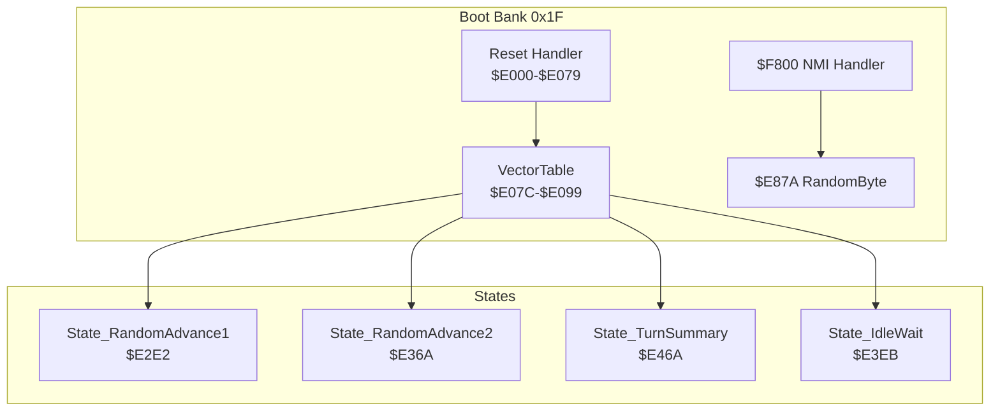
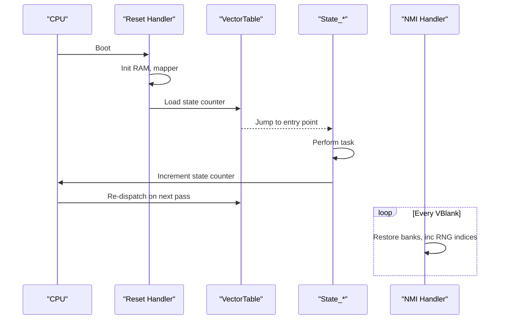
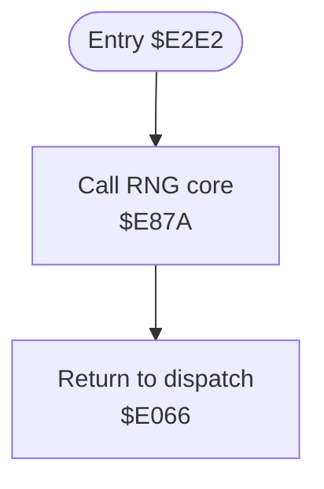
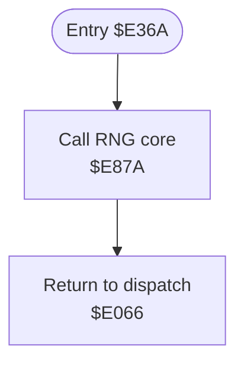
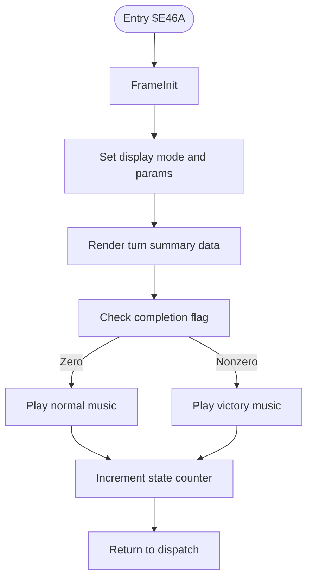
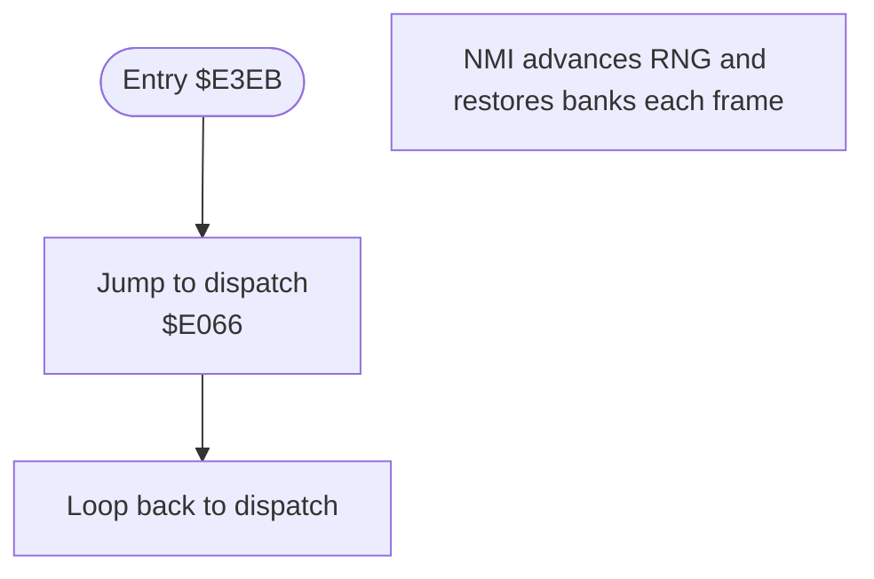
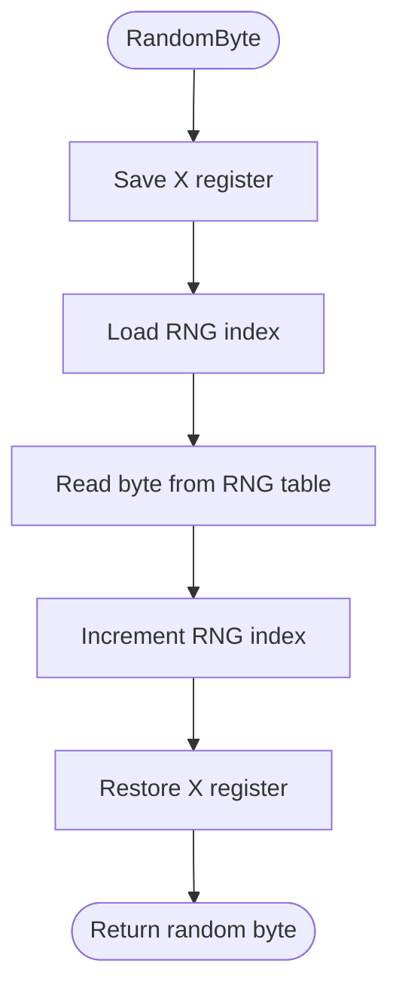
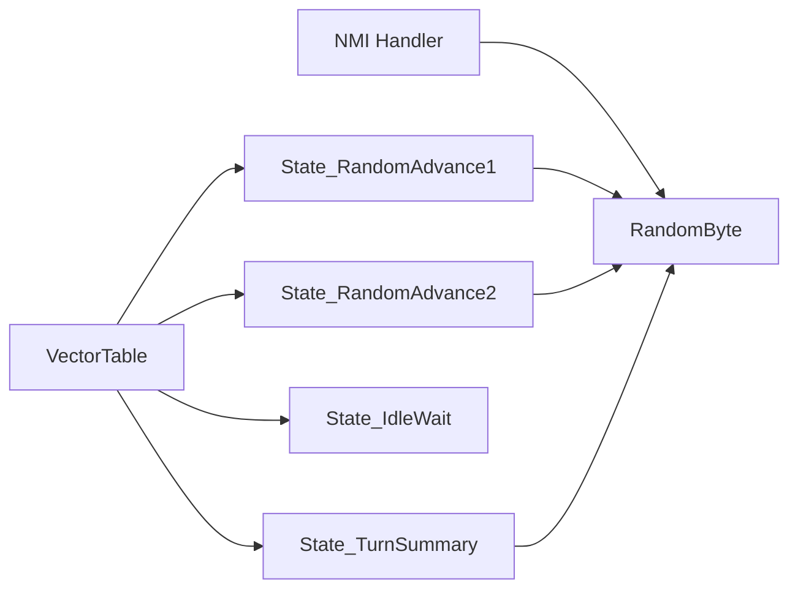

# Control Flow States

<cite>
**Referenced Files in This Document**
- [PROJECT.md](file://PROJECT.md)
- [prg_1f.asm](file://asm/banks/prg_1f.asm)
- [bank_1f_analysis.md](file://code/bank_1f_analysis.md)
- [bank_1f_raw.asm](file://code/bank_1f_raw.asm)
- [main.asm](file://asm/main.asm)
</cite>

## Table of Contents
1. [Introduction](#introduction)
2. [Project Structure](#project-structure)
3. [Core Components](#core-components)
4. [Architecture Overview](#architecture-overview)
5. [Detailed Component Analysis](#detailed-component-analysis)
6. [Dependency Analysis](#dependency-analysis)
7. [Performance Considerations](#performance-considerations)
8. [Troubleshooting Guide](#troubleshooting-guide)
9. [Conclusion](#conclusion)

## Introduction
This document explains the control flow states State_RandomAdvance1, State_RandomAdvance2, State_TurnSummary, and State_IdleWait within the game’s state machine. It details how these states manage random number generation, turn progression, game conclusion conditions, and idle periods. It also covers the mathematical operations behind random number generation, the turn summary logic, and how these states maintain overall game flow and prepare for subsequent phases.

## Project Structure
The state machine resides in the boot bank (0x1F) and uses a vector table to dispatch to state entry points. The NMI handler coordinates per-frame updates and RNG advancement, while each state performs its specific tasks and advances the state counter to move the game forward.

**Diagram sources**
- [prg_1f.asm:150-168](file://asm/banks/prg_1f.asm#L150-L168)
- [prg_1f.asm:74-148](file://asm/banks/prg_1f.asm#L74-L148)
- [prg_1f.asm:2559-2658](file://asm/banks/prg_1f.asm#L2559-L2658)
- [bank_1f_analysis.md:560-580](file://code/bank_1f_analysis.md#L560-L580)

**Section sources**
- [PROJECT.md:101-117](file://PROJECT.md#L101-L117)
- [prg_1f.asm:150-168](file://asm/banks/prg_1f.asm#L150-L168)

## Core Components
- State counter and dispatch: The game maintains a state counter at a fixed RAM location and uses a vector table to jump to the appropriate state entry point each pass through the main loop.
- NMI-driven frame progression: The NMI handler runs per frame, restores bank registers, increments RNG indices, and performs sub-dispatch for rendering and input handling.
- Random number generation: A table-driven RNG advances an index and returns a byte each call. Multiple RNG instances exist for different subsystems.
- State transitions: Each state ends by incrementing the state counter and returning to the main dispatch loop.

**Section sources**
- [prg_1f.asm:21-25](file://asm/banks/prg_1f.asm#L21-L25)
- [prg_1f.asm:134-147](file://asm/banks/prg_1f.asm#L134-L147)
- [prg_1f.asm:2585-2658](file://asm/banks/prg_1f.asm#L2585-L2658)
- [bank_1f_analysis.md:560-580](file://code/bank_1f_analysis.md#L560-L580)

## Architecture Overview
The state machine operates as follows:
- Reset initializes RAM, mapper, and sets state 0, then dispatches to the first state.
- Each state performs its task (random display, RNG advance, turn summary, or idle wait).
- At the end of each state, the state counter is incremented and the main dispatch loop re-reads the vector table to jump to the next state.
- The NMI handler runs continuously, restoring banks and advancing RNG indices, ensuring deterministic pseudo-randomness and consistent per-frame behavior.

**Diagram sources**
- [prg_1f.asm:74-148](file://asm/banks/prg_1f.asm#L74-L148)
- [prg_1f.asm:150-168](file://asm/banks/prg_1f.asm#L150-L168)
- [prg_1f.asm:2585-2658](file://asm/banks/prg_1f.asm#L2585-L2658)

## Detailed Component Analysis

### State_RandomAdvance1
Purpose:
- Advance the RNG without displaying anything. Used before states that require a fresh random value.

Behavior:
- Calls the RNG core routine to consume a random byte.
- Immediately returns to the main dispatch loop.

Random number generation:
- The RNG core reads from a pre-computed table using an internal index and increments the index each call. This ensures deterministic, reproducible pseudo-randomness across runs.

Turn progression:
- Does not change game state; it simply advances RNG for subsequent use.

**Diagram sources**
- [bank_1f_raw.asm:314-327](file://code/bank_1f_raw.asm#L314-L327)
- [prg_1f.asm:1250-1260](file://asm/banks/prg_1f.asm#L1250-L1260)

**Section sources**
- [bank_1f_raw.asm:314-327](file://code/bank_1f_raw.asm#L314-L327)
- [prg_1f.asm:1250-1260](file://asm/banks/prg_1f.asm#L1250-L1260)

### State_RandomAdvance2
Purpose:
- Another RNG advance step, typically used between phases where random outcomes are needed.

Behavior:
- Identical to State_RandomAdvance1: calls RNG core and returns to dispatch.

Turn progression:
- No state change; prepares RNG for later use.

**Diagram sources**
- [bank_1f_raw.asm:446-459](file://code/bank_1f_raw.asm#L446-L459)
- [prg_1f.asm:1250-1260](file://asm/banks/prg_1f.asm#L1250-L1260)

**Section sources**
- [bank_1f_raw.asm:446-459](file://code/bank_1f_raw.asm#L446-L459)
- [prg_1f.asm:1250-1260](file://asm/banks/prg_1f.asm#L1250-L1260)

### State_TurnSummary
Purpose:
- Display the turn summary/report screen and determine whether the game continues or concludes.

Behavior:
- Performs per-frame initialization, sets display mode, renders turn report data, checks a completion flag, and plays either normal or victory music accordingly.
- Increments the state counter to move to the next phase.

Turn summary logic:
- Reads a completion flag from memory and branches to play victory music if nonzero, otherwise normal music.
- After music playback, returns to the main dispatch loop.

**Diagram sources**
- [bank_1f_raw.asm:959-1048](file://code/bank_1f_raw.asm#L959-L1048)
- [prg_1f.asm:1051-1100](file://asm/banks/prg_1f.asm#L1051-L1100)

**Section sources**
- [bank_1f_raw.asm:959-1048](file://code/bank_1f_raw.asm#L959-L1048)
- [prg_1f.asm:1051-1100](file://asm/banks/prg_1f.asm#L1051-L1100)

### State_IdleWait
Purpose:
- Provide a minimal frame wait state during which the NMI handler can modify the state counter to break the loop.

Behavior:
- Immediately returns to the main dispatch loop without performing any rendering or input processing.
- The NMI handler increments RNG indices and restores bank registers each frame, keeping the system responsive.

Turn progression:
- Does not increment the state counter itself; the NMI handler or other logic outside this state typically changes the state counter to exit the idle loop.

**Diagram sources**
- [prg_1f.asm:622-624](file://asm/banks/prg_1f.asm#L622-L624)
- [prg_1f.asm:2638-2658](file://asm/banks/prg_1f.asm#L2638-L2658)

**Section sources**
- [prg_1f.asm:622-624](file://asm/banks/prg_1f.asm#L622-L624)
- [prg_1f.asm:2638-2658](file://asm/banks/prg_1f.asm#L2638-L2658)

### Random Number Generation Operations
Mathematical operations and design:
- Table-driven RNG: A fixed-size table of random bytes is indexed sequentially. Each call reads the byte at the current index and increments the index.
- Multiple RNG instances: Separate indices are maintained for different subsystems, enabling independent streams of randomness.
- Modulo and threshold operations: Additional helpers provide division by 2, modulo with powers of two, and threshold comparisons using masked random values.

**Diagram sources**
- [prg_1f.asm:1250-1260](file://asm/banks/prg_1f.asm#L1250-L1260)
- [prg_1f.asm:1266-1294](file://asm/banks/prg_1f.asm#L1266-L1294)

**Section sources**
- [prg_1f.asm:1250-1260](file://asm/banks/prg_1f.asm#L1250-L1260)
- [prg_1f.asm:1266-1294](file://asm/banks/prg_1f.asm#L1266-L1294)
- [bank_1f_analysis.md:560-580](file://code/bank_1f_analysis.md#L560-L580)

## Dependency Analysis
- State dispatch depends on the vector table and the state counter.
- RNG advancement is managed by the NMI handler, ensuring consistent pseudo-randomness across frames.
- Each state relies on shared helpers for frame initialization, bank switching, and display routines.

**Diagram sources**
- [prg_1f.asm:150-168](file://asm/banks/prg_1f.asm#L150-L168)
- [prg_1f.asm:2559-2658](file://asm/banks/prg_1f.asm#L2559-L2658)
- [prg_1f.asm:1250-1260](file://asm/banks/prg_1f.asm#L1250-L1260)

**Section sources**
- [prg_1f.asm:150-168](file://asm/banks/prg_1f.asm#L150-L168)
- [prg_1f.asm:2559-2658](file://asm/banks/prg_1f.asm#L2559-L2658)

## Performance Considerations
- Table-driven RNG is lightweight and deterministic, suitable for frequent calls during gameplay.
- Idle states minimize CPU usage by avoiding rendering work, allowing the NMI handler to keep the system responsive.
- Bank switching and PPU initialization are centralized in helpers to reduce duplication and overhead.

## Troubleshooting Guide
- If RNG appears predictable or identical across runs, verify that the RNG table and index are correctly loaded and that the NMI handler increments the RNG indices as expected.
- If a state seems stuck in an idle loop, confirm that external logic (e.g., input handling or NMI sub-dispatch) updates the state counter appropriately.
- If turn summary music does not change based on completion, inspect the completion flag’s memory location and branching logic.

**Section sources**
- [prg_1f.asm:2638-2658](file://asm/banks/prg_1f.asm#L2638-L2658)
- [bank_1f_raw.asm:959-1048](file://code/bank_1f_raw.asm#L959-L1048)

## Conclusion
State_RandomAdvance1 and State_RandomAdvance2 provide deterministic RNG advancement between phases, State_TurnSummary handles turn reporting and game conclusion logic, and State_IdleWait offers efficient frame pacing. Together, they form a compact, reliable state machine that leverages the NMI handler for consistent per-frame updates and shared RNG resources, ensuring smooth gameplay progression and predictable behavior.