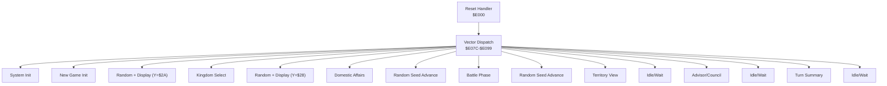
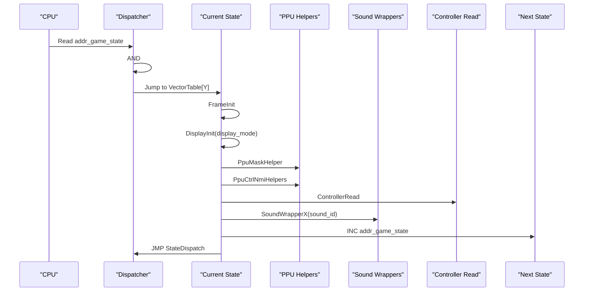
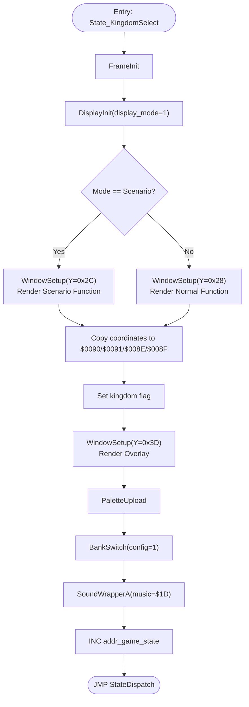
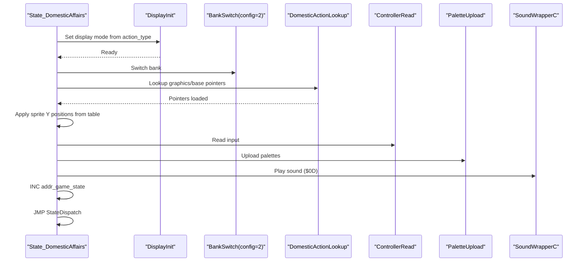
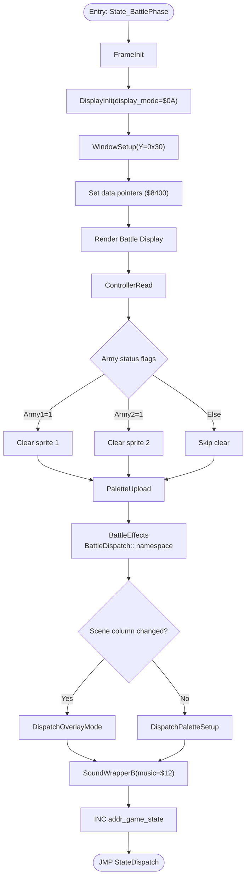
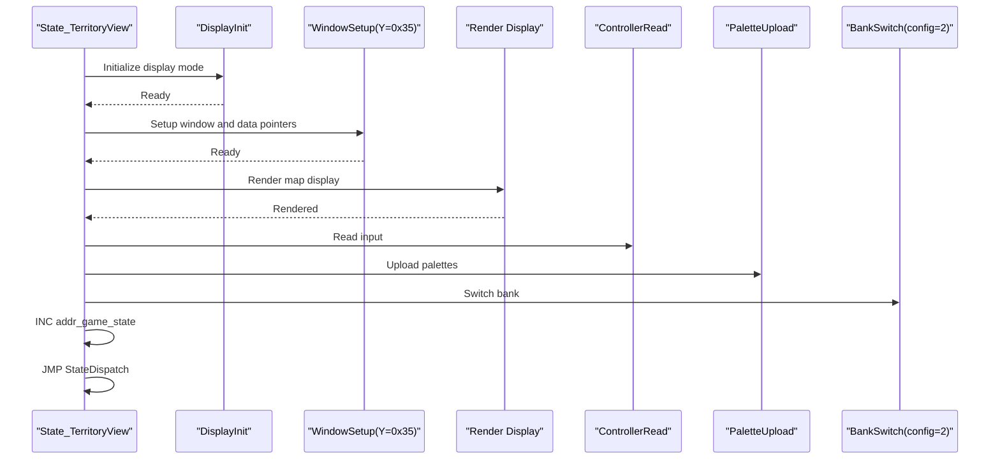
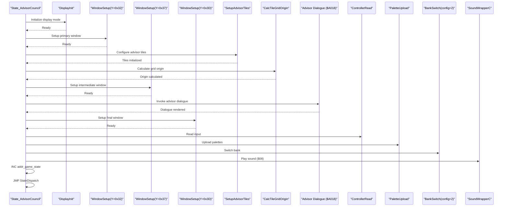
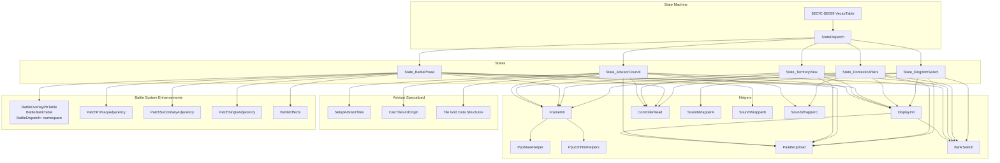

# Display and Interaction States

<cite>
**Referenced Files in This Document**
- [PROJECT.md](file://PROJECT.md)
- [prg_1f.asm](file://asm/banks/prg_1f.asm)
- [prg_1f_analysis.md](file://code/bank_1f_analysis.md)
- [prg_17_18.asm](file://asm/banks/prg_17_18.asm)
- [bank_1f_raw.asm](file://code/bank_1f_raw.asm)
- [6502_registers.h](file://include/6502_registers.h)
- [namco163.h](file://include/namco163.h)
- [macros.h](file://include/macros.h)
</cite>

## Update Summary
**Changes Made**
- Enhanced documentation for battle overlay system with proper namespace qualification for BattleDispatch::BattleOverlayPtrTable and BattleDispatch::BattleBankTable references
- Improved adjacency calculation routines documentation with clearer variable naming and memory addressing patterns
- Updated State_BattlePhase section to reflect enhanced battle overlay system improvements
- Added detailed coverage of PatchPrimaryAdjacency, PatchSecondaryAdjacency, and PatchSingleAdjacency procedures
- Expanded battle effects system documentation with improved scene column and palette management

## Table of Contents
1. [Introduction](#introduction)
2. [Project Structure](#project-structure)
3. [Core Components](#core-components)
4. [Architecture Overview](#architecture-overview)
5. [Detailed Component Analysis](#detailed-component-analysis)
6. [Dependency Analysis](#dependency-analysis)
7. [Performance Considerations](#performance-considerations)
8. [Troubleshooting Guide](#troubleshooting-guide)
9. [Conclusion](#conclusion)

## Introduction
This document explains the display and interaction states that drive gameplay in the disassembly of a Namco-163 mapper strategy game for the NES. It focuses on five core states: State_KingdomSelect, State_DomesticAffairs, State_BattlePhase, State_TerritoryView, and State_AdvisorCouncil. For each state, we describe how user interaction is handled, how display rendering is initialized and updated, how data is processed, and how state transitions occur. We also document display modes, window management, controller input handling, and the relationship between states and their underlying data structures. Finally, we explain how helper procedures support rendering, audio, and timing.

**Updated** Enhanced documentation now includes detailed coverage of the battle overlay system with proper namespace qualification and improved adjacency calculation routines for better memory addressing patterns.

## Project Structure
The project is organized around a 32-bank PRG layout with a fixed boot bank (0x1F) mapped to $E000-$FFFF. The reset handler initializes hardware, clears RAM, and dispatches to the first state via a vector table. The state machine is driven by a global state counter that indexes into the vector table to select the current state routine.

**Diagram sources**
- [prg_1f.asm:150-168](file://asm/banks/prg_1f.asm#L150-L168)
- [prg_1f.asm:737-750](file://asm/banks/prg_1f.asm#L737-L750)

**Section sources**
- [PROJECT.md:101-117](file://PROJECT.md#L101-L117)
- [prg_1f.asm:150-168](file://asm/banks/prg_1f.asm#L150-L168)

## Core Components
- State dispatcher: A vector table at $E07C selects the current state routine based on the global state counter masked to 0-14. The dispatcher then jumps to the selected routine.
- Frame initialization: A per-frame helper clears working RAM, disables PPU rendering, initializes PPU/mapper, and prepares sprite buffers.
- Display initialization: A helper sets up windows and invokes bank-switched display routines to render content.
- Controller input: A dedicated routine reads controller state, computes edge-triggered events, and stores previous frame state for comparison.
- PPU helpers: Utilities to upload palettes, configure PPU masks, and enable NMI.
- Bank switching: A configurable bank switch routine writes 4 PRG bank configurations to mapper registers and stores extended config in RAM.
- Sound wrappers: Thin wrappers that invoke the sound engine with specific sound IDs.

**Section sources**
- [prg_1f.asm:737-750](file://asm/banks/prg_1f.asm#L737-L750)
- [prg_1f.asm:751-779](file://asm/banks/prg_1f.asm#L751-L779)
- [prg_1f.asm:560-570](file://asm/banks/prg_1f.asm#L560-L570)
- [prg_1f.asm:1036-1065](file://asm/banks/prg_1f.asm#L1036-L1065)
- [prg_1f.asm:1087-1113](file://asm/banks/prg_1f.asm#L1087-L1113)
- [prg_1f.asm:781-820](file://asm/banks/prg_1f.asm#L781-L820)
- [prg_1f.asm:1008-1024](file://asm/banks/prg_1f.asm#L1008-L1024)

## Architecture Overview
The game uses a state-driven architecture. Each state performs:
- Frame initialization
- Display mode selection and initialization
- Window setup and rendering
- Controller input read
- Audio playback
- PPU configuration updates
- Transition to the next state

**Diagram sources**
- [prg_1f.asm:737-750](file://asm/banks/prg_1f.asm#L737-L750)
- [prg_1f.asm:751-779](file://asm/banks/prg_1f.asm#L751-L779)
- [prg_1f.asm:560-570](file://asm/banks/prg_1f.asm#L560-L570)
- [prg_1f.asm:1036-1065](file://asm/banks/prg_1f.asm#L1036-L1065)
- [prg_1f.asm:1087-1113](file://asm/banks/prg_1f.asm#L1087-L1113)
- [prg_1f.asm:1008-1024](file://asm/banks/prg_1f.asm#L1008-L1024)

## Detailed Component Analysis

### State_KingdomSelect
Purpose: Allows the player to choose a kingdom at the start of a campaign. Handles scenario vs. normal mode, renders the kingdom selection interface, and prepares data pointers for subsequent phases.

Interaction and rendering:
- Calls FrameInit to prepare per-frame state.
- Sets sub-state and display mode, then calls DisplayInit.
- Renders the kingdom selection display via a bank-switched function.
- Branches based on mode: scenario mode uses a different window setup and function; normal mode uses another.
- Copies selected coordinates to working RAM for later use.
- Sets a flag indicating a kingdom selection occurred.
- Renders a final overlay and uploads palettes.
- Switches to a specific bank configuration and plays music.

Data processing:
- Reads mode from a parameter location and compares against a scenario flag.
- Copies four coordinate bytes to working RAM for downstream use.
- Sets a pointer to a territory data region in RAM.

State transitions:
- Increments the global state counter to move to the next phase.
- Plays a music track associated with the kingdom selection.

**Diagram sources**
- [prg_1f.asm:295-365](file://asm/banks/prg_1f.asm#L295-L365)

**Section sources**
- [prg_1f.asm:295-365](file://asm/banks/prg_1f.asm#L295-L365)
- [prg_1f_analysis.md:177-226](file://code/bank_1f_analysis.md#L177-L226)

### State_DomesticAffairs
Purpose: Presents the domestic affairs phase where players select actions (e.g., farming, commerce). Manages action type selection, sprite indicators, and transitions to the next phase.

Interaction and rendering:
- Calls FrameInit and sets sub-state.
- Computes a display mode from an action type parameter and calls DisplayInit.
- Switches to a specific bank configuration and renders the domestic display.
- Performs a lookup to select the correct action graphics and base data pointers.
- Applies sprite Y positions from a table based on two sprite index parameters.
- Reads controller input and renders overlays with palette uploads.

Data processing:
- Uses an action type parameter to index into a lookup table for graphics and base data pointers.
- Applies sprite Y positions from a small table to indicate selected units or effects.

State transitions:
- Increments the global state counter.
- Plays a sound effect associated with the domestic phase.
- Jumps to the dispatcher to continue the state cycle.

**Diagram sources**
- [prg_1f.asm:383-433](file://asm/banks/prg_1f.asm#L383-L433)
- [prg_1f.asm:441-466](file://asm/banks/prg_1f.asm#L441-L466)
- [prg_1f.asm:471-479](file://asm/banks/prg_1f.asm#L471-L479)

**Section sources**
- [prg_1f.asm:383-433](file://asm/banks/prg_1f.asm#L383-L433)
- [prg_1f.asm:441-466](file://asm/banks/prg_1f.asm#L441-L466)
- [prg_1f_analysis.md:243-298](file://code/bank_1f_analysis.md#L243-L298)

### State_BattlePhase
Purpose: Handles the battle/combat phase. Displays army graphics and adjusts sprite visibility based on army status flags. Features enhanced battle overlay system with proper namespace qualification.

Interaction and rendering:
- Calls FrameInit and sets sub-state.
- Sets a specific display mode and initializes display.
- Prepares window and data pointers for army graphics.
- Renders the battle display and overlays.
- Reads controller input for potential interaction.
- Adjusts sprite buffers based on army status flags.
- **Enhanced** Implements improved battle effects system with BattleDispatch:: namespace qualification for overlay and bank tables.

**Enhanced** Battle overlay system improvements include:
- Proper namespace qualification: BattleDispatch::BattleOverlayPtrTable and BattleDispatch::BattleBankTable
- Enhanced adjacency calculation routines: PatchPrimaryAdjacency, PatchSecondaryAdjacency, PatchSingleAdjacency
- Improved memory addressing patterns with clearer variable naming
- Optimized scene column and palette management through BattleEffects procedure

Data processing:
- Reads two army status flags and clears corresponding sprite entries if the flags indicate inactive armies.
- **Enhanced** Battle effects processing: Computes scene column index using ($008E - 6) >> 3 and compares to cached values.
- **Enhanced** Overlay management: Dispatches to overlay reload or palette update based on scene column changes.

State transitions:
- Increments the global state counter.
- Plays a battle music track.
- Updates PPU and jumps to the dispatcher.

**Diagram sources**
- [prg_1f.asm:493-550](file://asm/banks/prg_1f.asm#L493-L550)
- [prg_17_18.asm:2501-2507](file://asm/banks/prg_17_18.asm#L2501-L2507)
- [prg_17_18.asm:2558-2651](file://asm/banks/prg_17_18.asm#L2558-L2651)
- [prg_17_18.asm:1869-1883](file://asm/banks/prg_17_18.asm#L1869-L1883)

**Section sources**
- [prg_1f.asm:493-550](file://asm/banks/prg_1f.asm#L493-L550)
- [prg_1f_analysis.md:312-349](file://code/bank_1f_analysis.md#L312-L349)
- [prg_17_18.asm:2501-2507](file://asm/banks/prg_17_18.asm#L2501-L2507)
- [prg_17_18.asm:2558-2651](file://asm/banks/prg_17_18.asm#L2558-L2651)
- [prg_17_18.asm:1869-1883](file://asm/banks/prg_17_18.asm#L1869-L1883)

### State_TerritoryView
Purpose: Displays the game map and territory view. Manages window setup, data pointers, and palette updates.

Interaction and rendering:
- Calls FrameInit and sets sub-state.
- Initializes display with a specific mode and prepares window and data pointers for map data.
- Renders the map display and overlays.
- Reads controller input and updates palettes.
- Switches to a specific bank configuration and increments the state.

State transitions:
- Increments the global state counter.
- Updates PPU and jumps to the dispatcher.

**Diagram sources**
- [prg_1f.asm:575-619](file://asm/banks/prg_1f.asm#L575-L619)

**Section sources**
- [prg_1f.asm:575-619](file://asm/banks/prg_1f.asm#L575-L619)
- [prg_1f_analysis.md:378-402](file://code/bank_1f_analysis.md#L378-L402)

### State_AdvisorCouncil
Purpose: Presents advisor dialogue and related content during the advisor phase. Features an advanced tile grid system for dynamic content rendering.

Interaction and rendering:
- Calls FrameInit and sets sub-state.
- Initializes display with a specific mode and prepares window and data pointers for advisor content.
- Renders the advisor display and overlays.
- Invokes specialized bank-switched functions for advisor dialogue and tile grid management.
- Reads controller input and updates palettes.
- Switches to a specific bank configuration and increments the state.

**Enhanced** The advisor council state now includes sophisticated tile grid management through SetupAdvisorTiles and CalcTileGridOrigin procedures, enabling dynamic content positioning and rendering optimization.

Tile Grid System:
- SetupAdvisorTiles: Configures advisor tile rendering parameters and initializes tile grid data structures
- CalcTileGridOrigin: Calculates optimal tile grid origin points for efficient rendering
- Tile Grid Data Structures: Maintains 64-byte tile index grid with empty/uninitialized state tracking
- Dynamic Rendering: Supports both horizontal and vertical tile grid initialization and dispatch

Rendering Pipeline:
- Multiple window setup stages for different advisor content layers
- Bank-switched dialogue rendering through $A018 entry point
- Advanced palette management and sprite buffer coordination
- Consolidated advisor dialogue functionality with improved tile grid calculation

State transitions:
- Increments the global state counter.
- Plays a sound effect.
- Updates PPU and jumps to the dispatcher.

**Diagram sources**
- [prg_1f.asm:630-680](file://asm/banks/prg_1f.asm#L630-L680)
- [prg_17_18.asm:1520-1588](file://asm/banks/prg_17_18.asm#L1520-L1588)
- [prg_17_18.asm:1734-1780](file://asm/banks/prg_17_18.asm#L1734-L1780)

**Section sources**
- [prg_1f.asm:630-680](file://asm/banks/prg_1f.asm#L630-L680)
- [prg_1f_analysis.md:416-442](file://code/bank_1f_analysis.md#L416-L442)
- [prg_17_18.asm:1520-1588](file://asm/banks/prg_17_18.asm#L1520-L1588)
- [prg_17_18.asm:1734-1780](file://asm/banks/prg_17_18.asm#L1734-L1780)
- [bank_1f_raw.asm:860-957](file://code/bank_1f_raw.asm#L860-L957)

## Dependency Analysis
The states share common helpers and rely on the vector dispatch mechanism. The following diagram shows key dependencies among state routines and helper procedures.

**Diagram sources**
- [prg_1f.asm:150-168](file://asm/banks/prg_1f.asm#L150-L168)
- [prg_1f.asm:737-750](file://asm/banks/prg_1f.asm#L737-L750)
- [prg_1f.asm:560-570](file://asm/banks/prg_1f.asm#L560-L570)
- [prg_1f.asm:751-779](file://asm/banks/prg_1f.asm#L751-L779)
- [prg_1f.asm:1036-1065](file://asm/banks/prg_1f.asm#L1036-L1065)
- [prg_1f.asm:1087-1113](file://asm/banks/prg_1f.asm#L1087-L1113)
- [prg_1f.asm:781-820](file://asm/banks/prg_1f.asm#L781-L820)
- [prg_1f.asm:1008-1024](file://asm/banks/prg_1f.asm#L1008-L1024)
- [prg_17_18.asm:1520-1588](file://asm/banks/prg_17_18.asm#L1520-L1588)
- [prg_17_18.asm:1734-1780](file://asm/banks/prg_17_18.asm#L1734-L1780)
- [prg_17_18.asm:2501-2507](file://asm/banks/prg_17_18.asm#L2501-L2507)
- [prg_17_18.asm:2558-2651](file://asm/banks/prg_17_18.asm#L2558-L2651)
- [prg_17_18.asm:1869-1883](file://asm/banks/prg_17_18.asm#L1869-L1883)

**Section sources**
- [prg_1f.asm:150-168](file://asm/banks/prg_1f.asm#L150-L168)
- [prg_1f.asm:737-750](file://asm/banks/prg_1f.asm#L737-L750)

## Performance Considerations
- VBlank synchronization: All states call a PPU status read and a VBlank wait before rendering to avoid screen tearing and ensure smooth updates.
- Minimal per-frame allocations: FrameInit clears working RAM and resets sentinel values, reducing overhead and preventing stale data from affecting rendering.
- Bank switching cost: Each state may switch banks to access display routines and data. Batched rendering and careful ordering minimize unnecessary bank switches.
- Palette uploads: Palettes are uploaded once per state update to keep color palettes synchronized with the current scene.
- Controller polling: Input is polled once per frame and edge detection is computed to reduce redundant checks.
- **Enhanced** Battle overlay performance: Improved namespace qualification and adjacency calculation routines reduce memory addressing overhead and improve cache locality.
- **Enhanced** Advisor council performance: Tile grid system reduces rendering overhead through optimized grid calculations and dynamic content positioning.

## Troubleshooting Guide
Common issues and remedies:
- Incorrect state transitions: Verify the global state counter is incremented at the end of each state and that the dispatcher reads the masked value.
- Display corruption: Ensure FrameInit runs before rendering and that PPU masks are set appropriately.
- No input response: Confirm ControllerRead is invoked and that edge-triggered flags are used for button press detection.
- Audio not playing: Check that the correct SoundWrapper is called with the intended sound ID.
- Palette mismatch: Ensure PaletteUpload is executed after changing palettes and before rendering.
- **New** Battle overlay issues: Verify BattleDispatch:: namespace qualification is properly applied to BattleOverlayPtrTable and BattleBankTable references.
- **New** Adjacency calculation problems: Check that PatchPrimaryAdjacency, PatchSecondaryAdjacency, and PatchSingleAdjacency use proper variable naming and memory addressing patterns.
- **New** Battle effects system issues: Verify BattleEffects correctly computes scene column index and dispatches appropriate overlay or palette updates.
- **New** Advisor council issues: Verify SetupAdvisorTiles executes before CalcTileGridOrigin and that tile grid data structures are properly initialized in the $0680-$06BF range.
- **New** Tile grid problems: Check that tile index grid contains valid values (0-255) or $FF for empty/uninitialized states.

**Section sources**
- [prg_1f.asm:751-779](file://asm/banks/prg_1f.asm#L751-L779)
- [prg_1f.asm:1036-1065](file://asm/banks/prg_1f.asm#L1036-L1065)
- [prg_1f.asm:1067-1085](file://asm/banks/prg_1f.asm#L1067-L1085)
- [prg_1f.asm:1008-1024](file://asm/banks/prg_1f.asm#L1008-L1024)
- [prg_17_18.asm:1520-1588](file://asm/banks/prg_17_18.asm#L1520-L1588)
- [prg_17_18.asm:1734-1780](file://asm/banks/prg_17_18.asm#L1734-L1780)
- [prg_17_18.asm:2501-2507](file://asm/banks/prg_17_18.asm#L2501-L2507)
- [prg_17_18.asm:2558-2651](file://asm/banks/prg_17_18.asm#L2558-L2651)
- [prg_17_18.asm:1869-1883](file://asm/banks/prg_17_18.asm#L1869-L1883)

## Conclusion
The display and interaction states form a cohesive state machine that drives the game's narrative and gameplay. Each state follows a consistent pattern: initialize per-frame resources, set up display and windows, render content, handle input, update audio and PPU, and transition to the next state. Shared helpers ensure predictable behavior across states, while bank switching and palette management provide flexibility for varied scenes.

**Enhanced** The advisor council state now features a sophisticated tile grid system that significantly improves rendering efficiency and content management. The integration of SetupAdvisorTiles and CalcTileGridOrigin procedures demonstrates advanced game engine architecture, enabling dynamic content positioning and optimized resource utilization. Understanding these enhanced states and their specialized helper procedures is essential for maintaining and extending the game's presentation logic, particularly for complex interactive sequences involving advisor dialogue and tile-based rendering systems.

**Enhanced** The battle phase now includes improved overlay system capabilities with proper namespace qualification and enhanced adjacency calculation routines. These improvements provide better memory addressing patterns, clearer variable naming, and more efficient scene management through the BattleEffects system. The integration of BattleDispatch:: namespace qualification ensures proper organization and access to battle-related data structures and functions.