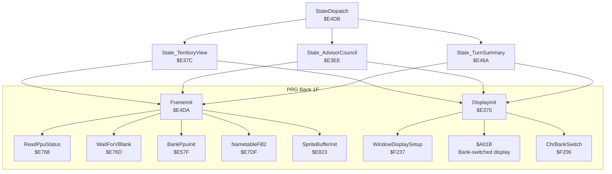
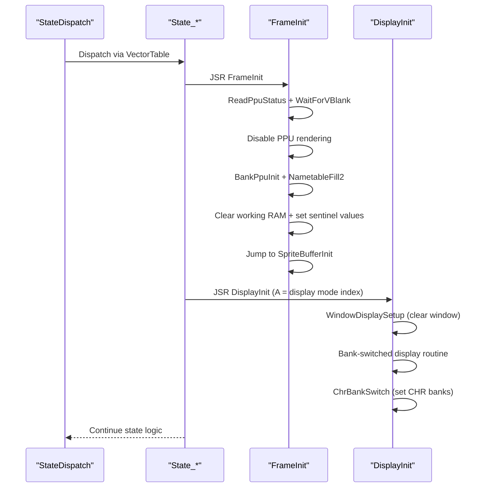
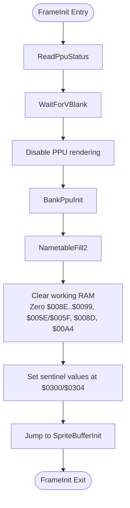
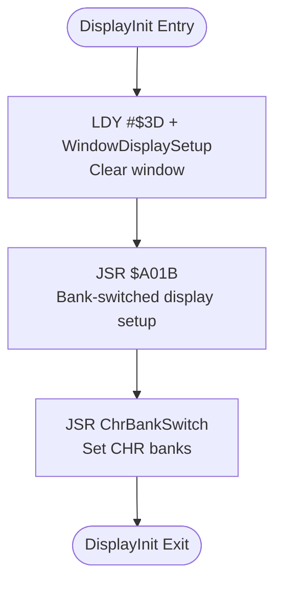
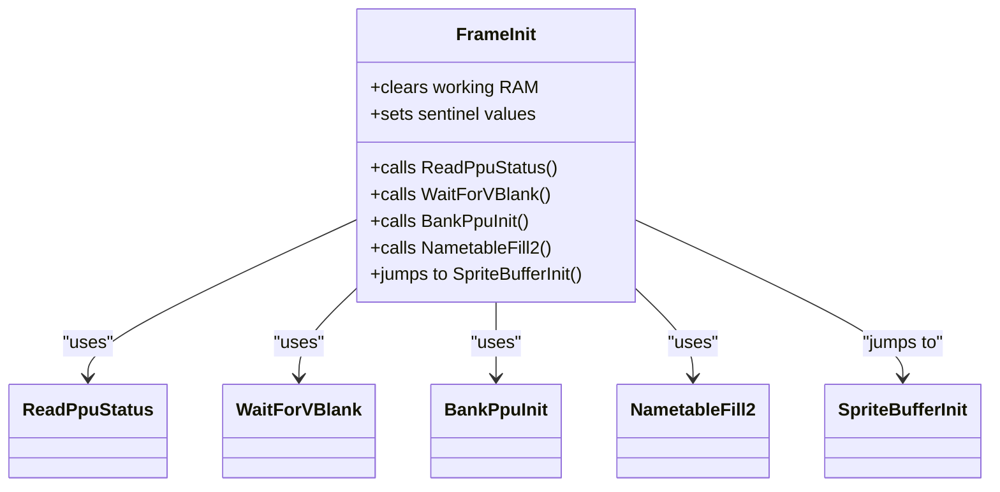
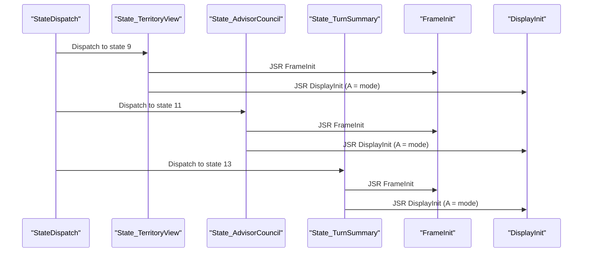
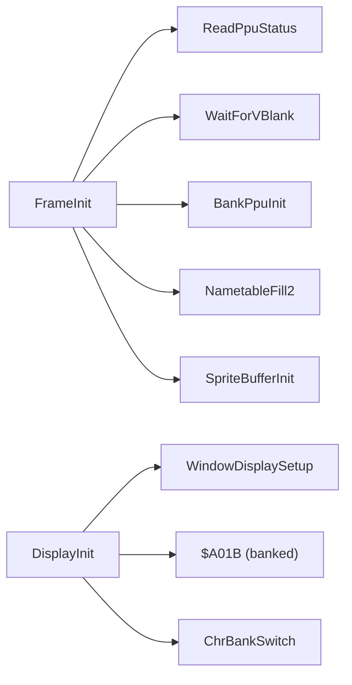

# Helper Procedures

<cite>
**Referenced Files in This Document**
- [prg_1f.asm](file://asm/banks/prg_1f.asm)
- [prg_1f.asm.bak](file://asm/banks/prg_1f.asm.bak)
- [main.asm](file://asm/main.asm)
- [macros.h](file://include/macros.h)
- [bank_1f_raw.asm](file://code/bank_1f_raw.asm)
</cite>

## Table of Contents
1. [Introduction](#introduction)
2. [Project Structure](#project-structure)
3. [Core Components](#core-components)
4. [Architecture Overview](#architecture-overview)
5. [Detailed Component Analysis](#detailed-component-analysis)
6. [Dependency Analysis](#dependency-analysis)
7. [Performance Considerations](#performance-considerations)
8. [Troubleshooting Guide](#troubleshooting-guide)
9. [Conclusion](#conclusion)

## Introduction
This document explains two helper procedures central to the display initialization pipeline: DisplayInit and FrameInit. It details how DisplayInit clears windows, initializes display parameters, and manages bank switching for display operations. It also documents FrameInit’s role in frame preparation, PPU status handling, memory clearing, and sprite buffer initialization. The document covers initialization sequences, parameter passing conventions, return value handling, and how these helpers integrate with the state machine architecture.

## Project Structure
The relevant code for these helpers resides in the PRG bank 1F module, with supporting PPU and mapper routines in the same bank. The state machine dispatch and entry points call these helpers at appropriate times during state transitions.

**Diagram sources**
- [prg_1f.asm:755-779](file://asm/banks/prg_1f.asm#L755-L779)
- [prg_1f.asm:564-569](file://asm/banks/prg_1f.asm#L564-L569)
- [prg_1f.asm:739-749](file://asm/banks/prg_1f.asm#L739-L749)
- [prg_1f.asm:575-618](file://asm/banks/prg_1f.asm#L575-L618)
- [prg_1f.asm:630-679](file://asm/banks/prg_1f.asm#L630-L679)
- [prg_1f.asm:687-735](file://asm/banks/prg_1f.asm#L687-L735)

**Section sources**
- [prg_1f.asm:755-779](file://asm/banks/prg_1f.asm#L755-L779)
- [prg_1f.asm:564-569](file://asm/banks/prg_1f.asm#L564-L569)
- [prg_1f.asm:739-749](file://asm/banks/prg_1f.asm#L739-L749)

## Core Components
- FrameInit: Prepares the frame by synchronizing to VBlank, disabling PPU rendering, initializing PPU and mapper state, clearing working memory, setting sentinel values, and preparing the sprite OAM buffer.
- DisplayInit: Configures windowing and CHR bank switching for a given display mode, clearing windows and enabling banked display routines.

**Section sources**
- [prg_1f.asm:755-779](file://asm/banks/prg_1f.asm#L755-L779)
- [prg_1f.asm:564-569](file://asm/banks/prg_1f.asm#L564-L569)

## Architecture Overview
The state machine selects a state and invokes helper procedures at predictable points. FrameInit is called early in state entry to establish a clean frame context. DisplayInit is invoked after FrameInit to set up the specific display mode and banked resources.

**Diagram sources**
- [prg_1f.asm:739-749](file://asm/banks/prg_1f.asm#L739-L749)
- [prg_1f.asm:575-618](file://asm/banks/prg_1f.asm#L575-L618)
- [prg_1f.asm:630-679](file://asm/banks/prg_1f.asm#L630-L679)
- [prg_1f.asm:687-735](file://asm/banks/prg_1f.asm#L687-L735)
- [prg_1f.asm:755-779](file://asm/banks/prg_1f.asm#L755-L779)
- [prg_1f.asm:564-569](file://asm/banks/prg_1f.asm#L564-L569)

## Detailed Component Analysis

### FrameInit Analysis
FrameInit performs the following steps:
- Read PPU status and wait for VBlank to ensure safe initialization timing.
- Disable PPU rendering to avoid flicker or partial updates.
- Initialize PPU and mapper state via BankPpuInit.
- Clear nametables using NametableFill2.
- Zero out selected working RAM locations and set sentinel values in memory region $0300/$0304.
- Jump to SpriteBufferInit to fill OAM with off-screen markers.

**Diagram sources**
- [prg_1f.asm:755-779](file://asm/banks/prg_1f.asm#L755-L779)
- [prg_1f.asm:1116-1131](file://asm/banks/prg_1f.asm#L1116-L1131)
- [prg_1f.asm:1162-1169](file://asm/banks/prg_1f.asm#L1162-L1169)
- [prg_1f.asm:1172-1183](file://asm/banks/prg_1f.asm#L1172-L1183)

Key behaviors and conventions:
- Timing: Uses PPU status checks and VBlank waits to synchronize with the PPU.
- Memory: Clears and initializes several working RAM addresses and sets sentinel values for safety.
- Bank switching: Delegates PPU/mapper initialization to BankPpuInit.
- Sprite buffer: Jumps to SpriteBufferInit to prepare OAM.

Return value handling:
- FrameInit does not return a value; it performs initialization and transfers control to SpriteBufferInit.

Integration with state machine:
- Called at the start of state entry routines to establish a clean frame context before rendering and windowing logic.

**Section sources**
- [prg_1f.asm:755-779](file://asm/banks/prg_1f.asm#L755-L779)
- [prg_1f.asm:1116-1131](file://asm/banks/prg_1f.asm#L1116-L1131)
- [prg_1f.asm:1162-1169](file://asm/banks/prg_1f.asm#L1162-L1169)
- [prg_1f.asm:1172-1183](file://asm/banks/prg_1f.asm#L1172-L1183)

### DisplayInit Analysis
DisplayInit configures the display for a specific mode:
- Clears the designated window via WindowDisplaySetup.
- Invokes a bank-switched display routine ($A01B) to set up display buffers.
- Performs CHR bank switching via ChrBankSwitch to load appropriate tiles.

**Diagram sources**
- [prg_1f.asm:564-569](file://asm/banks/prg_1f.asm#L564-L569)
- [prg_1f.asm:2282-2295](file://asm/banks/prg_1f.asm#L2282-L2295)

Parameter convention:
- The accumulator A holds the display mode index passed before the call. This index is used by the banked display routines to select configuration and data.

Return value handling:
- DisplayInit returns via RTS; no special return value is expected by callers.

Integration with state machine:
- Called after FrameInit within state entry routines to finalize display setup for the chosen mode.

**Section sources**
- [prg_1f.asm:564-569](file://asm/banks/prg_1f.asm#L564-L569)
- [prg_1f.asm:2282-2295](file://asm/banks/prg_1f.asm#L2282-L2295)

### Supporting Helpers Used by FrameInit
- ReadPpuStatus: Reads PPU_STATUS to prime the status latch.
- WaitForVBlank: Waits until VBlank begins.
- BankPpuInit: Initializes PPU/mapper state and patches a RAM stub for later jumps.
- NametableFill2: Fills all three nametables with a constant tile value.
- SpriteBufferInit: Fills OAM ($0200–$02FF) with off-screen markers.

**Diagram sources**
- [prg_1f.asm:755-779](file://asm/banks/prg_1f.asm#L755-L779)
- [prg_1f.asm:1116-1131](file://asm/banks/prg_1f.asm#L1116-L1131)
- [prg_1f.asm:1162-1169](file://asm/banks/prg_1f.asm#L1162-L1169)
- [prg_1f.asm:1172-1183](file://asm/banks/prg_1f.asm#L1172-L1183)

**Section sources**
- [prg_1f.asm:1116-1131](file://asm/banks/prg_1f.asm#L1116-L1131)
- [prg_1f.asm:1162-1169](file://asm/banks/prg_1f.asm#L1162-L1169)
- [prg_1f.asm:1172-1183](file://asm/banks/prg_1f.asm#L1172-L1183)

### State Machine Integration
FrameInit and DisplayInit are invoked by state entry routines. The state machine dispatch selects the current state, and each state calls these helpers in a standardized order to ensure consistent initialization.

**Diagram sources**
- [prg_1f.asm:739-749](file://asm/banks/prg_1f.asm#L739-L749)
- [prg_1f.asm:575-618](file://asm/banks/prg_1f.asm#L575-L618)
- [prg_1f.asm:630-679](file://asm/banks/prg_1f.asm#L630-L679)
- [prg_1f.asm:687-735](file://asm/banks/prg_1f.asm#L687-L735)

**Section sources**
- [prg_1f.asm:739-749](file://asm/banks/prg_1f.asm#L739-L749)
- [prg_1f.asm:575-618](file://asm/banks/prg_1f.asm#L575-L618)
- [prg_1f.asm:630-679](file://asm/banks/prg_1f.asm#L630-L679)
- [prg_1f.asm:687-735](file://asm/banks/prg_1f.asm#L687-L735)

## Dependency Analysis
- FrameInit depends on:
  - ReadPpuStatus and WaitForVBlank for timing.
  - BankPpuInit for PPU/mapper initialization and RAM patching.
  - NametableFill2 for background tile clearing.
  - SpriteBufferInit for OAM preparation.
- DisplayInit depends on:
  - WindowDisplaySetup for window clearing and bank parameter propagation.
  - A banked display routine ($A01B) for mode-specific setup.
  - ChrBankSwitch for loading CHR banks.

**Diagram sources**
- [prg_1f.asm:755-779](file://asm/banks/prg_1f.asm#L755-L779)
- [prg_1f.asm:564-569](file://asm/banks/prg_1f.asm#L564-L569)
- [prg_1f.asm:1116-1131](file://asm/banks/prg_1f.asm#L1116-L1131)
- [prg_1f.asm:1162-1169](file://asm/banks/prg_1f.asm#L1162-L1169)
- [prg_1f.asm:1172-1183](file://asm/banks/prg_1f.asm#L1172-L1183)
- [prg_1f.asm:2282-2295](file://asm/banks/prg_1f.asm#L2282-L2295)

**Section sources**
- [prg_1f.asm:755-779](file://asm/banks/prg_1f.asm#L755-L779)
- [prg_1f.asm:564-569](file://asm/banks/prg_1f.asm#L564-L569)

## Performance Considerations
- Synchronization: Using ReadPpuStatus and WaitForVBlank ensures initialization occurs during safe periods, preventing visible artifacts.
- Minimal work in VBlank: By disabling rendering early and performing most setup before rendering resumes, the helpers reduce the risk of partial-frame corruption.
- Efficient clearing: SpriteBufferInit fills OAM quickly with off-screen markers, ensuring the OAM is ready for the frame’s draw phase.

## Troubleshooting Guide
Common issues and checks:
- Stuck in VBlank: If WaitForVBlank does not return, verify PPU_STATUS polling and ensure the PPU is powered.
- Incorrect window clearing: Confirm WindowDisplaySetup is called with the intended bank parameter and that the banked display routine executes as expected.
- CHR bank mismatch: Verify ChrBankSwitch writes the correct bank indices to CHR registers for the selected display mode.
- OAM not cleared: Ensure SpriteBufferInit runs after FrameInit to initialize OAM with off-screen values.

**Section sources**
- [prg_1f.asm:1116-1131](file://asm/banks/prg_1f.asm#L1116-L1131)
- [prg_1f.asm:1172-1183](file://asm/banks/prg_1f.asm#L1172-L1183)
- [prg_1f.asm:2282-2295](file://asm/banks/prg_1f.asm#L2282-L2295)

## Conclusion
FrameInit and DisplayInit form the backbone of the display initialization pipeline. FrameInit establishes a clean frame context by synchronizing to VBlank, clearing working memory, and preparing OAM. DisplayInit finalizes the display mode by clearing windows, invoking banked display logic, and setting CHR banks. Together with the state machine, they provide a robust, repeatable initialization sequence that supports the rest of the rendering and UI subsystems.