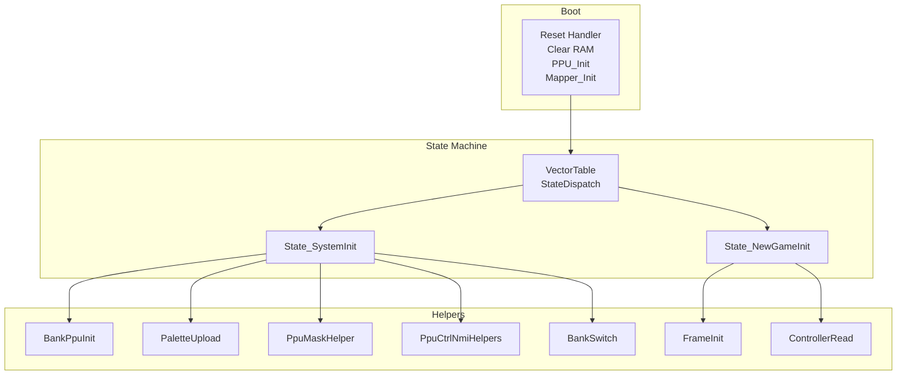
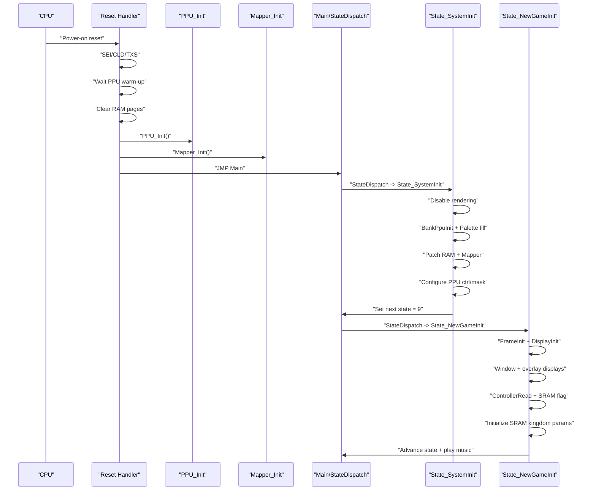
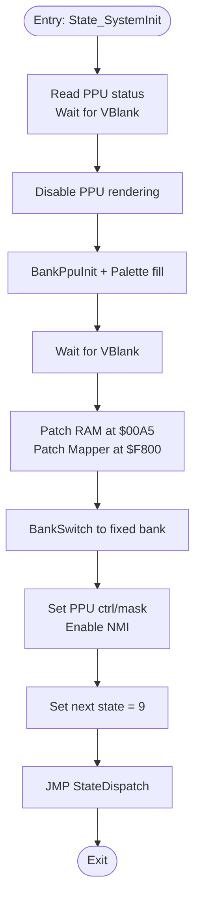
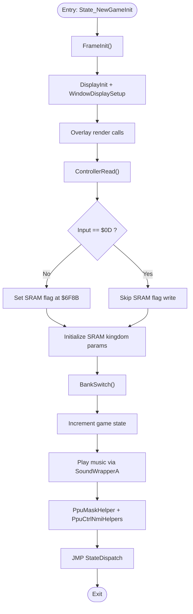
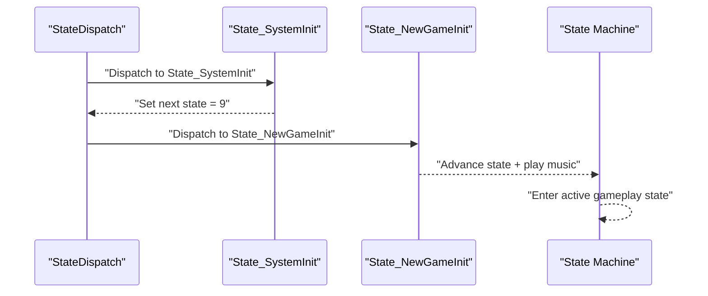
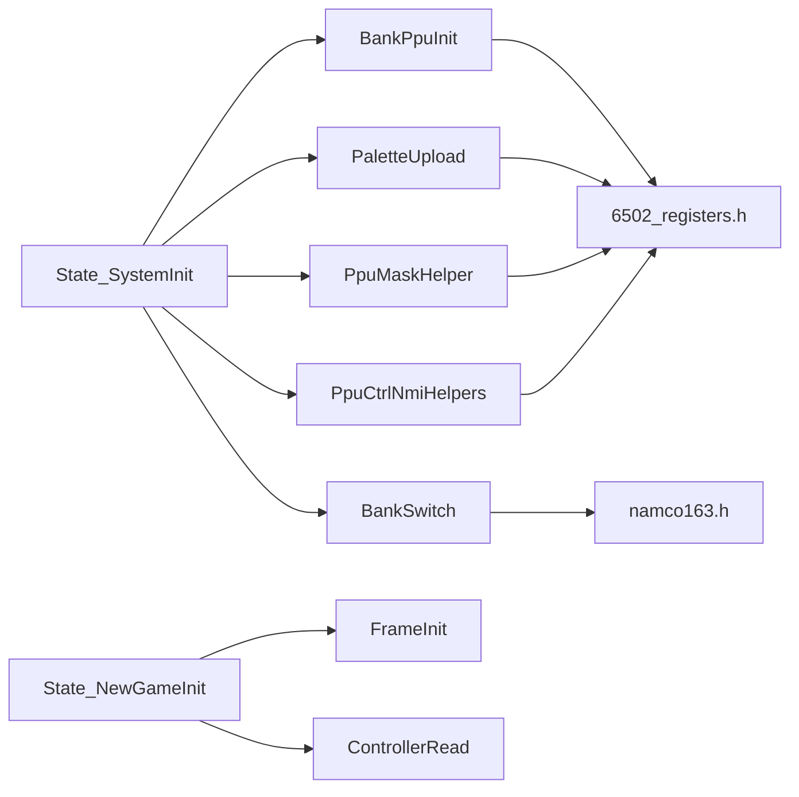

# Initialization States

<cite>
**Referenced Files in This Document**
- [main.asm](file://asm/main.asm)
- [prg_1f.asm](file://asm/banks/prg_1f.asm)
- [6502_registers.h](file://include/6502_registers.h)
- [namco163.h](file://include/namco163.h)
- [bank_1f_raw.asm](file://code/bank_1f_raw.asm)
</cite>

## Table of Contents
1. [Introduction](#introduction)
2. [Project Structure](#project-structure)
3. [Core Components](#core-components)
4. [Architecture Overview](#architecture-overview)
5. [Detailed Component Analysis](#detailed-component-analysis)
6. [Dependency Analysis](#dependency-analysis)
7. [Performance Considerations](#performance-considerations)
8. [Troubleshooting Guide](#troubleshooting-guide)
9. [Conclusion](#conclusion)

## Introduction
This document explains the initialization states that bootstrap the game’s runtime environment. It focuses on:
- State_SystemInit: system-level initialization, PPU setup, palette configuration, and preparation for subsequent states.
- State_NewGameInit: game setup, controller input handling, SRAM flag management, and initial data configuration.

It also documents the initialization sequence, memory clearing operations, mapper configuration, and how these states establish the foundation for the complete game state machine, culminating in the transition from initialization to active gameplay.

## Project Structure
The initialization logic spans several assembly modules:
- The reset and early bootstrapping occur in the main entry module.
- The state machine and state-specific initialization routines live in the bank-1F bank.
- Hardware register definitions for the 6502, PPU, and Namco-163 mapper are provided via header files.
- Additional raw disassembly captures mapper/controller initialization and bank-switching details.

**Diagram sources**
- [main.asm:30-60](file://asm/main.asm#L30-L60)
- [prg_1f.asm:153-202](file://asm/banks/prg_1f.asm#L153-L202)
- [prg_1f.asm:740-750](file://asm/banks/prg_1f.asm#L740-L750)
- [prg_1f.asm:174-202](file://asm/banks/prg_1f.asm#L174-L202)
- [prg_1f.asm:210-276](file://asm/banks/prg_1f.asm#L210-L276)
- [prg_1f.asm:755-779](file://asm/banks/prg_1f.asm#L755-L779)
- [prg_1f.asm:832-840](file://asm/banks/prg_1f.asm#L832-L840)
- [prg_1f.asm:1067-1085](file://asm/banks/prg_1f.asm#L1067-L1085)
- [prg_1f.asm:1087-1113](file://asm/banks/prg_1f.asm#L1087-L1113)
- [prg_1f.asm:785-818](file://asm/banks/prg_1f.asm#L785-L818)
- [prg_1f.asm:1037-1065](file://asm/banks/prg_1f.asm#L1037-L1065)

**Section sources**
- [main.asm:30-60](file://asm/main.asm#L30-L60)
- [prg_1f.asm:153-202](file://asm/banks/prg_1f.asm#L153-L202)
- [prg_1f.asm:740-750](file://asm/banks/prg_1f.asm#L740-L750)

## Core Components
- Reset and early boot: The reset handler initializes CPU flags, waits for PPU stabilization, clears zero-page and page-aligned RAM regions, runs PPU and mapper initialization, and jumps to the main state dispatch loop.
- State_SystemInit: Disables rendering, initializes PPU and palette buffers, patches RAM and mapper registers, configures PPU control/mask, and transitions to the next state.
- State_NewGameInit: Performs frame initialization, sets up displays and windows, handles controller input, manages SRAM flags and initial kingdom data, and advances to the next state.

Key hardware and helpers:
- PPU registers and bit masks are defined for control, mask, and status.
- Namco-163 mapper registers and bank-switching macros define PRG banking.
- Helper routines provide palette upload, PPU mask/control helpers, VBlank synchronization, and controller input sampling.

**Section sources**
- [main.asm:30-60](file://asm/main.asm#L30-L60)
- [prg_1f.asm:174-202](file://asm/banks/prg_1f.asm#L174-L202)
- [prg_1f.asm:210-276](file://asm/banks/prg_1f.asm#L210-L276)
- [6502_registers.h:5-13](file://include/6502_registers.h#L5-L13)
- [6502_registers.h:52-87](file://include/6502_registers.h#L52-L87)
- [namco163.h:10-17](file://include/namco163.h#L10-L17)
- [namco163.h:67-86](file://include/namco163.h#L67-L86)

## Architecture Overview
The initialization sequence establishes a clean runtime environment and transitions into the state machine. The diagram below maps the boot process and the first two states.

**Diagram sources**
- [main.asm:30-60](file://asm/main.asm#L30-L60)
- [prg_1f.asm:174-202](file://asm/banks/prg_1f.asm#L174-L202)
- [prg_1f.asm:210-276](file://asm/banks/prg_1f.asm#L210-L276)
- [prg_1f.asm:740-750](file://asm/banks/prg_1f.asm#L740-L750)

## Detailed Component Analysis

### State_SystemInit
State_SystemInit performs system initialization and prepares the environment for subsequent states. Its responsibilities include:
- Synchronizing with PPU and disabling rendering during initialization.
- Initializing PPU-related buffers and palettes.
- Patching RAM and mapper registers to stabilize runtime behavior.
- Configuring PPU control and mask registers.
- Transitioning to the next state in the state machine.

Implementation highlights:
- Uses PPU status read and VBlank wait helpers to synchronize.
- Calls a bank-PPU initialization routine that disables sound, uploads palettes, and patches RAM/mapper registers.
- Fills sprite palette buffer with a constant color pattern.
- Waits for VBlank, then writes a jump instruction into a patched RAM location and a mapper control register.
- Switches to a specific bank and configures PPU control/mask bits.
- Sets the next state to a predefined index and dispatches to the state machine.

**Diagram sources**
- [prg_1f.asm:174-202](file://asm/banks/prg_1f.asm#L174-L202)
- [prg_1f.asm:832-840](file://asm/banks/prg_1f.asm#L832-L840)
- [prg_1f.asm:1067-1085](file://asm/banks/prg_1f.asm#L1067-L1085)
- [prg_1f.asm:1087-1113](file://asm/banks/prg_1f.asm#L1087-L1113)

**Section sources**
- [prg_1f.asm:174-202](file://asm/banks/prg_1f.asm#L174-L202)
- [prg_1f.asm:832-840](file://asm/banks/prg_1f.asm#L832-L840)
- [prg_1f.asm:1067-1085](file://asm/banks/prg_1f.asm#L1067-L1085)
- [prg_1f.asm:1087-1113](file://asm/banks/prg_1f.asm#L1087-L1113)

### State_NewGameInit
State_NewGameInit handles game setup and initial data configuration. Its responsibilities include:
- Performing a frame initialization to clear display working RAM and set sentinel values.
- Setting up displays and windows for the new game sequence.
- Reading controller input and managing SRAM flags based on input.
- Initializing SRAM with kingdom parameters.
- Advancing to the next state and triggering music playback.

Implementation highlights:
- Calls FrameInit to disable rendering, initialize PPU, clear display buffers, and set sentinel values.
- Sets sub-state and invokes display initialization and window setup routines.
- Configures pointers and parameters for rendering and overlays.
- Reads controller input and conditionally sets an SRAM flag.
- Writes SRAM values for kingdom parameters and switches banks.
- Increments the game state, plays music, and applies PPU mask/control updates.

**Diagram sources**
- [prg_1f.asm:210-276](file://asm/banks/prg_1f.asm#L210-L276)
- [prg_1f.asm:755-779](file://asm/banks/prg_1f.asm#L755-L779)
- [prg_1f.asm:1037-1065](file://asm/banks/prg_1f.asm#L1037-L1065)
- [prg_1f.asm:1087-1113](file://asm/banks/prg_1f.asm#L1087-L1113)

**Section sources**
- [prg_1f.asm:210-276](file://asm/banks/prg_1f.asm#L210-L276)
- [prg_1f.asm:755-779](file://asm/banks/prg_1f.asm#L755-L779)
- [prg_1f.asm:1037-1065](file://asm/banks/prg_1f.asm#L1037-L1065)
- [prg_1f.asm:1087-1113](file://asm/banks/prg_1f.asm#L1087-L1113)

### Initialization Sequence and Memory Clearing
The initialization sequence begins at reset and proceeds as follows:
- CPU flags are set, stack pointer initialized.
- PPU warm-up loop ensures stable conditions.
- RAM clearing targets page-aligned regions ($0000–$07FF) using indexed stores.
- PPU and mapper initialization are performed.
- The main loop dispatches to the first state.

Memory clearing specifics:
- A loop increments a base pointer and iterates through pages, writing zeros to target addresses.
- The loop terminates after a bounded number of pages to cover the intended region.

Mapper and controller initialization:
- Mapper initialization includes writing to mapper registers and performing controller checks.
- Controller polling reads from I/O ports, computes edge-triggered and raw inputs, and stores them for later use.

**Section sources**
- [main.asm:30-60](file://asm/main.asm#L30-L60)
- [main.asm:116-130](file://asm/main.asm#L116-L130)
- [prg_1f.asm:131-136](file://asm/banks/prg_1f.asm#L131-L136)
- [prg_1f.asm:1037-1065](file://asm/banks/prg_1f.asm#L1037-L1065)

### Mapper Configuration
Mapper configuration uses the Namco-163 interface:
- Mapper registers are written to select PRG banks mapped to $8000–$FFFF.
- Bank switching is performed via macros that write to dedicated mapper addresses.
- A bank-switching table defines configurations for PRG register settings and extended mapper behavior.

Raw disassembly confirms mapper register writes and bank-switch table layout.

**Section sources**
- [namco163.h:10-17](file://include/namco163.h#L10-L17)
- [namco163.h:67-86](file://include/namco163.h#L67-L86)
- [prg_1f.asm:785-818](file://asm/banks/prg_1f.asm#L785-L818)
- [bank_1f_raw.asm:1103-1192](file://code/bank_1f_raw.asm#L1103-L1192)

### Transition from Initialization to Active Gameplay
After State_SystemInit completes, the state machine transitions to a predefined next state. State_NewGameInit then performs game setup, controller input handling, SRAM flag management, and initial data configuration. Upon completion, it advances the state machine to the next stage and triggers music playback, establishing the foundation for active gameplay.

**Diagram sources**
- [prg_1f.asm:740-750](file://asm/banks/prg_1f.asm#L740-L750)
- [prg_1f.asm:174-202](file://asm/banks/prg_1f.asm#L174-L202)
- [prg_1f.asm:210-276](file://asm/banks/prg_1f.asm#L210-L276)

## Dependency Analysis
The initialization states depend on helper routines and hardware register definitions. The following diagram shows key dependencies:

**Diagram sources**
- [prg_1f.asm:174-202](file://asm/banks/prg_1f.asm#L174-L202)
- [prg_1f.asm:210-276](file://asm/banks/prg_1f.asm#L210-L276)
- [prg_1f.asm:832-840](file://asm/banks/prg_1f.asm#L832-L840)
- [prg_1f.asm:1067-1085](file://asm/banks/prg_1f.asm#L1067-L1085)
- [prg_1f.asm:1087-1113](file://asm/banks/prg_1f.asm#L1087-L1113)
- [prg_1f.asm:755-779](file://asm/banks/prg_1f.asm#L755-L779)
- [prg_1f.asm:1037-1065](file://asm/banks/prg_1f.asm#L1037-L1065)
- [6502_registers.h:5-13](file://include/6502_registers.h#L5-L13)
- [namco163.h:10-17](file://include/namco163.h#L10-L17)

**Section sources**
- [prg_1f.asm:174-202](file://asm/banks/prg_1f.asm#L174-L202)
- [prg_1f.asm:210-276](file://asm/banks/prg_1f.asm#L210-L276)
- [6502_registers.h:5-13](file://include/6502_registers.h#L5-L13)
- [namco163.h:10-17](file://include/namco163.h#L10-L17)

## Performance Considerations
- Synchronization with VBlank: Both states rely on PPU status checks to synchronize operations, preventing screen tearing and ensuring deterministic initialization timing.
- Minimal CPU work during frame init: Palette uploads and PPU configuration are batched to reduce overhead.
- Bank switching cost: Mapper writes and bank switches occur infrequently during initialization, minimizing runtime impact.
- Controller polling: Input sampling is performed once per frame initialization to avoid excessive I/O overhead.

## Troubleshooting Guide
Common issues and remedies:
- PPU not stabilizing: Ensure the PPU warm-up loop completes before proceeding with initialization. Verify PPU status reads and VBlank waits.
- Incorrect palette or blank screen: Confirm palette upload routine executes and PPU mask/control registers are set appropriately.
- Mapper instability: Validate mapper register writes and bank-switching sequences. Check the bank-switching table configuration.
- Controller input anomalies: Confirm controller strobe and read sequences are executed and edge/raw/previous buffers are populated correctly.

**Section sources**
- [prg_1f.asm:1126-1131](file://asm/banks/prg_1f.asm#L1126-L1131)
- [prg_1f.asm:1067-1085](file://asm/banks/prg_1f.asm#L1067-L1085)
- [prg_1f.asm:1087-1113](file://asm/banks/prg_1f.asm#L1087-L1113)
- [prg_1f.asm:1037-1065](file://asm/banks/prg_1f.asm#L1037-L1065)

## Conclusion
State_SystemInit and State_NewGameInit form the backbone of the game’s initialization sequence. They establish a clean runtime environment, configure the PPU and mapper, manage palette data, handle controller input, and prepare SRAM for gameplay. Together with the state dispatch mechanism, they transition the system from boot to active gameplay, laying the groundwork for the complete state machine.