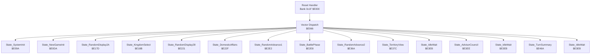
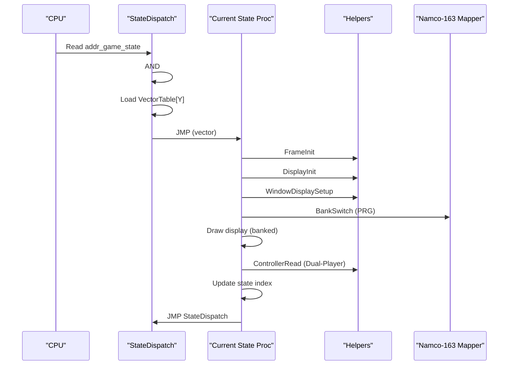

# State Procedures

<cite>
**Referenced Files in This Document**
- [functions.h](file://include/functions.h)
- [prg_1f.aligned.asm](file://asm/banks/prg_1f.aligned.asm)
- [disasm_bank_1f.py](file://tools/disasm_bank_1f.py)
- [debug_regions.py](file://tools/debug_regions.py)
- [transform_17_18.py](file://tools/transform_17_18.py)
</cite>

## Update Summary
**Changes Made**
- Enhanced documentation of advisor council interactions with improved dialogue system integration
- Updated rendering system documentation to reflect consolidated tile setup procedures
- Improved code organization documentation with new semantic naming conventions
- Added detailed coverage of bank switching integration and modular .proc organization
- Enhanced state transition documentation with improved parameter handling

## Table of Contents
1. [Introduction](#introduction)
2. [Project Structure](#project-structure)
3. [Core Components](#core-components)
4. [Architecture Overview](#architecture-overview)
5. [Detailed Component Analysis](#detailed-component-analysis)
6. [Dependency Analysis](#dependency-analysis)
7. [Performance Considerations](#performance-considerations)
8. [Troubleshooting Guide](#troubleshooting-guide)
9. [Conclusion](#conclusion)

## Introduction
This document describes the individual state procedures that drive the gameplay flow in the disassembly. It focuses on the 15 distinct game states and their implementations, detailing initialization sequences, display setup, user input handling, data manipulation, transitions, and the modular .proc organization. The system features enhanced dual-player controller support with dedicated memory addresses for both Player 1 and Player 2 input processing, improved rendering systems with consolidated tile setup procedures, and new semantic naming conventions for better code organization.

## Project Structure
The game uses a vector-based dispatch mechanism located in bank 0x1F. The reset handler initializes the system and then dispatches to state handlers via a 15-entry vector table. Each state is implemented as a .proc and typically:
- Calls FrameInit to prepare PPU and working RAM
- Sets up display modes and windows
- Performs bank-switched drawing calls
- Reads dual-player controller input
- Updates state machine and transitions

**Diagram sources**
- [functions.h:25-46](file://include/functions.h#L25-L46)
- [prg_1f.aligned.asm:224-260](file://asm/banks/prg_1f.aligned.asm#L224-L260)
- [prg_1f.aligned.asm:260-327](file://asm/banks/prg_1f.aligned.asm#L260-L327)
- [prg_1f.aligned.asm:331-338](file://asm/banks/prg_1f.aligned.asm#L331-L338)
- [prg_1f.aligned.asm:345-419](file://asm/banks/prg_1f.aligned.asm#L345-L419)
- [prg_1f.aligned.asm:420-432](file://asm/banks/prg_1f.aligned.asm#L420-L432)
- [prg_1f.aligned.asm:433-470](file://asm/banks/prg_1f.aligned.asm#L433-L470)
- [prg_1f.aligned.asm:534-543](file://asm/banks/prg_1f.aligned.asm#L534-L543)
- [prg_1f.aligned.asm:544-590](file://asm/banks/prg_1f.aligned.asm#L544-L590)
- [prg_1f.aligned.asm:606-625](file://asm/banks/prg_1f.aligned.asm#L606-L625)
- [prg_1f.aligned.asm:626-679](file://asm/banks/prg_1f.aligned.asm#L626-L679)
- [prg_1f.aligned.asm:680-733](file://asm/banks/prg_1f.aligned.asm#L680-L733)
- [prg_1f.aligned.asm:734-789](file://asm/banks/prg_1f.aligned.asm#L734-L789)

**Section sources**
- [functions.h:25-46](file://include/functions.h#L25-L46)
- [prg_1f.aligned.asm:224-260](file://asm/banks/prg_1f.aligned.asm#L224-L260)

## Core Components
- Vector Dispatch: Central dispatcher that selects the current state routine using a 15-entry table.
- State Handlers: Modular .proc routines implementing each game state's logic and transitions.
- Helper Procedures: FrameInit, DisplayInit, WindowDisplaySetup, ControllerRead, BankSwitch, PpuMaskHelper, PpuCtrlNmiHelpers, and others.
- Dual-Player Controller Support: Enhanced input handling with separate memory addresses for Player 1 and Player 2.
- Bank Switching: Uses the Namco-163 mapper to load code/data from other banks during state execution.

Key helper and utility locations:
- FrameInit: Prepares PPU, clears working RAM, initializes sentinel values, and initializes sprite buffers.
- DisplayInit: Clears window, invokes bank-switched display mode, and switches CHR banks.
- WindowDisplaySetup/WindowSetup2: Configure bank parameters and write to mapper registers for banked calls.
- BankSwitch: Applies PRG bank configurations to mapper registers.
- ControllerRead: Polls both controller ports and computes edge-triggered and previous states for both players.
- PpuMaskHelper/PpuCtrlNmiHelpers: Control PPU mask and NMI enablement.

**Section sources**
- [prg_1f.aligned.asm:832-840](file://asm/banks/prg_1f.aligned.asm#L832-L840)
- [prg_1f.aligned.asm:573-579](file://asm/banks/prg_1f.aligned.asm#L573-L579)
- [prg_1f.aligned.asm:2302-2309](file://asm/banks/prg_1f.aligned.asm#L2302-L2309)
- [prg_1f.aligned.asm:2315-2318](file://asm/banks/prg_1f.aligned.asm#L2315-L2318)
- [prg_1f.aligned.asm:776-809](file://asm/banks/prg_1f.aligned.asm#L776-L809)
- [prg_1f.aligned.asm:1049-1085](file://asm/banks/prg_1f.aligned.asm#L1049-L1085)
- [prg_1f.aligned.asm:1118-1151](file://asm/banks/prg_1f.aligned.asm#L1118-L1151)

## Architecture Overview
The state machine is driven by a single global variable (game state index) and a vector table. Each state routine:
- Prepares the frame (PPU, RAM, sprites)
- Chooses a display mode and sets up windows
- Invokes bank-switched drawing routines
- Reads dual-player input and applies logic
- Updates state and transitions

**Diagram sources**
- [functions.h:25-46](file://include/functions.h#L25-L46)
- [prg_1f.aligned.asm:832-840](file://asm/banks/prg_1f.aligned.asm#L832-L840)
- [prg_1f.aligned.asm:573-579](file://asm/banks/prg_1f.aligned.asm#L573-L579)
- [prg_1f.aligned.asm:2302-2309](file://asm/banks/prg_1f.aligned.asm#L2302-L2309)
- [prg_1f.aligned.asm:776-809](file://asm/banks/prg_1f.aligned.asm#L776-L809)
- [prg_1f.aligned.asm:1049-1085](file://asm/banks/prg_1f.aligned.asm#L1049-L1085)

## Detailed Component Analysis

### State_SystemInit (index 0)
Purpose: Initialize PPU, clear palettes, disable rendering, patch mapper, switch to initial state.
Behavior:
- Waits for VBlank, disables PPU mask, runs banked PPU init, fills sprite palette.
- Patches RAM and mapper registers, switches to bank 0x00, enables NMI and sets PPU control/mask.
- Transitions to State_TerritoryView (index 9).

Parameters: None (internal initialization).

Transition: addr_game_state = 9, then StateDispatch.

**Section sources**
- [prg_1f.aligned.asm:224-260](file://asm/banks/prg_1f.aligned.asm#L224-L260)
- [prg_1f.aligned.asm:832-840](file://asm/banks/prg_1f.aligned.asm#L832-L840)

### State_NewGameInit (index 1)
Purpose: Initialize new game screen, set up display parameters, optionally initialize SRAM flags, and transition to next state.
Behavior:
- Calls FrameInit, sets sub-state, DisplayInit, and draws initial windows.
- Sets pointer to $8000, configures width/params, draws overlay, reads dual-player controller.
- Optionally sets SRAM flags based on input.
- Sets display mode, uploads palettes, switches to bank 0x01, increments state, plays music, enables PPU/NMI.

Parameters:
- $0400: dual-player controller input result
- $0098: display param
- SRAM: $6F41, $6F3F, $6F8B: kingdom initialization

Transition: INC addr_game_state, then StateDispatch.

**Section sources**
- [prg_1f.aligned.asm:260-327](file://asm/banks/prg_1f.aligned.asm#L260-L327)

### State_RandomDisplay2A (index 2)
Purpose: Draw a random display using window mode 0x2A and advance RNG.
Behavior:
- Calls RandomByte, sets window mode 0x2A, invokes bank-switched display, then StateDispatch.

Parameters: None (uses internal RNG).

Transition: StateDispatch.

**Section sources**
- [prg_1f.aligned.asm:331-338](file://asm/banks/prg_1f.aligned.asm#L331-L338)
- [prg_1f.aligned.asm:1250-1260](file://asm/banks/prg_1f.aligned.asm#L1250-L1260)

### State_KingdomSelect (index 3)
Purpose: Allow player to select a kingdom; supports scenario mode and normal mode.
Behavior:
- FrameInit, sets sub-state, DisplayInit, draws kingdom display.
- Checks mode: scenario vs normal, calls appropriate banked function.
- Copies selected coordinates to working RAM, sets flags, overlays, reads dual-player controller.
- Uploads palettes, switches to bank 0x01, increments state, plays music, enables PPU/NMI.

Parameters:
- $0500: kingdom mode ($0B=scenario)
- $0510-$0513: kingdom coordinate data
- $0068/$0069: territory data pointer

Transition: INC addr_game_state, then StateDispatch.

**Section sources**
- [prg_1f.aligned.asm:345-419](file://asm/banks/prg_1f.aligned.asm#L345-L419)

### State_RandomDisplay28 (index 4)
Purpose: Draw a random display using window mode 0x28 and advance RNG.
Behavior:
- Calls RandomByte, sets window mode 0x28, invokes bank-switched display, then StateDispatch.

Parameters: None (uses internal RNG).

Transition: StateDispatch.

**Section sources**
- [prg_1f.aligned.asm:420-432](file://asm/banks/prg_1f.aligned.asm#L420-L432)
- [prg_1f.aligned.asm:1250-1260](file://asm/banks/prg_1f.aligned.asm#L1250-L1260)

### State_DomesticAffairs (index 5)
Purpose: Present domestic action interface and handle sprite indicators.
Behavior:
- FrameInit, sets sub-state, DisplayInit with action type, switches to bank 0x02, draws domestic display.
- Uses DomesticActionDisplay to draw action-specific graphics.
- Loads sprite positions from a table and renders overlay.
- Reads dual-player controller input, uploads palettes, increments state, plays sound, enables PPU/NMI.

Parameters:
- $0544: domestic action type (0-6)
- $0562/$0563: sprite position indices

Transition: INC addr_game_state, then StateDispatch.

**Section sources**
- [prg_1f.aligned.asm:433-470](file://asm/banks/prg_1f.aligned.asm#L433-L470)
- [prg_1f.aligned.asm:472-485](file://asm/banks/prg_1f.aligned.asm#L472-L485)

### State_RandomAdvance1 (index 6)
Purpose: Advance random seed (RNG) without drawing.
Behavior:
- Calls RandomByte, then StateDispatch.

Parameters: None (uses internal RNG).

Transition: StateDispatch.

**Section sources**
- [prg_1f.aligned.asm:534-543](file://asm/banks/prg_1f.aligned.asm#L534-L543)
- [prg_1f.aligned.asm:1250-1260](file://asm/banks/prg_1f.aligned.asm#L1250-L1260)

### State_BattlePhase (index 7)
Purpose: Render and manage battle interface; handle army status and transitions.
Behavior:
- FrameInit, sets sub-state, sets display mode, draws battle background and overlay.
- Reads army status flags and clears sprites accordingly.
- Reads dual-player controller input, uploads palettes, switches to bank 0x03, increments state, plays music, enables PPU/NMI.

Parameters:
- $04AB/$04AC: army status flags

Transition: INC addr_game_state, then StateDispatch.

**Section sources**
- [prg_1f.aligned.asm:544-590](file://asm/banks/prg_1f.aligned.asm#L544-L590)

### State_RandomAdvance2 (index 8)
Purpose: Advance random seed (RNG) without drawing.
Behavior:
- Calls RandomByte, then StateDispatch.

Parameters: None (uses internal RNG).

Transition: StateDispatch.

**Section sources**
- [prg_1f.aligned.asm:606-625](file://asm/banks/prg_1f.aligned.asm#L606-L625)
- [prg_1f.aligned.asm:1250-1260](file://asm/banks/prg_1f.aligned.asm#L1250-L1260)

### State_TerritoryView (index 9)
Purpose: Display the world map and handle scrolling/palettes.
Behavior:
- FrameInit, sets sub-state, DisplayInit, draws map background and overlay.
- Sets up pointers and parameters for map data, reads dual-player controller input, uploads palettes.
- Switches to bank 0x02, increments state, enables PPU/NMI.

Transition: INC addr_game_state, then StateDispatch.

**Section sources**
- [prg_1f.aligned.asm:626-679](file://asm/banks/prg_1f.aligned.asm#L626-L679)

### State_IdleWait (indices 10, 12, 14)
Purpose: No-op idle states that simply re-dispatch.
Behavior:
- JMP StateDispatch without changing state.

Transition: StateDispatch.

**Section sources**
- [prg_1f.aligned.asm:680-733](file://asm/banks/prg_1f.aligned.asm#L680-L733)

### State_AdvisorCouncil (index 11)
Purpose: Show advisor/council dialogue and handle dual-player input with enhanced rendering system.
Behavior:
- FrameInit, sets sub-state, DisplayInit, draws advisor background and dialogue.
- Integrates with consolidated tile setup procedures for improved rendering performance.
- Sets up parameters for dialog, reads dual-player controller input, uploads palettes.
- Switches to bank 0x02, increments state, plays sound, enables PPU/NMI.

**Updated** Enhanced with improved advisor dialogue system integration and consolidated tile setup procedures for better rendering performance.

Transition: INC addr_game_state, then StateDispatch.

**Section sources**
- [prg_1f.aligned.asm:680-733](file://asm/banks/prg_1f.aligned.asm#L680-L733)

### State_TurnSummary (index 13)
Purpose: Display turn summary; play normal or victory music depending on completion flag.
Behavior:
- FrameInit, sets sub-state, DisplayInit, draws report background and overlay.
- Reads completion flag, selects music (normal or victory), uploads palettes.
- Switches to bank 0x02, increments state, enables PPU/NMI.

Parameters:
- $0541: completion flag (0=normal, nonzero=victory)

Transition: INC addr_game_state, then StateDispatch.

**Section sources**
- [prg_1f.aligned.asm:734-789](file://asm/banks/prg_1f.aligned.asm#L734-L789)

### StateDispatch
Purpose: Central dispatcher that selects the next state routine.
Behavior:
- Reads addr_game_state, masks to 0-31, multiplies by 2 for word index, loads vector, jumps to routine.

Transition: JMP (vector)

**Section sources**
- [functions.h:25-46](file://include/functions.h#L25-L46)

### Helper Procedures and Utilities

#### FrameInit
- Clears display working RAM, sets sentinel values, disables PPU, runs banked PPU init, fills nametables, resets counters, and initializes sprite buffers.

**Section sources**
- [prg_1f.aligned.asm:832-840](file://asm/banks/prg_1f.aligned.asm#L832-L840)

#### DisplayInit
- Clears window, invokes bank-switched display mode, and switches CHR banks.

**Section sources**
- [prg_1f.aligned.asm:573-579](file://asm/banks/prg_1f.aligned.asm#L573-L579)

#### WindowDisplaySetup / WindowSetup2
- Stores bank parameters to $00E2/$00E3 and writes to mapper registers for banked calls.

**Section sources**
- [prg_1f.aligned.asm:2302-2309](file://asm/banks/prg_1f.aligned.asm#L2302-L2309)
- [prg_1f.aligned.asm:2315-2318](file://asm/banks/prg_1f.aligned.asm#L2315-L2318)

#### BankSwitch
- Applies PRG bank configuration from a table to mapper registers.

**Section sources**
- [prg_1f.aligned.asm:776-809](file://asm/banks/prg_1f.aligned.asm#L776-L809)
- [prg_1f.aligned.asm:815-819](file://asm/banks/prg_1f.aligned.asm#L815-L819)

#### ControllerRead (Enhanced Dual-Player Support)
- Strobes both controller ports, reads 8-bit serial data for both players, computes raw, previous, and edge-triggered states for each player.
- Player 1 addresses: addr_pad1_edge, addr_pad1_raw, addr_pad1_prev
- Player 2 addresses: addr_pad2_edge, addr_pad2_raw, addr_pad2_prev

**Section sources**
- [prg_1f.aligned.asm:1049-1085](file://asm/banks/prg_1f.aligned.asm#L1049-L1085)

#### PpuMaskHelper / PpuCtrlNmiHelpers
- Control PPU mask and enable NMI via PPU registers.

**Section sources**
- [prg_1f.aligned.asm:1118-1151](file://asm/banks/prg_1f.aligned.asm#L1118-L1151)

### Bank Switching Integration
- The game uses the Namco-163 mapper to dynamically load code/data from other banks during state execution.
- BankSwitch applies a configuration from a table to mapper registers.
- WindowDisplaySetup and WindowSetup2 set parameters that are later written to mapper registers to select PRG/CHR banks.
- Banked drawing routines are invoked via addresses in the $A0xx range (e.g., $A003 for text, $A006 for scenario/action, $A009 for kingdom, $A015 for overlays, $A018 for advisor dialogue, $A024 for domestic, $A027 for kingdom select, etc.).

**Section sources**
- [functions.h:25-46](file://include/functions.h#L25-L46)
- [prg_1f.aligned.asm:776-809](file://asm/banks/prg_1f.aligned.asm#L776-L809)
- [prg_1f.aligned.asm:2302-2309](file://asm/banks/prg_1f.aligned.asm#L2302-L2309)

### Modular .proc Organization and Local Variables
- Each state is implemented as a .proc with its own local variables in zero-page/working RAM (e.g., $0500–$0513 for kingdom select, $0544 for domestic action type, $0562/$0563 for sprite indices, $0541 for turn summary completion flag).
- Helper procedures are reusable across states and operate on shared memory areas.
- Banked routines are invoked indirectly through window setup and bank switching, keeping state procs agnostic of exact bank addresses.
- Dual-player controller support is integrated throughout all state handlers via unified ControllerRead procedure.
- New semantic naming conventions improve code readability and maintainability across the state system.

**Section sources**
- [prg_1f.aligned.asm:345-353](file://asm/banks/prg_1f.aligned.asm#L345-L353)
- [prg_1f.aligned.asm:433-440](file://asm/banks/prg_1f.aligned.asm#L433-L440)
- [prg_1f.aligned.asm:734-740](file://asm/banks/prg_1f.aligned.asm#L734-L740)

## Dependency Analysis
- State_SystemInit depends on PPU init, palette upload, and mapper patching.
- State_NewGameInit depends on FrameInit, DisplayInit, dual-player controller input, and SRAM initialization.
- State_KingdomSelect depends on DisplayInit, banked kingdom display, and coordinate handling.
- State_DomesticAffairs depends on DisplayInit, DomesticActionLookup/DomesticActionDisplay, sprite position tables, and dual-player controller input.
- State_BattlePhase depends on DisplayInit, army status flags, and banked battle display.
- State_TerritoryView depends on DisplayInit and banked map display.
- State_AdvisorCouncil depends on DisplayInit and banked advisor dialogue with enhanced rendering integration.
- State_TurnSummary depends on DisplayInit, completion flag, and music selection.
- All states depend on StateDispatch for transitions and on helpers for PPU, input, and bank switching.

```mermaid
graph TB
State_SystemInit --> PPU_Init["PPU Init / Patch"]
State_NewGameInit --> FrameInit
State_NewGameInit --> DisplayInit
State_NewGameInit --> DualController["Dual-Player Controller Read"]
State_NewGameInit --> ControllerRead
State_KingdomSelect --> DisplayInit
State_KingdomSelect --> BankedKingdom["Banked Kingdom Display"]
State_DomesticAffairs --> DisplayInit
State_DomesticAffairs --> DomesticLookup["DomesticActionLookup"]
State_DomesticAffairs --> SpriteTable["DomesticSpriteYPos"]
State_DomesticAffairs --> DualController
State_BattlePhase --> DisplayInit
State_BattlePhase --> ArmyFlags["Army Status Flags"]
State_BattlePhase --> DualController
State_TerritoryView --> DisplayInit
State_TerritoryView --> BankedMap["Banked Map Display"]
State_TerritoryView --> DualController
State_AdvisorCouncil --> DisplayInit
State_AdvisorCouncil --> BankedAdvisor["Banked Advisor Dialogue"]
State_AdvisorCouncil --> EnhancedRendering["Enhanced Rendering System"]
State_AdvisorCouncil --> DualController
State_TurnSummary --> DisplayInit
State_TurnSummary --> CompletionFlag["Completion Flag"]
StateDispatch --> AllStates["All States"]
```

**Diagram sources**
- [prg_1f.aligned.asm:224-260](file://asm/banks/prg_1f.aligned.asm#L224-L260)
- [prg_1f.aligned.asm:260-327](file://asm/banks/prg_1f.aligned.asm#L260-L327)
- [prg_1f.aligned.asm:345-419](file://asm/banks/prg_1f.aligned.asm#L345-L419)
- [prg_1f.aligned.asm:433-470](file://asm/banks/prg_1f.aligned.asm#L433-L470)
- [prg_1f.aligned.asm:544-590](file://asm/banks/prg_1f.aligned.asm#L544-L590)
- [prg_1f.aligned.asm:626-679](file://asm/banks/prg_1f.aligned.asm#L626-L679)
- [prg_1f.aligned.asm:680-733](file://asm/banks/prg_1f.aligned.asm#L680-L733)
- [prg_1f.aligned.asm:734-789](file://asm/banks/prg_1f.aligned.asm#L734-L789)
- [functions.h:25-46](file://include/functions.h#L25-L46)

**Section sources**
- [prg_1f.aligned.asm:224-260](file://asm/banks/prg_1f.aligned.asm#L224-L260)
- [prg_1f.aligned.asm:260-327](file://asm/banks/prg_1f.aligned.asm#L260-L327)
- [prg_1f.aligned.asm:345-419](file://asm/banks/prg_1f.aligned.asm#L345-L419)
- [prg_1f.aligned.asm:433-470](file://asm/banks/prg_1f.aligned.asm#L433-L470)
- [prg_1f.aligned.asm:544-590](file://asm/banks/prg_1f.aligned.asm#L544-L590)
- [prg_1f.aligned.asm:626-679](file://asm/banks/prg_1f.aligned.asm#L626-L679)
- [prg_1f.aligned.asm:680-733](file://asm/banks/prg_1f.aligned.asm#L680-L733)
- [prg_1f.aligned.asm:734-789](file://asm/banks/prg_1f.aligned.asm#L734-L789)
- [functions.h:25-46](file://include/functions.h#L25-L46)

## Performance Considerations
- Bank switching occurs infrequently per state but is essential for loading graphics and text data. Keep state routines compact to minimize overhead.
- PPU operations (mask, NMI, palette upload) are performed once per state to reduce flicker and maintain timing.
- Dual-player controller polling is centralized in ControllerRead and reused across states to avoid redundant reads.
- Edge-triggered input detection is optimized for both players to ensure responsive gameplay.
- Consolidated tile setup procedures improve rendering performance by reducing redundant setup operations.
- Enhanced advisor dialogue system integration optimizes memory access patterns for better frame rates.

## Troubleshooting Guide
Common issues and checks:
- PPU flicker or incorrect palette: Verify PpuMaskHelper and PaletteUpload calls occur before enabling rendering.
- Incorrect banked drawing: Confirm BankSwitch and WindowDisplaySetup/WindowSetup2 are executed before invoking $A0xx routines.
- Dual-player input not responding: Ensure ControllerRead is called and edge-triggered flags are checked appropriately for both addr_pad1_edge and addr_pad2_edge.
- State stuck: Confirm StateDispatch is reached after each state completes its logic.
- Controller input conflicts: Verify proper edge-triggered detection using XOR and AND operations on raw and previous states.
- Advisor dialogue rendering issues: Check consolidated tile setup procedures are properly integrated with the advisor dialogue system.
- Memory access errors in state transitions: Verify semantic naming conventions are consistently applied across all state procedures.

**Section sources**
- [prg_1f.aligned.asm:1118-1151](file://asm/banks/prg_1f.aligned.asm#L1118-L1151)
- [prg_1f.aligned.asm:1049-1085](file://asm/banks/prg_1f.aligned.asm#L1049-L1085)
- [functions.h:25-46](file://include/functions.h#L25-L46)

## Conclusion
The state system is a clean, modular design centered on a vector dispatch mechanism. Each state manages its own local variables, prepares the frame, performs bank-switched drawing, handles dual-player input, and transitions cleanly. The enhanced dual-player controller support provides comprehensive input handling with separate memory addresses for both players, while the helper procedures encapsulate common tasks (PPU control, input, bank switching), and the vector table ensures predictable control flow across 15 distinct game states. The new semantic naming conventions improve code organization and maintainability, while the consolidated tile setup procedures and enhanced advisor dialogue system integration optimize performance and rendering quality.