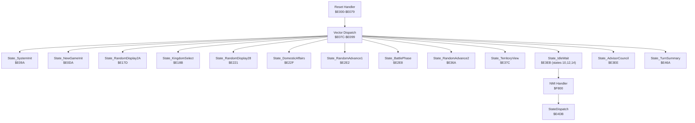
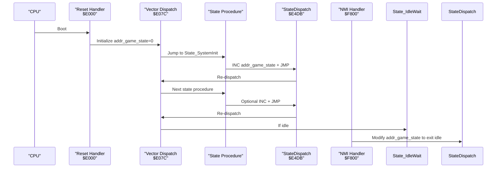
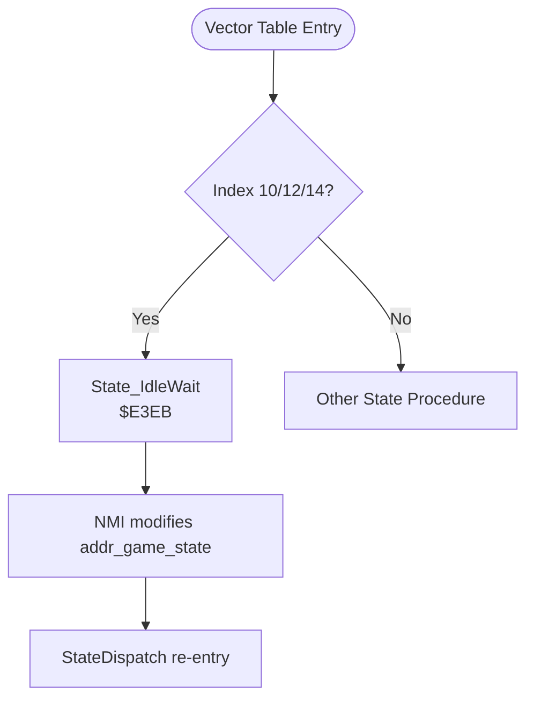
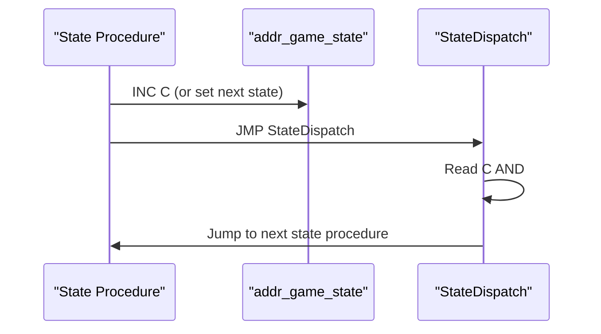
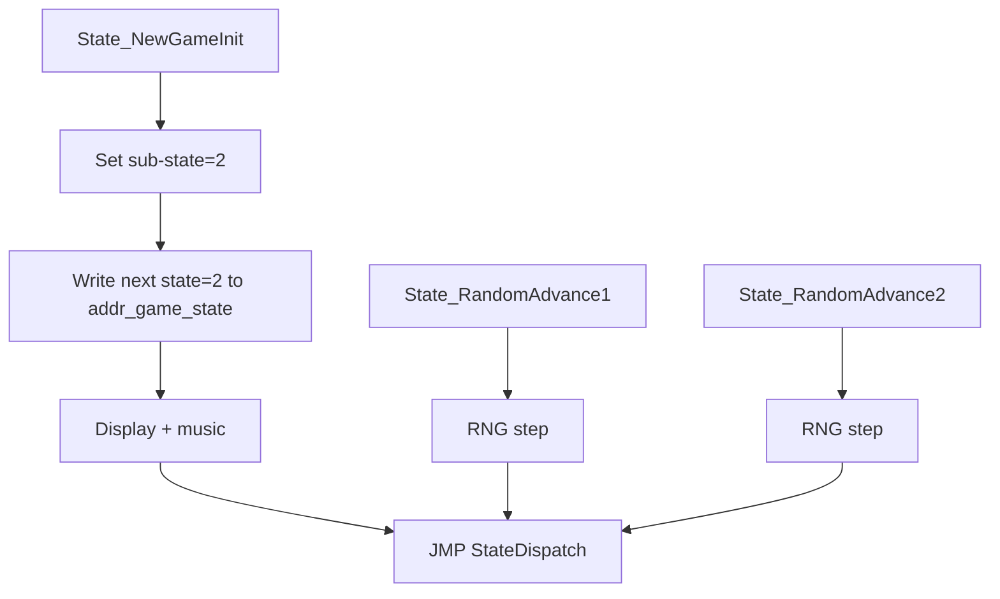
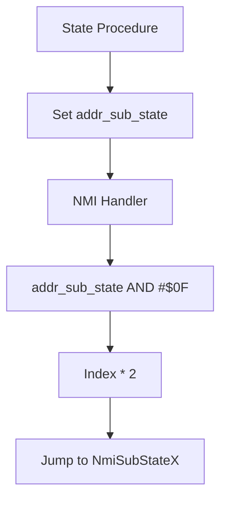
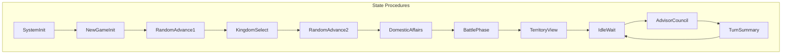
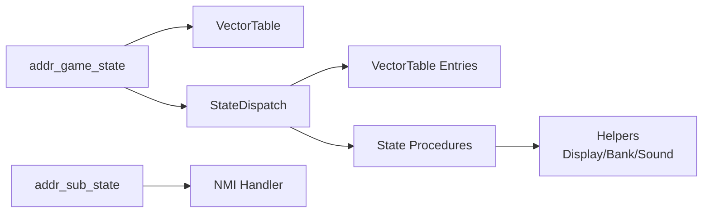

# State Transition Logic

<cite>
**Referenced Files in This Document**
- [PROJECT.md](file://PROJECT.md)
- [bank_1f_analysis.md](file://code/bank_1f_analysis.md)
- [prg_1f.asm](file://asm/banks/prg_1f.asm)
- [main.asm](file://asm/main.asm)
</cite>

## Table of Contents
1. [Introduction](#introduction)
2. [Project Structure](#project-structure)
3. [Core Components](#core-components)
4. [Architecture Overview](#architecture-overview)
5. [Detailed Component Analysis](#detailed-component-analysis)
6. [Dependency Analysis](#dependency-analysis)
7. [Performance Considerations](#performance-considerations)
8. [Troubleshooting Guide](#troubleshooting-guide)
9. [Conclusion](#conclusion)

## Introduction
This document explains the 15-state game phase system and the state transition logic that drives gameplay progression. It covers:
- The state numbering scheme (0–14) and how states 10, 12, and 14 are duplicates of the idle state (IdleWait)
- The increment operation that advances the state counter at the end of each state procedure
- Special cases such as New Game Init (jumped to 2) and Random Advance states (direct jumps without increment)
- The relationship between major states and sub-states, and the role of addr_sub_state for fine-grained control
- The modular design enabling both linear progression and conditional state changes
- The efficiency of this approach for 6502 assembly and how it minimizes branching overhead

## Project Structure
The state machine resides in Bank 0x1F, which is mapped to $E000–$FFFF at boot. The reset handler initializes the state counter and dispatches to the current state via a vector table. The NMI handler performs per-frame tasks and can modify the state counter to exit idle states.

**Diagram sources**
- [bank_1f_analysis.md:54-77](file://code/bank_1f_analysis.md#L54-L77)
- [prg_1f.asm:153-168](file://asm/banks/prg_1f.asm#L153-L168)
- [prg_1f.asm:623-626](file://asm/banks/prg_1f.asm#L623-L626)
- [prg_1f.asm:738-750](file://asm/banks/prg_1f.asm#L738-L750)

**Section sources**
- [PROJECT.md:101-117](file://PROJECT.md#L101-L117)
- [bank_1f_analysis.md:54-77](file://code/bank_1f_analysis.md#L54-L77)

## Core Components
- addr_game_state ($007A): The primary state counter (0–14). It indexes the vector table and controls which state procedure runs.
- VectorTable ($E07C–$E099): 15-entry table of 2-byte addresses pointing to state procedures. Only entries 0–14 are valid; 15+ would read code bytes as pointers.
- State_IdleWait ($E3EB): A null state that immediately returns to dispatch. NMI modifies addr_game_state to exit idle.
- addr_sub_state ($0078): Fine-grained sub-state within a major state, used by NMI to select per-frame behavior.
- StateDispatch ($E4DB): Re-dispatch routine that reads addr_game_state, masks to 0–31, computes a 16-bit vector index, and jumps to the state entry.

Key behaviors:
- Most state procedures end with INC addr_game_state followed by JMP StateDispatch, ensuring sequential progression.
- Special cases:
  - State_NewGameInit writes next state 2 directly, bypassing the increment.
  - State_RandomAdvance1 and State_RandomAdvance2 are pure RNG steps with no display; they jump directly to StateDispatch without increment.
  - States 10, 12, and 14 all point to State_IdleWait, creating a simplified idle pattern.

**Section sources**
- [bank_1f_analysis.md:54-77](file://code/bank_1f_analysis.md#L54-L77)
- [prg_1f.asm:153-168](file://asm/banks/prg_1f.asm#L153-L168)
- [prg_1f.asm:209-276](file://asm/banks/prg_1f.asm#L209-L276)
- [prg_1f.asm:482-486](file://asm/banks/prg_1f.asm#L482-L486)
- [prg_1f.asm:554-558](file://asm/banks/prg_1f.asm#L554-L558)
- [prg_1f.asm:623-626](file://asm/banks/prg_1f.asm#L623-L626)
- [prg_1f.asm:738-750](file://asm/banks/prg_1f.asm#L738-L750)

## Architecture Overview
The state machine uses a small, efficient loop:
- Reset initializes addr_game_state to 0 and dispatches to State_SystemInit.
- Each state procedure performs its work, optionally updates addr_sub_state, and either increments addr_game_state or jumps directly to StateDispatch.
- StateDispatch re-reads addr_game_state and jumps to the next state procedure.
- During idle frames, NMI can change addr_game_state to break out of State_IdleWait.

**Diagram sources**
- [bank_1f_analysis.md:22-45](file://code/bank_1f_analysis.md#L22-L45)
- [bank_1f_analysis.md:54-77](file://code/bank_1f_analysis.md#L54-L77)
- [prg_1f.asm:738-750](file://asm/banks/prg_1f.asm#L738-L750)
- [prg_1f.asm:623-626](file://asm/banks/prg_1f.asm#L623-L626)
- [prg_1f.asm:2559-2658](file://asm/banks/prg_1f.asm#L2559-L2658)

## Detailed Component Analysis

### State Numbering Scheme and Idle Simplification
- States 0–14 represent distinct phases. States 10, 12, and 14 all point to State_IdleWait, forming a simplified idle pattern.
- The vector table explicitly lists these duplicates, ensuring consistent idle behavior across three indices.

**Diagram sources**
- [bank_1f_analysis.md:54-77](file://code/bank_1f_analysis.md#L54-L77)
- [prg_1f.asm:163-168](file://asm/banks/prg_1f.asm#L163-L168)
- [prg_1f.asm:623-626](file://asm/banks/prg_1f.asm#L623-L626)

**Section sources**
- [bank_1f_analysis.md:54-77](file://code/bank_1f_analysis.md#L54-L77)
- [prg_1f.asm:163-168](file://asm/banks/prg_1f.asm#L163-L168)

### Increment Operation and Sequential Flow
- After performing work, most state procedures increment addr_game_state and then jump to StateDispatch, ensuring linear progression.
- Examples:
  - State_NewGameInit writes next state 2 directly (no increment).
  - State_RandomAdvance1 and State_RandomAdvance2 jump to StateDispatch without increment.
  - All other state procedures use INC addr_game_state before JMP StateDispatch.

**Diagram sources**
- [prg_1f.asm:209-276](file://asm/banks/prg_1f.asm#L209-L276)
- [prg_1f.asm:482-486](file://asm/banks/prg_1f.asm#L482-L486)
- [prg_1f.asm:554-558](file://asm/banks/prg_1f.asm#L554-L558)
- [prg_1f.asm:738-750](file://asm/banks/prg_1f.asm#L738-L750)

**Section sources**
- [prg_1f.asm:209-276](file://asm/banks/prg_1f.asm#L209-L276)
- [prg_1f.asm:482-486](file://asm/banks/prg_1f.asm#L482-L486)
- [prg_1f.asm:554-558](file://asm/banks/prg_1f.asm#L554-L558)
- [prg_1f.asm:738-750](file://asm/banks/prg_1f.asm#L738-L750)

### Special Cases: New Game Init and Random Advances
- State_NewGameInit:
  - Sets sub-state to 2.
  - Writes next state 2 directly to addr_game_state.
  - Proceeds to display and music, then returns to StateDispatch.
- State_RandomAdvance1 and State_RandomAdvance2:
  - Perform a single RNG step.
  - Jump directly to StateDispatch without incrementing addr_game_state.

**Diagram sources**
- [prg_1f.asm:209-276](file://asm/banks/prg_1f.asm#L209-L276)
- [prg_1f.asm:482-486](file://asm/banks/prg_1f.asm#L482-L486)
- [prg_1f.asm:554-558](file://asm/banks/prg_1f.asm#L554-L558)

**Section sources**
- [prg_1f.asm:209-276](file://asm/banks/prg_1f.asm#L209-L276)
- [prg_1f.asm:482-486](file://asm/banks/prg_1f.asm#L482-L486)
- [prg_1f.asm:554-558](file://asm/banks/prg_1f.asm#L554-L558)

### Major States vs. Sub-states and addr_sub_state
- addr_sub_state ($0078) enables per-frame sub-behaviors within a major state.
- The NMI handler reads addr_sub_state AND #$0F, multiplies by 2, and uses it as an index into a sub-dispatch table to select per-frame logic (e.g., main game frame, kingdom select frame, map view frame, etc.).
- Many state procedures set addr_sub_state early to configure NMI’s behavior for that state.

**Diagram sources**
- [prg_1f.asm:2585-2594](file://asm/banks/prg_1f.asm#L2585-L2594)
- [prg_1f.asm:2596-2599](file://asm/banks/prg_1f.asm#L2596-L2599)
- [prg_1f.asm:2600-2637](file://asm/banks/prg_1f.asm#L2600-L2637)

**Section sources**
- [prg_1f.asm:2585-2594](file://asm/banks/prg_1f.asm#L2585-L2594)
- [prg_1f.asm:2596-2599](file://asm/banks/prg_1f.asm#L2596-L2599)
- [prg_1f.asm:2600-2637](file://asm/banks/prg_1f.asm#L2600-L2637)

### Modular Design and Conditional Transitions
- The modular design separates state logic into focused procedures, each responsible for:
  - Frame initialization
  - Display setup and rendering
  - Input handling
  - Bank switching
  - Sound/music
- Conditional transitions occur via:
  - Direct writes to addr_game_state (e.g., New Game Init)
  - Jumps to StateDispatch without increment (Random Advances)
  - NMI-driven state changes during idle frames

**Diagram sources**
- [bank_1f_analysis.md:54-77](file://code/bank_1f_analysis.md#L54-L77)
- [prg_1f.asm:153-168](file://asm/banks/prg_1f.asm#L153-L168)
- [prg_1f.asm:623-626](file://asm/banks/prg_1f.asm#L623-L626)

**Section sources**
- [bank_1f_analysis.md:54-77](file://code/bank_1f_analysis.md#L54-L77)
- [prg_1f.asm:153-168](file://asm/banks/prg_1f.asm#L153-L168)

## Dependency Analysis
- addr_game_state is the central dependency for state progression.
- VectorTable depends on addr_game_state modulo 32 for indexing.
- StateDispatch depends on VectorTable and addr_game_state.
- NMI depends on addr_sub_state to select per-frame logic.
- Several state procedures depend on helper routines for display, bank switching, and sound.

**Diagram sources**
- [bank_1f_analysis.md:54-77](file://code/bank_1f_analysis.md#L54-L77)
- [prg_1f.asm:738-750](file://asm/banks/prg_1f.asm#L738-L750)
- [prg_1f.asm:2585-2594](file://asm/banks/prg_1f.asm#L2585-L2594)

**Section sources**
- [bank_1f_analysis.md:54-77](file://code/bank_1f_analysis.md#L54-L77)
- [prg_1f.asm:738-750](file://asm/banks/prg_1f.asm#L738-L750)
- [prg_1f.asm:2585-2594](file://asm/banks/prg_1f.asm#L2585-L2594)

## Performance Considerations
- Minimal branching: The dispatch uses a simple vector table lookup with masking and shifting, avoiding conditionals in the hot path.
- Efficient idle handling: State_IdleWait is a tiny null state; NMI can exit it quickly by modifying addr_game_state.
- Linear progression: Most state procedures increment the counter and jump to StateDispatch, reducing overhead compared to complex branching.
- 6502-friendly arithmetic: Multiplication by 2 for word indexing and masking by 0x1F are straightforward 6502 operations.

[No sources needed since this section provides general guidance]

## Troubleshooting Guide
Common issues and checks:
- Invalid vector reads: If addr_game_state is out of range or corrupted, the mask AND #$1F ensures safe indexing within 0–31. Index 15+ reads code bytes as pointers, which is undefined behavior.
- Idle stuck: If addr_game_state remains at 10/12/14, verify NMI is functioning and addr_game_state is being modified during idle frames.
- Unexpected next state: Review state procedures that write next state directly (e.g., New Game Init) versus those that increment.

**Section sources**
- [bank_1f_analysis.md:54-77](file://code/bank_1f_analysis.md#L54-L77)
- [prg_1f.asm:623-626](file://asm/banks/prg_1f.asm#L623-L626)
- [prg_1f.asm:209-276](file://asm/banks/prg_1f.asm#L209-L276)

## Conclusion
The 15-state system uses a compact, predictable design:
- A single counter (addr_game_state) drives sequential progression.
- A vector table maps indices to state procedures, with states 10/12/14 intentionally duplicated to simplify idle handling.
- Most state procedures increment the counter and re-dispatch, while special cases adjust the counter directly or bypass incrementation.
- addr_sub_state enables fine-grained per-frame behavior controlled by NMI.
- This approach is highly efficient for 6502 assembly, minimizing branching and leveraging simple arithmetic for fast dispatch.