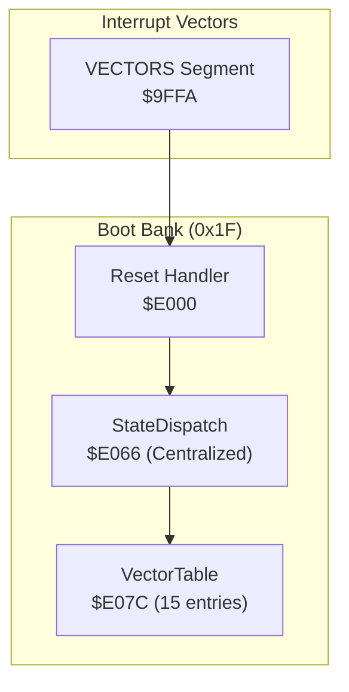
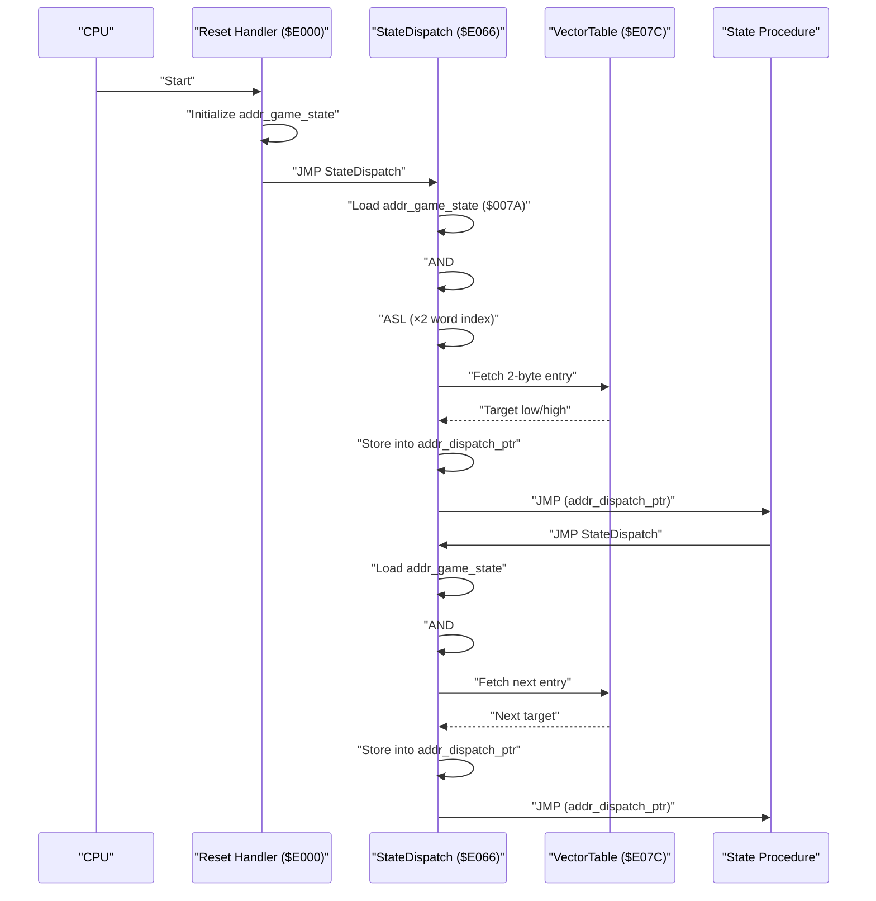
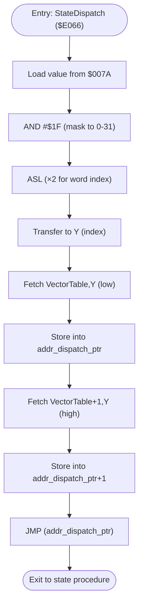
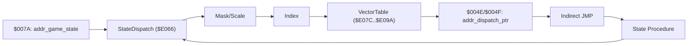

# Vector Dispatch Mechanism

<cite>
**Referenced Files in This Document**
- [PROJECT.md](file://PROJECT.md)
- [main.asm](file://asm/main.asm)
- [prg_1f.asm](file://asm/banks/prg_1f.asm)
</cite>

## Update Summary
**Changes Made**
- Updated to reflect the new centralized StateDispatch routine at $E066 that replaces previous inline dispatch logic
- Added comprehensive documentation of the centralized dispatch mechanism
- Enhanced vector table documentation with current implementation details
- Updated state selection algorithm explanation to reflect the new centralized approach
- Revised architectural diagrams to show the new StateDispatch pattern

## Table of Contents
1. [Introduction](#introduction)
2. [Project Structure](#project-structure)
3. [Core Components](#core-components)
4. [Architecture Overview](#architecture-overview)
5. [Detailed Component Analysis](#detailed-component-analysis)
6. [Dependency Analysis](#dependency-analysis)
7. [Performance Considerations](#performance-considerations)
8. [Troubleshooting Guide](#troubleshooting-guide)
9. [Conclusion](#conclusion)

## Introduction
This document explains the vector dispatch mechanism used by the game's state engine. The mechanism centers around a new centralized StateDispatch routine at $E066 that replaces previous inline dispatch logic, providing a consistent entry point for all state handlers. The system uses an interrupt vector table implementation located at $E07C, a state selection algorithm that masks and scales the game state counter, and an indirect jump mechanism that resolves each state to its dedicated procedure. The approach employs a compact 30-byte table with 15 entries, enabling efficient dispatch with minimal branching overhead on 6502 assembly.

## Project Structure
The vector dispatch mechanism resides in the boot bank (0x1F) mapped to $E000-$FFFF. The reset handler initializes the system and triggers the dispatch via a centralized StateDispatch routine. The main program entry and interrupt vectors are defined in the main assembly file, while the state machine and dispatch logic are implemented in the boot bank with a centralized dispatch approach.

**Diagram sources**
- [prg_1f.asm:142-156](file://asm/banks/prg_1f.asm#L142-L156)
- [prg_1f.asm:158-177](file://asm/banks/prg_1f.asm#L158-L177)
- [main.asm:133-141](file://asm/main.asm#L133-L141)

**Section sources**
- [PROJECT.md:100-117](file://PROJECT.md#L100-L117)
- [main.asm:133-141](file://asm/main.asm#L133-L141)
- [prg_1f.asm:142-156](file://asm/banks/prg_1f.asm#L142-L156)

## Core Components
- **Centralized StateDispatch routine** at $E066 that serves as the main dispatch target for all state handlers
- **Game state counter** at $007A holds the current major state index (0–14)
- **VectorTable** at $E07C is a 15-entry, 30-byte table of 2-byte addresses pointing to state procedures
- **Indirect jump mechanism** using a 2-byte pointer at $004E/$004F to resolve the target address
- **Consistent entry point pattern** where all state procedures end with `JMP StateDispatch`

Key memory and addressing constants:
- addr_game_state = $007A
- addr_dispatch_ptr = $004E
- addr_dispatch_ptr+1 = $004F
- VectorTable base = $E07C
- StateDispatch entry point = $E066

**Section sources**
- [prg_1f.asm:21](file://asm/banks/prg_1f.asm#L21-L25)
- [prg_1f.asm:142-156](file://asm/banks/prg_1f.asm#L142-L156)
- [prg_1f.asm:158-177](file://asm/banks/prg_1f.asm#L158-L177)

## Architecture Overview
The centralized dispatch pipeline operates as follows:
1. The reset handler initializes the system and sets the initial state
2. StateDispatch routine reads the current state from $007A
3. It applies AND #$1F to constrain the index to 0–31, then shifts left once (ASL) to multiply by 2 for a word index
4. The indexed 2-byte address is loaded from VectorTable into the indirect pointer at $004E/$004F
5. An indirect jump resolves to the state procedure, which executes until it calls StateDispatch again to transition to another state

**Diagram sources**
- [prg_1f.asm:142-156](file://asm/banks/prg_1f.asm#L142-L156)
- [prg_1f.asm:158-177](file://asm/banks/prg_1f.asm#L158-L177)

## Detailed Component Analysis

### Centralized StateDispatch Routine
The new centralized StateDispatch routine at $E066 provides a consistent entry point for all state handlers:
- **Single dispatch location** eliminates redundant inline dispatch logic
- **Standardized pattern** where all state procedures end with `JMP StateDispatch`
- **Efficient state transitions** through centralized index calculation and table lookup
- **Maintainable architecture** with clear separation between dispatch logic and state implementations

The routine performs:
1. Load current state from addr_game_state
2. Apply mask AND #$1F to constrain to 0–31
3. Arithmetic shift left (ASL) to multiply by 2 for word indexing
4. Use Y register as index into VectorTable
5. Load target address into addr_dispatch_ptr
6. Perform indirect jump to state procedure

**Section sources**
- [prg_1f.asm:142-156](file://asm/banks/prg_1f.asm#L142-L156)

### VectorTable Layout and Entries
- VectorTable spans $E07C to $E09A (15 entries × 2 bytes each = 30 bytes total)
- Each entry is a 2-byte address within bank 0x1F, pointing to a state procedure
- The table is indexed by the masked and scaled state value (0–14)
- **Centralized dispatch pattern** ensures all state procedures use the same dispatch mechanism

Example state-to-vector mapping (selected):
- Index 0 → State_SystemInit
- Index 1 → State_NewGameInit  
- Index 2 → State_RandomDisplay2A
- Index 3 → State_KingdomSelect
- Index 4 → State_RandomDisplay28
- Index 5 → State_DomesticAffairs
- Index 6 → State_RandomAdvance1
- Index 7 → State_BattlePhase
- Index 8 → State_RandomAdvance2
- Index 9 → State_TerritoryView
- Index 10 → State_IdleWait (shared)
- Index 11 → State_AdvisorCouncil
- Index 12 → State_IdleWait (shared)
- Index 13 → State_TurnSummary
- Index 14 → State_IdleWait (shared)

Notes:
- Some indices share the same target (indices 10, 12, and 14 all point to State_IdleWait)
- The table intentionally limits entries to 15 to fit within the 30-byte footprint
- **Centralized pattern** ensures consistent dispatch behavior across all states

**Section sources**
- [prg_1f.asm:158-177](file://asm/banks/prg_1f.asm#L158-L177)

### State Selection Algorithm
The centralized algorithm transforms the raw state counter into a table index:
- **Mask**: AND #$1F constrains the value to 0–31
- **Scale**: ASL multiplies by 2 to convert a byte index into a word index
- **Load**: Two fetches read the low and high bytes of the target address from VectorTable
- **Jump**: Store into addr_dispatch_ptr and perform an indirect JMP

**Diagram sources**
- [prg_1f.asm:142-156](file://asm/banks/prg_1f.asm#L142-L156)

**Section sources**
- [prg_1f.asm:142-156](file://asm/banks/prg_1f.asm#L142-L156)

### Indirect Jump Mechanism
- **addr_dispatch_ptr** is a 2-byte pointer used to store the resolved target address
- **Centralized pattern** ensures all state procedures use the same dispatch mechanism
- **Indirect addressing** allows state procedures to be relocated within bank 0x1F without changing dispatch logic
- **Consistent state transitions** through standardized `JMP StateDispatch` calls

**Diagram sources**
- [prg_1f.asm:142-156](file://asm/banks/prg_1f.asm#L142-L156)
- [prg_1f.asm:158-177](file://asm/banks/prg_1f.asm#L158-L177)

**Section sources**
- [prg_1f.asm:142-156](file://asm/banks/prg_1f.asm#L142-L156)

### Modular .proc Organization
Each state is implemented as a separate .proc block, enabling:
- **Clean separation** of concerns per state
- **Reusability** of the centralized StateDispatch routine
- **Straightforward linking** of state procedures to VectorTable entries
- **Consistent state transition** pattern through `JMP StateDispatch`

Examples of state procedures:
- State_SystemInit
- State_NewGameInit  
- State_RandomDisplay2A
- State_KingdomSelect
- State_RandomDisplay28
- State_DomesticAffairs
- State_RandomAdvance1
- State_BattlePhase
- State_RandomAdvance2
- State_TerritoryView
- State_IdleWait
- State_AdvisorCouncil
- State_TurnSummary

**Updated** All state procedures now consistently end with `JMP StateDispatch` for centralized dispatch

**Section sources**
- [prg_1f.asm:182-210](file://asm/banks/prg_1f.asm#L182-L210)
- [prg_1f.asm:218-284](file://asm/banks/prg_1f.asm#L218-L284)
- [prg_1f.asm:289-295](file://asm/banks/prg_1f.asm#L289-L295)
- [prg_1f.asm:303-373](file://asm/banks/prg_1f.asm#L303-L373)
- [prg_1f.asm:378-384](file://asm/banks/prg_1f.asm#L378-L384)
- [prg_1f.asm:391-440](file://asm/banks/prg_1f.asm#L391-L440)

### Supporting Sub-State Dispatch (NMI)
While not part of the main vector dispatch, the NMI handler demonstrates a similar technique for sub-states:
- Uses addr_sub_state AND #$0F to index a sub-dispatch table
- Performs a second level of indirection via NmiSubDispatchTable

This reinforces the pattern of masking, scaling, and indirect resolution for efficient branching.

**Section sources**
- [prg_1f.asm:2585-2594](file://asm/banks/prg_1f.asm#L2585-L2594)
- [prg_1f.asm:2596-2599](file://asm/banks/prg_1f.asm#L2596-L2599)

## Dependency Analysis
The centralized dispatch mechanism depends on:
- **addr_game_state** being properly maintained by each state procedure
- **VectorTable entries** remaining aligned with the intended state procedures  
- **addr_dispatch_ptr** being available in zero-page for fast indirect addressing
- **Consistent state transition pattern** through `JMP StateDispatch`

**Diagram sources**
- [prg_1f.asm:21](file://asm/banks/prg_1f.asm#L21-L25)
- [prg_1f.asm:142-156](file://asm/banks/prg_1f.asm#L142-L156)

**Section sources**
- [prg_1f.asm:21](file://asm/banks/prg_1f.asm#L21-L25)
- [prg_1f.asm:142-156](file://asm/banks/prg_1f.asm#L142-L156)

## Performance Considerations
- **Centralized dispatch optimization**: The StateDispatch routine eliminates redundant inline dispatch logic
- **The mask-and-scale approach** (AND #$1F, ASL) is optimal for 6502:
  - Single arithmetic operations per index calculation
  - No branches or conditionals in the hot path
- **Using a 2-byte pointer** for indirect jumps avoids extra addressing modes and keeps the instruction stream tight
- **The 30-byte table** fits within a single page-aligned region, minimizing fetch latency
- **Modular .proc blocks** reduce code duplication and improve maintainability without impacting runtime cost
- **Consistent state transition pattern** reduces branching overhead through centralized dispatch

## Troubleshooting Guide
Common issues and checks:
- **Incorrect state transitions**:
  - Verify addr_game_state is incremented or set correctly before calling StateDispatch
  - Confirm VectorTable entries match the intended procedures
  - Ensure all state procedures end with `JMP StateDispatch`
- **Stuck in idle or unexpected state**:
  - Ensure states do not skip calling StateDispatch after transitions
  - Check for accidental writes to addr_game_state outside the expected flow
- **Indirect jump failures**:
  - Confirm addr_dispatch_ptr is writable and not clobbered by other routines
  - Validate that VectorTable addresses reside within bank 0x1F
- **Centralized dispatch issues**:
  - Verify StateDispatch routine is properly located at $E066
  - Check that all state procedures follow the centralized dispatch pattern

**Section sources**
- [prg_1f.asm:142-156](file://asm/banks/prg_1f.asm#L142-L156)
- [prg_1f.asm:182-210](file://asm/banks/prg_1f.asm#L182-L210)
- [prg_1f.asm:218-284](file://asm/banks/prg_1f.asm#L218-L284)

## Conclusion
The centralized vector dispatch mechanism leverages a compact, predictable table and simple arithmetic to achieve efficient state branching on 6502. By implementing StateDispatch at $E066 and replacing previous inline dispatch logic, the design provides a consistent entry point for all state handlers while minimizing branching overhead. The centralized approach maintains clean, modular state logic while supporting both direct execution and seamless transitions through the standardized dispatch pattern. This architecture forms the backbone of the game's state engine with improved maintainability and performance.