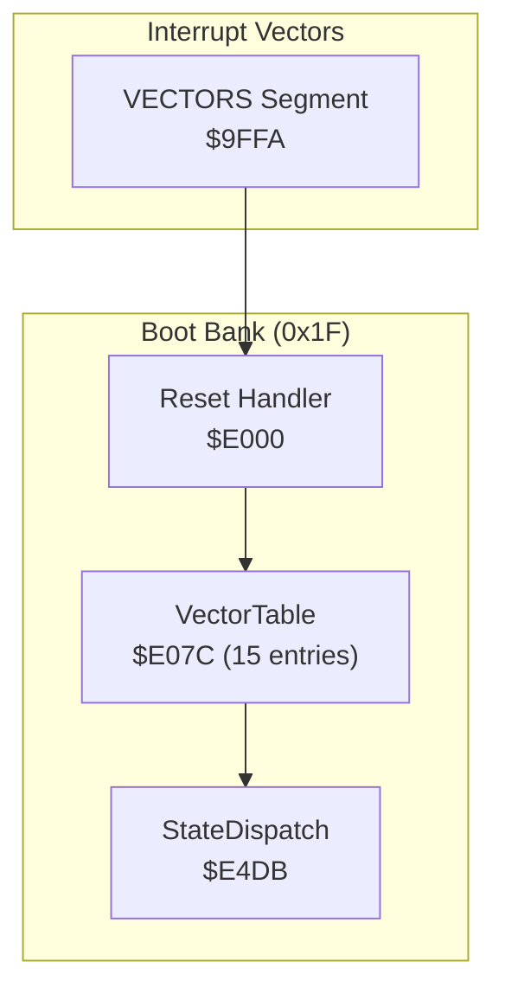
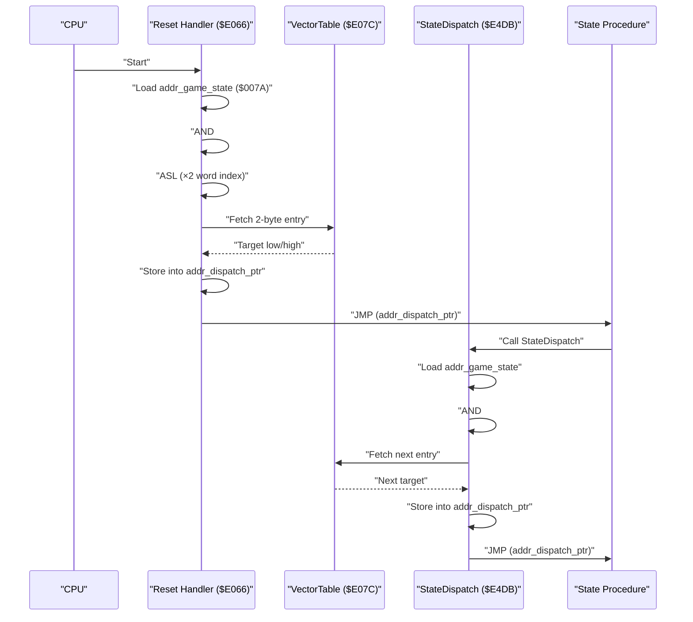
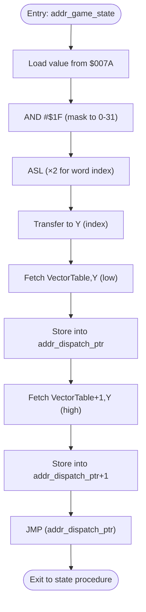
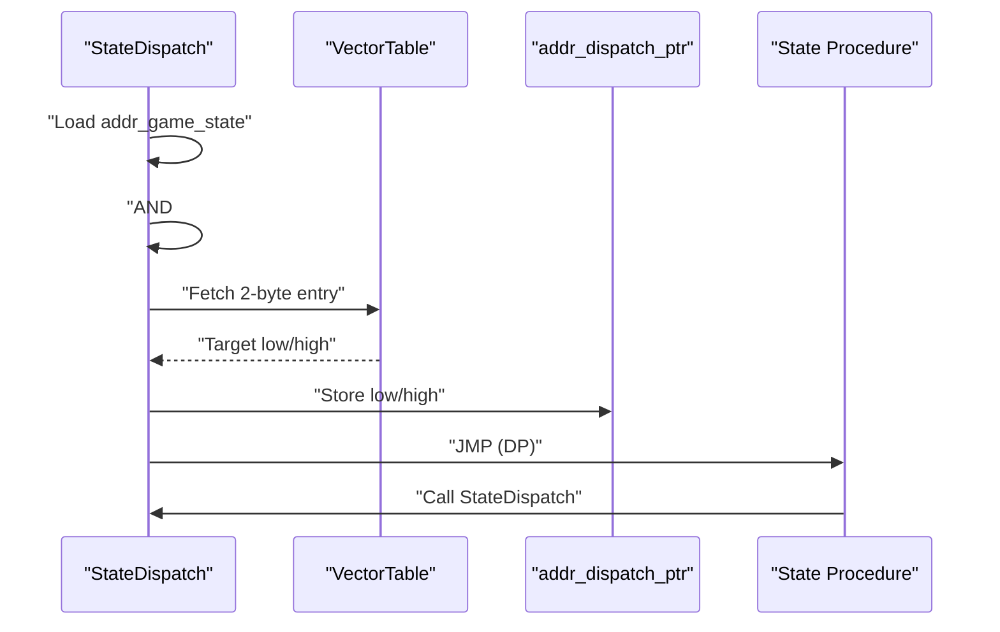
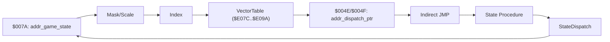

# Vector Dispatch Mechanism

<cite>
**Referenced Files in This Document**
- [PROJECT.md](file://PROJECT.md)
- [main.asm](file://asm/main.asm)
- [prg_1f.asm](file://asm/banks/prg_1f.asm)
</cite>

## Table of Contents
1. [Introduction](#introduction)
2. [Project Structure](#project-structure)
3. [Core Components](#core-components)
4. [Architecture Overview](#architecture-overview)
5. [Detailed Component Analysis](#detailed-component-analysis)
6. [Dependency Analysis](#dependency-analysis)
7. [Performance Considerations](#performance-considerations)
8. [Troubleshooting Guide](#troubleshooting-guide)
9. [Conclusion](#conclusion)

## Introduction
This document explains the vector dispatch mechanism used by the game’s state engine. It focuses on the interrupt vector table implementation located at $E07C, the state selection algorithm that masks and scales the game state counter, and the indirect jump mechanism that resolves each state to its dedicated procedure. The approach uses a compact 30-byte table with 15 entries, enabling efficient dispatch with minimal branching overhead on 6502 assembly.

## Project Structure
The vector dispatch resides in the boot bank (0x1F) mapped to $E000-$FFFF. The reset handler initializes the system and triggers the dispatch via a vector table. The main program entry and interrupt vectors are defined in the main assembly file, while the state machine and dispatch logic are implemented in the boot bank.

**Diagram sources**
- [prg_1f.asm:130-148](file://asm/banks/prg_1f.asm#L130-L148)
- [prg_1f.asm:150-169](file://asm/banks/prg_1f.asm#L150-L169)
- [prg_1f.asm:738-749](file://asm/banks/prg_1f.asm#L738-L749)
- [main.asm:133-141](file://asm/main.asm#L133-L141)

**Section sources**
- [PROJECT.md:100-117](file://PROJECT.md#L100-L117)
- [main.asm:133-141](file://asm/main.asm#L133-L141)
- [prg_1f.asm:130-148](file://asm/banks/prg_1f.asm#L130-L148)

## Core Components
- Game state counter at $007A holds the current major state index (0–14).
- VectorTable at $E07C is a 15-entry, 30-byte table of 2-byte addresses pointing to state procedures.
- StateDispatch routine performs the mask-and-scale operation and indirect jump to the selected state.
- The indirect jump uses a 2-byte pointer at $004E/$004F to resolve the target address.

Key memory and addressing constants:
- addr_game_state = $007A
- addr_dispatch_ptr = $004E
- addr_dispatch_ptr+1 = $004F
- VectorTable base = $E07C

**Section sources**
- [prg_1f.asm:21](file://asm/banks/prg_1f.asm#L21)
- [prg_1f.asm:23-24](file://asm/banks/prg_1f.asm#L23-L24)
- [prg_1f.asm:150-169](file://asm/banks/prg_1f.asm#L150-L169)
- [prg_1f.asm:738-749](file://asm/banks/prg_1f.asm#L738-L749)

## Architecture Overview
The dispatch pipeline operates as follows:
1. The reset handler reads the current state from $007A.
2. It applies AND #$1F to constrain the index to 0–31, then shifts left once (ASL) to multiply by 2 for a word index.
3. The indexed 2-byte address is loaded from VectorTable into the indirect pointer at $004E/$004F.
4. An indirect jump resolves to the state procedure, which executes until it calls StateDispatch again to transition to another state.

**Diagram sources**
- [prg_1f.asm:138-147](file://asm/banks/prg_1f.asm#L138-L147)
- [prg_1f.asm:740-749](file://asm/banks/prg_1f.asm#L740-L749)
- [prg_1f.asm:150-169](file://asm/banks/prg_1f.asm#L150-L169)

## Detailed Component Analysis

### VectorTable Layout and Entries
- VectorTable spans $E07C to $E09A (15 entries × 2 bytes each = 30 bytes total).
- Each entry is a 2-byte address within bank 0x1F, pointing to a state procedure.
- The table is indexed by the masked and scaled state value (0–14).

Example state-to-vector mapping (selected):
- Index 0 → State_SystemInit
- Index 1 → State_NewGameInit
- Index 3 → State_KingdomSelect
- Index 9 → State_TerritoryView
- Index 10 → State_IdleWait (shared)
- Index 13 → State_TurnSummary
- Index 14 → State_IdleWait (shared)

Notes:
- Some indices share the same target (e.g., 10 and 14 both point to State_IdleWait).
- The table intentionally limits entries to 15 to fit within the 30-byte footprint.

**Section sources**
- [prg_1f.asm:150-169](file://asm/banks/prg_1f.asm#L150-L169)

### State Selection Algorithm
The algorithm transforms the raw state counter into a table index:
- Mask: AND #$1F constrains the value to 0–31.
- Scale: ASL multiplies by 2 to convert a byte index into a word index.
- Load: Two fetches read the low and high bytes of the target address from VectorTable.
- Jump: Store into addr_dispatch_ptr and perform an indirect JMP.

**Diagram sources**
- [prg_1f.asm:138-147](file://asm/banks/prg_1f.asm#L138-L147)
- [prg_1f.asm:740-749](file://asm/banks/prg_1f.asm#L740-L749)

**Section sources**
- [prg_1f.asm:138-147](file://asm/banks/prg_1f.asm#L138-L147)
- [prg_1f.asm:740-749](file://asm/banks/prg_1f.asm#L740-L749)

### Indirect Jump Mechanism
- addr_dispatch_ptr is a 2-byte pointer used to store the resolved target address.
- The indirect jump pattern ensures the state procedure can be relocated within bank 0x1F without changing the dispatch logic.
- After executing, each state procedure calls StateDispatch to compute the next state and continue the loop.

**Diagram sources**
- [prg_1f.asm:740-749](file://asm/banks/prg_1f.asm#L740-L749)
- [prg_1f.asm:150-169](file://asm/banks/prg_1f.asm#L150-L169)

**Section sources**
- [prg_1f.asm:740-749](file://asm/banks/prg_1f.asm#L740-L749)

### Modular .proc Organization
Each state is implemented as a separate .proc block, enabling:
- Clean separation of concerns per state.
- Reusability of the shared StateDispatch routine.
- Straightforward linking of state procedures to VectorTable entries.

Examples of state procedures:
- State_SystemInit
- State_NewGameInit
- State_KingdomSelect
- State_TerritoryView
- State_IdleWait
- State_TurnSummary

Transitions:
- States typically increment addr_game_state and then call StateDispatch to branch to the next state.
- Some states reuse State_IdleWait for idle periods.

**Section sources**
- [prg_1f.asm:174-202](file://asm/banks/prg_1f.asm#L174-L202)
- [prg_1f.asm:210-276](file://asm/banks/prg_1f.asm#L210-L276)
- [prg_1f.asm:295-349](file://asm/banks/prg_1f.asm#L295-L349)
- [prg_1f.asm:575-619](file://asm/banks/prg_1f.asm#L575-L619)
- [prg_1f.asm:624-625](file://asm/banks/prg_1f.asm#L624-L625)
- [prg_1f.asm:686-735](file://asm/banks/prg_1f.asm#L686-L735)

### Supporting Sub-State Dispatch (NMI)
While not part of the main vector dispatch, the NMI handler demonstrates a similar technique for sub-states:
- Uses addr_sub_state AND #$0F to index a sub-dispatch table.
- Performs a second level of indirection via NmiSubDispatchTable.

This reinforces the pattern of masking, scaling, and indirect resolution for efficient branching.

**Section sources**
- [prg_1f.asm:2585-2594](file://asm/banks/prg_1f.asm#L2585-L2594)
- [prg_1f.asm:2596-2599](file://asm/banks/prg_1f.asm#L2596-L2599)

## Dependency Analysis
The dispatch mechanism depends on:
- addr_game_state being properly maintained by each state procedure.
- VectorTable entries remaining aligned with the intended state procedures.
- addr_dispatch_ptr being available in zero-page for fast indirect addressing.

**Diagram sources**
- [prg_1f.asm:21](file://asm/banks/prg_1f.asm#L21)
- [prg_1f.asm:138-147](file://asm/banks/prg_1f.asm#L138-L147)
- [prg_1f.asm:740-749](file://asm/banks/prg_1f.asm#L740-L749)

**Section sources**
- [prg_1f.asm:21](file://asm/banks/prg_1f.asm#L21)
- [prg_1f.asm:138-147](file://asm/banks/prg_1f.asm#L138-L147)
- [prg_1f.asm:740-749](file://asm/banks/prg_1f.asm#L740-L749)

## Performance Considerations
- The mask-and-scale approach (AND #$1F, ASL) is optimal for 6502:
  - Single arithmetic operations per index calculation.
  - No branches or conditionals in the hot path.
- Using a 2-byte pointer for indirect jumps avoids extra addressing modes and keeps the instruction stream tight.
- The 30-byte table fits within a single page-aligned region, minimizing fetch latency.
- Modular .proc blocks reduce code duplication and improve maintainability without impacting runtime cost.

[No sources needed since this section provides general guidance]

## Troubleshooting Guide
Common issues and checks:
- Incorrect state transitions:
  - Verify addr_game_state is incremented or set correctly before calling StateDispatch.
  - Confirm VectorTable entries match the intended procedures.
- Stuck in idle or unexpected state:
  - Ensure states do not skip calling StateDispatch after transitions.
  - Check for accidental writes to addr_game_state outside the expected flow.
- Indirect jump failures:
  - Confirm addr_dispatch_ptr is writable and not clobbered by other routines.
  - Validate that VectorTable addresses reside within bank 0x1F.

**Section sources**
- [prg_1f.asm:740-749](file://asm/banks/prg_1f.asm#L740-L749)
- [prg_1f.asm:199-201](file://asm/banks/prg_1f.asm#L199-L201)
- [prg_1f.asm:269-275](file://asm/banks/prg_1f.asm#L269-L275)

## Conclusion
The vector dispatch mechanism leverages a compact, predictable table and simple arithmetic to achieve efficient state branching on 6502. By masking and scaling the state counter and resolving targets via an indirect pointer, the design minimizes branching overhead while maintaining clean, modular state logic. This approach supports both direct execution and seamless transitions, forming the backbone of the game’s state engine.