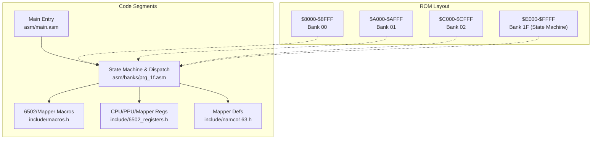
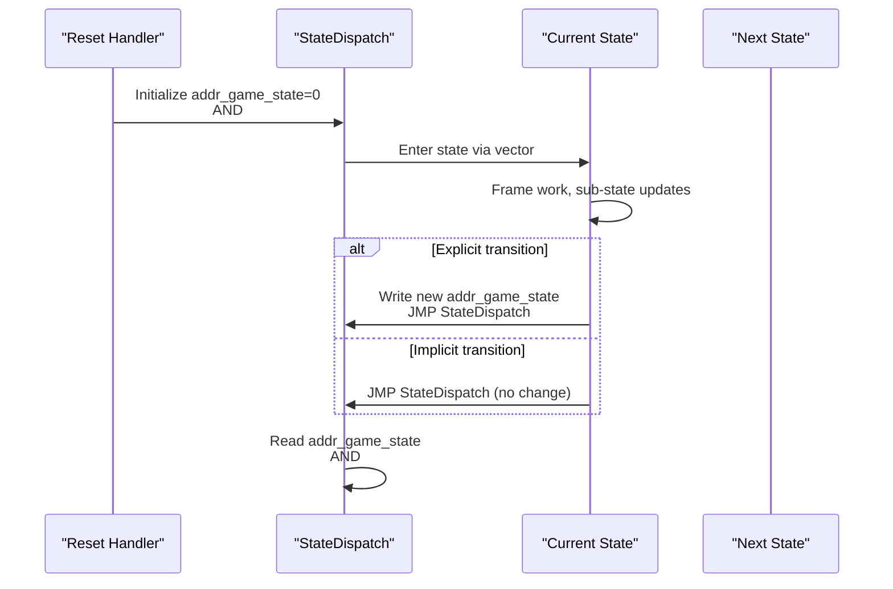
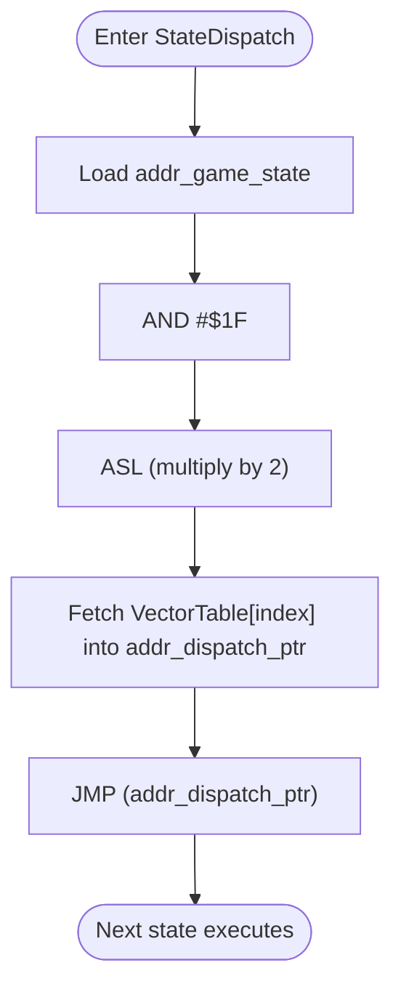
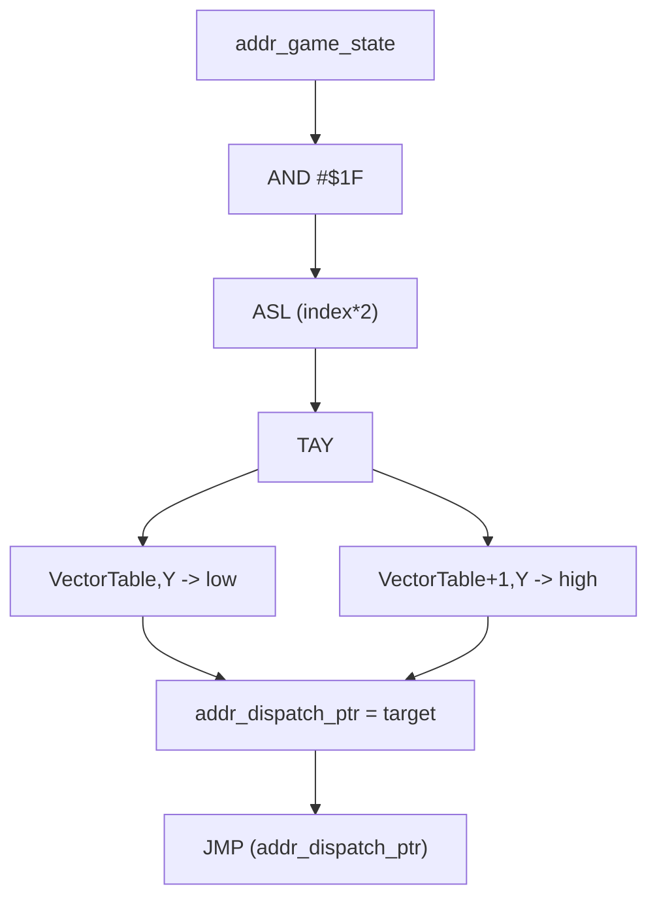
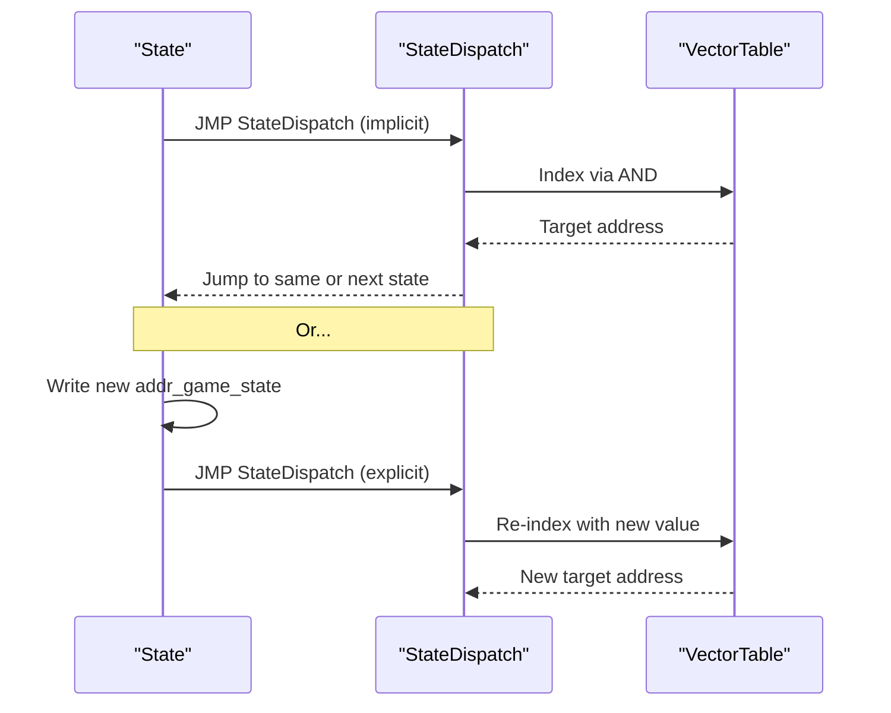
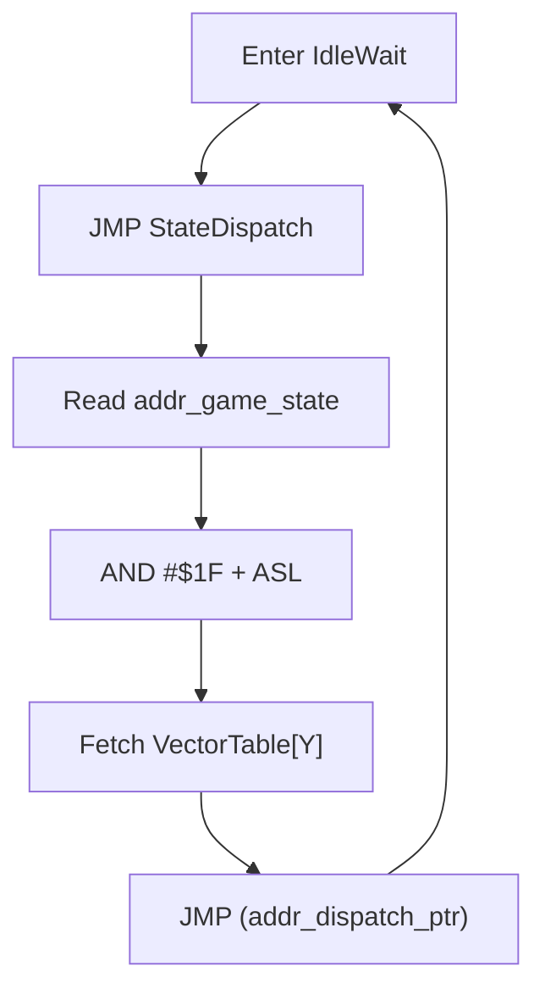
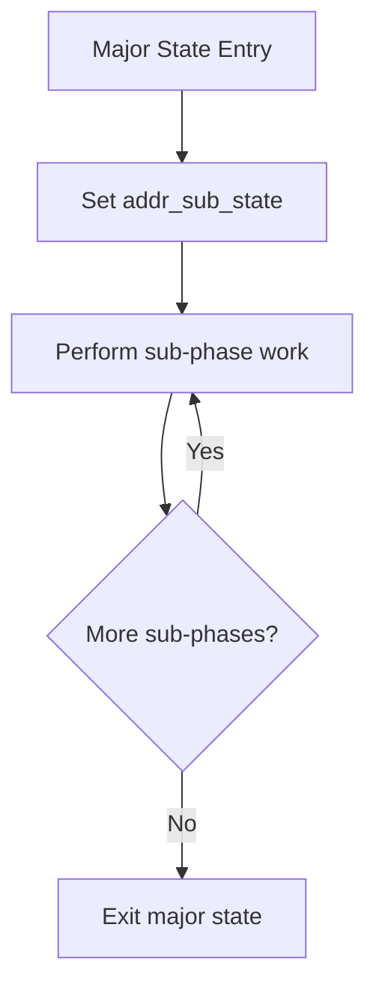
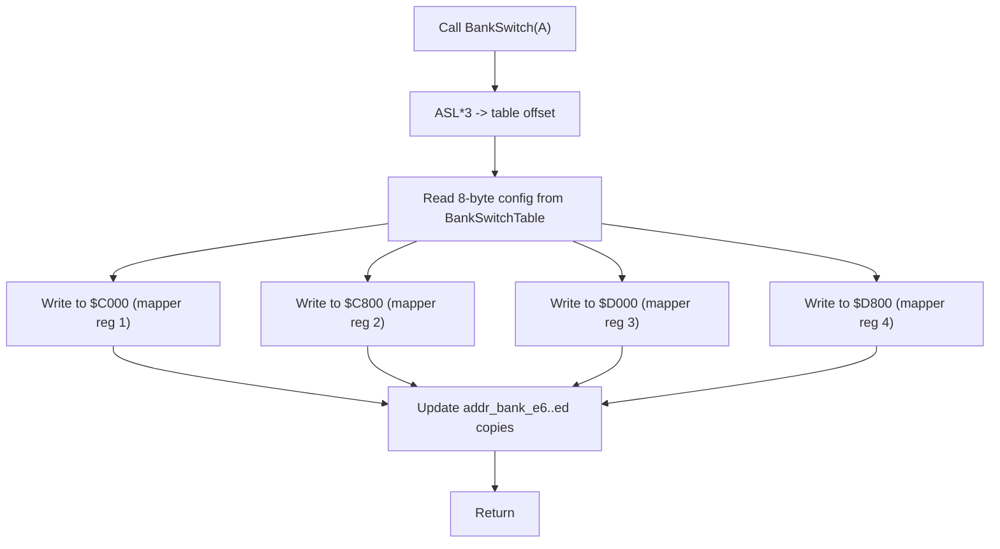
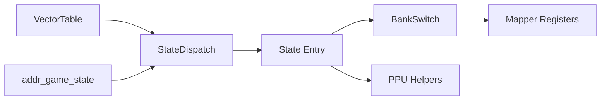

# State Transition Mechanisms

<cite>
**Referenced Files in This Document**
- [main.asm](file://asm/main.asm)
- [prg_1f.asm](file://asm/banks/prg_1f.asm)
- [all_banks.asm](file://asm/banks/all_banks.asm)
- [namco163.h](file://include/namco163.h)
- [6502_registers.h](file://include/6502_registers.h)
- [macros.h](file://include/macros.h)
</cite>

## Table of Contents
1. [Introduction](#introduction)
2. [Project Structure](#project-structure)
3. [Core Components](#core-components)
4. [Architecture Overview](#architecture-overview)
5. [Detailed Component Analysis](#detailed-component-analysis)
6. [Dependency Analysis](#dependency-analysis)
7. [Performance Considerations](#performance-considerations)
8. [Troubleshooting Guide](#troubleshooting-guide)
9. [Conclusion](#conclusion)

## Introduction
This document explains the state transition mechanisms and control flow management in the disassembly. It focuses on how the game state counter increments to move to the next phase, how the StateDispatch loop maintains continuous execution, and how certain states like IdleWait provide pause functionality. It also documents the relationship between addr_game_state and the vector table indexing, showing how the AND #$1F operation ensures proper bounds checking, and how sub-states ($0078) provide finer control within major states. Finally, it covers bank switching coordination during state transitions and how different states utilize different memory banks, and it details the StateDispatch procedure that keeps the execution loop running.

## Project Structure
The state machine resides primarily in bank 1F ($E000–$FFFF), with supporting utilities and bank switching macros in shared header files. The main entry point initializes hardware and branches into the state machine. The bank stubs include all PRG banks for completeness.

**Diagram sources**
- [main.asm:124-141](file://asm/main.asm#L124-L141)
- [prg_1f.asm:1-8](file://asm/banks/prg_1f.asm#L1-L8)
- [all_banks.asm:1-38](file://asm/banks/all_banks.asm#L1-L38)
- [namco163.h:10-14](file://include/namco163.h#L10-L14)
- [6502_registers.h:40-51](file://include/6502_registers.h#L40-L51)

**Section sources**
- [main.asm:124-141](file://asm/main.asm#L124-L141)
- [prg_1f.asm:1-8](file://asm/banks/prg_1f.asm#L1-L8)
- [all_banks.asm:1-38](file://asm/banks/all_banks.asm#L1-L38)
- [namco163.h:10-14](file://include/namco163.h#L10-L14)
- [6502_registers.h:40-51](file://include/6502_registers.h#L40-L51)

## Core Components
- addr_game_state ($007A): Major state counter (0–14) that indexes the vector table.
- VectorTable: Dispatch table of 15 entries (30 bytes) mapping state indices to state entry points.
- StateDispatch: Central dispatch routine that re-indexes addr_game_state and jumps to the current state.
- addr_sub_state ($0078): Minor sub-state used for fine-grained control within major states.
- BankSwitch: Writes 8-byte configurations to PRG bank registers via mapper, coordinating memory access across states.
- IdleWait: A reusable state that simply returns to StateDispatch, providing pause functionality.

Key behaviors:
- Explicit state changes: States write new major state values to addr_game_state (e.g., INC addr_game_state).
- Implicit transitions: StateDispatch reads addr_game_state, masks it to 0–31, computes a word index, fetches the target, and jumps to it.
- Bounds checking: AND #$1F ensures the index stays within the 15-entry table, preventing out-of-range access.
- Pause mechanism: IdleWait performs a tail-call to StateDispatch, effectively pausing until addr_game_state advances.

**Section sources**
- [prg_1f.asm:21-25](file://asm/banks/prg_1f.asm#L21-L25)
- [prg_1f.asm:153-168](file://asm/banks/prg_1f.asm#L153-L168)
- [prg_1f.asm:740-749](file://asm/banks/prg_1f.asm#L740-L749)
- [prg_1f.asm:624-625](file://asm/banks/prg_1f.asm#L624-L625)

## Architecture Overview
The state machine uses a central vector table indexed by addr_game_state. Each state performs per-frame work, updates global state variables, and either:
- Explicitly advance to the next state by writing to addr_game_state, or
- Return to StateDispatch to remain in the current state (e.g., IdleWait).

**Diagram sources**
- [prg_1f.asm:138-147](file://asm/banks/prg_1f.asm#L138-L147)
- [prg_1f.asm:740-749](file://asm/banks/prg_1f.asm#L740-L749)

**Section sources**
- [prg_1f.asm:138-147](file://asm/banks/prg_1f.asm#L138-L147)
- [prg_1f.asm:740-749](file://asm/banks/prg_1f.asm#L740-L749)

## Detailed Component Analysis

### StateDispatch Procedure
StateDispatch is the central loop that:
- Loads addr_game_state.
- Masks to 0–31 with AND #$1F.
- Multiplies index by 2 (ASL) to convert byte index to word index.
- Uses the result as an offset into VectorTable to load the next state’s entry point into addr_dispatch_ptr.
- Jumps to that address.

This ensures continuous execution and robust bounds checking.

**Diagram sources**
- [prg_1f.asm:740-749](file://asm/banks/prg_1f.asm#L740-L749)

**Section sources**
- [prg_1f.asm:740-749](file://asm/banks/prg_1f.asm#L740-L749)

### Vector Table Indexing and Bounds Checking
VectorTable contains 15 entries. The indexing logic:
- addr_game_state AND #$1F constrains the index to 0–31.
- ASL converts the byte index to a word index (times 2).
- TAY sets up the zero-page Y index for indirect loads.
- VectorTable,Y and VectorTable+1,Y fetch the low and high bytes of the target address.

This guarantees that even if addr_game_state exceeds 14, the mask keeps the effective index within bounds.

**Diagram sources**
- [prg_1f.asm:138-147](file://asm/banks/prg_1f.asm#L138-L147)
- [prg_1f.asm:740-749](file://asm/banks/prg_1f.asm#L740-L749)

**Section sources**
- [prg_1f.asm:138-147](file://asm/banks/prg_1f.asm#L138-L147)
- [prg_1f.asm:740-749](file://asm/banks/prg_1f.asm#L740-L749)

### Explicit vs Implicit Transitions
- Explicit transitions: States write a new value to addr_game_state (e.g., INC addr_game_state) and then call StateDispatch to re-enter the loop.
  - Example: State_NewGameInit writes next state, then JMP StateDispatch.
  - Example: State_KingdomSelect increments after finishing setup.
- Implicit transitions: States call StateDispatch without changing addr_game_state, allowing the same state to continue.

**Diagram sources**
- [prg_1f.asm:270](file://asm/banks/prg_1f.asm#L270)
- [prg_1f.asm:359](file://asm/banks/prg_1f.asm#L359)
- [prg_1f.asm:740-749](file://asm/banks/prg_1f.asm#L740-L749)

**Section sources**
- [prg_1f.asm:270](file://asm/banks/prg_1f.asm#L270)
- [prg_1f.asm:359](file://asm/banks/prg_1f.asm#L359)
- [prg_1f.asm:740-749](file://asm/banks/prg_1f.asm#L740-L749)

### IdleWait Pause Mechanism
IdleWait simply returns to StateDispatch, enabling a “pause” state. Since StateDispatch re-reads addr_game_state, the game remains in IdleWait until another state writes a new value to addr_game_state.

**Diagram sources**
- [prg_1f.asm:624-625](file://asm/banks/prg_1f.asm#L624-L625)
- [prg_1f.asm:740-749](file://asm/banks/prg_1f.asm#L740-L749)

**Section sources**
- [prg_1f.asm:624-625](file://asm/banks/prg_1f.asm#L624-L625)
- [prg_1f.asm:740-749](file://asm/banks/prg_1f.asm#L740-L749)

### Sub-State System ($0078)
Sub-states provide finer control within major states:
- States set addr_sub_state near the start of their logic to indicate sub-phases.
- Examples:
  - State_NewGameInit sets sub-state 2 early to prepare display buffers.
  - State_KingdomSelect sets sub-state 3 for kingdom selection logic.
  - State_DomesticAffairs sets sub-state 4 for domestic actions.
  - State_TerritoryView sets sub-state 6 for map rendering.
  - State_AdvisorCouncil sets sub-state 7 for advisor interactions.
  - State_TurnSummary sets sub-state 8 for turn reports.

This allows states to break down complex logic into manageable sub-phases while still sharing the same major state index.

**Diagram sources**
- [prg_1f.asm:213](file://asm/banks/prg_1f.asm#L213)
- [prg_1f.asm:306](file://asm/banks/prg_1f.asm#L306)
- [prg_1f.asm:390](file://asm/banks/prg_1f.asm#L390)
- [prg_1f.asm:578](file://asm/banks/prg_1f.asm#L578)
- [prg_1f.asm:633](file://asm/banks/prg_1f.asm#L633)
- [prg_1f.asm:691](file://asm/banks/prg_1f.asm#L691)

**Section sources**
- [prg_1f.asm:213](file://asm/banks/prg_1f.asm#L213)
- [prg_1f.asm:306](file://asm/banks/prg_1f.asm#L306)
- [prg_1f.asm:390](file://asm/banks/prg_1f.asm#L390)
- [prg_1f.asm:578](file://asm/banks/prg_1f.asm#L578)
- [prg_1f.asm:633](file://asm/banks/prg_1f.asm#L633)
- [prg_1f.asm:691](file://asm/banks/prg_1f.asm#L691)

### Bank Switching Coordination During Transitions
States often need to access functions and data located in different PRG banks. The BankSwitch routine coordinates this:
- Accepts a configuration index in A.
- Computes an 8-byte table offset (ASL three times).
- Writes 4 PRG bank register values to $C000–$D800 via the mapper.
- Also updates internal bank register copies at $00E6–$00ED for later reads.

States commonly call BankSwitch before invoking banked routines or when transitioning to a new major state that requires different bank layouts.

**Diagram sources**
- [prg_1f.asm:785-817](file://asm/banks/prg_1f.asm#L785-L817)
- [prg_1f.asm:824-827](file://asm/banks/prg_1f.asm#L824-L827)

**Section sources**
- [prg_1f.asm:785-817](file://asm/banks/prg_1f.asm#L785-L817)
- [prg_1f.asm:824-827](file://asm/banks/prg_1f.asm#L824-L827)

### State Examples and Transitions
- State_SystemInit: Initializes PPU/mapper, sets next state to 9, then jumps to StateDispatch.
- State_NewGameInit: Prepares display buffers, optionally toggles SRAM flags, selects music, enables rendering, then increments addr_game_state and jumps to StateDispatch.
- State_KingdomSelect: Handles kingdom selection logic, sets palette and flags, increments state, and jumps to StateDispatch.
- State_DomesticAffairs: Renders domestic actions, updates sprite positions, increments state, and jumps to StateDispatch.
- State_BattlePhase: Renders battle displays, checks army flags, updates palette, increments state, and jumps to StateDispatch.
- State_TerritoryView: Renders map view, updates palette, increments state, and jumps to StateDispatch.
- State_AdvisorCouncil: Renders advisor dialogues, updates palette, increments state, and jumps to StateDispatch.
- State_TurnSummary: Renders turn report, selects music based on completion flag, increments state, and jumps to StateDispatch.

These examples demonstrate both explicit state changes (INC addr_game_state) and implicit transitions (JMP StateDispatch).

**Section sources**
- [prg_1f.asm:174-202](file://asm/banks/prg_1f.asm#L174-L202)
- [prg_1f.asm:210-276](file://asm/banks/prg_1f.asm#L210-L276)
- [prg_1f.asm:295-365](file://asm/banks/prg_1f.asm#L295-L365)
- [prg_1f.asm:383-433](file://asm/banks/prg_1f.asm#L383-L433)
- [prg_1f.asm:493-550](file://asm/banks/prg_1f.asm#L493-L550)
- [prg_1f.asm:575-619](file://asm/banks/prg_1f.asm#L575-L619)
- [prg_1f.asm:630-680](file://asm/banks/prg_1f.asm#L630-L680)
- [prg_1f.asm:686-735](file://asm/banks/prg_1f.asm#L686-L735)

## Dependency Analysis
The state machine depends on:
- VectorTable for dispatch indexing.
- StateDispatch for continuous loop maintenance.
- BankSwitch for accessing banked routines/data.
- Mapper registers for PRG bank configuration.
- PPU registers for rendering control helpers.

**Diagram sources**
- [prg_1f.asm:153-168](file://asm/banks/prg_1f.asm#L153-L168)
- [prg_1f.asm:740-749](file://asm/banks/prg_1f.asm#L740-L749)
- [prg_1f.asm:785-817](file://asm/banks/prg_1f.asm#L785-L817)
- [namco163.h:10-14](file://include/namco163.h#L10-L14)

**Section sources**
- [prg_1f.asm:153-168](file://asm/banks/prg_1f.asm#L153-L168)
- [prg_1f.asm:740-749](file://asm/banks/prg_1f.asm#L740-L749)
- [prg_1f.asm:785-817](file://asm/banks/prg_1f.asm#L785-L817)
- [namco163.h:10-14](file://include/namco163.h#L10-L14)

## Performance Considerations
- Vector indexing uses minimal arithmetic (AND + ASL) for fast dispatch.
- BankSwitch writes are constant-time and occur only when needed.
- IdleWait avoids heavy work by delegating to StateDispatch, reducing unnecessary computations.
- Using sub-states prevents redundant initialization and improves modularity.

## Troubleshooting Guide
Common issues and remedies:
- Out-of-bounds state: Verify addr_game_state masking via AND #$1F. If a state writes values beyond 14, the mask will wrap within 0–31, potentially jumping to an unintended entry.
- Stuck in IdleWait: Ensure a state increments addr_game_state before returning to StateDispatch.
- Incorrect bank access: Confirm BankSwitch is called with the correct configuration index before invoking banked routines.
- Rendering glitches: Review PPU helpers (mask/ctrl) and palette uploads around state transitions.

**Section sources**
- [prg_1f.asm:138-147](file://asm/banks/prg_1f.asm#L138-L147)
- [prg_1f.asm:624-625](file://asm/banks/prg_1f.asm#L624-L625)
- [prg_1f.asm:785-817](file://asm/banks/prg_1f.asm#L785-L817)
- [prg_1f.asm:1090-1113](file://asm/banks/prg_1f.asm#L1090-L1113)
- [prg_1f.asm:1071-1085](file://asm/banks/prg_1f.asm#L1071-L1085)

## Conclusion
The state transition mechanism relies on a clean separation between state logic and dispatch mechanics. addr_game_state drives the major state, VectorTable provides indexed dispatch, and StateDispatch maintains the execution loop. Sub-states refine control within states, while BankSwitch coordinates memory access across banks. IdleWait offers a simple pause by returning to StateDispatch. Together, these patterns yield a robust, maintainable state machine suitable for the game’s progression.