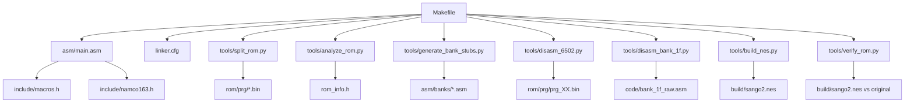

# Getting Started Guide

<cite>
**Referenced Files in This Document**
- [PROJECT.md](file://PROJECT.md)
- [Makefile](file://Makefile)
- [linker.cfg](file://linker.cfg)
- [asm/main.asm](file://asm/main.asm)
- [include/macros.h](file://include/macros.h)
- [include/namco163.h](file://include/namco163.h)
- [tools/split_rom.py](file://tools/split_rom.py)
- [tools/analyze_rom.py](file://tools/analyze_rom.py)
- [tools/generate_bank_stubs.py](file://tools/generate_bank_stubs.py)
- [tools/disasm_6502.py](file://tools/disasm_6502.py)
- [tools/disasm_bank_1f.py](file://tools/disasm_bank_1f.py)
- [tools/build_nes.py](file://tools/build_nes.py)
- [tools/verify_rom.py](file://tools/verify_rom.py)
</cite>

## Table of Contents
1. [Introduction](#introduction)
2. [Prerequisites](#prerequisites)
3. [Installation](#installation)
4. [Initial Setup](#initial-setup)
5. [Workflow Progression](#workflow-progression)
6. [Project Structure Overview](#project-structure-overview)
7. [Step-by-Step Commands](#step-by-step-commands)
8. [Common Issues and Solutions](#common-issues-and-solutions)
9. [Verification Examples](#verification-examples)
10. [Troubleshooting Guide](#troubleshooting-guide)
11. [Conclusion](#conclusion)

## Introduction
This guide helps new contributors quickly set up and begin working with the sango2dasm project. It focuses on preparing your environment, understanding the ROM structure, and following a practical workflow from ROM analysis to disassembly to verification. The project targets the Namco-163 (Mapper 19) game Sangokushi 2 - Haou no Tairiku (J), with a 32-bank PRG ROM and 256KB of PRG/CHR data.

## Prerequisites
Before starting, ensure you understand:
- 6502 assembly basics: addressing modes, instructions, interrupts, and memory layout
- NES hardware: PPU/APU registers, memory map, and bank switching concepts
- Familiarity with the cc65 toolchain (ca65 assembler and ld65 linker)
- Python 3.x for the analysis and build scripts

These topics are foundational for navigating the project’s assembly, linker configuration, and analysis tools.

**Section sources**
- [PROJECT.md:49-57](file://PROJECT.md#L49-L57)
- [PROJECT.md:70-83](file://PROJECT.md#L70-L83)

## Installation
Install the cc65 toolchain and configure your environment:

1. Install cc65 (ca65, ld65) from source to a local directory (e.g., ~/.local/)
2. Add the cc65 bin directory to your PATH so make can find ca65 and ld65
3. Ensure Python 3 is installed for running the analysis and build scripts

Verification:
- Confirm ca65 and ld65 are available in your PATH
- Confirm Python 3 is available

**Section sources**
- [PROJECT.md:49-57](file://PROJECT.md#L49-L57)
- [Makefile:4-10](file://Makefile#L4-L10)

## Initial Setup
Prepare the project for development:

1. Obtain the original ROM file and place it at the project root (named as indicated in the project documentation)
2. Prepare the ROM dump directories and bank files using the provided scripts
3. Generate bank stubs for all 32 PRG banks
4. Analyze the ROM to identify key banks and entry points

**Section sources**
- [PROJECT.md:18](file://PROJECT.md#L18)
- [PROJECT.md:63-67](file://PROJECT.md#L63-L67)
- [tools/split_rom.py:38-122](file://tools/split_rom.py#L38-L122)
- [tools/generate_bank_stubs.py:12-46](file://tools/generate_bank_stubs.py#L12-L46)
- [tools/analyze_rom.py:10-128](file://tools/analyze_rom.py#L10-L128)

## Workflow Progression
Follow this recommended workflow to make steady progress:

1. Start with Bank 0x1F
   - It contains the reset handler and dispatch logic
   - Use the dedicated disassembler to produce a structured assembly file
   - Replace the bank stub with the generated code

2. Identify bank switching routines
   - Locate how the game switches PRG banks using the Namco-163 registers
   - Update the linker configuration to reflect new segments

3. Disassemble other banks
   - Follow the dispatch targets from Bank 0x1F
   - Replace stubs incrementally with real disassembled code

4. Verify accuracy
   - Build a ROM and compare it with the original using the verification script
   - Track progress by measuring byte-level accuracy

**Section sources**
- [PROJECT.md:134-150](file://PROJECT.md#L134-L150)
- [PROJECT.md:118-133](file://PROJECT.md#L118-L133)
- [PROJECT.md:152-158](file://PROJECT.md#L152-L158)
- [tools/disasm_bank_1f.py:361-433](file://tools/disasm_bank_1f.py#L361-L433)

## Project Structure Overview
The project organizes files into logical groups:

- asm/: Assembly sources and bank stubs
- include/: 6502 and mapper register definitions plus macros
- rom/: Split PRG/CHR banks and combined binaries
- tools/: Python scripts for ROM splitting, analysis, disassembly, and verification
- build/: Output artifacts from the build process
- code/: Disassembly outputs and analysis notes
- Makefile and linker.cfg: Build orchestration and memory layout

**Diagram sources**
- [Makefile:19-28](file://Makefile#L19-L28)
- [asm/main.asm:6-7](file://asm/main.asm#L6-L7)
- [include/macros.h:1-72](file://include/macros.h#L1-L72)
- [include/namco163.h:1-87](file://include/namco163.h#L1-L87)
- [tools/split_rom.py:38-122](file://tools/split_rom.py#L38-L122)
- [tools/analyze_rom.py:10-128](file://tools/analyze_rom.py#L10-L128)
- [tools/generate_bank_stubs.py:12-46](file://tools/generate_bank_stubs.py#L12-L46)
- [tools/disasm_6502.py:286-334](file://tools/disasm_6502.py#L286-L334)
- [tools/disasm_bank_1f.py:361-433](file://tools/disasm_bank_1f.py#L361-L433)
- [tools/build_nes.py:10-51](file://tools/build_nes.py#L10-L51)
- [tools/verify_rom.py:10-51](file://tools/verify_rom.py#L10-L51)

**Section sources**
- [PROJECT.md:14-47](file://PROJECT.md#L14-L47)
- [Makefile:12-28](file://Makefile#L12-L28)

## Step-by-Step Commands
Perform these steps to prepare and begin disassembly:

1. Split the ROM into PRG/CHR banks
   - Command: make split
   - Output: rom/prg/, rom/chr/, rom_info.h, rom/prg_combined.bin

2. Generate bank stubs for all 32 PRG banks
   - Command: make banks
   - Output: asm/banks/prg_00.asm through prg_1f.asm, and asm/banks/all_banks.asm

3. Analyze the ROM structure
   - Command: make analyze
   - Output: Printed analysis including mapper, PRG/CHR sizes, and bank characteristics

4. Disassemble Bank 0x1F (reset handler and dispatch)
   - Command: make disasm FILE=rom/prg/prg_1f.bin ADDR=E000 LEN=1024
   - Output: Listing suitable for importing into asm/banks/prg_1f.asm

5. Build the ROM
   - Command: make
   - Output: build/sango2.nes

6. Verify against the original
   - Command: make verify
   - Output: Byte-by-byte comparison results

7. Clean build artifacts (optional)
   - Command: make clean

8. Clean everything including ROM dumps (optional)
   - Command: make distclean

Notes:
- Replace the .incbin stub in asm/banks/prg_XX.asm with your disassembled code
- Update linker.cfg to add new segments for each bank as you disassemble
- Use the provided macros and register definitions from include/

**Section sources**
- [PROJECT.md:63-69](file://PROJECT.md#L63-L69)
- [PROJECT.md:134-150](file://PROJECT.md#L134-L150)
- [Makefile:51-69](file://Makefile#L51-L69)
- [tools/disasm_6502.py:336-362](file://tools/disasm_6502.py#L336-L362)

## Common Issues and Solutions
- cc65 not found
  - Symptom: make fails with “command not found” for ca65/ld65
  - Solution: Ensure ~/.local/bin is in PATH or adjust CC65_HOME in Makefile

- Python module errors
  - Symptom: ImportError when running tools
  - Solution: Ensure Python 3 is installed and all tools are executable

- ROM file not found
  - Symptom: split or analyze targets fail with file not found
  - Solution: Place the original ROM at the project root with the exact filename expected by the scripts

- Bank switching confusion
  - Symptom: Code appears to jump to wrong addresses
  - Solution: Review the Namco-163 bank switching registers and macros; confirm bank assignments in linker.cfg

- Linker errors for new segments
  - Symptom: ld65 cannot resolve symbols for new banks
  - Solution: Add new MEMORY regions and SEGMENTS in linker.cfg for each bank you disassemble

- Verification failures
  - Symptom: Byte mismatches after building
  - Solution: Re-check disassembly accuracy, especially around branches and data tables; rebuild and re-verify

**Section sources**
- [PROJECT.md:49-57](file://PROJECT.md#L49-L57)
- [PROJECT.md:84-99](file://PROJECT.md#L84-L99)
- [PROJECT.md:152-158](file://PROJECT.md#L152-L158)
- [tools/verify_rom.py:10-51](file://tools/verify_rom.py#L10-L51)

## Verification Examples
Successful setup verification typically includes:

- ROM split produces 32 PRG banks and 32 CHR banks
- Bank stub generation creates all 32 bank files and all_banks.asm
- Analysis identifies key banks (e.g., 0x1F with high JSR count)
- Disassembly of Bank 0x1F produces a structured assembly file
- Building the ROM completes without linker errors
- Verification reports either zero mismatches or a high accuracy percentage

Example commands to run:
- make split
- make banks
- make analyze
- make disasm FILE=rom/prg/prg_1f.bin ADDR=E000 LEN=1024
- make
- make verify

Interpretation:
- If verification shows zero mismatches, your disassembly is accurate
- If there are mismatches, focus on the first mismatched address and surrounding code

**Section sources**
- [tools/split_rom.py:111-121](file://tools/split_rom.py#L111-L121)
- [tools/generate_bank_stubs.py:36-46](file://tools/generate_bank_stubs.py#L36-L46)
- [tools/analyze_rom.py:117-127](file://tools/analyze_rom.py#L117-L127)
- [tools/disasm_bank_1f.py:545-561](file://tools/disasm_bank_1f.py#L545-L561)
- [tools/verify_rom.py:43-51](file://tools/verify_rom.py#L43-L51)

## Troubleshooting Guide
- Build fails due to missing include files
  - Ensure include/6502_registers.h, include/namco163.h, and include/macros.h exist and are readable

- Bank stubs not generated
  - Verify the output directory exists or allow the script to create it

- Disassembler crashes or produces truncated output
  - Check that the input binary exists and is readable; ensure correct address and length parameters

- Linker cannot resolve bank segments
  - Confirm new segments are added to linker.cfg and that the bank addresses align with the Namco-163 memory map

- PPU/APU register confusion
  - Use the register definitions from include/6502_registers.h and the macros from include/macros.h

**Section sources**
- [include/macros.h:1-72](file://include/macros.h#L1-L72)
- [include/namco163.h:1-87](file://include/namco163.h#L1-L87)
- [linker.cfg:18-54](file://linker.cfg#L18-L54)

## Conclusion
You now have the essential steps to set up the sango2dasm environment, prepare the ROM, generate bank stubs, analyze the structure, and begin disassembling Bank 0x1F. Follow the incremental workflow, keep the linker configuration updated, and use verification to track your progress. As you become comfortable, expand to other banks using the dispatch targets identified during analysis.