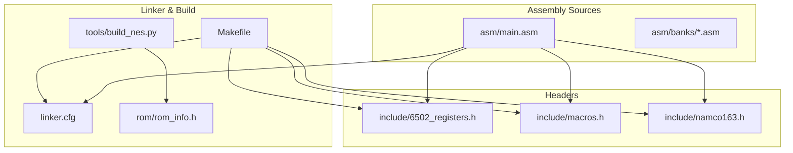
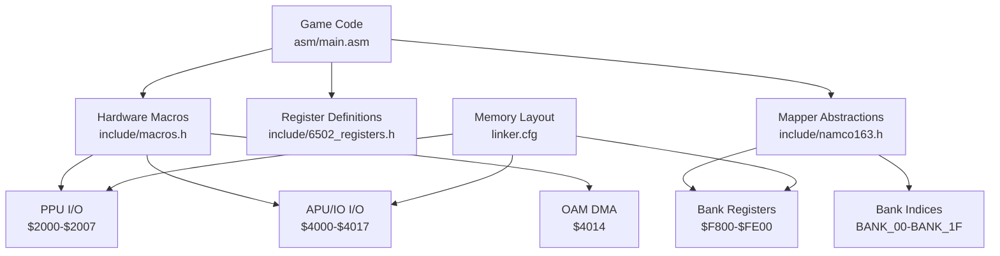
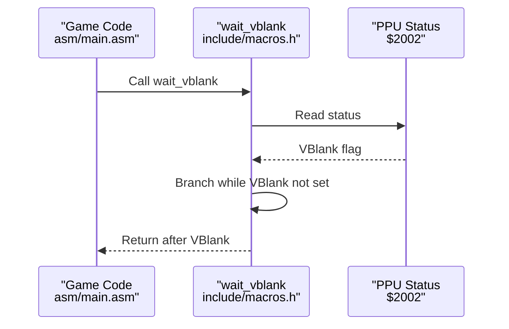
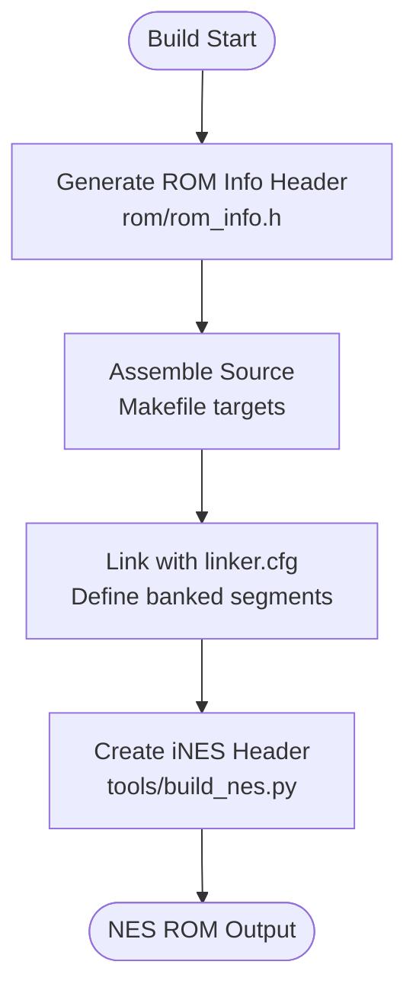
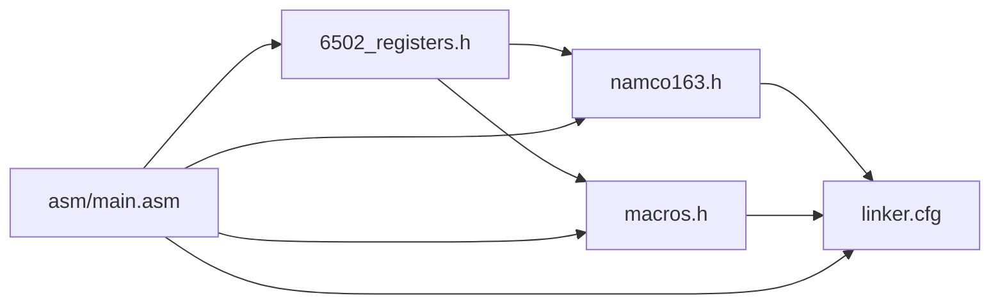

# Hardware Abstraction Layer

<cite>
**Referenced Files in This Document**
- [6502_registers.h](file://include/6502_registers.h)
- [macros.h](file://include/macros.h)
- [namco163.h](file://include/namco163.h)
- [main.asm](file://asm/main.asm)
- [linker.cfg](file://linker.cfg)
- [rom_info.h](file://rom/rom_info.h)
- [build_nes.py](file://tools/build_nes.py)
- [Makefile](file://Makefile)
</cite>

## Table of Contents
1. [Introduction](#introduction)
2. [Project Structure](#project-structure)
3. [Core Components](#core-components)
4. [Architecture Overview](#architecture-overview)
5. [Detailed Component Analysis](#detailed-component-analysis)
6. [Dependency Analysis](#dependency-analysis)
7. [Performance Considerations](#performance-considerations)
8. [Troubleshooting Guide](#troubleshooting-guide)
9. [Conclusion](#conclusion)
10. [Appendices](#appendices)

## Introduction
This document describes the hardware abstraction layer for the low-level hardware interface abstractions and utility functions used in the Sangokushi 2 - Haou no Tairiku disassembly project. It explains the PPU register definitions covering addresses $2000-$2007 and bit field meanings for controlling display functionality, documents the APU/IO register mappings for sound generation, input handling, and system timing, details the Namco-163 mapper implementation including bank switching addresses $F800-$FE00, the BANK_00-BANK_1F constants, and the switch_bank_* macros for dynamic bank loading, and provides practical examples of using the hardware abstraction macros like wait_vblank, set_ppu_addr, ppu_write, and dma_sprites. It also covers ROM information header generation and how it integrates with the build system, and documents the relationship between hardware abstraction and higher-level game code, showing how these abstractions enable portable code across different memory layouts.

## Project Structure
The hardware abstraction layer is organized around three primary header files and supporting build infrastructure:
- include/6502_registers.h: Defines PPU, APU/IO, and Namco-163 register addresses and bit field masks.
- include/macros.h: Provides reusable 6502 assembly macros for hardware operations (VBlank wait, PPU address setting, PPU writes, PPU block copy, DMA sprites, and bank switching).
- include/namco163.h: Defines Namco-163 mapper constants, bank indices, and switch_bank_* macros.
- asm/main.asm: Demonstrates usage of the hardware abstractions in initialization routines.
- linker.cfg: Describes the memory layout and banked PRG slots used by the mapper.
- rom/rom_info.h: Auto-generated ROM metadata used by the build system.
- tools/build_nes.py: Generates the iNES header and integrates ROM metadata during build.
- Makefile: Orchestrates assembly, linking, and ROM creation.

**Diagram sources**
- [main.asm:1-141](file://asm/main.asm#L1-L141)
- [6502_registers.h:1-88](file://include/6502_registers.h#L1-L88)
- [macros.h:1-72](file://include/macros.h#L1-L72)
- [namco163.h:1-87](file://include/namco163.h#L1-L87)
- [linker.cfg:1-55](file://linker.cfg#L1-L55)
- [rom_info.h:1-9](file://rom/rom_info.h#L1-L9)
- [build_nes.py:1-58](file://tools/build_nes.py#L1-L58)
- [Makefile:1-102](file://Makefile#L1-L102)

**Section sources**
- [Makefile:18-28](file://Makefile#L18-L28)
- [linker.cfg:18-54](file://linker.cfg#L18-L54)

## Core Components
This section documents the core hardware abstraction components and their roles.

- PPU Register Definitions ($2000-$2007)
  - Control register: Enables NMI, selects sprite/background pattern tables, sets VRAM increment, and selects nametable.
  - Mask register: Controls emphasis, visibility of sprites and background, and clipping regions.
  - Status register: Reports VBlank, sprite zero hit, overflow, and VRAM write status.
  - I/O registers: OAM address/data, scroll, address, and data for VRAM transfers.

- APU/IO Register Mappings
  - Pulse channels 1 and 2: Volume, sweep, period low/high.
  - Triangle wave channel: Linear counter, period low/high.
  - Noise channel: Volume, period low/high.
  - DMC: Frequency, raw sample, start address, and length.
  - OAM DMA: 8-bit DMA destination address for sprite data.
  - Sound channel enable and joysticks: Channel enable/disable and controller reads.

- Namco-163 Mapper Implementation
  - PRG bank switching via write-only registers at $F800, $FA00, $FC00, and $FE00.
  - Bank indices from BANK_00 to BANK_1F represent 32 total 8KB banks mapped to $8000-$FFFF.
  - Switching macros encapsulate writing to the appropriate bank register.

- Hardware Abstraction Macros
  - wait_vblank: Waits for VBlank by polling PPU status.
  - set_ppu_addr: Sets the PPU address register pair (high/low).
  - ppu_write: Writes a value to PPU data.
  - ppu_copy: Copies a block of data to PPU using a zero-page pointer.
  - dma_sprites: Triggers OAM DMA transfer from a 16-bit source address.
  - switch_prg_bank: Selects a PRG bank for a given 8KB slot.

**Section sources**
- [6502_registers.h:5-88](file://include/6502_registers.h#L5-L88)
- [namco163.h:10-87](file://include/namco163.h#L10-L87)
- [macros.h:8-72](file://include/macros.h#L8-L72)

## Architecture Overview
The hardware abstraction layer sits between the higher-level game code and the NES hardware registers. It provides:
- Consistent register and bit-field definitions for PPU and APU/IO.
- Reusable macros for common operations like VBlank waits, PPU transfers, and DMA.
- Mapper-specific abstractions for the Namco-163, enabling dynamic bank switching across four 8KB slots.

**Diagram sources**
- [main.asm:104-121](file://asm/main.asm#L104-L121)
- [6502_registers.h:6-38](file://include/6502_registers.h#L6-L38)
- [namco163.h:11-62](file://include/namco163.h#L11-L62)
- [linker.cfg:18-30](file://linker.cfg#L18-L30)

## Detailed Component Analysis

### PPU Register Abstractions
The PPU register definitions provide named constants for control, mask, status, and I/O registers, along with bit field masks for:
- Control bits: NMI enable, master/slave, sprite/background pattern table selection, VRAM increment, and nametable selection.
- Mask bits: Emphasis color channels, sprite/background visibility, and clipping flags.
- Status bits: VBlank flag, sprite zero hit, overflow, and VRAM write status.

These definitions enable readable and portable code that does not hard-code numeric addresses.

**Section sources**
- [6502_registers.h:6-13](file://include/6502_registers.h#L6-L13)
- [6502_registers.h:55-68](file://include/6502_registers.h#L55-L68)
- [6502_registers.h:73-79](file://include/6502_registers.h#L73-L79)
- [6502_registers.h:84-87](file://include/6502_registers.h#L84-L87)

### APU/IO Register Abstractions
The APU/IO register mappings define the locations for:
- Pulse channels 1 and 2: volume, sweep, period low/high.
- Triangle channel: linear counter, period low/high.
- Noise channel: volume, period low/high.
- DMC: frequency, raw sample, start address, length.
- OAM DMA: 8-bit DMA destination address for sprite data.
- Sound channel enable and joysticks: channel enable/disable and controller reads.

These definitions support sound generation, input handling, and system timing control.

**Section sources**
- [6502_registers.h:15-38](file://include/6502_registers.h#L15-L38)

### Namco-163 Mapper Abstractions
The Namco-163 mapper enables 256KB PRG ROM using four 8KB bank slots mapped to $8000-$FFFF. The bank switching registers are:
- $F800 (NAMCO_PRG_8000): Switches bank at $8000-$9FFF.
- $FA00 (NAMCO_PRG_A000): Switches bank at $A000-$BFFF.
- $FC00 (NAMCO_PRG_C000): Switches bank at $C000-$DFFF.
- $FE00 (NAMCO_PRG_E000): Switches bank at $E000-$FFFF.

Bank indices BANK_00 through BANK_1F enumerate the 32 available banks. The switch_bank_* macros encapsulate writing a bank index to the appropriate register.

**Section sources**
- [namco163.h:11-14](file://include/namco163.h#L11-L14)
- [namco163.h:31-62](file://include/namco163.h#L31-L62)
- [namco163.h:68-86](file://include/namco163.h#L68-L86)

### Hardware Abstraction Macros
The macros provide reusable, efficient sequences for common hardware operations:
- wait_vblank: Polls PPU status until VBlank begins.
- set_ppu_addr: Writes high and low bytes to PPU address registers.
- ppu_write: Writes a value to PPU data.
- ppu_copy: Copies a block of data to PPU using a zero-page pointer and loop counters.
- dma_sprites: Triggers OAM DMA transfer from a 16-bit source address.
- switch_prg_bank: Selects a PRG bank for a given 8KB slot using conditional assembly.

These macros abstract away the repetitive register writes and branching logic, improving readability and maintainability.

**Section sources**
- [macros.h:8-12](file://include/macros.h#L8-L12)
- [macros.h:17-22](file://include/macros.h#L17-L22)
- [macros.h:27-30](file://include/macros.h#L27-L30)
- [macros.h:37-47](file://include/macros.h#L37-L47)
- [macros.h:52-55](file://include/macros.h#L52-L55)
- [macros.h:60-71](file://include/macros.h#L60-L71)

### Practical Usage Examples
The main assembly file demonstrates practical usage of the hardware abstractions:
- PPU initialization clears control and mask registers and resets scroll registers.
- Mapper initialization uses switch_bank_* macros to select initial banks and configure the IRQ counter.
- The main loop waits for VBlank using a direct bit test, demonstrating how the wait_vblank macro would be used.

**Diagram sources**
- [main.asm:126-131](file://asm/main.asm#L126-L131)
- [macros.h:8-12](file://include/macros.h#L8-L12)

**Section sources**
- [main.asm:104-121](file://asm/main.asm#L104-L121)
- [main.asm:126-131](file://asm/main.asm#L126-L131)

### ROM Information Header Generation
The ROM information header is auto-generated and integrated into the build process:
- rom/rom_info.h defines constants for mapper, PRG banks, and CHR banks used by the build system.
- tools/build_nes.py creates the iNES header with mapper 19 (Namco-163), battery-backed SRAM, and horizontal mirroring, and writes the header plus padded PRG and empty CHR data to the output ROM.

**Diagram sources**
- [rom_info.h:1-9](file://rom/rom_info.h#L1-L9)
- [build_nes.py:10-51](file://tools/build_nes.py#L10-L51)
- [Makefile:38-48](file://Makefile#L38-L48)

**Section sources**
- [rom_info.h:6-8](file://rom/rom_info.h#L6-L8)
- [build_nes.py:26-37](file://tools/build_nes.py#L26-L37)

## Dependency Analysis
The hardware abstraction layer depends on the memory layout defined by the linker configuration and is consumed by the main assembly code and banked segments.

**Diagram sources**
- [6502_registers.h:1-88](file://include/6502_registers.h#L1-L88)
- [macros.h:1-72](file://include/macros.h#L1-L72)
- [namco163.h:1-87](file://include/namco163.h#L1-L87)
- [linker.cfg:18-54](file://linker.cfg#L18-L54)
- [main.asm:6-7](file://asm/main.asm#L6-L7)

**Section sources**
- [linker.cfg:18-30](file://linker.cfg#L18-L30)
- [main.asm:6-7](file://asm/main.asm#L6-L7)

## Performance Considerations
- Use macros for repeated operations to reduce instruction count and improve readability.
- Prefer block copy operations (ppu_copy) for large VRAM transfers to minimize loop overhead.
- Minimize PPU writes by batching updates and using set_ppu_addr followed by sequential ppu_write calls.
- Use VBlank waits to synchronize rendering updates and avoid flicker or tearing.

## Troubleshooting Guide
- VBlank synchronization issues: Ensure wait_vblank is used consistently and that PPU registers are configured before entering rendering loops.
- PPU corruption: Verify that set_ppu_addr and ppu_write are used in the correct order and that address increments are set appropriately.
- DMA problems: Confirm that dma_sprites is called with the correct 16-bit source address and that OAM DMA completes before sprites are drawn.
- Bank switching errors: Ensure switch_bank_* macros are used with valid bank indices and that the mapper is initialized before accessing banked code.

**Section sources**
- [macros.h:8-12](file://include/macros.h#L8-L12)
- [macros.h:17-30](file://include/macros.h#L17-L30)
- [macros.h:37-47](file://include/macros.h#L37-L47)
- [macros.h:52-55](file://include/macros.h#L52-L55)
- [namco163.h:68-86](file://include/namco163.h#L68-L86)

## Conclusion
The hardware abstraction layer provides a clean separation between high-level game logic and low-level hardware details. By defining register addresses and bit fields, offering reusable macros for common operations, and encapsulating mapper-specific bank switching, the layer enables portable and maintainable code across different memory layouts. The build system integrates ROM metadata and generates the iNES header, ensuring consistent ROM creation.

## Appendices

### PPU Control Bit Reference
- NMI enable: Enables NMI on VBlank.
- Master/slave: PPU master/slave mode.
- Sprite/background pattern table: Selects $0000 or $1000 for sprite/background tiles.
- VRAM increment: Sets VRAM address increment to 1 or 32.
- Nametable selection: Chooses among four nametables ($2000, $2400, $2800, $2C00).

**Section sources**
- [6502_registers.h:55-68](file://include/6502_registers.h#L55-L68)

### PPU Mask Bit Reference
- Emphasis: Red, green, blue emphasis channels.
- Visibility: Sprite and background visibility.
- Clipping: Sprite and background clipping regions.

**Section sources**
- [6502_registers.h:73-79](file://include/6502_registers.h#L73-L79)

### PPU Status Bit Reference
- VBlank: Set during VBlank period.
- Sprite zero hit: Set when sprite zero overlaps background pixel.
- Overflow: Set when more than eight sprites are on a scanline.
- VRAM write: Indicates VRAM write is in progress.

**Section sources**
- [6502_registers.h:84-87](file://include/6502_registers.h#L84-L87)

### APU/IO Register Reference
- Pulse channels: Volume, sweep, period low/high.
- Triangle channel: Linear counter, period low/high.
- Noise channel: Volume, period low/high.
- DMC: Frequency, raw sample, start address, length.
- OAM DMA: 8-bit DMA destination address.
- Sound channel enable and joysticks: Channel enable/disable and controller reads.

**Section sources**
- [6502_registers.h:16-38](file://include/6502_registers.h#L16-L38)

### Namco-163 Bank Indices
- BANK_00 through BANK_1F enumerate 32 banks, each 8KB, mapped to $8000-$FFFF.

**Section sources**
- [namco163.h:31-62](file://include/namco163.h#L31-L62)

### Memory Layout Reference
- Zero page and RAM: $0000-$07FF and mirrors.
- PPU registers: $2000-$2007 and mirrors.
- APU/IO registers: $4000-$401F.
- Expansion ROM (Namco-163): $4020-$5FFF.
- SRAM: $6000-$7FFF.
- PRG ROM: Four 8KB slots mapped to $8000-$FFFF.

**Section sources**
- [linker.cfg:18-12](file://linker.cfg#L18-L12)