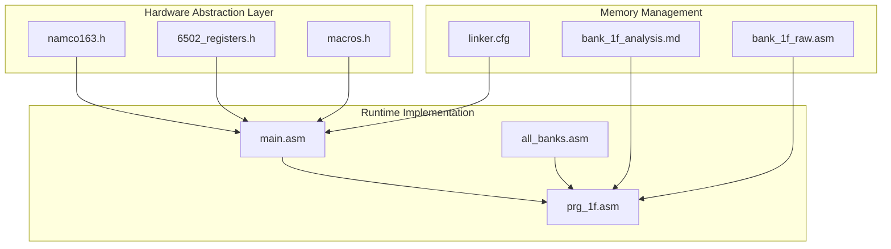
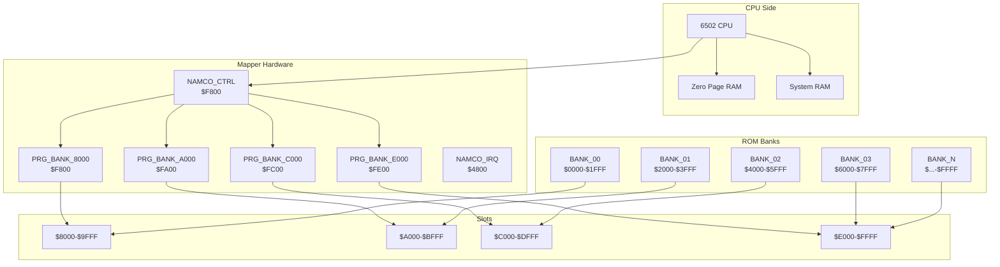
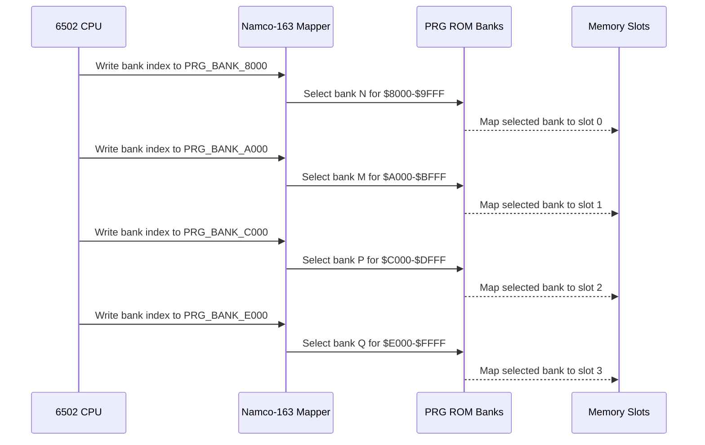
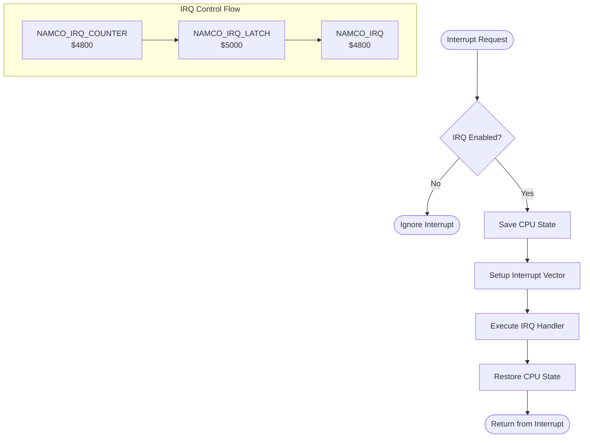
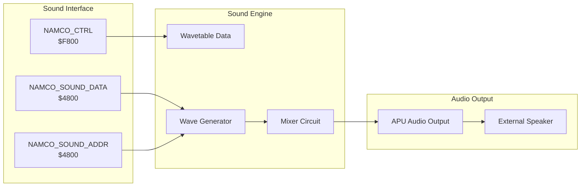
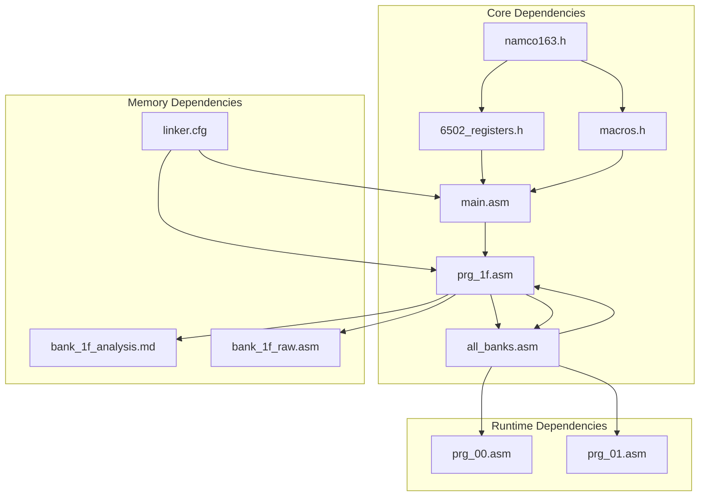

# Namco-163 Mapper Implementation

<cite>
**Referenced Files in This Document**
- [namco163.h](file://include/namco163.h)
- [6502_registers.h](file://include/6502_registers.h)
- [macros.h](file://include/macros.h)
- [main.asm](file://asm/main.asm)
- [linker.cfg](file://linker.cfg)
- [all_banks.asm](file://asm/banks/all_banks.asm)
- [prg_1f.asm](file://asm/banks/prg_1f.asm)
- [bank_1f_analysis.md](file://code/bank_1f_analysis.md)
- [bank_1f_raw.asm](file://code/bank_1f_raw.asm)
</cite>

## Table of Contents
1. [Introduction](#introduction)
2. [Project Structure](#project-structure)
3. [Core Components](#core-components)
4. [Architecture Overview](#architecture-overview)
5. [Detailed Component Analysis](#detailed-component-analysis)
6. [Dependency Analysis](#dependency-analysis)
7. [Performance Considerations](#performance-considerations)
8. [Troubleshooting Guide](#troubleshooting-guide)
9. [Conclusion](#conclusion)

## Introduction
This document provides comprehensive technical documentation for the Namco-163 mapper implementation used in the game "Sangokushi 2 - Haou no Tairiku". The Namco-163 (Mapper 19) enables dynamic PRG bank switching through dedicated write-only registers located in the $F800-$FE00 address range, allowing the system to access 256KB of PRG ROM across four 8KB programmable slots ($8000-$FFFF). The implementation includes sophisticated bank switching mechanisms, IRQ control capabilities, and hardware abstraction layers that integrate seamlessly with the 6502 CPU addressing scheme.

## Project Structure
The implementation follows a modular architecture with clear separation between hardware abstraction, memory management, and runtime bank switching:

**Diagram sources**
- [namco163.h:1-87](file://include/namco163.h#L1-L87)
- [6502_registers.h:1-88](file://include/6502_registers.h#L1-L88)
- [main.asm:1-141](file://asm/main.asm#L1-L141)

**Section sources**
- [linker.cfg:1-55](file://linker.cfg#L1-L55)
- [all_banks.asm:1-38](file://asm/banks/all_banks.asm#L1-L38)

## Core Components

### Hardware Abstraction Layer
The hardware abstraction layer defines the fundamental mapper interface and register mappings:

**Bank Switching Registers**: The mapper provides four programmable bank addresses that control which 8KB PRG bank is mapped to each 8KB slot:
- PRG_BANK_8000 = $F800: Controls bank mapping for $8000-$9FFF
- PRG_BANK_A000 = $FA00: Controls bank mapping for $A000-$BFFF  
- PRG_BANK_C000 = $FC00: Controls bank mapping for $C000-$DFFF
- PRG_BANK_E000 = $FE00: Controls bank mapping for $E000-$FFFF (typically fixed)

**Control and IRQ Registers**: Dedicated registers handle mapper control and interrupt functionality:
- NAMCO_CTRL = $F800: Control register (same as PRG_BANK_8000)
- NAMCO_IRQ_COUNTER = $4800: IRQ counter register
- NAMCO_IRQ_LATCH = $5000: IRQ latch value register
- NAMCO_SOUND_ADDR = $4800: Sound register address
- NAMCO_SOUND_DATA = $4800: Sound register data

**Section sources**
- [namco163.h:10-28](file://include/namco163.h#L10-L28)
- [6502_registers.h:40-50](file://include/6502_registers.h#L40-L50)

### Runtime Bank Switching Implementation
The runtime implementation provides both individual bank switching and batch configuration switching:

**Individual Bank Switching Macros**: Four specialized macros handle switching of specific bank slots:
- switch_bank_8000: Switches bank for $8000-$9FFF slot
- switch_bank_A000: Switches bank for $A000-$BFFF slot
- switch_bank_C000: Switches bank for $C000-$DFFF slot
- switch_bank_E000: Switches bank for $E000-$FFFF slot

**Batch Configuration Switching**: The BankSwitch routine provides efficient configuration-based bank switching:
- Processes 8-byte configuration tables
- Supports multiple bank configurations simultaneously
- Enables dynamic bank switching during runtime execution

**Section sources**
- [namco163.h:67-86](file://include/namco163.h#L67-L86)
- [macros.h:58-71](file://include/macros.h#L58-L71)
- [prg_1f.asm:781-827](file://asm/banks/prg_1f.asm#L781-L827)

### Memory Layout and Addressing
The memory architecture follows the standard NES 6502 addressing scheme with mapper-specific extensions:

**Memory Map Configuration**:
- $0000-$07FF: 2KB System RAM
- $2000-$3FFF: PPU register mirrors
- $4000-$401F: APU/IO registers
- $4020-$5FFF: Expansion ROM (Namco-163)
- $6000-$7FFF: 8KB SRAM (battery-backed)
- $8000-$FFFF: 256KB PRG ROM (32 banks × 8KB each)

**PRG Slot Mapping**: Four 8KB slots are programmable:
- PRG_SLOT0: $8000-$9FFF (initially bank 0)
- PRG_SLOT1: $A000-$BFFF (initially bank 1)
- PRG_SLOT2: $C000-$DFFF (initially bank 2)
- PRG_SLOT3: $E000-$FFFF (boot bank 0x1F)

**Section sources**
- [linker.cfg:4-16](file://linker.cfg#L4-L16)
- [linker.cfg:18-30](file://linker.cfg#L18-L30)

## Architecture Overview

**Diagram sources**
- [6502_registers.h:40-50](file://include/6502_registers.h#L40-L50)
- [namco163.h:11-14](file://include/namco163.h#L11-L14)
- [linker.cfg:25-30](file://linker.cfg#L25-L30)

## Detailed Component Analysis

### Bank Switching Mechanism

The bank switching mechanism operates through write-only registers that immediately affect memory mapping:

**Diagram sources**
- [namco163.h:11-14](file://include/namco163.h#L11-L14)
- [prg_1f.asm:785-817](file://asm/banks/prg_1f.asm#L785-L817)

**Dynamic Bank Switching Operations**: The system supports real-time bank switching during program execution, enabling:
- Seamless transitions between different functional modules
- Dynamic loading of graphics data and sound samples
- Efficient memory utilization across the 256KB address space

**Bank Configuration Management**: The BankSwitch routine provides sophisticated configuration management:
- Processes 8-byte configuration tables for batch operations
- Supports up to 32 different bank configurations
- Enables complex banking scenarios with minimal overhead

**Section sources**
- [namco163.h:67-86](file://include/namco163.h#L67-L86)
- [prg_1f.asm:781-827](file://asm/banks/prg_1f.asm#L781-L827)

### Interrupt Handling Capabilities

The Namco-163 mapper provides comprehensive interrupt support through dedicated registers:

**Diagram sources**
- [namco163.h:19-21](file://include/namco163.h#L19-L21)
- [6502_registers.h:41-42](file://include/6502_registers.h#L41-L42)

**Interrupt Features**:
- Programmable IRQ counter for timing control
- Latch register for configurable interrupt conditions
- Dedicated acknowledge mechanism for proper interrupt handling
- Integration with 6502 interrupt vectors (NMI=$F800, IRQ=$FB2D)

**Section sources**
- [namco163.h:19-25](file://include/namco163.h#L19-L25)
- [bank_1f_analysis.md:1587-1644](file://code/bank_1f_analysis.md#L1587-L1644)

### Sound System Integration

The mapper integrates with the Namco-163 sound chip through shared address space:

**Diagram sources**
- [namco163.h:23-25](file://include/namco163.h#L23-L25)
- [6502_registers.h:41-42](file://include/6502_registers.h#L41-L42)

**Sound System Features**:
- Shared address space for sound control and data
- Wavetable-based waveform generation
- Real-time sound parameter modification
- Integration with APU audio pipeline

**Section sources**
- [namco163.h:23-25](file://include/namco163.h#L23-L25)
- [prg_1f.asm:846-886](file://asm/banks/prg_1f.asm#L846-L886)

## Dependency Analysis

The implementation exhibits clear dependency relationships between components:

**Diagram sources**
- [namco163.h:1-87](file://include/namco163.h#L1-L87)
- [6502_registers.h:1-88](file://include/6502_registers.h#L1-L88)
- [main.asm:1-141](file://asm/main.asm#L1-L141)

**Coupling Analysis**:
- Hardware abstraction layer maintains loose coupling with runtime code
- Bank switching macros provide clean separation between hardware and application logic
- Memory management configuration supports flexible bank allocation
- Interrupt handling maintains minimal coupling with main execution flow

**Section sources**
- [all_banks.asm:1-38](file://asm/banks/all_banks.asm#L1-L38)
- [linker.cfg:32-54](file://linker.cfg#L32-L54)

## Performance Considerations

### Memory Access Patterns
The mapper implementation optimizes for efficient memory access through strategic bank placement:

**Optimal Bank Placement Strategies**:
- Frequently accessed boot code in bank 0x1F (fixed at $E000-$FFFF)
- Critical system routines in early banks for immediate access
- Large data tables distributed across multiple banks to reduce memory pressure
- Sound data and graphics assets organized for streaming access patterns

**Bank Switching Overhead**:
- Individual bank switching requires single write operation
- Batch configuration switching processes multiple banks in single routine
- Minimal CPU overhead with direct register writes
- No cache invalidation required for bank switching

### Execution Flow Impact
The 6502 addressing scheme integration ensures seamless operation:

**Address Translation**:
- $F800-$FE00 writes trigger immediate bank selection
- $4800 address space shared between sound and IRQ control
- $5000 address space for sound data and latching
- Interrupt vectors remain stable regardless of bank configuration

**Execution Efficiency**:
- Bank switching occurs during instruction fetch cycles
- No pipeline stalls for memory-mapped register access
- Interrupt handling maintains predictable timing
- Sound generation continues uninterrupted during bank operations

## Troubleshooting Guide

### Common Issues and Solutions

**Bank Switching Problems**:
- Verify correct register addresses are used for target slot
- Ensure proper bank index values within 0-31 range
- Check for proper initialization sequence in Mapper_Init routine
- Validate bank configuration tables for correct addressing

**Interrupt Handling Issues**:
- Confirm IRQ counter and latch registers are properly configured
- Verify interrupt acknowledge sequence completes successfully
- Check interrupt vector stability across bank switches
- Monitor interrupt timing for proper synchronization

**Memory Access Problems**:
- Validate memory map configuration in linker script
- Ensure proper bank placement for critical code sections
- Check for proper zero page usage conflicts
- Verify segment alignment for banked code sections

**Section sources**
- [main.asm:113-121](file://asm/main.asm#L113-L121)
- [namco163.h:19-25](file://include/namco163.h#L19-L25)
- [linker.cfg:18-30](file://linker.cfg#L18-L30)

## Conclusion

The Namco-163 mapper implementation provides a robust foundation for dynamic PRG bank switching in the "Sangokushi 2 - Haou no Tairiku" game. Through careful hardware abstraction, efficient bank switching mechanisms, and comprehensive interrupt support, the implementation enables sophisticated memory management while maintaining compatibility with the standard 6502 CPU addressing scheme.

Key achievements include:
- Complete hardware abstraction layer with clear register definitions
- Efficient bank switching macros for both individual and batch operations
- Comprehensive interrupt handling with configurable timing control
- Seamless integration with sound system and audio processing
- Flexible memory management supporting up to 32 banks of 8KB each

The modular architecture ensures maintainability and extensibility, while the performance optimizations minimize runtime overhead. This implementation serves as an excellent example of mapper hardware abstraction in NES development, demonstrating best practices for memory management, interrupt handling, and system integration.