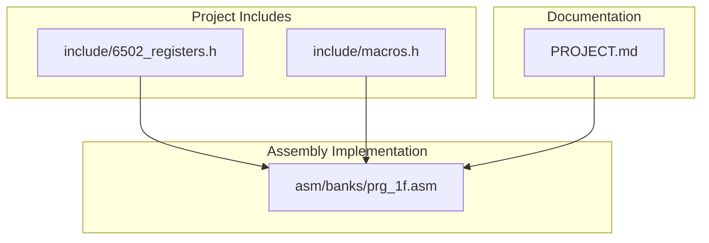
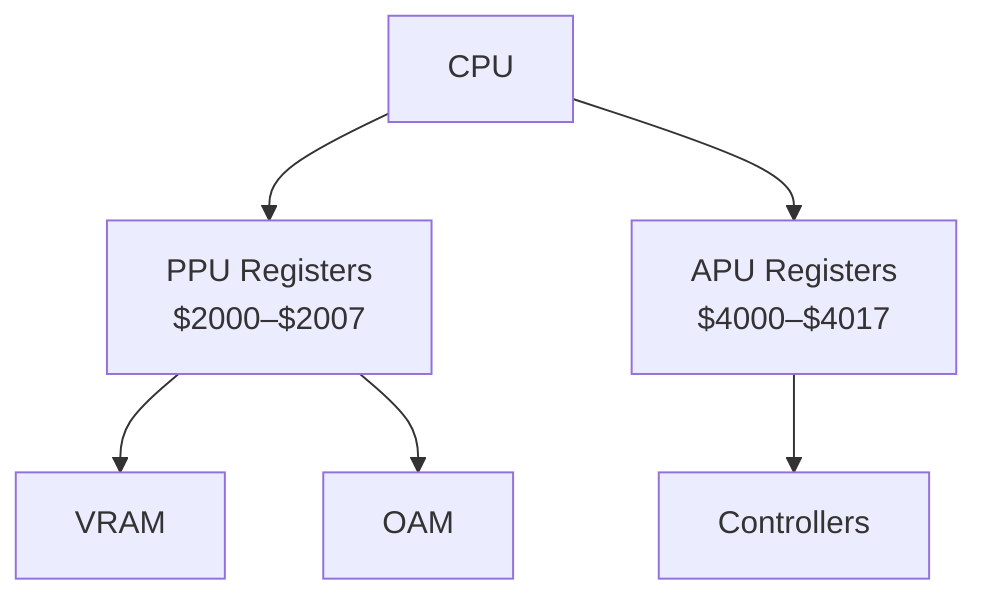
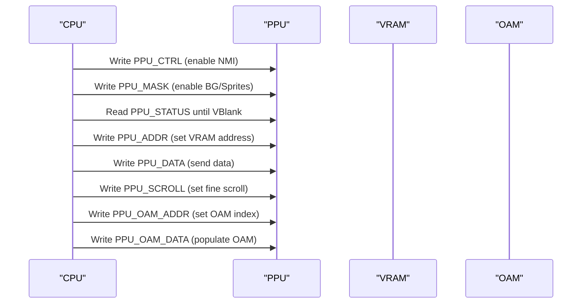
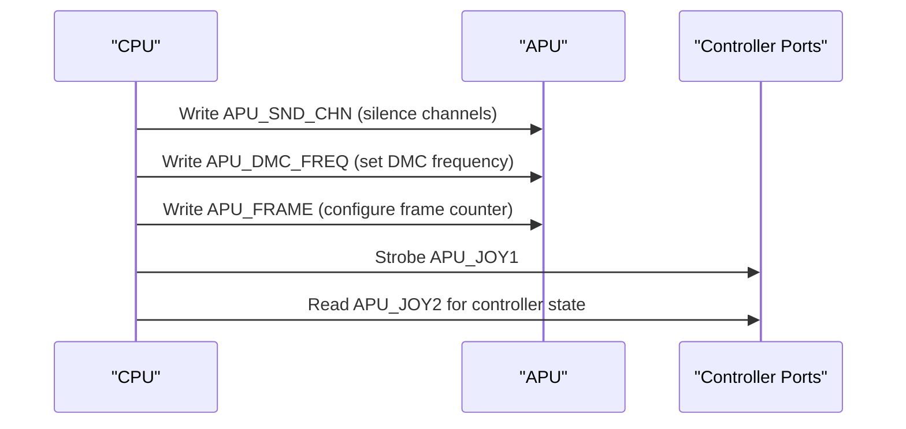
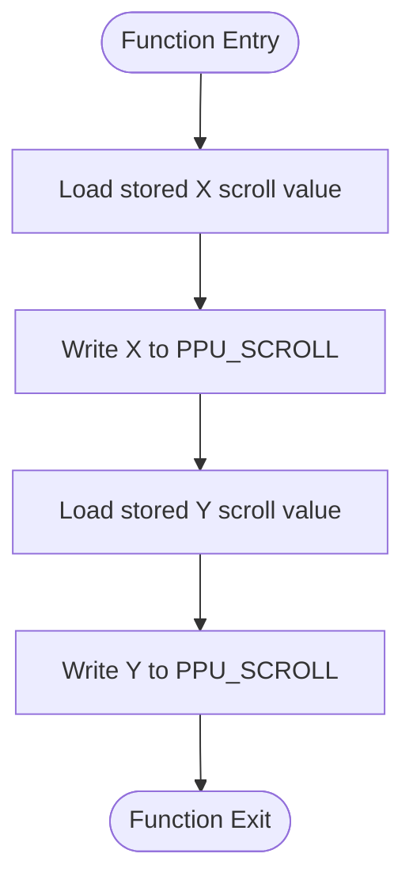
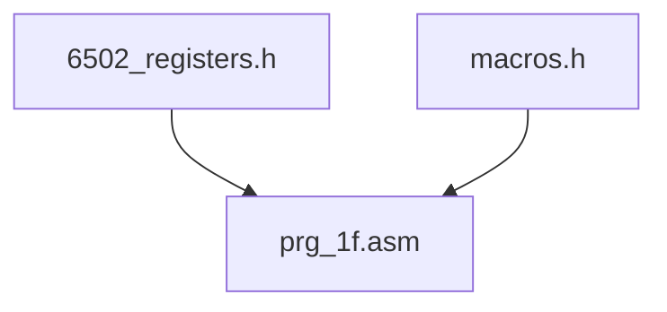

# PPU and APU Register Definitions

<cite>
**Referenced Files in This Document**
- [6502_registers.h](file://include/6502_registers.h)
- [macros.h](file://include/macros.h)
- [prg_1f.asm](file://asm/banks/prg_1f.asm)
- [PROJECT.md](file://PROJECT.md)
</cite>

## Table of Contents
1. [Introduction](#introduction)
2. [Project Structure](#project-structure)
3. [Core Components](#core-components)
4. [Architecture Overview](#architecture-overview)
5. [Detailed Component Analysis](#detailed-component-analysis)
6. [Dependency Analysis](#dependency-analysis)
7. [Performance Considerations](#performance-considerations)
8. [Troubleshooting Guide](#troubleshooting-guide)
9. [Conclusion](#conclusion)

## Introduction
This document provides comprehensive register definitions for the Picture Processing Unit (PPU) and Audio Processing Unit (APU) of the Nintendo Entertainment System (NES). It focuses on the complete hardware register mapping used by the PPU and APU, including all PPU registers ($2000–$2007) and APU registers ($4000–$4017). Practical examples demonstrate how these registers are configured and used in the target project, including enabling background rendering, setting scroll positions, configuring sound channels, and handling controller input. The document also covers bit manipulation techniques and timing considerations essential for proper hardware communication.

## Project Structure
The register definitions and usage patterns are primarily defined in the include files and demonstrated in the assembly code. The project’s memory map and register ranges are documented in the project overview.

**Diagram sources**
- [6502_registers.h:1-88](file://include/6502_registers.h#L1-L88)
- [macros.h:1-72](file://include/macros.h#L1-L72)
- [prg_1f.asm:1-2870](file://asm/banks/prg_1f.asm#L1-L2870)
- [PROJECT.md:70-83](file://PROJECT.md#L70-L83)

**Section sources**
- [PROJECT.md:70-83](file://PROJECT.md#L70-L83)

## Core Components
This section documents the PPU and APU register addresses and their bit-field meanings, along with practical usage patterns observed in the assembly code.

- PPU registers ($2000–$2007):
  - PPU_CTRL ($2000): Control register for enabling NMI, selecting master/slave mode, sprite and background pattern table addresses, VRAM increment, and nametable selection.
  - PPU_MASK ($2001): Controls color emphasis, background and sprite visibility, and clipping behavior.
  - PPU_STATUS ($2002): Reports VBlank status, sprite zero hit, overflow, and VRAM write status.
  - PPU_OAM_ADDR ($2003): Address pointer for accessing the Object Attribute Memory (OAM).
  - PPU_OAM_DATA ($2004): Data port for reading/writing OAM entries.
  - PPU_SCROLL ($2005): Fine horizontal and vertical scroll values.
  - PPU_ADDR ($2006): High/low address latches for VRAM transfers.
  - PPU_DATA ($2007): Data port for reading/writing VRAM.

- APU registers ($4000–$4017):
  - Pulse channels ($4000–$4007): Volume/envelope ($4000/$4004), sweep ($4001/$4005), timer low ($4002/$4006), and timer high ($4003/$4007).
  - Triangle wave ($4008–$400B): Linear counter load ($4008), timer low ($400A), and timer high ($400B).
  - Noise channel ($400C–$400F): Volume/envelope ($400C), timer low ($400E), and timer high ($400F).
  - DMC ($4010–$4013): Frequency ($4010), raw sample data ($4011), start address ($4012), and length ($4013).
  - OAM DMA ($4014): Initiates DMA transfer from CPU memory to OAM.
  - Sound channels enable ($4015): Enables/disables APU channels and DMC.
  - Controller ports ($4016–$4017): Joypad strobe ($4016), joypad read ($4017), and frame counter ($4017).

Bit-field meanings and control mechanisms are defined in the include file and used throughout the assembly code.

**Section sources**
- [6502_registers.h:5-13](file://include/6502_registers.h#L5-L13)
- [6502_registers.h:15-38](file://include/6502_registers.h#L15-L38)
- [6502_registers.h:53-87](file://include/6502_registers.h#L53-L87)

## Architecture Overview
The PPU and APU registers are accessed through memory-mapped I/O at fixed addresses. The assembly code demonstrates typical initialization sequences and runtime operations, including palette upload, enabling NMI, setting scroll positions, and configuring APU channels.

**Diagram sources**
- [6502_registers.h:5-13](file://include/6502_registers.h#L5-L13)
- [6502_registers.h:15-38](file://include/6502_registers.h#L15-L38)
- [PROJECT.md:70-83](file://PROJECT.md#L70-L83)

## Detailed Component Analysis

### PPU Register Definitions and Usage
- PPU_CTRL ($2000)
  - Bit meanings:
    - Bit 7: Enable NMI
    - Bit 6: PPU master/slave
    - Bit 5: Sprite size (8x8 vs 8x16)
    - Bit 4: Background pattern table address
    - Bit 3: Sprite pattern table address
    - Bit 2: VRAM address increment (1 vs 32)
    - Bits 1–0: Nametable select
  - Usage patterns:
    - Enabling NMI during initialization.
    - Setting sprite/background pattern tables and VRAM increment.
    - Selecting nametables for scrolling and rendering.

- PPU_MASK ($2001)
  - Bit meanings:
    - Bits 5–3: Color emphasis (blue, green, red)
    - Bit 2: Sprites visible
    - Bit 1: Background visible
    - Bits 1–0: Clipping masks for sprites and background
  - Usage patterns:
    - Enabling background and sprites for display.
    - Configuring color emphasis for palette effects.

- PPU_STATUS ($2002)
  - Bit meanings:
    - Bit 7: VBlank flag
    - Bit 6: Sprite zero hit
    - Bit 5: Sprite overflow
    - Bit 4: VRAM write disable
  - Usage patterns:
    - Checking VBlank status before updating registers.
    - Detecting sprite-related conditions.

- PPU_OAM_ADDR ($2003), PPU_OAM_DATA ($2004)
  - Usage patterns:
    - Writing OAM addresses and data for sprite attributes.
    - DMA transfer via OAM DMA ($4014) to populate OAM.

- PPU_SCROLL ($2005)
  - Usage patterns:
    - Writing fine horizontal and vertical scroll values for smooth scrolling.

- PPU_ADDR ($2006), PPU_DATA ($2007)
  - Usage patterns:
    - Setting VRAM address latches and writing data to VRAM.
    - Palette upload routine demonstrates address and data sequencing.

Practical examples from the assembly code:
- Palette upload routine sets VRAM address to $3F00 and writes 32 bytes to palette memory.
- PPU mask helper enables background and sprites for display.
- PPU control/NMI helper enables NMI and updates control register.
- Scroll set routine writes computed X/Y scroll values to PPU_SCROLL.

**Section sources**
- [6502_registers.h:53-87](file://include/6502_registers.h#L53-L87)
- [prg_1f.asm:1067-1121](file://asm/banks/prg_1f.asm#L1067-L1121)
- [prg_1f.asm:1562-1583](file://asm/banks/prg_1f.asm#L1562-L1583)

### APU Register Definitions and Usage
- Pulse channels ($4000–$4007)
  - Volume/envelope ($4000/$4004)
  - Sweep ($4001/$4005)
  - Timer low ($4002/$4006)
  - Timer high ($4003/$4007)
  - Usage patterns:
    - Initializing pulse channels with volume and sweep settings.
    - Clearing sound RAM and uploading waveform data.

- Triangle wave ($4008–$400B)
  - Linear counter load ($4008)
  - Timer low ($400A)
  - Timer high ($400B)
  - Usage patterns:
    - Initializing linear counter for triangle channel.

- Noise channel ($400C–$400F)
  - Volume/envelope ($400C)
  - Timer low ($400E)
  - Timer high ($400F)
  - Usage patterns:
    - Configuring noise channel parameters.

- DMC ($4010–$4013)
  - Frequency ($4010)
  - Raw sample data ($4011)
  - Start address ($4012)
  - Length ($4013)
  - Usage patterns:
    - Initializing DMC frequency to silence.

- OAM DMA ($4014)
  - Usage patterns:
    - Macro-based DMA transfer from CPU memory to OAM.

- Sound channels enable ($4015)
  - Usage patterns:
    - Silencing all APU channels during initialization.

- Controller ports ($4016–$4017)
  - Joypad strobe ($4016)
  - Joypad read ($4017)
  - Frame counter ($4017)
  - Usage patterns:
    - Strobing joypad to read controller state.
    - Using frame counter for APU frame sequencer.

Practical examples from the assembly code:
- Sound initialization routine configures APU registers, silences channels, and initializes frame counter.
- Controller read routine demonstrates strobe and serial read sequence for both players.
- Frame counter write enables APU frame interrupt mode.

**Section sources**
- [6502_registers.h:15-38](file://include/6502_registers.h#L15-L38)
- [prg_1f.asm:846-906](file://asm/banks/prg_1f.asm#L846-L906)
- [prg_1f.asm:1035-1065](file://asm/banks/prg_1f.asm#L1035-L1065)
- [prg_1f.asm:90-111](file://asm/banks/prg_1f.asm#L90-L111)

### PPU Initialization and Control Flow

**Diagram sources**
- [prg_1f.asm:90-111](file://asm/banks/prg_1f.asm#L90-L111)
- [prg_1f.asm:1067-1121](file://asm/banks/prg_1f.asm#L1067-L1121)
- [prg_1f.asm:1562-1583](file://asm/banks/prg_1f.asm#L1562-L1583)

### APU Initialization and Sound Configuration

**Diagram sources**
- [prg_1f.asm:90-111](file://asm/banks/prg_1f.asm#L90-L111)
- [prg_1f.asm:1035-1065](file://asm/banks/prg_1f.asm#L1035-L1065)

### Scroll Positioning Algorithm

**Diagram sources**
- [prg_1f.asm:1562-1571](file://asm/banks/prg_1f.asm#L1562-L1571)

## Dependency Analysis
The assembly code depends on the register definitions in the include files. Macros encapsulate common operations like waiting for VBlank, setting PPU addresses, writing PPU data, copying blocks to PPU, and performing OAM DMA.

**Diagram sources**
- [6502_registers.h:1-88](file://include/6502_registers.h#L1-L88)
- [macros.h:1-72](file://include/macros.h#L1-L72)
- [prg_1f.asm:1-2870](file://asm/banks/prg_1f.asm#L1-L2870)

**Section sources**
- [macros.h:8-55](file://include/macros.h#L8-L55)

## Performance Considerations
- Timing-sensitive operations:
  - Wait for VBlank before updating PPU registers to avoid screen tearing.
  - Use PPU address latches carefully to minimize bus conflicts.
- Efficient VRAM transfers:
  - Batch writes to PPU_DATA after setting address latches.
  - Use macros for repeated operations to reduce instruction overhead.
- APU frame sequencing:
  - Configure frame counter appropriately for desired audio behavior.
  - Initialize APU registers early to avoid audible glitches.

## Troubleshooting Guide
Common issues and remedies:
- Screen artifacts or flicker:
  - Ensure VBlank checks are performed before PPU register updates.
  - Verify PPU mask settings for background and sprite visibility.
- Incorrect scrolling:
  - Confirm scroll values are written in the correct order to PPU_SCROLL.
  - Check nametable selection bits in PPU_CTRL.
- No audio output:
  - Verify APU_SND_CHN is cleared during initialization.
  - Confirm frame counter mode and DMC frequency settings.
- Controller input not responding:
  - Ensure proper strobe sequence on APU_JOY1 before reading APU_JOY2.
  - Validate edge-triggered detection logic for button presses.

**Section sources**
- [prg_1f.asm:1035-1065](file://asm/banks/prg_1f.asm#L1035-L1065)
- [prg_1f.asm:1067-1121](file://asm/banks/prg_1f.asm#L1067-L1121)
- [prg_1f.asm:1562-1583](file://asm/banks/prg_1f.asm#L1562-L1583)

## Conclusion
The PPU and APU register definitions and usage patterns documented here provide a solid foundation for developing NES graphics and audio functionality. By following the initialization sequences, bit manipulation techniques, and timing considerations outlined in this document, developers can reliably configure the PPU for background rendering and scrolling, manage sprite data via OAM, and set up APU channels for sound synthesis and DMC playback. The included examples from the assembly code serve as practical references for integrating these registers into real applications.