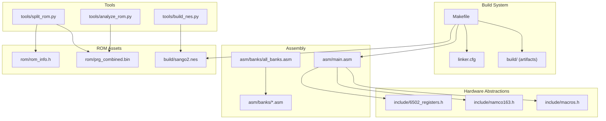
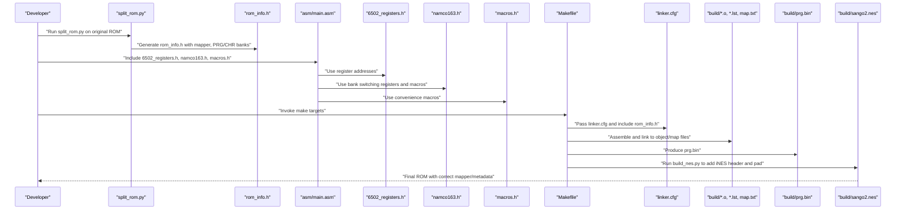
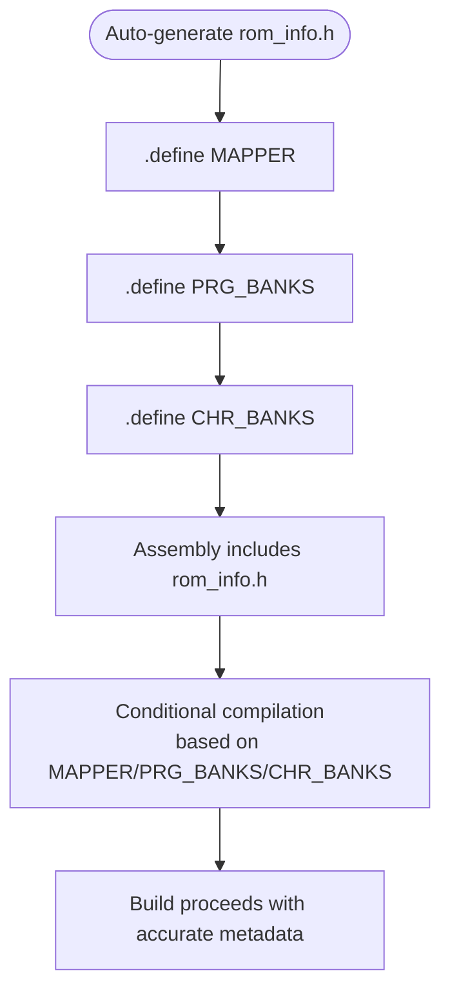
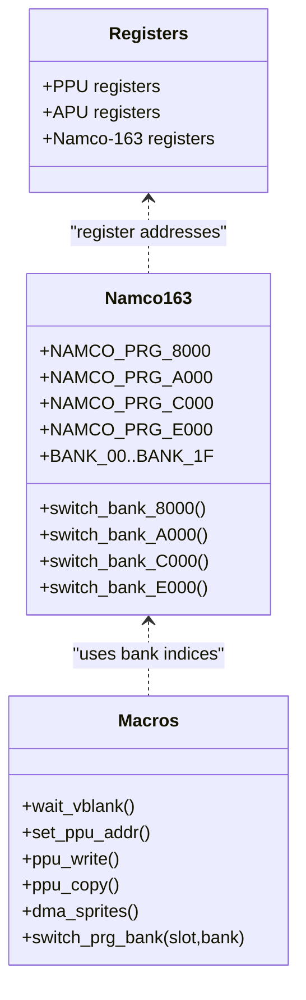
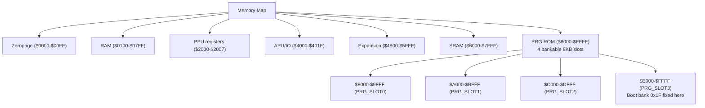
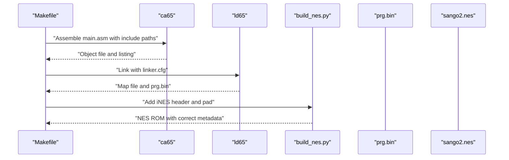
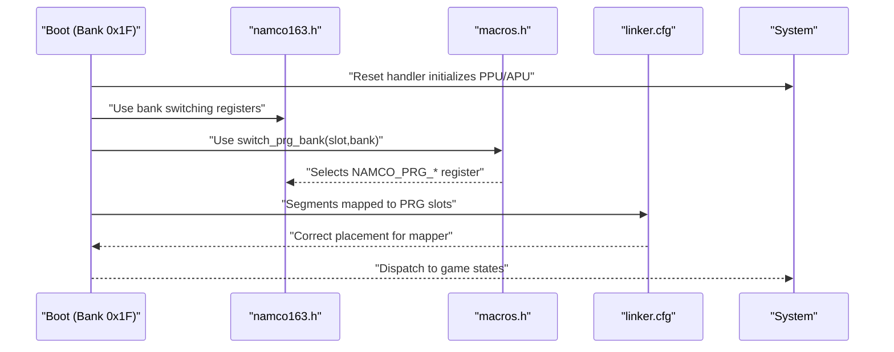
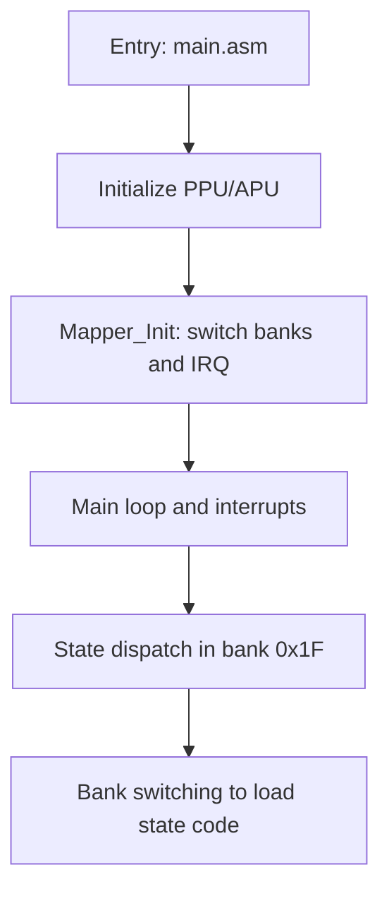
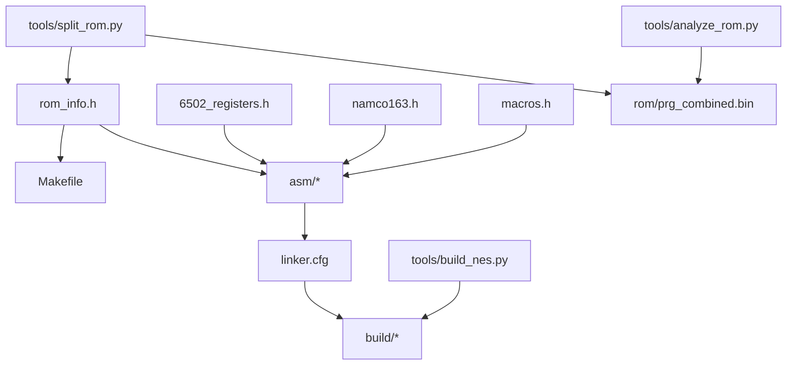

# ROM Information and Build Integration

<cite>
**Referenced Files in This Document**
- [rom_info.h](file://rom/rom_info.h)
- [Makefile](file://Makefile)
- [linker.cfg](file://linker.cfg)
- [PROJECT.md](file://PROJECT.md)
- [namco163.h](file://include/namco163.h)
- [6502_registers.h](file://include/6502_registers.h)
- [macros.h](file://include/macros.h)
- [build_nes.py](file://tools/build_nes.py)
- [split_rom.py](file://tools/split_rom.py)
- [analyze_rom.py](file://tools/analyze_rom.py)
- [main.asm](file://asm/main.asm)
- [prg_1f.asm](file://asm/banks/prg_1f.asm)
- [all_banks.asm](file://asm/banks/all_banks.asm)
</cite>

## Table of Contents
1. [Introduction](#introduction)
2. [Project Structure](#project-structure)
3. [Core Components](#core-components)
4. [Architecture Overview](#architecture-overview)
5. [Detailed Component Analysis](#detailed-component-analysis)
6. [Dependency Analysis](#dependency-analysis)
7. [Performance Considerations](#performance-considerations)
8. [Troubleshooting Guide](#troubleshooting-guide)
9. [Conclusion](#conclusion)

## Introduction
This document explains how ROM metadata and configuration integrate with the build system to connect hardware abstractions (mapper, memory layout, bank switching) to the assembly and linking process. It focuses on:
- The rom_info.h structure and its role in communicating ROM characteristics to the build
- How hardware abstractions (registers, bank switching macros, and memory maps) are declared and used
- How build-time decisions (mapper, PRG/CHR bank counts, memory layout) influence runtime behavior
- Practical examples of how ROM characteristics influence register settings, bank switching strategies, and memory organization
- The relationship between hardware abstractions and build-time configurations across development and production environments

## Project Structure
The repository organizes build and hardware abstraction concerns across several directories and files:
- asm/: Assembly entry points and bank stubs
- include/: Hardware register and macro definitions
- rom/: Output ROM assets and auto-generated ROM info
- tools/: Python scripts that drive ROM splitting, building, and analysis
- build/: Build artifacts (object files, listings, map, and final ROM)
- Root configs: Makefile and linker.cfg define toolchain, flags, and memory layout

**Diagram sources**
- [Makefile:1-102](file://Makefile#L1-L102)
- [linker.cfg:1-55](file://linker.cfg#L1-L55)
- [main.asm:1-141](file://asm/main.asm#L1-L141)
- [all_banks.asm:1-38](file://asm/banks/all_banks.asm#L1-L38)
- [6502_registers.h:1-88](file://include/6502_registers.h#L1-L88)
- [namco163.h:1-87](file://include/namco163.h#L1-L87)
- [macros.h:1-72](file://include/macros.h#L1-L72)
- [split_rom.py:1-140](file://tools/split_rom.py#L1-L140)
- [build_nes.py:1-58](file://tools/build_nes.py#L1-L58)
- [analyze_rom.py:1-135](file://tools/analyze_rom.py#L1-L135)

**Section sources**
- [Makefile:1-102](file://Makefile#L1-L102)
- [linker.cfg:1-55](file://linker.cfg#L1-L55)
- [PROJECT.md:14-47](file://PROJECT.md#L14-L47)

## Core Components
This section documents the ROM metadata and configuration aspects that tie hardware abstractions to the build process.

- rom_info.h: Auto-generated header containing ROM characteristics used by the build system and assembly code. It defines constants for mapper type, PRG/CHR bank counts, and can be included by assembly sources to conditionally compile or configure behavior based on ROM metadata.
- Hardware abstraction headers:
  - 6502_registers.h: Defines PPU/APU/Namco-163 register addresses and bit masks used by assembly code.
  - namco163.h: Declares mapper-specific bank switching registers, bank indices, and convenience macros for switching PRG banks.
  - macros.h: Provides reusable macros for common operations (e.g., VBlank wait, PPU address setting, DMA, and a generic bank switch macro).
- Linker configuration: linker.cfg defines the 6502 memory map, PRG slot regions, and segment assignments for banked code and data.
- Build pipeline: Makefile orchestrates assembling, linking, and ROM creation; tools support ROM splitting, analysis, and verification.

**Section sources**
- [rom_info.h:1-9](file://rom/rom_info.h#L1-L9)
- [6502_registers.h:1-88](file://include/6502_registers.h#L1-L88)
- [namco163.h:1-87](file://include/namco163.h#L1-L87)
- [macros.h:1-72](file://include/macros.h#L1-L72)
- [linker.cfg:1-55](file://linker.cfg#L1-L55)
- [Makefile:1-102](file://Makefile#L1-L102)

## Architecture Overview
The build system integrates ROM metadata and hardware abstractions to produce a byte-accurate ROM. The flow below shows how ROM characteristics influence assembly and linking, and how tools generate ROM assets.

**Diagram sources**
- [split_rom.py:99-122](file://tools/split_rom.py#L99-L122)
- [rom_info.h:1-9](file://rom/rom_info.h#L1-L9)
- [main.asm:6-7](file://asm/main.asm#L6-L7)
- [6502_registers.h:1-88](file://include/6502_registers.h#L1-L88)
- [namco163.h:1-87](file://include/namco163.h#L1-L87)
- [macros.h:1-72](file://include/macros.h#L1-L72)
- [Makefile:38-48](file://Makefile#L38-L48)
- [linker.cfg:1-55](file://linker.cfg#L1-L55)
- [build_nes.py:10-51](file://tools/build_nes.py#L10-L51)

## Detailed Component Analysis

### ROM Header and Metadata: rom_info.h
- Purpose: Provide ROM metadata (mapper, PRG/CHR bank counts) to assembly and build scripts.
- Content: Auto-generated header with .define directives for MAPPER, PRG_BANKS, and CHR_BANKS.
- Usage: Assembly code can include this header to conditionally compile or configure behavior based on ROM characteristics. The Makefile and linker configuration rely on these values to set up memory maps and bank segments.

**Diagram sources**
- [split_rom.py:100-110](file://tools/split_rom.py#L100-L110)
- [rom_info.h:6-8](file://rom/rom_info.h#L6-L8)

**Section sources**
- [rom_info.h:1-9](file://rom/rom_info.h#L1-L9)
- [split_rom.py:99-122](file://tools/split_rom.py#L99-L122)

### Hardware Abstraction Layer: Registers, Bank Switching, and Macros
- 6502_registers.h: Centralizes PPU/APU/Namco-163 register addresses and bit masks. Used by assembly for initialization and runtime control.
- namco163.h: Declares mapper-specific bank switching registers and bank indices. Provides macros to switch PRG banks at $8000, $A000, $C000, and $E000.
- macros.h: Offers higher-level macros for common tasks (e.g., wait_vblank, set_ppu_addr, ppu_write, ppu_copy, dma_sprites) and a generic switch_prg_bank macro that selects the appropriate register based on the slot.

**Diagram sources**
- [6502_registers.h:1-88](file://include/6502_registers.h#L1-L88)
- [namco163.h:10-87](file://include/namco163.h#L10-L87)
- [macros.h:8-72](file://include/macros.h#L8-L72)

**Section sources**
- [6502_registers.h:1-88](file://include/6502_registers.h#L1-L88)
- [namco163.h:1-87](file://include/namco163.h#L1-L87)
- [macros.h:1-72](file://include/macros.h#L1-L72)

### Memory Layout and Bank Segments: linker.cfg
- Memory map: Defines Zeropage, RAM, PRG slots ($8000–$FFFF), and segment assignments for code and read-only data.
- PRG slots: Four 8KB slots mapped to $8000–$FFFF. Bank 0x1F is fixed at $E000–$FFFF at boot on Namco-163.
- Segment model: CODE, VECTORS, and optional CODEx/RODATAx segments are assigned to PRG slots. As banks are disassembled, new segments are added to map code/data into the correct slots.

**Diagram sources**
- [linker.cfg:4-30](file://linker.cfg#L4-L30)
- [PROJECT.md:70-83](file://PROJECT.md#L70-L83)

**Section sources**
- [linker.cfg:1-55](file://linker.cfg#L1-L55)
- [PROJECT.md:70-117](file://PROJECT.md#L70-L117)

### Build Pipeline Integration: Makefile and Tools
- Makefile:
  - Assembles main.asm with include paths for hardware headers
  - Links with linker.cfg and generates prg.bin and map.txt
  - Creates the final ROM by invoking build_nes.py to add an iNES header and pad PRG to 16KB pages
- tools/split_rom.py:
  - Parses the iNES header and splits PRG/CHR into 8KB banks
  - Generates rom_info.h with mapper and bank counts
  - Produces a combined PRG binary for analysis
- tools/build_nes.py:
  - Adds iNES header (mapper 19, flags for battery and horizontal mirroring)
  - Pads PRG to 16KB pages and creates empty CHR data
  - Prints ROM metadata summary

**Diagram sources**
- [Makefile:27-48](file://Makefile#L27-L48)
- [build_nes.py:10-51](file://tools/build_nes.py#L10-L51)

**Section sources**
- [Makefile:1-102](file://Makefile#L1-L102)
- [split_rom.py:38-122](file://tools/split_rom.py#L38-L122)
- [build_nes.py:10-58](file://tools/build_nes.py#L10-L58)

### Example: How ROM Characteristics Influence Runtime Behavior
- Mapper selection: The ROM metadata (mapper 19) determines bank switching strategy and register addresses. Assembly code uses namco163.h to write bank numbers to $F800–$FFFF to switch PRG banks.
- Boot bank: On Namco-163, bank 0x1F is fixed at $E000–$FFFF at boot. The reset handler resides here and initializes the system before dispatching to other states.
- Bank switching macros: The generic switch_prg_bank macro selects the correct register based on the slot, enabling consistent bank switching across code.
- Memory layout: The linker.cfg assigns segments to PRG slots, ensuring code/data are placed where the mapper expects them.

**Diagram sources**
- [PROJECT.md:101-117](file://PROJECT.md#L101-L117)
- [namco163.h:68-86](file://include/namco163.h#L68-L86)
- [macros.h:60-71](file://include/macros.h#L60-L71)
- [linker.cfg:32-54](file://linker.cfg#L32-L54)

**Section sources**
- [PROJECT.md:70-117](file://PROJECT.md#L70-L117)
- [namco163.h:1-87](file://include/namco163.h#L1-L87)
- [macros.h:1-72](file://include/macros.h#L1-L72)
- [linker.cfg:1-55](file://linker.cfg#L1-L55)

### Assembly Entry Points and Bank Switching in Practice
- main.asm includes hardware headers and initializes PPU/APU, then calls Mapper_Init to switch initial PRG banks and set up the Namco-163 IRQ counter.
- prg_1f.asm demonstrates the boot bank’s reset handler and state dispatch mechanism, including bank switching to load state-specific code.

**Diagram sources**
- [main.asm:115-121](file://asm/main.asm#L115-L121)
- [prg_1f.asm:74-148](file://asm/banks/prg_1f.asm#L74-L148)

**Section sources**
- [main.asm:1-141](file://asm/main.asm#L1-L141)
- [prg_1f.asm:1-800](file://asm/banks/prg_1f.asm#L1-L800)

## Dependency Analysis
This section maps dependencies among ROM metadata, hardware abstractions, and build configuration.

**Diagram sources**
- [rom_info.h:1-9](file://rom/rom_info.h#L1-L9)
- [Makefile:19-28](file://Makefile#L19-L28)
- [main.asm:6-7](file://asm/main.asm#L6-L7)
- [6502_registers.h:1-88](file://include/6502_registers.h#L1-L88)
- [namco163.h:1-87](file://include/namco163.h#L1-L87)
- [macros.h:1-72](file://include/macros.h#L1-L72)
- [linker.cfg:18-54](file://linker.cfg#L18-L54)
- [split_rom.py:99-122](file://tools/split_rom.py#L99-L122)
- [build_nes.py:10-51](file://tools/build_nes.py#L10-L51)
- [analyze_rom.py:10-135](file://tools/analyze_rom.py#L10-L135)

**Section sources**
- [Makefile:19-48](file://Makefile#L19-L48)
- [linker.cfg:18-54](file://linker.cfg#L18-L54)
- [split_rom.py:99-122](file://tools/split_rom.py#L99-L122)
- [build_nes.py:10-51](file://tools/build_nes.py#L10-L51)

## Performance Considerations
- Bank switching overhead: Frequent bank switches can impact performance. Use macros and minimize unnecessary writes to mapper registers.
- Memory layout: Place frequently accessed code/data in the same bank to reduce switching frequency.
- Linker segmentation: Assign hot code to PRG_SLOT0/1/2/3 strategically to keep critical paths resident.
- Build-time padding: The build script pads PRG to 16KB pages; ensure linker.cfg reflects the intended total size to avoid wasted space.

[No sources needed since this section provides general guidance]

## Troubleshooting Guide
Common issues and remedies:
- Incorrect mapper or bank counts:
  - Verify rom_info.h was generated from the correct ROM using split_rom.py.
  - Confirm the ROM header indicates mapper 19 and expected PRG/CHR sizes.
- Bank switching not taking effect:
  - Ensure the correct register is written for the desired slot ($F800–$FFFF).
  - Use switch_prg_bank macro to select the right register based on slot.
- Linker errors about missing segments:
  - Add new MEMORY regions and SEGMENTS in linker.cfg as banks are disassembled.
  - Assign code/data to the correct PRG slot to match the mapper’s expectations.
- ROM mismatch with original:
  - Use analyze_rom.py to compare bank usage and vector layouts.
  - Run make verify to compare the built ROM against the original.

**Section sources**
- [split_rom.py:99-122](file://tools/split_rom.py#L99-L122)
- [analyze_rom.py:10-135](file://tools/analyze_rom.py#L10-L135)
- [linker.cfg:18-54](file://linker.cfg#L18-L54)
- [namco163.h:68-86](file://include/namco163.h#L68-L86)
- [macros.h:60-71](file://include/macros.h#L60-L71)

## Conclusion
The ROM metadata and hardware abstraction layer form the foundation for a robust build system that produces accurate, mapper-compliant ROMs. rom_info.h communicates ROM characteristics to assembly and build scripts, while namco163.h and 6502_registers.h provide the register-level primitives for bank switching and hardware control. linker.cfg enforces the memory layout and segment model that aligns with the mapper’s capabilities. Together, these components enable both development iteration and production-quality builds, with clear integration points for verification and analysis.