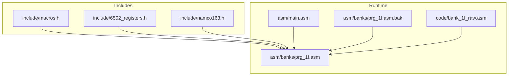
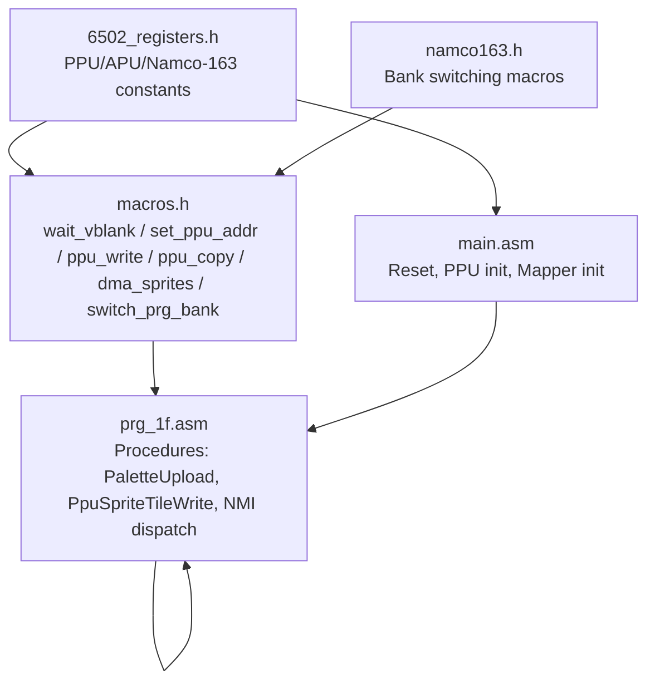
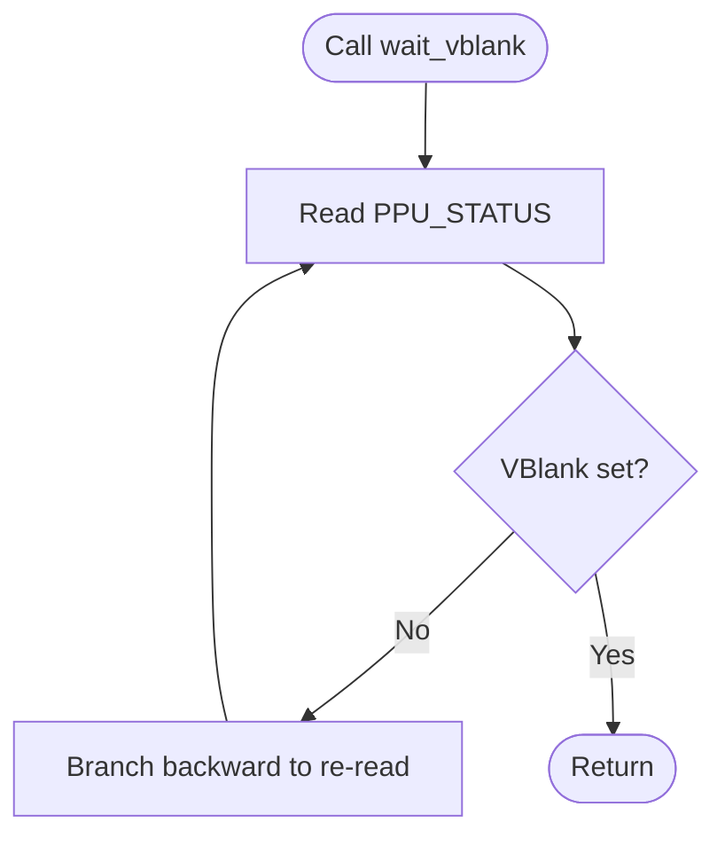
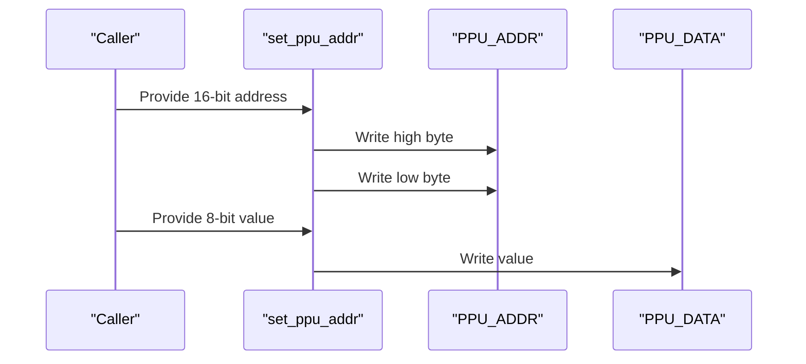
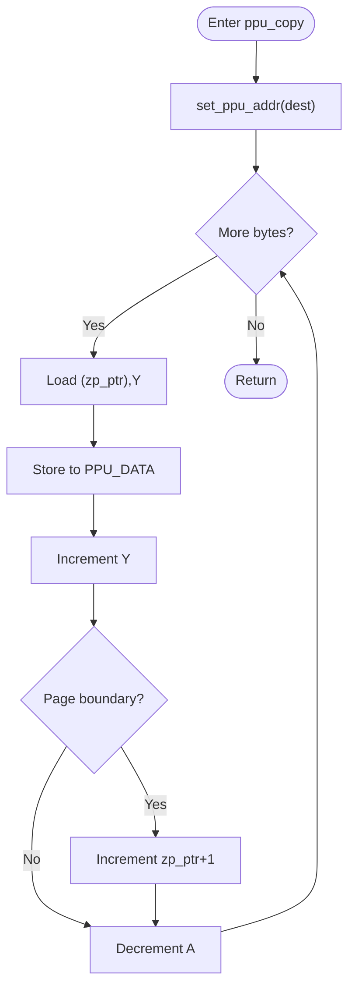
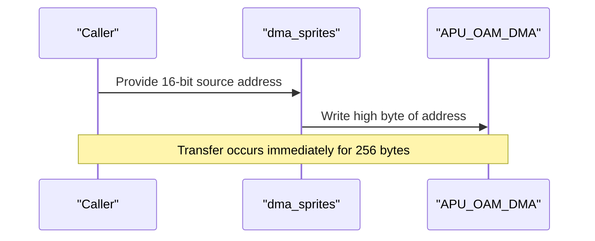
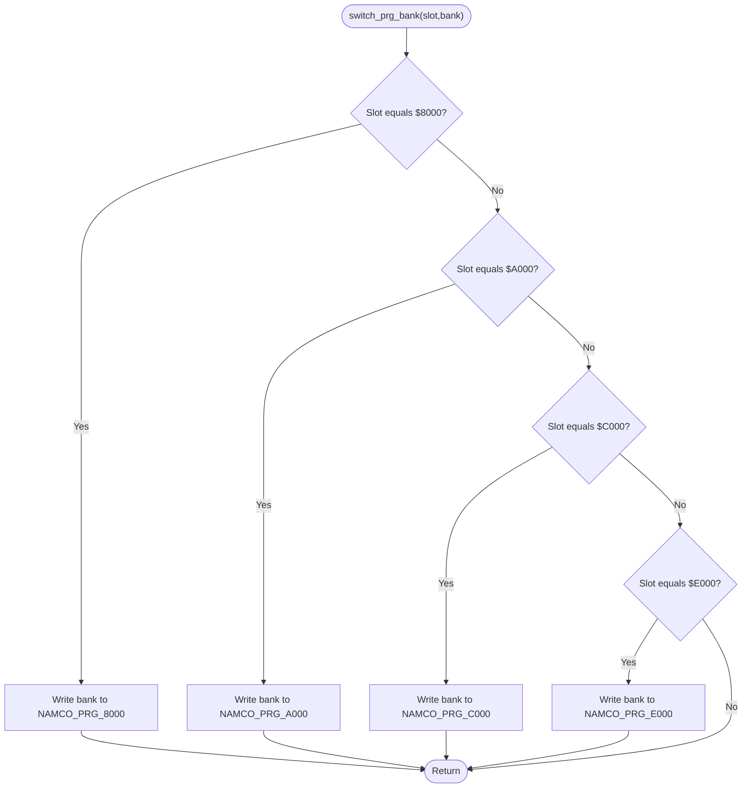
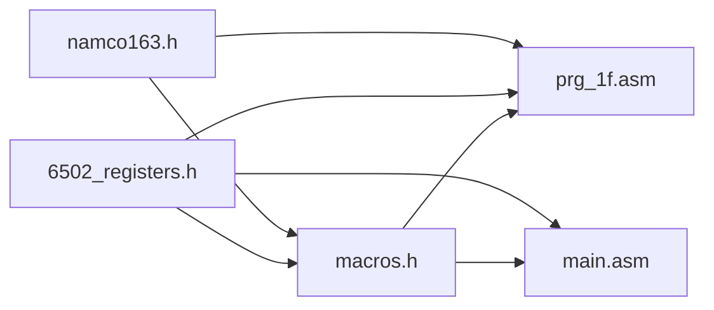

# Utility Macros and Helper Functions

<cite>
**Referenced Files in This Document**
- [macros.h](file://include/macros.h)
- [6502_registers.h](file://include/6502_registers.h)
- [namco163.h](file://include/namco163.h)
- [main.asm](file://asm/main.asm)
- [prg_1f.asm](file://asm/banks/prg_1f.asm)
- [prg_1f.asm.bak](file://asm/banks/prg_1f.asm.bak)
- [bank_1f_raw.asm](file://code/bank_1f_raw.asm)
</cite>

## Table of Contents
1. [Introduction](#introduction)
2. [Project Structure](#project-structure)
3. [Core Components](#core-components)
4. [Architecture Overview](#architecture-overview)
5. [Detailed Component Analysis](#detailed-component-analysis)
6. [Dependency Analysis](#dependency-analysis)
7. [Performance Considerations](#performance-considerations)
8. [Troubleshooting Guide](#troubleshooting-guide)
9. [Conclusion](#conclusion)

## Introduction
This document focuses on the utility macros and helper functions that simplify hardware access and common operations in the assembly codebase. It explains how macros encapsulate low-level PPU and APU register writes, VRAM address setup, PPU data transfers, and DMA sprite operations. It also documents memory management patterns, register access conventions, and recommended usage sequences for correctness and performance on the target platform.

## Project Structure
The relevant macros and helpers live in the include directory and are consumed by banked assembly code. The main entry point initializes hardware and sets up the runtime environment, while bank 1F contains higher-level procedures that demonstrate typical usage patterns for PPU operations and VBlank synchronization.

**Diagram sources**
- [macros.h:1-72](file://include/macros.h#L1-L72)
- [6502_registers.h:1-88](file://include/6502_registers.h#L1-L88)
- [namco163.h:1-87](file://include/namco163.h#L1-L87)
- [main.asm:1-141](file://asm/main.asm#L1-L141)
- [prg_1f.asm:1-200](file://asm/banks/prg_1f.asm#L1-L200)

**Section sources**
- [macros.h:1-72](file://include/macros.h#L1-L72)
- [6502_registers.h:1-88](file://include/6502_registers.h#L1-L88)
- [namco163.h:1-87](file://include/namco163.h#L1-L87)
- [main.asm:1-141](file://asm/main.asm#L1-L141)
- [prg_1f.asm:1-200](file://asm/banks/prg_1f.asm#L1-L200)

## Core Components
This section documents the primary macros and helper constructs used for hardware access and common operations.

- wait_vblank
  - Purpose: Wait until the PPU enters vertical blanking period.
  - Implementation: Reads the PPU status and loops while the VBlank flag is not set.
  - Parameters: None.
  - Typical usage: Call before modifying PPU state or VRAM to avoid screen tearing.
  - Timing: Waits for the start of VBlank; ensure subsequent PPU writes occur during VBlank.

- set_ppu_addr
  - Purpose: Set the PPU address register pair (high then low) to target VRAM address.
  - Implementation: Writes high byte, then low byte to PPU address registers.
  - Parameters: Immediate 16-bit address.
  - Typical usage: Before writing tile or attribute data to VRAM.

- ppu_write
  - Purpose: Write a single byte to PPU data register.
  - Implementation: Loads immediate value into accumulator and stores to PPU data register.
  - Parameters: Immediate 8-bit value.
  - Typical usage: Single-value writes after setting address.

- ppu_copy
  - Purpose: Block copy from a zero-page pointer to PPU data register.
  - Implementation: Sets destination address, then loops reading from (zp_ptr),Y and writing to PPU data, incrementing Y and handling page crossing.
  - Parameters: Destination VRAM address.
  - Preconditions: X holds low byte of source pointer, Y holds high byte, A holds remaining length.
  - Typical usage: Bulk upload of tiles or attributes.

- dma_sprites
  - Purpose: Trigger an APU OAM DMA transfer from CPU RAM to PPU OAM.
  - Implementation: Writes high-byte of source address to APU OAM DMA register.
  - Parameters: 16-bit source address (typically $0000-$07FF).
  - Typical usage: During VBlank to refresh sprite RAM safely.

- switch_prg_bank
  - Purpose: Switch PRG banks on Namco-163 mapper for specific 8KB window.
  - Implementation: Conditional branches select the appropriate bank register based on slot, then writes bank number.
  - Parameters: Slot address constant and bank number.
  - Typical usage: Switch banks for code/data access during runtime.

- switch_bank_8000, switch_bank_A000, switch_bank_C000, switch_bank_E000
  - Purpose: Convenience macros for bank switching at fixed slots on the mapper.
  - Implementation: Write bank number to the corresponding mapper register.
  - Parameters: Bank number.
  - Typical usage: Initialize mapper layout or dynamically switch banks.

**Section sources**
- [macros.h:8-71](file://include/macros.h#L8-L71)
- [namco163.h:68-87](file://include/namco163.h#L68-L87)

## Architecture Overview
The macros and helpers sit atop well-defined register constants and are used by higher-level procedures that orchestrate PPU initialization, palette uploads, sprite DMA, and NMI-driven updates.

**Diagram sources**
- [6502_registers.h:1-88](file://include/6502_registers.h#L1-L88)
- [macros.h:1-72](file://include/macros.h#L1-L72)
- [namco163.h:1-87](file://include/namco163.h#L1-L87)
- [main.asm:1-141](file://asm/main.asm#L1-L141)
- [prg_1f.asm:1067-1121](file://asm/banks/prg_1f.asm#L1067-L1121)

## Detailed Component Analysis

### wait_vblank
- Purpose: Synchronize with VBlank to safely modify PPU state or VRAM.
- Implementation pattern: Read PPU status and branch backward while the VBlank flag is clear.
- Usage pattern: Call prior to enabling rendering or changing PPU control/mask registers.
- Performance note: Minimal overhead; ensures safe timing for PPU operations.

**Diagram sources**
- [macros.h:8-12](file://include/macros.h#L8-L12)
- [6502_registers.h:82-87](file://include/6502_registers.h#L82-L87)

**Section sources**
- [macros.h:8-12](file://include/macros.h#L8-L12)
- [6502_registers.h:82-87](file://include/6502_registers.h#L82-L87)

### set_ppu_addr and ppu_write
- Purpose: Set PPU address and write a single byte to PPU data register.
- Implementation pattern: High byte then low byte to PPU address registers; immediate value to PPU data.
- Usage pattern: After setting address, write tile/attribute bytes sequentially.

**Diagram sources**
- [macros.h:17-30](file://include/macros.h#L17-L30)
- [6502_registers.h:5-13](file://include/6502_registers.h#L5-L13)

**Section sources**
- [macros.h:17-30](file://include/macros.h#L17-L30)
- [6502_registers.h:5-13](file://include/6502_registers.h#L5-L13)

### ppu_copy
- Purpose: Efficiently copy a block of data from CPU memory to PPU data register.
- Implementation pattern: Uses a zero-page pointer pair and Y-indexed indirect addressing to stream data, handling page crossings and decrementing a length counter.
- Preconditions: X = low byte of source pointer, Y = high byte of source pointer, A = remaining byte count.
- Usage pattern: Bulk upload of tiles or attributes after setting destination address.

**Diagram sources**
- [macros.h:37-47](file://include/macros.h#L37-L47)

**Section sources**
- [macros.h:37-47](file://include/macros.h#L37-L47)

### dma_sprites
- Purpose: Trigger a DMA transfer from CPU RAM to PPU OAM.
- Implementation pattern: Write the high byte of the source address to the APU OAM DMA register.
- Usage pattern: Typically called during VBlank to avoid corrupting OAM during rendering.

**Diagram sources**
- [macros.h:52-55](file://include/macros.h#L52-L55)
- [6502_registers.h:34-34](file://include/6502_registers.h#L34-L34)

**Section sources**
- [macros.h:52-55](file://include/macros.h#L52-L55)
- [6502_registers.h:34-34](file://include/6502_registers.h#L34-L34)

### switch_prg_bank and switch_bank_* (Namco-163)
- Purpose: Switch PRG banks for specific 8KB windows on the mapper.
- Implementation pattern: Conditional selection of mapper register based on slot, then write bank number.
- Usage pattern: Initialize mapper layout at startup or dynamically switch banks for code/data access.

**Diagram sources**
- [macros.h:60-71](file://include/macros.h#L60-L71)
- [namco163.h:11-14](file://include/namco163.h#L11-L14)

**Section sources**
- [macros.h:60-71](file://include/macros.h#L60-L71)
- [namco163.h:11-14](file://include/namco163.h#L11-L14)

### Practical Usage Patterns and Sequencing
- VBlank synchronization before PPU changes:
  - Use wait_vblank before toggling PPU control/mask or changing nametable selections.
  - Verified by procedures that read PPU status and wait for VBlank before proceeding.

- Palette upload:
  - Reset PPU address latch, set address to palette area, then stream 32 bytes via PPU data.
  - Demonstrated by a dedicated procedure that sets latch, sets high/low address bytes, and loops over palette data.

- Sprite DMA:
  - During VBlank, set OAM DMA source address and trigger DMA to refresh sprite RAM.
  - Verified by procedures that call the DMA macro and rely on VBlank timing.

- Bank switching:
  - Initialize mapper layout early in startup or when transitioning between code banks.
  - Use convenience macros for fixed slots to keep code readable.

**Section sources**
- [prg_1f.asm:1118-1131](file://asm/banks/prg_1f.asm#L1118-L1131)
- [prg_1f.asm:1067-1084](file://asm/banks/prg_1f.asm#L1067-L1084)
- [prg_1f.asm:2168-2184](file://asm/banks/prg_1f.asm#L2168-L2184)
- [main.asm:115-121](file://asm/main.asm#L115-L121)

## Dependency Analysis
The macros depend on register constants defined in the 6502 registers header and optionally on mapper register definitions. Higher-level procedures in bank 1F consume these macros and helpers to implement PPU operations and initialization.

**Diagram sources**
- [6502_registers.h:1-88](file://include/6502_registers.h#L1-L88)
- [namco163.h:1-87](file://include/namco163.h#L1-L87)
- [macros.h:1-72](file://include/macros.h#L1-L72)
- [prg_1f.asm:1-200](file://asm/banks/prg_1f.asm#L1-L200)
- [main.asm:1-141](file://asm/main.asm#L1-L141)

**Section sources**
- [6502_registers.h:1-88](file://include/6502_registers.h#L1-L88)
- [namco163.h:1-87](file://include/namco163.h#L1-L87)
- [macros.h:1-72](file://include/macros.h#L1-L72)
- [prg_1f.asm:1-200](file://asm/banks/prg_1f.asm#L1-L200)
- [main.asm:1-141](file://asm/main.asm#L1-L141)

## Performance Considerations
- VBlank timing: Always synchronize with VBlank before modifying PPU state or VRAM to avoid visual artifacts.
- DMA efficiency: Use the DMA macro for sprite uploads; it transfers 256 bytes in a single operation during VBlank.
- Block transfers: Prefer ppu_copy for bulk uploads to minimize instruction overhead and reduce total cycles compared to repeated single writes.
- Bank switching: Minimize frequent bank switches; cache or pre-load required banks to reduce latency.
- Register access: Use immediate values for ppu_write and set_ppu_addr to reduce addressing overhead.

[No sources needed since this section provides general guidance]

## Troubleshooting Guide
- Stuttering or flickering:
  - Ensure wait_vblank is called before toggling PPU control/mask or changing VRAM addresses.
  - Verify that sprite DMA occurs during VBlank.

- Incorrect palette or tiles:
  - Confirm that the PPU address latch is reset before setting new addresses.
  - Ensure the correct VRAM address is written to PPU address registers.

- OAM corruption:
  - Only trigger DMA during VBlank; avoid doing so while PPU is rendering sprites.

- Bank access issues:
  - Verify the correct slot is selected when switching banks.
  - Ensure the mapper is initialized before attempting banked code execution.

**Section sources**
- [prg_1f.asm:1118-1131](file://asm/banks/prg_1f.asm#L1118-L1131)
- [prg_1f.asm:1067-1084](file://asm/banks/prg_1f.asm#L1067-L1084)
- [prg_1f.asm:2168-2184](file://asm/banks/prg_1f.asm#L2168-L2184)
- [main.asm:115-121](file://asm/main.asm#L115-L121)

## Conclusion
The utility macros and helpers provide a concise and reliable way to interact with PPU/APU registers, manage VRAM addresses, perform block transfers, and handle sprite DMA. By adhering to proper sequencing—especially VBlank synchronization—and leveraging these abstractions, developers can write clearer, safer, and more maintainable assembly code for the target platform.