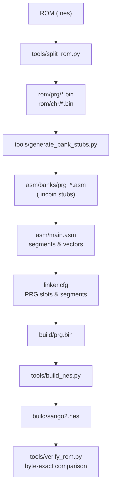
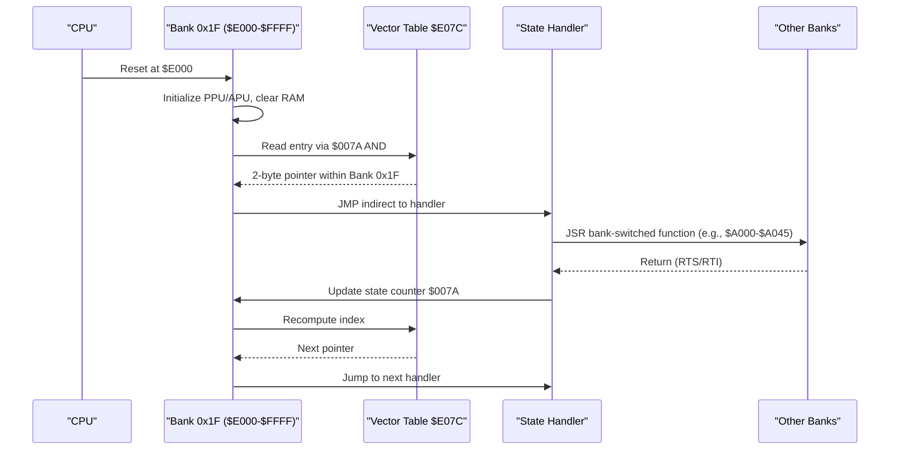
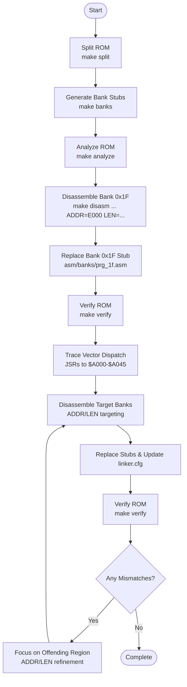
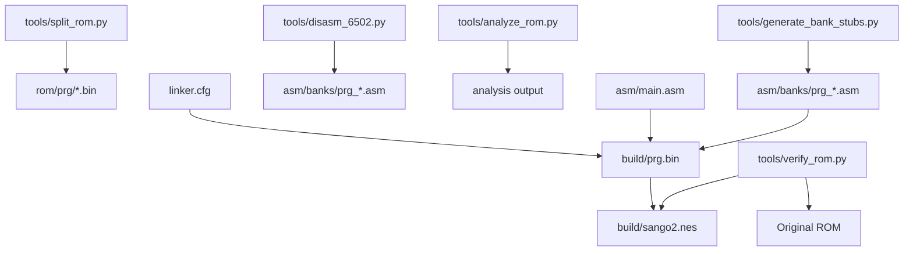

# Disassembly Workflow

<cite>
**Referenced Files in This Document**
- [PROJECT.md](file://PROJECT.md)
- [Makefile](file://Makefile)
- [linker.cfg](file://linker.cfg)
- [tools/split_rom.py](file://tools/split_rom.py)
- [tools/generate_bank_stubs.py](file://tools/generate_bank_stubs.py)
- [tools/analyze_rom.py](file://tools/analyze_rom.py)
- [tools/disasm_6502.py](file://tools/disasm_6502.py)
- [tools/verify_rom.py](file://tools/verify_rom.py)
- [asm/main.asm](file://asm/main.asm)
- [asm/banks/prg_1f.asm](file://asm/banks/prg_1f.asm)
- [include/namco163.h](file://include/namco163.h)
- [include/macros.h](file://include/macros.h)
- [code/bank_1f_analysis.md](file://code/bank_1f_analysis.md)
- [code/bank_1f_plan.md](file://code/bank_1f_plan.md)
</cite>

## Table of Contents
1. [Introduction](#introduction)
2. [Project Structure](#project-structure)
3. [Core Components](#core-components)
4. [Architecture Overview](#architecture-overview)
5. [Detailed Component Analysis](#detailed-component-analysis)
6. [Dependency Analysis](#dependency-analysis)
7. [Performance Considerations](#performance-considerations)
8. [Troubleshooting Guide](#troubleshooting-guide)
9. [Conclusion](#conclusion)
10. [Appendices](#appendices)

## Introduction
This document describes a complete, repeatable disassembly workflow for the Namco-163 (Mapper 19) game ROM. It focuses on the step-by-step process of reverse engineering the game code, starting with Bank 0x1F (reset handler and vector dispatch), following the execution flow through the vector table at $E07C, and progressively disassembling other banks based on runtime dispatch. It explains how to replace bank stubs with actual disassembled code, how analysis tools help identify code-heavy banks, and how to verify byte-exact fidelity using the provided build and verification pipeline.

The guide is structured for both beginners and experienced reverse engineers. Beginners will find a clear roadmap and practical examples; advanced users will benefit from the tooling details, linker integration, and verification mechanics.

## Project Structure
The repository organizes assets around a modular, bank-centric approach:
- ROM splitting and bank generation are automated via Python tools.
- Bank stubs are generated per PRG bank and included into a single assembly file.
- The linker configuration defines 4 PRG slots and segments for banked code.
- A Makefile orchestrates ROM split, bank stub generation, disassembly, linking, and verification.

**Diagram sources**
- [tools/split_rom.py:38-122](file://tools/split_rom.py#L38-L122)
- [tools/generate_bank_stubs.py:12-46](file://tools/generate_bank_stubs.py#L12-L46)
- [asm/banks/prg_1f.asm:1-13](file://asm/banks/prg_1f.asm#L1-L13)
- [asm/main.asm:24-141](file://asm/main.asm#L24-L141)
- [linker.cfg:18-54](file://linker.cfg#L18-L54)
- [tools/verify_rom.py:10-51](file://tools/verify_rom.py#L10-L51)

**Section sources**
- [PROJECT.md:14-47](file://PROJECT.md#L14-L47)
- [Makefile:12-28](file://Makefile#L12-L28)
- [tools/split_rom.py:38-122](file://tools/split_rom.py#L38-L122)
- [tools/generate_bank_stubs.py:12-46](file://tools/generate_bank_stubs.py#L12-L46)
- [linker.cfg:18-54](file://linker.cfg#L18-L54)

## Core Components
- ROM splitter: Splits the iNES ROM into 32 PRG banks (8KB) and 32 CHR banks, generating a combined PRG binary and a ROM info header.
- Bank stub generator: Creates per-bank assembly stubs that include the original binary, serving as placeholders for disassembly.
- Analyzer: Scans each bank for JSR/RTI/RTI patterns and interrupt vectors to prioritize code-heavy banks.
- Disassembler: Produces ca65-friendly listings for targeted regions (e.g., Bank 0x1F vectors).
- Linker configuration: Defines PRG slots and segments for banked code, enabling incremental addition of disassembled banks.
- Verification: Compares the rebuilt ROM byte-by-byte against the original to ensure accuracy.

Practical usage:
- Split ROM: make split
- Generate bank stubs: make banks
- Analyze ROM: make analyze
- Disassemble a region: make disasm FILE=rom/prg/prg_1f.bin ADDR=E000 LEN=1024
- Build and verify: make verify

**Section sources**
- [PROJECT.md:58-69](file://PROJECT.md#L58-L69)
- [Makefile:54-69](file://Makefile#L54-L69)
- [tools/split_rom.py:38-122](file://tools/split_rom.py#L38-L122)
- [tools/generate_bank_stubs.py:12-46](file://tools/generate_bank_stubs.py#L12-L46)
- [tools/analyze_rom.py:10-128](file://tools/analyze_rom.py#L10-L128)
- [tools/disasm_6502.py:286-334](file://tools/disasm_6502.py#L286-L334)
- [linker.cfg:18-54](file://linker.cfg#L18-L54)
- [tools/verify_rom.py:10-51](file://tools/verify_rom.py#L10-L51)

## Architecture Overview
The disassembly architecture centers on Bank 0x1F as the boot bank. At reset, the processor maps Bank 0x1F to $E000-$FFFF. The reset handler initializes hardware, clears RAM, and performs a vector dispatch based on a state counter. The vector table at $E07C contains 15 entries, each a 2-byte pointer within Bank 0x1F. Execution follows these pointers to state handlers that often call bank-switched functions located in other banks.

**Diagram sources**
- [PROJECT.md:101-117](file://PROJECT.md#L101-L117)
- [asm/banks/prg_1f.asm:74-148](file://asm/banks/prg_1f.asm#L74-L148)
- [code/bank_1f_analysis.md:54-76](file://code/bank_1f_analysis.md#L54-L76)

**Section sources**
- [PROJECT.md:101-117](file://PROJECT.md#L101-L117)
- [asm/banks/prg_1f.asm:74-148](file://asm/banks/prg_1f.asm#L74-L148)
- [code/bank_1f_analysis.md:54-76](file://code/bank_1f_analysis.md#L54-L76)

## Detailed Component Analysis

### Phase 1: ROM Analysis and Preparation
- Split ROM into 32 PRG banks and 32 CHR banks, and generate rom_info.h and prg_combined.bin.
- Generate bank stubs for all 32 PRG banks. Each stub includes the original binary via .incbin and a placeholder segment.
- Analyze ROM to identify code-heavy banks by JSR/RTI counts and interrupt vector candidates.

Practical steps:
- make split
- make banks
- make analyze

Verification:
- The analyzer prints JSR/RTI/RTI counts and highlights potential interrupt vectors and reset markers.

**Section sources**
- [Makefile:54-75](file://Makefile#L54-L75)
- [tools/split_rom.py:38-122](file://tools/split_rom.py#L38-L122)
- [tools/generate_bank_stubs.py:12-46](file://tools/generate_bank_stubs.py#L12-L46)
- [tools/analyze_rom.py:10-128](file://tools/analyze_rom.py#L10-L128)

### Phase 2: Bank 0x1F Disassembly (Reset Handler and Vector Dispatch)
- Disassemble Bank 0x1F from $E000-$E100 to capture the reset handler and initial warm-up routines.
- Disassemble the vector table at $E07C and the state handlers it points to.
- Replace the Bank 0x1F stub with actual disassembled code and update segments in linker.cfg accordingly.

Key elements:
- Reset handler initializes PPU/APU, clears RAM, and performs vector dispatch.
- Vector table entries are 2-byte pointers within Bank 0x1F; invalid indices read code bytes as pointers.
- State handlers call bank-switched functions (e.g., $A000-$A045) and update the state counter.

Practical steps:
- make disasm FILE=rom/prg/prg_1f.bin ADDR=E000 LEN=1024
- Review code/bank_1f_analysis.md and code/bank_1f_plan.md for detailed coverage.
- Replace .incbin in asm/banks/prg_1f.asm with disassembled code and add appropriate .segment directives.

Verification:
- After replacing stubs, rebuild and run make verify to confirm byte-exactness.

**Section sources**
- [PROJECT.md:134-150](file://PROJECT.md#L134-L150)
- [PROJECT.md:101-117](file://PROJECT.md#L101-L117)
- [code/bank_1f_analysis.md:22-76](file://code/bank_1f_analysis.md#L22-L76)
- [code/bank_1f_plan.md:34-120](file://code/bank_1f_plan.md#L34-L120)
- [asm/banks/prg_1f.asm:74-148](file://asm/banks/prg_1f.asm#L74-L148)

### Phase 3: Following the Vector Dispatch and Identifying Bank Switching
- From each state handler, trace JSR calls to bank-switched functions at $A000-$A045.
- Use the bank switching routine (e.g., BankSwitch at $E51F) to understand how PRG banks are selected for display and gameplay functions.
- Identify which banks contain the called functions and prioritize their disassembly.

Practical steps:
- Inspect state handlers in Bank 0x1F for JSRs to $A000-$A045.
- Determine the bank index from the bank switching table and locate the corresponding prg_XX.asm file.
- Disassemble the target bank with targeted ADDR and LEN parameters.

**Section sources**
- [code/bank_1f_analysis.md:527-533](file://code/bank_1f_analysis.md#L527-L533)
- [code/bank_1f_plan.md:224-244](file://code/bank_1f_plan.md#L224-L244)
- [asm/banks/prg_1f.asm:785-800](file://asm/banks/prg_1f.asm#L785-L800)

### Phase 4: Incremental Bank Stub Replacement and Linker Updates
- Replace .incbin stubs in asm/banks/prg_XX.asm with disassembled code.
- Add new MEMORY regions and SEGMENTS in linker.cfg for each newly disassembled bank.
- Ensure segments are correctly assigned to PRG slots and that the vector table and state handlers reference the correct addresses.

Practical steps:
- Edit asm/banks/prg_XX.asm to remove .incbin and insert disassembled code with proper .segment declarations.
- Extend linker.cfg with new CODEn/RODATAn segments and adjust PRG_SLOTn regions as needed.
- Rebuild and verify.

**Section sources**
- [PROJECT.md:148-150](file://PROJECT.md#L148-L150)
- [linker.cfg:18-54](file://linker.cfg#L18-L54)
- [asm/banks/prg_00.asm:6-12](file://asm/banks/prg_00.asm#L6-L12)

### Phase 5: Iterative Improvement and Verification
- After each bank replacement, rebuild and run make verify to measure accuracy and locate mismatches.
- Use the first mismatch address to focus further disassembly efforts on problematic regions.
- Continue tracing vector dispatch and bank switching until the entire program is covered.

Practical steps:
- make verify
- Review mismatch reports and disassemble the offending regions with targeted ADDR/LEN.
- Repeat until accuracy reaches 100%.

**Section sources**
- [Makefile:58-61](file://Makefile#L58-L61)
- [tools/verify_rom.py:10-51](file://tools/verify_rom.py#L10-L51)

### Conceptual Overview
The workflow is a guided exploration of the game’s runtime control flow:
- Start at reset to establish the dispatch mechanism.
- Follow the vector table to discover state handlers and their dependencies.
- Use bank switching to locate and disassemble the functions that implement gameplay logic.
- Replace stubs iteratively and verify continuously to maintain byte-exact fidelity.

[No sources needed since this diagram shows conceptual workflow, not actual code structure]

## Dependency Analysis
The disassembly pipeline depends on several coordinated components:
- Tools depend on Python 3 and the cc65 toolchain (ca65/ld65).
- Bank stubs depend on rom/prg/prg_XX.bin files produced by the ROM splitter.
- Linker configuration depends on the banked code segments and PRG slot assignments.
- Verification depends on the rebuilt ROM and the original ROM for byte-wise comparison.

**Diagram sources**
- [tools/split_rom.py:38-122](file://tools/split_rom.py#L38-L122)
- [tools/generate_bank_stubs.py:12-46](file://tools/generate_bank_stubs.py#L12-L46)
- [tools/disasm_6502.py:286-334](file://tools/disasm_6502.py#L286-L334)
- [tools/analyze_rom.py:10-128](file://tools/analyze_rom.py#L10-L128)
- [linker.cfg:18-54](file://linker.cfg#L18-L54)
- [asm/main.asm:24-141](file://asm/main.asm#L24-L141)
- [tools/verify_rom.py:10-51](file://tools/verify_rom.py#L10-L51)

**Section sources**
- [Makefile:7-28](file://Makefile#L7-L28)
- [tools/split_rom.py:38-122](file://tools/split_rom.py#L38-L122)
- [tools/generate_bank_stubs.py:12-46](file://tools/generate_bank_stubs.py#L12-L46)
- [tools/disasm_6502.py:286-334](file://tools/disasm_6502.py#L286-L334)
- [tools/analyze_rom.py:10-128](file://tools/analyze_rom.py#L10-L128)
- [linker.cfg:18-54](file://linker.cfg#L18-L54)
- [asm/main.asm:24-141](file://asm/main.asm#L24-L141)
- [tools/verify_rom.py:10-51](file://tools/verify_rom.py#L10-L51)

## Performance Considerations
- Bank switching overhead: Frequent bank switches incur extra memory accesses and can slow down tight loops. Disassembly should preserve call sites and avoid unnecessary relocations.
- Segment alignment: Keep code and data aligned to 256-byte boundaries where possible to minimize padding and improve linker efficiency.
- Incremental verification: Running make verify after each significant stub replacement helps catch errors early and reduces debugging time.

[No sources needed since this section provides general guidance]

## Troubleshooting Guide
Common issues and remedies:
- Incorrect vector interpretation: Ensure the vector table index masking and word indexing are correct. Misreads can produce garbage addresses for invalid indices.
- Bank switching confusion: The bank switching routine reads a table and writes to mapper registers. Verify the table offset calculation and register writes.
- Stub replacement mistakes: When replacing .incbin stubs, ensure segments are properly declared and that addresses align with the linker configuration.
- Verification failures: Use the first mismatch address to narrow down the problematic region. Re-run disasm with a smaller ADDR/LEN window to isolate the issue.

Practical checks:
- Confirm PRG slot assignments in linker.cfg match the intended bank layout.
- Validate that bank-switched calls resolve to existing disassembled code.
- Use the analyzer to confirm code-heavy banks and prioritize accordingly.

**Section sources**
- [code/bank_1f_analysis.md:56-76](file://code/bank_1f_analysis.md#L56-L76)
- [code/bank_1f_analysis.md:527-533](file://code/bank_1f_analysis.md#L527-L533)
- [linker.cfg:18-54](file://linker.cfg#L18-L54)
- [tools/verify_rom.py:10-51](file://tools/verify_rom.py#L10-L51)

## Conclusion
This disassembly workflow provides a systematic, repeatable path from ROM analysis to byte-exact verification. Starting at Bank 0x1F’s reset handler and vector dispatch, you trace execution flow, identify code-heavy banks, disassemble incrementally, replace stubs with accurate disassembly, and verify continuously. The provided tools, Makefile targets, and linker configuration support an efficient and reliable reverse engineering process.

[No sources needed since this section summarizes without analyzing specific files]

## Appendices

### Practical Examples
- Disassemble Bank 0x1F reset handler and vector table:
  - make disasm FILE=rom/prg/prg_1f.bin ADDR=E000 LEN=1024
- Disassemble a specific region within a bank:
  - make disasm FILE=rom/prg/prg_XX.bin ADDR=YYYY LEN=ZZZZ
- Replace a bank stub with disassembled code:
  - Edit asm/banks/prg_XX.asm to remove .incbin and add .segment and disassembled code.
- Update linker.cfg for new segments:
  - Add new MEMORY regions and SEGMENTS for the disassembled bank.
- Verify byte-exactness:
  - make verify

**Section sources**
- [PROJECT.md:134-150](file://PROJECT.md#L134-L150)
- [Makefile:63-65](file://Makefile#L63-L65)
- [linker.cfg:43-54](file://linker.cfg#L43-L54)