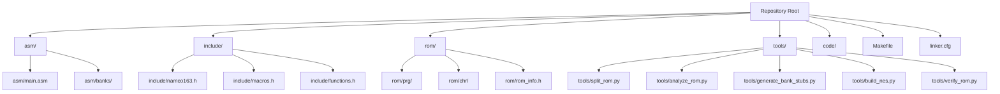
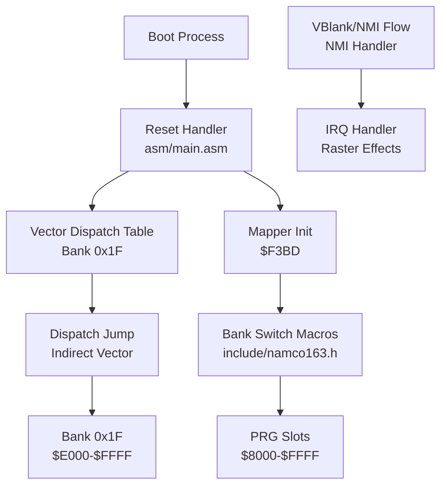
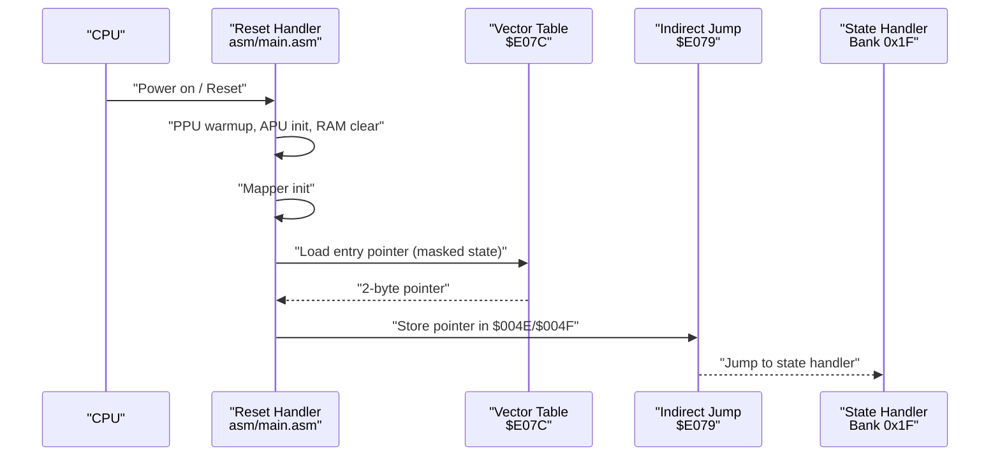
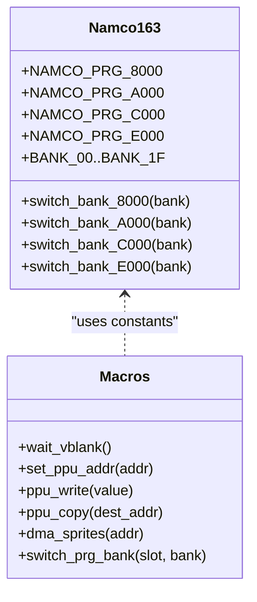
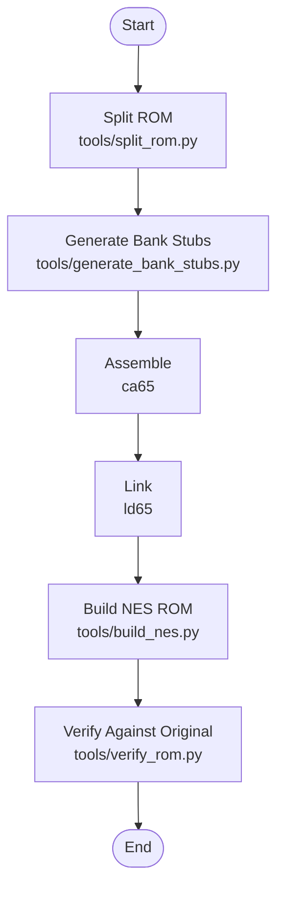
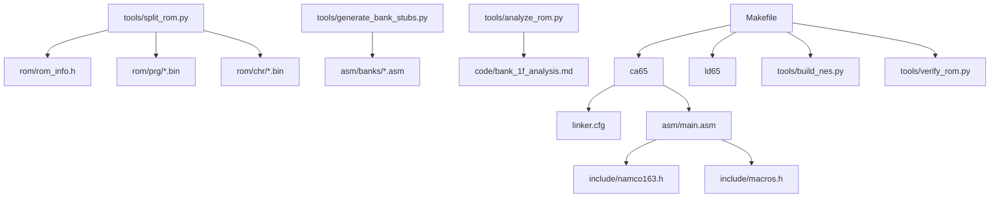

# Introduction and Goals

<cite>
**Referenced Files in This Document**
- [PROJECT.md](file://PROJECT.md)
- [Makefile](file://Makefile)
- [linker.cfg](file://linker.cfg)
- [asm/main.asm](file://asm/main.asm)
- [include/namco163.h](file://include/namco163.h)
- [include/macros.h](file://include/macros.h)
- [tools/split_rom.py](file://tools/split_rom.py)
- [tools/analyze_rom.py](file://tools/analyze_rom.py)
- [tools/generate_bank_stubs.py](file://tools/generate_bank_stubs.py)
- [rom/rom_info.h](file://rom/rom_info.h)
- [code/bank_1f_plan.md](file://code/bank_1f_plan.md)
- [code/key_functions_analysis.md](file://code/key_functions_analysis.md)
- [code/bank_1f_analysis.md](file://code/bank_1f_analysis.md)
</cite>

## Table of Contents
1. [Introduction](#introduction)
2. [Project Structure](#project-structure)
3. [Core Components](#core-components)
4. [Architecture Overview](#architecture-overview)
5. [Detailed Component Analysis](#detailed-component-analysis)
6. [Dependency Analysis](#dependency-analysis)
7. [Performance Considerations](#performance-considerations)
8. [Troubleshooting Guide](#troubleshooting-guide)
9. [Conclusion](#conclusion)

## Introduction
This project is a complete reverse engineering and preservation effort for Sangokushi 2 - Haou no Tairiku (J), a classic Namco-163 mapper-based strategy game for the Nintendo Entertainment System. The project’s primary purpose is to produce a full, accurate 32-bank (256KB) disassembly of the PRG ROM, enabling both retro gaming preservation and deep educational research into classic NES architecture and development practices.

Why this project matters:
- Retro Gaming Preservation: By reconstructing the complete disassembly, we ensure the game’s code remains accessible for study, emulation verification, and future preservation efforts.
- Educational Research: The project serves as a practical learning resource for developers and researchers studying classic 6502 assembly, bank switching, vector dispatch, and mapper abstraction on the NES.
- Historical Significance: Sangokushi 2 is a notable example of the Namco-163 mapper’s capabilities, including 8KB bank switching and integrated sound, offering insights into advanced cartridge design of the era.

Scope and Objectives:
- Complete 32-bank PRG ROM disassembly (256KB) with accurate bank switching and mapper abstraction.
- Document and analyze the game's vector dispatch system, reset handler, and interrupt vectors.
- Provide a reproducible build pipeline using cc65 toolchain and Python-based utilities.
- Enable incremental disassembly by replacing bank stubs with real code and verifying byte-for-byte accuracy against the original ROM.

Current Progress:
- 5 bank groups fully disassembled: $1F (boot), $0A/$0B, $0C/$0D, $17/$18, $1D/$1E
- Combined-pair approach used for banks sharing $A000-$DFFF (16KB units)
- include/functions.h provides 932 lines of symbolic cross-bank label definitions
- Remaining stub banks: $00–$09, $0E–$16, $19–$1C

Educational Value:
- For beginners: Learn classic NES memory layout, bank switching, and mapper abstraction through hands-on analysis of a real game.
- For experienced developers: Study advanced topics such as vector dispatch, PPU/PPU register usage, controller I/O, sound engine integration, and mathematical routines implemented in 6502 assembly.

Practical Contributions:
- The project’s toolchain and build system can be adapted for other Namco-163 games and similar mappers.
- The documented bank analysis and function tables serve as reference material for academic research and emulator development.
- The modular approach encourages collaboration and iterative improvement of the disassembly.

**Section sources**
- [PROJECT.md:1-181](file://PROJECT.md#L1-L181)

## Project Structure
The repository is organized around a complete disassembly workflow for the Namco-163 mapper-based game. The structure supports:
- Assembly sources with bank stubs and fully disassembled combined-pair files
- ROM splitting and analysis tools
- Linker configuration for 4 PRG slots with dedicated segments for disassembled banks
- Build automation via Makefile and Python scripts
- Symbolic function labels in include/functions.h (BXX_Name convention)
- Documentation and analysis artifacts for key banks

**Diagram sources**
- [PROJECT.md:14-47](file://PROJECT.md#L14-L47)
- [Makefile:1-102](file://Makefile#L1-L102)
- [linker.cfg:1-55](file://linker.cfg#L1-L55)

**Section sources**
- [PROJECT.md:14-47](file://PROJECT.md#L14-L47)
- [Makefile:12-29](file://Makefile#L12-L29)
- [linker.cfg:18-30](file://linker.cfg#L18-L30)

## Core Components
This section outlines the essential building blocks of the project and their roles in achieving the disassembly goals.

- Assembly Entry Point and Interrupt Vectors
  - The main assembly file defines the reset, NMI, and IRQ handlers and initializes PPU/APU registers and the mapper. The reset handler performs PPU warmup, APU initialization, RAM clearing, and then reads a vector table to perform a dispatch jump. The vectors segment places the interrupt vectors at the end of PRG slot 0, aligning with the NES vector table layout.
  - Key elements: Reset handler, NMI/IRQ stubs, PPU/APU initialization, mapper initialization, and vector table usage.

- Mapper Abstraction and Bank Switching
  - The project defines mapper-specific constants and macros for the Namco-163 mapper, including bank switching registers and helper macros. These abstractions encapsulate the complexity of switching PRG banks at runtime and are central to understanding how the game organizes its 256KB of code across 32 banks.

- Symbolic Function Labels (include/functions.h)
  - A 932-line header defining symbolic names for all known functions and data labels using the BXX_FunctionName convention (e.g., B1F_Reset, B0A_ArmyDispatch). This enables cross-bank references without hardcoding addresses and is included by all disassembled bank files.

- Linker Configuration
  - The linker configuration establishes 4 PRG slots ($8000–$FFFF) and assigns segments to these slots. This enables the assembly code to be organized by bank while maintaining a coherent memory map for the final ROM.

- ROM Splitting and Analysis Tools
  - The ROM splitting script parses the iNES header, splits PRG and CHR banks into 8KB chunks, and generates a combined PRG binary for disassembly. The analysis script identifies code patterns, interrupt vectors, and bank characteristics to guide the disassembly process.

- Bank Stub Generation
  - The stub generator creates per-bank assembly files that include the original binary data. These serve as placeholders during early stages of disassembly, allowing developers to replace stubs with actual disassembled code incrementally.

- Build Pipeline
  - The Makefile orchestrates the assembly and linking steps, invokes the ROM building script to add the iNES header, and provides targets for splitting ROMs, generating stubs, analyzing ROM structure, and verifying the built ROM against the original.

- Documentation and Analysis Artifacts
  - The code directory contains detailed analyses of key functions and bank layouts, including vector dispatch, math routines, sound engine, controller I/O, and display infrastructure. These documents guide the disassembly process and provide reference material for developers.

**Section sources**
- [asm/main.asm:25-141](file://asm/main.asm#L25-L141)
- [include/namco163.h:10-87](file://include/namco163.h#L10-L87)
- [include/macros.h:8-72](file://include/macros.h#L8-L72)
- [linker.cfg:18-54](file://linker.cfg#L18-L54)
- [tools/split_rom.py:38-122](file://tools/split_rom.py#L38-L122)
- [tools/analyze_rom.py:10-128](file://tools/analyze_rom.py#L10-L128)
- [tools/generate_bank_stubs.py:12-47](file://tools/generate_bank_stubs.py#L12-L47)
- [Makefile:31-76](file://Makefile#L31-L76)
- [code/bank_1f_plan.md:1-245](file://code/bank_1f_plan.md#L1-L245)
- [code/key_functions_analysis.md:1-284](file://code/key_functions_analysis.md#L1-L284)

## Architecture Overview
The project’s architecture centers on a mapper abstraction layer, bank switching mechanisms, and a vector dispatch system. The following diagram illustrates how these components interact during boot and runtime.

**Diagram sources**
- [PROJECT.md:101-117](file://PROJECT.md#L101-L117)
- [asm/main.asm:30-61](file://asm/main.asm#L30-L61)
- [include/namco163.h:68-87](file://include/namco163.h#L68-L87)
- [code/bank_1f_analysis.md:22-77](file://code/bank_1f_analysis.md#L22-L77)

**Section sources**
- [PROJECT.md:101-117](file://PROJECT.md#L101-L117)
- [asm/main.asm:30-61](file://asm/main.asm#L30-L61)
- [include/namco163.h:68-87](file://include/namco163.h#L68-L87)
- [code/bank_1f_analysis.md:22-77](file://code/bank_1f_analysis.md#L22-L77)

## Detailed Component Analysis

### Vector Dispatch and Reset Handler
The reset handler at the fixed boot bank (Bank 0x1F mapped to $E000–$FFFF) performs initialization and then reads a vector table to dispatch to the appropriate game state. The vector table contains 15 entries, each a 2-byte little-endian pointer within Bank 0x1F. The dispatch logic uses a state counter masked to 0–31 and multiplied by 2 to index into the table.

**Diagram sources**
- [PROJECT.md:101-117](file://PROJECT.md#L101-L117)
- [asm/main.asm:30-61](file://asm/main.asm#L30-L61)
- [code/bank_1f_analysis.md:22-77](file://code/bank_1f_analysis.md#L22-L77)

**Section sources**
- [PROJECT.md:101-117](file://PROJECT.md#L101-L117)
- [asm/main.asm:30-61](file://asm/main.asm#L30-L61)
- [code/bank_1f_analysis.md:22-77](file://code/bank_1f_analysis.md#L22-L77)

### Mapper Abstraction and Bank Switching
The project defines mapper-specific constants and macros for the Namco-163 mapper, including bank switching registers and helper macros. These abstractions encapsulate the complexity of switching PRG banks at runtime and are central to understanding how the game organizes its 256KB of code across 32 banks.

**Diagram sources**
- [include/namco163.h:10-87](file://include/namco163.h#L10-L87)
- [include/macros.h:8-72](file://include/macros.h#L8-L72)

**Section sources**
- [include/namco163.h:10-87](file://include/namco163.h#L10-L87)
- [include/macros.h:8-72](file://include/macros.h#L8-L72)

### Build Pipeline and Verification
The Makefile coordinates assembly, linking, and ROM creation. It invokes Python tools to split ROMs, generate bank stubs, analyze ROM structure, and verify the built ROM against the original. The linker configuration defines 4 PRG slots and assigns segments accordingly.

**Diagram sources**
- [Makefile:31-76](file://Makefile#L31-L76)
- [tools/split_rom.py:38-122](file://tools/split_rom.py#L38-L122)
- [tools/generate_bank_stubs.py:12-47](file://tools/generate_bank_stubs.py#L12-L47)
- [linker.cfg:18-54](file://linker.cfg#L18-L54)

**Section sources**
- [Makefile:31-76](file://Makefile#L31-L76)
- [tools/split_rom.py:38-122](file://tools/split_rom.py#L38-L122)
- [tools/generate_bank_stubs.py:12-47](file://tools/generate_bank_stubs.py#L12-L47)
- [linker.cfg:18-54](file://linker.cfg#L18-L54)

## Dependency Analysis
The project’s dependencies form a cohesive pipeline from ROM parsing to verified ROM output. The following diagram highlights key dependencies among components.

**Diagram sources**
- [tools/split_rom.py:99-122](file://tools/split_rom.py#L99-L122)
- [tools/generate_bank_stubs.py:36-47](file://tools/generate_bank_stubs.py#L36-L47)
- [tools/analyze_rom.py:10-128](file://tools/analyze_rom.py#L10-L128)
- [Makefile:31-76](file://Makefile#L31-L76)
- [linker.cfg:18-54](file://linker.cfg#L18-L54)
- [asm/main.asm:6-8](file://asm/main.asm#L6-L8)

**Section sources**
- [tools/split_rom.py:99-122](file://tools/split_rom.py#L99-L122)
- [tools/generate_bank_stubs.py:36-47](file://tools/generate_bank_stubs.py#L36-L47)
- [tools/analyze_rom.py:10-128](file://tools/analyze_rom.py#L10-L128)
- [Makefile:31-76](file://Makefile#L31-L76)
- [linker.cfg:18-54](file://linker.cfg#L18-L54)
- [asm/main.asm:6-8](file://asm/main.asm#L6-L8)

## Performance Considerations
- Bank Switching Overhead: Frequent bank switching can introduce overhead due to mapper register writes and potential cache misses. The project’s macro-based bank switching minimizes repeated register writes and streamlines the process.
- Vector Dispatch Efficiency: Using a small vector table indexed by a masked state counter reduces branching complexity and improves dispatch speed.
- PPU/APU Initialization: Proper PPU warmup and APU initialization reduce frame tearing and audio glitches during boot.
- Build Pipeline Optimization: Using incremental assembly and linking avoids unnecessary rebuilds and speeds up iteration during disassembly.

[No sources needed since this section provides general guidance]

## Troubleshooting Guide
Common issues and resolutions:
- Incorrect Bank Mapping: Ensure the correct bank is mapped to $E000–$FFFF at boot. The project specifies that Bank 0x1F is fixed at boot for the Namco-163 mapper.
- Vector Table Misinterpretation: The vector table ends at $E099; entries beyond index 14 should not be treated as valid vectors. Misreading bytes at $E09A as a 16th vector entry can cause invalid addresses.
- ROM Verification Failures: Use the verify target to compare the built ROM with the original. If differences occur, recheck bank stub replacements and linker segment assignments.
- Bank Stub Replacement: After disassembling a bank, remove the .incbin directive and add proper .segment directives. Update linker.cfg to include new segments for each bank as you disassemble.

**Section sources**
- [PROJECT.md:116-117](file://PROJECT.md#L116-L117)
- [PROJECT.md:175-181](file://PROJECT.md#L175-L181)
- [Makefile:58-62](file://Makefile#L58-L62)

## Conclusion
This project provides a comprehensive framework for preserving and understanding Sangokushi 2 - Haou no Tairiku (J) through a full 32-bank disassembly. By focusing on mapper abstraction, bank switching, and vector dispatch, it offers both beginner-friendly entry points and advanced technical depth for experienced retro developers. The modular toolchain, detailed documentation, and reproducible build pipeline make it a valuable resource for the broader retro gaming and academic communities.

[No sources needed since this section summarizes without analyzing specific files]