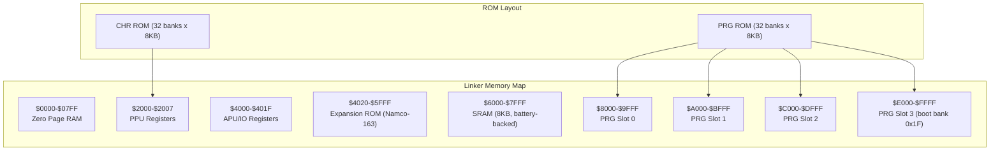
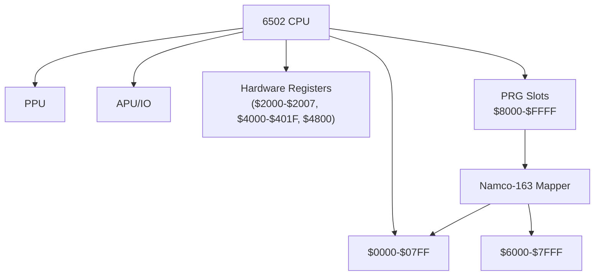
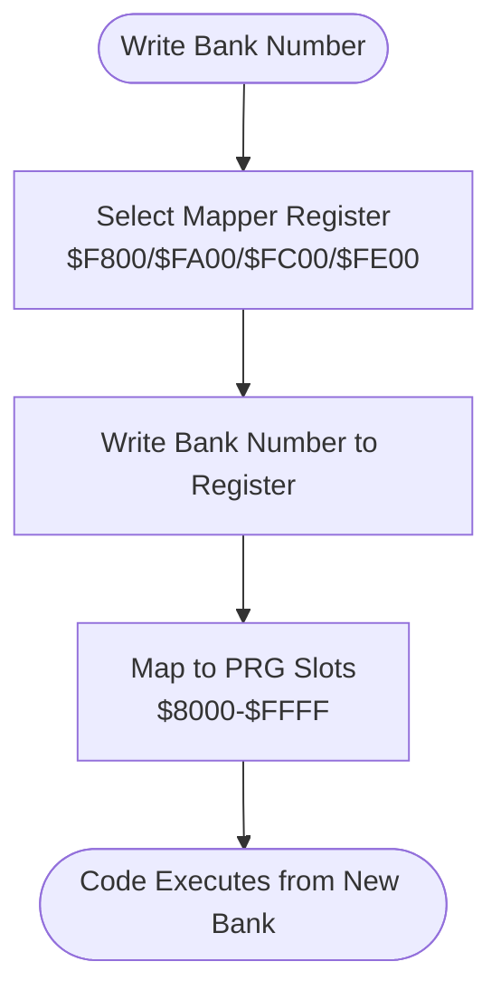
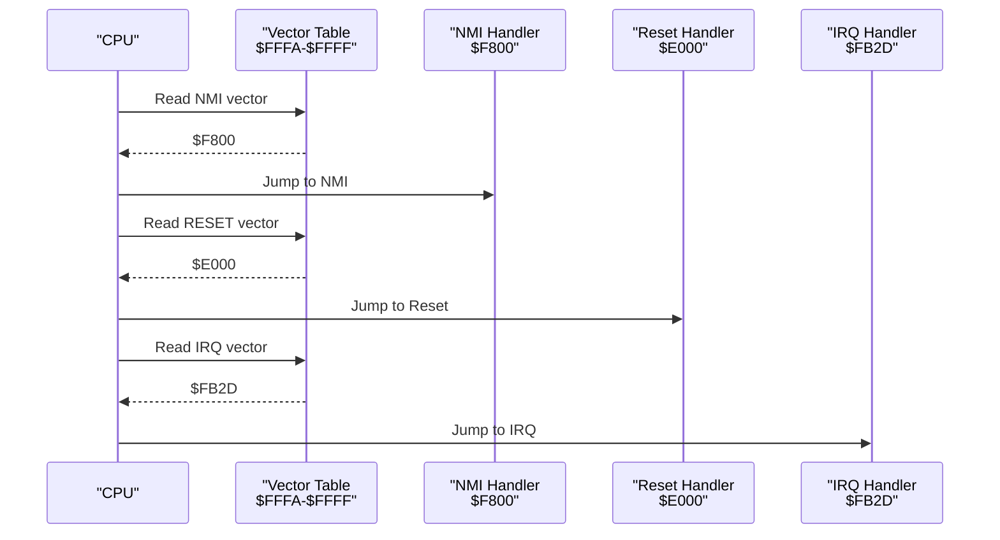
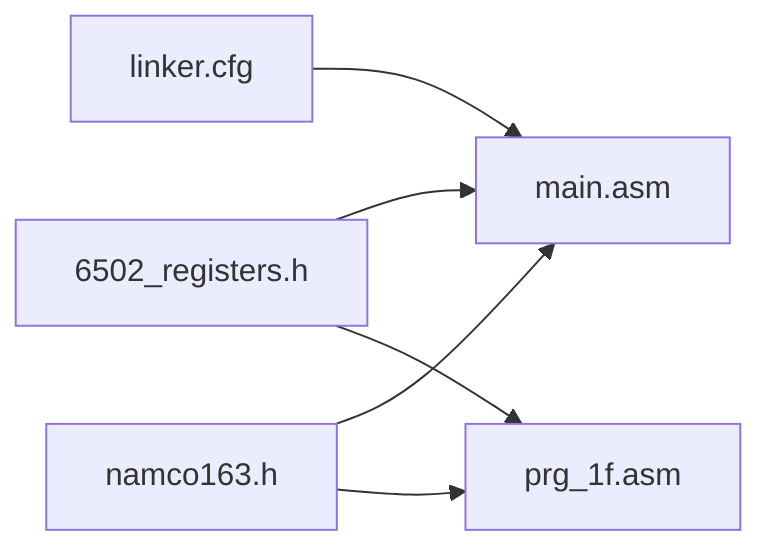

# Memory Map and Hardware

<cite>
**Referenced Files in This Document**
- [PROJECT.md](file://PROJECT.md)
- [linker.cfg](file://linker.cfg)
- [6502_registers.h](file://include/6502_registers.h)
- [namco163.h](file://include/namco163.h)
- [macros.h](file://include/macros.h)
- [main.asm](file://asm/main.asm)
- [prg_1f.asm](file://asm/banks/prg_1f.asm)
- [rom_info.h](file://rom/rom_info.h)
</cite>

## Table of Contents
1. [Introduction](#introduction)
2. [Project Structure](#project-structure)
3. [Core Components](#core-components)
4. [Architecture Overview](#architecture-overview)
5. [Detailed Component Analysis](#detailed-component-analysis)
6. [Dependency Analysis](#dependency-analysis)
7. [Performance Considerations](#performance-considerations)
8. [Troubleshooting Guide](#troubleshooting-guide)
9. [Conclusion](#conclusion)

## Introduction
This document explains the complete 6502 memory map and Namco-163 mapper specifics for the project. It covers RAM, PPU registers, APU/IO registers, and the four PRG slots with their fixed and switchable addresses. It details the Namco-163 bank switching mechanism, including the unique boot behavior where bank 0x1F is fixed at $E000-$FFFF. It also documents hardware register definitions and bank switching macros, providing both conceptual overviews for beginners and technical implementation details for experienced developers.

## Project Structure
The project is organized around a disassembly workflow for an NES game using the Namco-163 mapper. The ROM is split into 32 PRG banks (8KB each) and 32 CHR banks (8KB each). The linker configuration defines four PRG slots ($8000-$FFFF) and maps them to the Namco-163 mapper’s bank switching registers.

**Diagram sources**
- [linker.cfg: 4-16:4-16](file://linker.cfg#L4-L16)
- [PROJECT.md: 70-83:70-83](file://PROJECT.md#L70-L83)

**Section sources**
- [PROJECT.md: 70-83:70-83](file://PROJECT.md#L70-L83)
- [linker.cfg: 4-16:4-16](file://linker.cfg#L4-L16)

## Core Components
- 6502 memory map and hardware registers:
  - RAM: $0000-$07FF
  - PPU registers: $2000-$2007
  - APU/IO registers: $4000-$401F
  - Expansion ROM: $4020-$5FFF (Namco-163)
  - SRAM: $6000-$7FFF
  - PRG slots: $8000-$FFFF (four 8KB slots)
- Namco-163 mapper:
  - 32 PRG banks (8KB each), mapped to $8000-$FFFF
  - Bank switching registers at $F800, $FA00, $FC00, $FE00
  - Boot behavior: bank 0x1F fixed at $E000-$FFFF

**Section sources**
- [PROJECT.md: 70-83:70-83](file://PROJECT.md#L70-L83)
- [6502_registers.h: 5-50:5-50](file://include/6502_registers.h#L5-L50)
- [namco163.h: 6-14:6-14](file://include/namco163.h#L6-L14)

## Architecture Overview
The system uses the Namco-163 mapper to provide 32 PRG banks mapped to four 8KB PRG slots. Bank switching occurs by writing a bank number to specific addresses. At reset, bank 0x1F is fixed in PRG slot 3 ($E000-$FFFF), while the other slots are switchable. The linker configuration defines four PRG slots and places the interrupt vectors in PRG slot 0.

**Diagram sources**
- [linker.cfg: 18-30:18-30](file://linker.cfg#L18-L30)
- [PROJECT.md: 70-83:70-83](file://PROJECT.md#L70-L83)
- [6502_registers.h: 5-50:5-50](file://include/6502_registers.h#L5-L50)

**Section sources**
- [linker.cfg: 18-30:18-30](file://linker.cfg#L18-L30)
- [PROJECT.md: 70-83:70-83](file://PROJECT.md#L70-L83)

## Detailed Component Analysis

### 6502 Memory Map and Hardware Registers
- RAM: $0000-$07FF (2KB)
- PPU registers: $2000-$2007 (control, mask, status, OAM addr/data, scroll, PPU addr/data)
- APU/IO registers: $4000-$401F (pulse channels, triangle, noise, DMC, OAM DMA, sound channels, joysticks)
- Expansion ROM: $4020-$5FFF (Namco-163)
- SRAM: $6000-$7FFF (battery-backed)
- PRG slots: $8000-$FFFF (four 8KB slots)

Hardware register definitions include PPU control/mask/status bits and APU/IO register addresses. The Namco-163 registers include IRQ/sound and control addresses.

**Section sources**
- [PROJECT.md: 70-83:70-83](file://PROJECT.md#L70-L83)
- [6502_registers.h: 5-88:5-88](file://include/6502_registers.h#L5-L88)

### PRG Slots and Bank Switching
- Four PRG slots:
  - $8000-$9FFF (PRG slot 0)
  - $A000-$BFFF (PRG slot 1)
  - $C000-$DFFF (PRG slot 2)
  - $E000-$FFFF (PRG slot 3)
- Bank switching registers:
  - $F800: switch PRG bank at $8000-$9FFF
  - $FA00: switch PRG bank at $A000-$BFFF
  - $FC00: switch PRG bank at $C000-$DFFF
  - $FE00: switch PRG bank at $E000-$FFFF (fixed boot bank 0x1F)

Bank switching is performed by writing a bank number to the corresponding register. The linker configuration defines four PRG slots and maps them to the mapper’s registers.

**Section sources**
- [PROJECT.md: 84-94:84-94](file://PROJECT.md#L84-L94)
- [namco163.h: 10-14:10-14](file://include/namco163.h#L10-L14)
- [linker.cfg: 25-30:25-30](file://linker.cfg#L25-L30)

### Boot Behavior and Interrupt Vector
- Boot bank: bank 0x1F is fixed at $E000-$FFFF (PRG slot 3) at reset
- Reset handler located at $E000 in bank 0x1F
- Interrupt vectors:
  - NMI: $F800
  - RESET: $E000
  - IRQ: $FB2D

The reset handler initializes PPU/APU, clears RAM, runs mapper initialization, and dispatches to the first state via a vector table at $E07C.

**Section sources**
- [PROJECT.md: 101-117:101-117](file://PROJECT.md#L101-L117)
- [prg_1f.asm: 74-148:74-148](file://asm/banks/prg_1f.asm#L74-L148)
- [bank_1f_analysis.md: 3-9:3-9](file://code/bank_1f_analysis.md#L3-L9)

### Bank Switching Macros and Usage
The project provides bank switching macros for convenience:
- switch_bank_8000(bank)
- switch_bank_A000(bank)
- switch_bank_C000(bank)
- switch_bank_E000(bank)

These macros write the bank number to the appropriate mapper register. The main entry point demonstrates initializing PRG slot 0 with bank 0, slot 1 with bank 1, and slot 2 with bank 2, then clearing the IRQ counter.

**Section sources**
- [namco163.h: 68-86:68-86](file://include/namco163.h#L68-L86)
- [macros.h: 58-71:58-71](file://include/macros.h#L58-L71)
- [main.asm: 115-121:115-121](file://asm/main.asm#L115-L121)

### Practical Examples: Memory Addressing Patterns and Hardware Register Access
- PPU register access:
  - Example: set PPU control/mask registers via macros or direct writes
  - Example: read PPU status and wait for VBlank using macros
- APU/IO register access:
  - Example: initialize APU registers for DMC/frame counter
- Bank switching:
  - Example: switch PRG slot 0 to bank 5 using switch_bank_8000
  - Example: switch PRG slot 1 to bank 10 using switch_bank_A000
- Interrupt vectors:
  - Example: NMI handler at $F800, RESET at $E000, IRQ at $FB2D

These patterns are demonstrated in the main entry point and bank 0x1F reset handler.

**Section sources**
- [main.asm: 104-121:104-121](file://asm/main.asm#L104-L121)
- [prg_1f.asm: 74-148:74-148](file://asm/banks/prg_1f.asm#L74-L148)
- [macros.h: 8-12:8-12](file://include/macros.h#L8-L12)

### Bank Switching Flow

**Diagram sources**
- [namco163.h: 10-14:10-14](file://include/namco163.h#L10-L14)
- [PROJECT.md: 84-94:84-94](file://PROJECT.md#L84-L94)

**Section sources**
- [namco163.h: 10-14:10-14](file://include/namco163.h#L10-L14)
- [PROJECT.md: 84-94:84-94](file://PROJECT.md#L84-L94)

### Interrupt Vector Table

**Diagram sources**
- [PROJECT.md: 101-117:101-117](file://PROJECT.md#L101-L117)
- [bank_1f_analysis.md: 209-210:209-210](file://code/bank_1f_analysis.md#L209-L210)

**Section sources**
- [PROJECT.md: 101-117:101-117](file://PROJECT.md#L101-L117)
- [bank_1f_analysis.md: 209-210:209-210](file://code/bank_1f_analysis.md#L209-L210)

## Dependency Analysis
- The linker configuration defines four PRG slots and maps them to the Namco-163 mapper registers.
- The main entry point initializes PRG slot 0 with bank 0, slot 1 with bank 1, and slot 2 with bank 2.
- Bank 0x1F is fixed at $E000-$FFFF and contains the reset handler and dispatch logic.
- Bank switching macros depend on the mapper register definitions.

**Diagram sources**
- [linker.cfg: 18-54:18-54](file://linker.cfg#L18-L54)
- [main.asm: 6-7:6-7](file://asm/main.asm#L6-L7)
- [namco163.h: 10-14:10-14](file://include/namco163.h#L10-L14)
- [6502_registers.h: 5-50:5-50](file://include/6502_registers.h#L5-L50)

**Section sources**
- [linker.cfg: 18-54:18-54](file://linker.cfg#L18-L54)
- [main.asm: 6-7:6-7](file://asm/main.asm#L6-L7)
- [namco163.h: 10-14:10-14](file://include/namco163.h#L10-L14)
- [6502_registers.h: 5-50:5-50](file://include/6502_registers.h#L5-L50)

## Performance Considerations
- Bank switching overhead: Frequent bank switches can cause visible delays during rendering. Minimize switches during critical frames.
- PPU/APU initialization: Warm-up sequences and register writes should be batched to reduce overhead.
- Vector dispatch: The reset handler uses a small vector table to branch to states, avoiding large conditional blocks.

[No sources needed since this section provides general guidance]

## Troubleshooting Guide
- Incorrect bank mapping:
  - Ensure the correct bank is written to the intended mapper register.
  - Verify the linker configuration PRG slots align with the mapper registers.
- Boot issues:
  - Confirm bank 0x1F is mapped to $E000-$FFFF.
  - Verify the interrupt vectors are correctly placed at $FFFA-$FFFF.
- Register access:
  - Use the provided register definitions for PPU/APU registers.
  - For Namco-163 registers, use the addresses defined in the mapper header.

**Section sources**
- [PROJECT.md: 101-117:101-117](file://PROJECT.md#L101-L117)
- [linker.cfg: 18-30:18-30](file://linker.cfg#L18-L30)
- [6502_registers.h: 5-50:5-50](file://include/6502_registers.h#L5-L50)

## Conclusion
This document outlined the 6502 memory map and Namco-163 mapper specifics for the project. It explained the RAM, PPU/IO registers, PRG slots, and bank switching mechanism, including the unique boot behavior where bank 0x1F is fixed at $E000-$FFFF. The hardware register definitions and bank switching macros were documented, along with practical examples and troubleshooting tips. This foundation enables both beginners and experienced developers to understand and work with the system effectively.