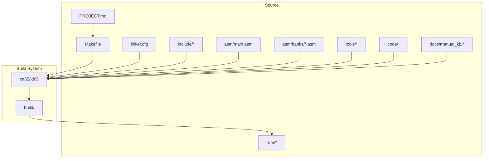
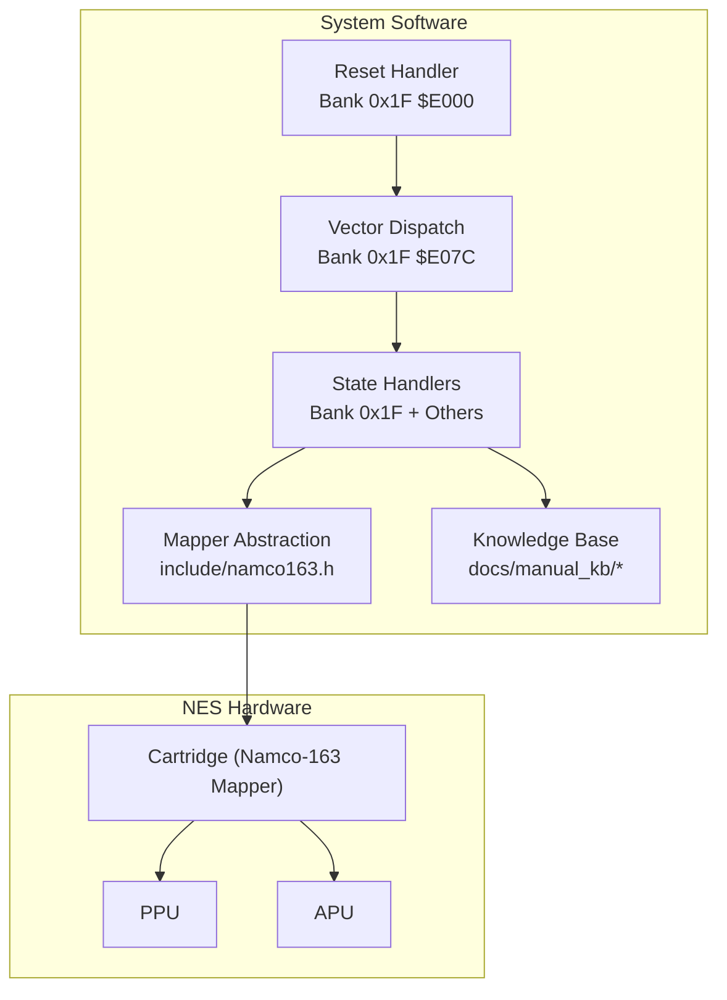
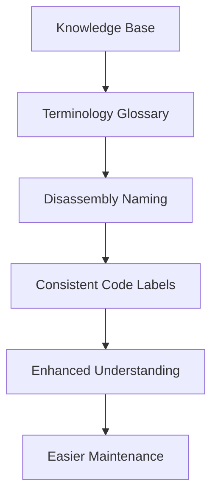
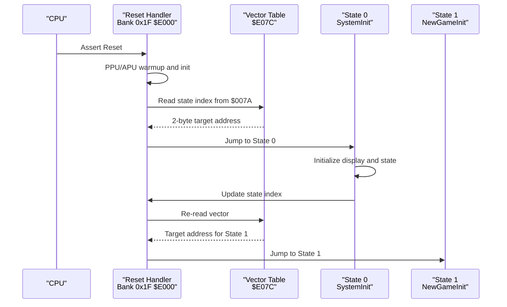
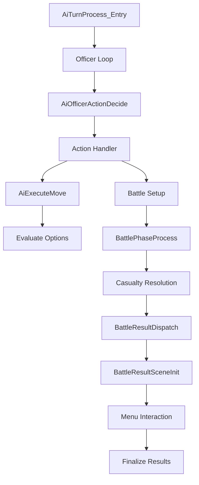
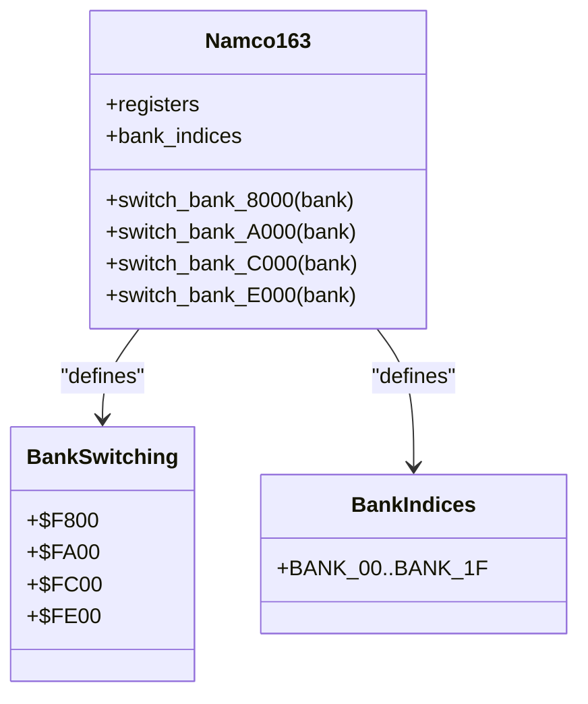
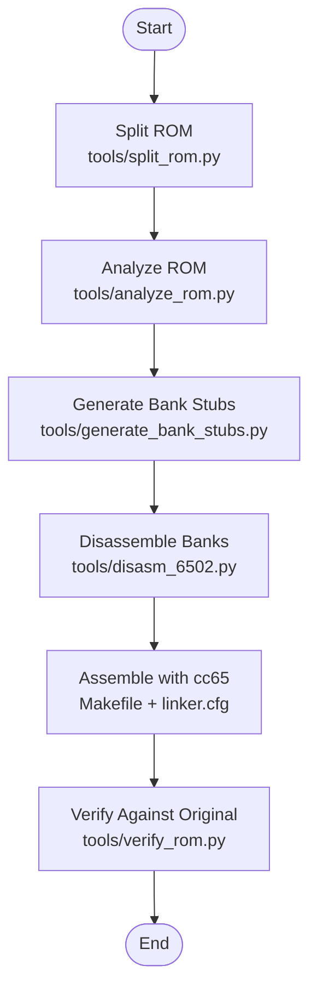
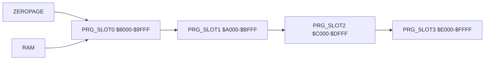
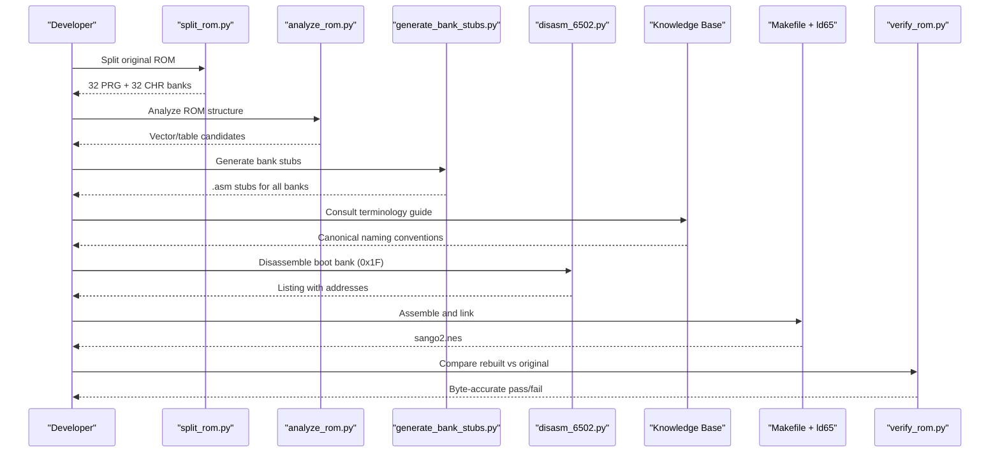
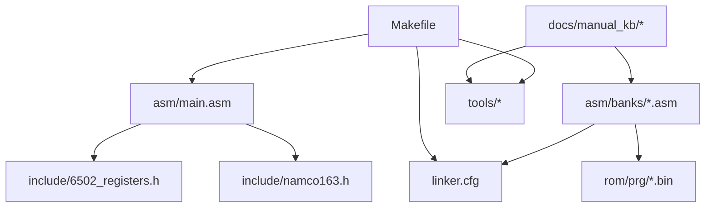

# Project Overview

<cite>
**Referenced Files in This Document**
- [PROJECT.md](file://PROJECT.md)
- [Makefile](file://Makefile)
- [linker.cfg](file://linker.cfg)
- [include/namco163.h](file://include/namco163.h)
- [include/macros.h](file://include/macros.h)
- [include/6502_registers.h](file://include/6502_registers.h)
- [include/functions.h](file://include/functions.h)
- [tools/split_rom.py](file://tools/split_rom.py)
- [tools/analyze_rom.py](file://tools/analyze_rom.py)
- [tools/generate_bank_stubs.py](file://tools/generate_bank_stubs.py)
- [tools/disasm_6502.py](file://tools/disasm_6502.py)
- [tools/verify_rom.py](file://tools/verify_rom.py)
- [asm/main.asm](file://asm/main.asm)
- [asm/banks/prg_1f.asm](file://asm/banks/prg_1f.asm)
- [asm/banks/prg_00.asm](file://asm/banks/prg_00.asm)
- [asm/banks/prg_08_09.asm](file://asm/banks/prg_08_09.asm)
- [code/bank_1f_plan.md](file://code/bank_1f_plan.md)
- [code/key_functions_analysis.md](file://code/key_functions_analysis.md)
- [docs/manual_kb/README.md](file://docs/manual_kb/README.md)
- [docs/manual_kb/terminology.md](file://docs/manual_kb/terminology.md)
- [docs/manual_kb/01-overview.md](file://docs/manual_kb/01-overview.md)
- [docs/manual_kb/04-strategy-commands.md](file://docs/manual_kb/04-strategy-commands.md)
- [docs/manual_kb/07-war-rules.md](file://docs/manual_kb/07-war-rules.md)
- [docs/manual_kb/09-battle-mode.md](file://docs/manual_kb/09-battle-mode.md)
- [docs/manual_kb/14-map.md](file://docs/manual_kb/14-map.md)
</cite>

## Update Summary
**Changes Made**
- Added comprehensive documentation of the new knowledge base structure covering 15 structured documents transcribed from original Japanese manual scans
- Enhanced terminology standardization section with detailed coverage of the semantic English glossary system
- Updated project structure documentation to include the knowledge base as a core component
- Expanded educational value section to highlight the knowledge base's role in preserving game terminology and mechanics
- Added new sections covering knowledge base integration and terminology-driven development workflow

## Table of Contents
1. [Introduction](#introduction)
2. [Project Structure](#project-structure)
3. [Core Components](#core-components)
4. [Architecture Overview](#architecture-overview)
5. [Knowledge Base Framework](#knowledge-base-framework)
6. [Detailed Component Analysis](#detailed-component-analysis)
7. [Dependency Analysis](#dependency-analysis)
8. [Performance Considerations](#performance-considerations)
9. [Troubleshooting Guide](#troubleshooting-guide)
10. [Conclusion](#conclusion)
11. [Appendices](#appendices)

## Introduction
This project is a complete reverse engineering and disassembly effort for the Namco-163 (Mapper 19) strategy game Sangokushi 2 - Haou no Tairiku (J) for the Nintendo Entertainment System (NES). The goal is to produce a faithful, byte-accurate recreation of the original ROM using modern tooling and a modular, bank-based organization. The project covers 32 programmable PRG banks (256KB) and mirrors the game's mapper abstraction to support 8KB bank switching across four PRG slots ($8000–$FFFF). It also documents the reset handler, vector dispatch mechanism, and the bank-switched code that implements gameplay states, display, audio, and I/O.

Beyond technical reconstruction, this project serves as an educational resource for retro gaming preservation. It demonstrates how to split, analyze, and rebuild a complex mapper-based ROM while maintaining byte-for-byte fidelity, and it provides a reusable framework applicable to other games using similar mappers. **The project now includes a comprehensive knowledge base structure containing 15 structured documents transcribed from the original Japanese manual scans**, establishing a canonical reference framework for terminology standardization and game mechanics understanding throughout the disassembly process.

## Project Structure
The repository is organized around a modular bank-based approach and a cc65 toolchain integration, enhanced by a structured knowledge base system. The structure supports incremental disassembly and verification:

- asm/: Assembly entry point and per-bank stubs
- include/: 6502/PPU/APU/Namco-163 register and macro definitions
- rom/: Split PRG/CHR banks and combined binaries
- tools/: Python scripts for ROM splitting, analysis, disassembly, bank stub generation, and verification
- code/: Disassembly plans and analyses for key banks and functions
- docs/manual_kb/: **New** Comprehensive knowledge base with 15 structured documents from original Japanese manual
- build/: Build outputs (object files, listings, map, and final ROM)
- Top-level configuration: Makefile and linker.cfg

**Diagram sources**
- [Makefile:1-102](file://Makefile#L1-L102)
- [linker.cfg:1-55](file://linker.cfg#L1-L55)

**Section sources**
- [PROJECT.md:14-47](file://PROJECT.md#L14-L47)
- [Makefile:12-31](file://Makefile#L12-L31)
- [linker.cfg:18-54](file://linker.cfg#L18-L54)

## Core Components
- Modular bank organization: 32 PRG banks (8KB each) mapped to four 8KB slots ($8000–$FFFF). Bank switching is performed via writes to $F800–$FFFF.
- cc65 toolchain integration: ca65 assembler and ld65 linker are orchestrated via Makefile and linker.cfg to assemble and link the project into a final ROM.
- Automated analysis pipeline: Python tools split the ROM, analyze structure, generate bank stubs, disassemble binaries, and verify byte-identical rebuilds.
- Mapper abstraction: include/namco163.h defines register addresses, bank indices, and macros for bank switching, enabling consistent mapper usage across code.
- Reset handler and vector dispatch: asm/main.asm and asm/banks/prg_1f.asm implement the reset routine and a vector table-driven state machine that dispatches to game logic across banks.
- **Knowledge base framework**: Structured documentation system providing canonical terminology and game mechanics reference for consistent disassembly naming and understanding.

Practical outcomes:
- Byte-accurate ROM verification against the original
- Incremental disassembly workflow from the boot bank to other banks
- Reusable bank stubs and linker segments for ongoing analysis
- **Standardized terminology framework for consistent label naming across all disassembled code**

**Section sources**
- [PROJECT.md:84-117](file://PROJECT.md#L84-L117)
- [include/namco163.h:10-87](file://include/namco163.h#L10-L87)
- [asm/main.asm:25-141](file://asm/main.asm#L25-L141)
- [asm/banks/prg_1f.asm:74-148](file://asm/banks/prg_1f.asm#L74-L148)

## Architecture Overview
The architecture centers on a mapper abstraction layer and a bank-based code layout. The reset handler in bank 0x1F initializes the system and reads a vector table to dispatch to state handlers. These handlers may branch to bank-switched routines at $A000–$A045 and beyond, depending on the current game state.

**Diagram sources**
- [PROJECT.md:101-117](file://PROJECT.md#L101-L117)
- [include/namco163.h:10-87](file://include/namco163.h#L10-L87)
- [asm/banks/prg_1f.asm:153-169](file://asm/banks/prg_1f.asm#L153-L169)

**Section sources**
- [PROJECT.md:101-117](file://PROJECT.md#L101-L117)
- [include/namco163.h:10-87](file://include/namco163.h#L10-L87)

## Knowledge Base Framework
**Updated** The project now includes a comprehensive knowledge base structure consisting of 15 structured documents transcribed from the original Japanese manual scans. This framework establishes a canonical reference system for terminology standardization and game mechanics understanding throughout the disassembly process.

### Knowledge Base Structure
The knowledge base is organized into thematic categories covering all aspects of the game:

| Category | Documents | Purpose |
|----------|-----------|---------|
| **Overview & Setup** | 01-overview.md | Game premise, modes, victory rules, setup flow |
| **Statistics & Data** | 02-general-stats.md, 03-country-stats.md | Officer attributes, country statistics |
| **Gameplay Mechanics** | 04-strategy-commands.md, 05-events.md | Strategy mode commands, monthly events |
| **Reference Tables** | 06-reference-tables.md | Quick reference tables for operations |
| **War System** | 07-war-rules.md | War rules, victory conditions, processing |
| **Tactical Systems** | 08-tactical-mode.md, 09-battle-mode.md, 10-duel-mode.md | Tactical, battle, and duel mode mechanics |
| **Progression** | 11-levelup.md | Officer level-up system |
| **Strategy & Guidance** | 12-strategy-advice.md, 13-ruler-guide.md | Strategic advice and ruler-specific guides |
| **World Map** | 14-map.md | Complete 30-country faction map |

### Terminology Standardization System
The consolidated semantic English glossary ([terminology.md](file://docs/manual_kb/terminology.md)) serves as the authoritative vocabulary source for naming labels, procedures, and RAM symbols throughout the disassembly. Key features include:

- **PascalCase Convention**: All identifiers follow established PascalCase semantic-English convention (e.g., `StratagemExecute`, `FormationSelect`)
- **Domain-Specific Naming**: Dispatch/handler routines follow patterns like `<Domain>ActionDispatch`, `<Domain>CommandSelect`
- **Mode Hierarchy**: Clear distinction between Strategy Mode, Tactical Mode, Battle Mode, and Duel Mode
- **Statistical Terminology**: Canonical names for officer stats, country data, and game variables

**Diagram sources**
- [docs/manual_kb/README.md:1-15](file://docs/manual_kb/README.md#L1-L15)
- [docs/manual_kb/terminology.md:1-16](file://docs/manual_kb/terminology.md#L1-L16)

**Section sources**
- [docs/manual_kb/README.md:16-97](file://docs/manual_kb/README.md#L16-L97)
- [docs/manual_kb/terminology.md:17-293](file://docs/manual_kb/terminology.md#L17-L293)

## Detailed Component Analysis

### Bank 0x1F: Reset Handler, Vector Dispatch, and Boot Bank Responsibilities
Bank 0x1F is the boot bank mapped to $E000–$FFFF at startup. It contains:
- Reset handler that initializes PPU/APU, clears RAM, and performs mapper initialization
- Vector dispatch table indexing into state handlers
- State handlers for system initialization, menus, gameplay phases, and turn summaries
- Supporting utilities: RNG, data access functions, PPU helpers, sound engine, and IRQ/NMI infrastructure

**Diagram sources**
- [asm/banks/prg_1f.asm:74-148](file://asm/banks/prg_1f.asm#L74-L148)
- [asm/banks/prg_1f.asm:153-169](file://asm/banks/prg_1f.asm#L153-L169)

**Section sources**
- [PROJECT.md:101-117](file://PROJECT.md#L101-L117)
- [asm/banks/prg_1f.asm:74-148](file://asm/banks/prg_1f.asm#L74-L148)
- [code/bank_1f_plan.md:8-18](file://code/bank_1f_plan.md#L8-L18)

### Enhanced Section 7: Combined Banks 08+09 - AI Turn Processing and Battle System
**Updated** Enhanced Section 7 coverage now includes comprehensive jump-table entries and internal procedures for combined banks 08+09 with B08_09_* prefixed function declarations. This section implements the core AI turn processing and battle system functionality.

The combined banks 08+09 provide a 16KB memory space ($A000-$DFFF) containing:
- **Jump Table Entry Points**: 14 entry points at $A000-$A02A handling AI turn processing, battle setup, casualty resolution, and result scenes
- **AI Decision Engine**: Complete AI officer action system with strategic decision-making, movement planning, and combat evaluation
- **Battle System**: Full battle phase processing including unit positioning, combat calculations, and result scene management
- **Strategic Elements**: Formation management, terrain effects, and special officer validation

**Diagram sources**
- [include/functions.h:897-911](file://include/functions.h#L897-L911)
- [asm/banks/prg_08_09.asm:84-113](file://asm/banks/prg_08_09.asm#L84-L113)

**Section sources**
- [include/functions.h:887-1071](file://include/functions.h#L887-L1071)
- [asm/banks/prg_08_09.asm:1-200](file://asm/banks/prg_08_09.asm#L1-L200)

### Mapper Abstraction and Bank Switching
The project encapsulates mapper behavior behind include/namco163.h, which defines:
- Register addresses for bank switching ($F800–$FFFF)
- Bank indices (BANK_00–BANK_1F)
- Macros for switching PRG banks at $8000, $A000, $C000, and $E000

**Diagram sources**
- [include/namco163.h:10-87](file://include/namco163.h#L10-L87)

**Section sources**
- [include/namco163.h:10-87](file://include/namco163.h#L10-L87)
- [PROJECT.md:84-99](file://PROJECT.md#L84-L99)

### Automated Analysis Pipeline
The pipeline integrates Python tools with the cc65 toolchain to split, analyze, disassemble, and verify ROMs:

**Diagram sources**
- [tools/split_rom.py:38-122](file://tools/split_rom.py#L38-L122)
- [tools/analyze_rom.py:10-128](file://tools/analyze_rom.py#L10-L128)
- [tools/generate_bank_stubs.py:12-46](file://tools/generate_bank_stubs.py#L12-L46)
- [tools/disasm_6502.py:286-334](file://tools/disasm_6502.py#L286-L334)
- [Makefile:37-48](file://Makefile#L37-L48)
- [tools/verify_rom.py:10-51](file://tools/verify_rom.py#L10-L51)

**Section sources**
- [tools/split_rom.py:38-122](file://tools/split_rom.py#L38-L122)
- [tools/analyze_rom.py:10-128](file://tools/analyze_rom.py#L10-L128)
- [tools/generate_bank_stubs.py:12-46](file://tools/generate_bank_stubs.py#L12-L46)
- [tools/disasm_6502.py:286-334](file://tools/disasm_6502.py#L286-L334)
- [Makefile:37-48](file://Makefile#L37-L48)
- [tools/verify_rom.py:10-51](file://tools/verify_rom.py#L10-L51)

### Linker Configuration and Segments
linker.cfg defines the memory map and segments for the four PRG slots. As banks are disassembled, new segments are added to map code into the correct slots. The configuration ensures that the reset vector and interrupt vectors are placed correctly for the boot bank.

**Diagram sources**
- [linker.cfg:18-54](file://linker.cfg#L18-54)

**Section sources**
- [linker.cfg:18-54](file://linker.cfg#L18-54)
- [PROJECT.md:152-158](file://PROJECT.md#L152-L158)

### Practical Workflow: From ROM to Verified Disassembly
- Start with the original ROM and split it into 32 PRG banks and 32 CHR banks
- Analyze the ROM to identify hotspots and likely reset/vector locations
- Generate bank stubs for all PRG banks
- Disassemble the boot bank (0x1F) first to understand the reset handler and vector dispatch
- Replace stubs with real disassembly and update linker.cfg segments accordingly
- Build with cc65 and verify byte-for-byte against the original
- **Use knowledge base terminology for consistent labeling throughout the process**

**Diagram sources**
- [tools/split_rom.py:38-122](file://tools/split_rom.py#L38-L122)
- [tools/analyze_rom.py:10-128](file://tools/analyze_rom.py#L10-L128)
- [tools/generate_bank_stubs.py:12-46](file://tools/generate_bank_stubs.py#L12-L46)
- [tools/disasm_6502.py:286-334](file://tools/disasm_6502.py#L286-L334)
- [Makefile:37-48](file://Makefile#L37-L48)
- [tools/verify_rom.py:10-51](file://tools/verify_rom.py#L10-L51)

**Section sources**
- [PROJECT.md:134-151](file://PROJECT.md#L134-L151)
- [tools/split_rom.py:38-122](file://tools/split_rom.py#L38-L122)
- [tools/analyze_rom.py:10-128](file://tools/analyze_rom.py#L10-L128)
- [tools/generate_bank_stubs.py:12-46](file://tools/generate_bank_stubs.py#L12-L46)
- [tools/disasm_6502.py:286-334](file://tools/disasm_6502.py#L286-L334)
- [Makefile:37-48](file://Makefile#L37-L48)
- [tools/verify_rom.py:10-51](file://tools/verify_rom.py#L10-L51)

## Dependency Analysis
The project exhibits strong cohesion within its modular bank structure and clean separation of concerns:

- asm/main.asm depends on include/namco163.h and include/6502_registers.h for mapper and register definitions
- Bank stubs in asm/banks/ depend on rom/prg/ for original binary inclusion and on linker.cfg for segment placement
- Tools are decoupled and invoked via Makefile targets, enabling reproducible builds
- **Knowledge base documents provide cross-references between game mechanics and implementation details**

**Diagram sources**
- [asm/main.asm:6-7](file://asm/main.asm#L6-L7)
- [include/namco163.h:10-87](file://include/namco163.h#L10-L87)
- [include/6502_registers.h:5-43](file://include/6502_registers.h#L5-L43)
- [linker.cfg:18-54](file://linker.cfg#L18-54)
- [Makefile:19-28](file://Makefile#L19-L28)

**Section sources**
- [asm/main.asm:6-7](file://asm/main.asm#L6-L7)
- [include/namco163.h:10-87](file://include/namco163.h#L10-L87)
- [include/6502_registers.h:5-43](file://include/6502_registers.h#L5-L43)
- [linker.cfg:18-54](file://linker.cfg#L18-54)
- [Makefile:19-28](file://Makefile#L19-L28)

## Performance Considerations
- Bank switching overhead: Frequent bank switches incur extra cycles and must be minimized in tight loops. The project's vector dispatch and state handlers are designed to reduce unnecessary switches.
- PPU/APU initialization: Warmup sequences and register writes are batched to avoid flicker and ensure deterministic timing.
- Disassembly accuracy: Using a dedicated disassembler with correct addressing modes and base addresses prevents misinterpretation of data as code, reducing rework during verification.
- AI processing efficiency: The enhanced Section 7 implementation optimizes AI turn processing through efficient officer scanning and decision trees.
- **Knowledge base integration**: Terminology consistency reduces cognitive load during development and maintenance, improving overall productivity.

## Troubleshooting Guide
Common issues and remedies:
- Incorrect bank mapping: Ensure bank indices and switch addresses are aligned with include/namco163.h and linker.cfg. Misalignment leads to incorrect code execution or crashes.
- Vector table misreads: Verify the vector table at $E07C and the state index at $007A. Off-by-one errors here cause jumps to invalid addresses.
- Disassembler base address errors: When disassembling banked code, use the correct base address so that CPU addresses map to file offsets accurately.
- Verification failures: Use tools/verify_rom.py to pinpoint mismatch locations and iterate until byte-identical matches are achieved.
- Section 7 integration: When working with combined banks 08+09, ensure proper bank switching between $A000-$BFFF and $C000-$DFFF ranges.
- **Terminology inconsistencies**: Refer to docs/manual_kb/terminology.md for canonical naming conventions when creating new labels or procedures.

**Section sources**
- [include/namco163.h:10-87](file://include/namco163.h#L10-L87)
- [linker.cfg:18-54](file://linker.cfg#L18-54)
- [tools/verify_rom.py:10-51](file://tools/verify_rom.py#L10-L51)

## Conclusion
This project demonstrates a robust, modular approach to reverse engineering a mapper-based NES game. By combining a mapper abstraction, bank-stubbed assembly, an automated analysis pipeline, and a comprehensive knowledge base framework, it achieves both educational clarity and technical fidelity. The enhanced Section 7 coverage for combined banks 08+09 provides comprehensive documentation of the AI turn processing and battle system, contributing significantly to understanding the game's strategic mechanics. **The addition of the knowledge base structure represents a major advancement in the project's ability to preserve and communicate game terminology and mechanics.** The workflow from ROM splitting to verified disassembly provides a template applicable to other classic games, contributing to the preservation and understanding of NES architecture.

## Appendices

### Beginner-Friendly Concepts
- Bank switching: The act of replacing the contents of an 8KB window in the $8000–$FFFF range by writing to special addresses. This lets a cartridge fit more code than the console's fixed window allows.
- Vector dispatch: A table of addresses that the reset handler consults to decide where to jump next. It enables a compact dispatch mechanism across many states.
- Mapper abstraction: Encapsulating mapper-specific details (register addresses, bank indices, macros) in a single header file simplifies code reuse and reduces errors.
- Combined banks: Multiple 8KB banks can be logically combined to create larger functional units, such as the 16KB AI and battle system in banks 08+09.
- **Knowledge base utilization**: The structured documentation system provides authoritative references for game terminology, mechanics, and implementation guidance throughout the disassembly process.

**Section sources**
- [PROJECT.md:84-117](file://PROJECT.md#L84-L117)
- [include/namco163.h:10-87](file://include/namco163.h#L10-L87)

### Experienced Developer Notes
- Segment management: As new banks are disassembled, add corresponding segments in linker.cfg and assign code to the correct PRG slots.
- Interrupt vectors: Ensure the reset vector points to the boot bank and that NMI/IRQ vectors are correctly placed in the vector area.
- Data vs code: Use tools/disasm_6502.py with accurate base addresses to distinguish data from code. Replace stubs with proper segments and labels.
- Section 7 development: When extending the AI system, maintain consistency with existing B08_09_* naming conventions and follow the established jump table pattern.
- **Knowledge base integration**: Leverage the terminology glossary and game mechanics documentation to ensure consistent naming and understanding across all disassembled components.

**Section sources**
- [linker.cfg:32-54](file://linker.cfg#L32-L54)
- [PROJECT.md:134-151](file://PROJECT.md#L134-L151)
- [tools/disasm_6502.py:286-334](file://tools/disasm_6502.py#L286-L334)
- [include/functions.h:887-1071](file://include/functions.h#L887-L1071)

### Knowledge Base Integration Guide
**New** The knowledge base serves as a central reference for understanding game mechanics and ensuring consistent terminology throughout the disassembly process.

#### Key Resources
- **Primary Reference**: [docs/manual_kb/README.md](file://docs/manual_kb/README.md) - Complete index and scan-to-page mapping
- **Terminology Authority**: [docs/manual_kb/terminology.md](file://docs/manual_kb/terminology.md) - Consolidated semantic English glossary
- **Game Mechanics**: Individual documents covering specific aspects of gameplay (strategy commands, battle systems, etc.)

#### Usage Patterns
1. **Before implementing new features**: Consult relevant knowledge base documents for canonical terminology
2. **When naming labels/procedures**: Follow PascalCase semantic-English conventions from terminology.md
3. **For understanding game logic**: Reference specific mechanic documents for accurate implementation
4. **During code review**: Verify terminology consistency against the knowledge base

**Section sources**
- [docs/manual_kb/README.md:1-97](file://docs/manual_kb/README.md#L1-L97)
- [docs/manual_kb/terminology.md:1-293](file://docs/manual_kb/terminology.md#L1-L293)