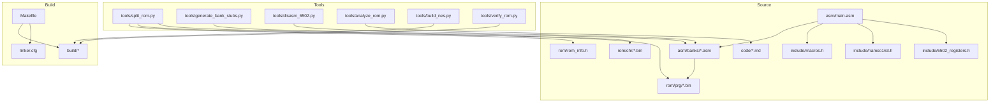
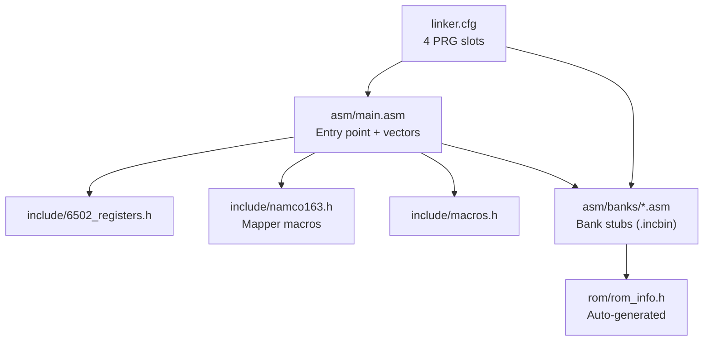
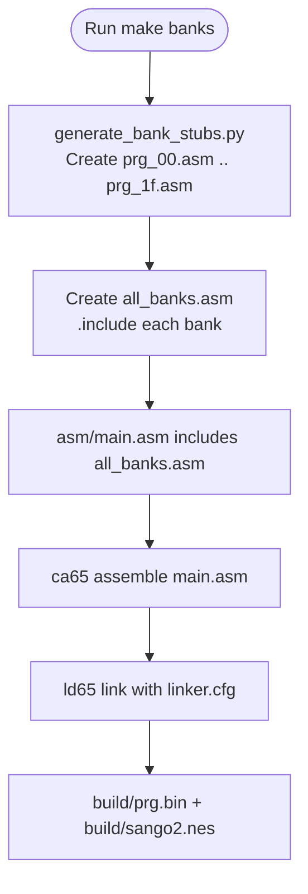
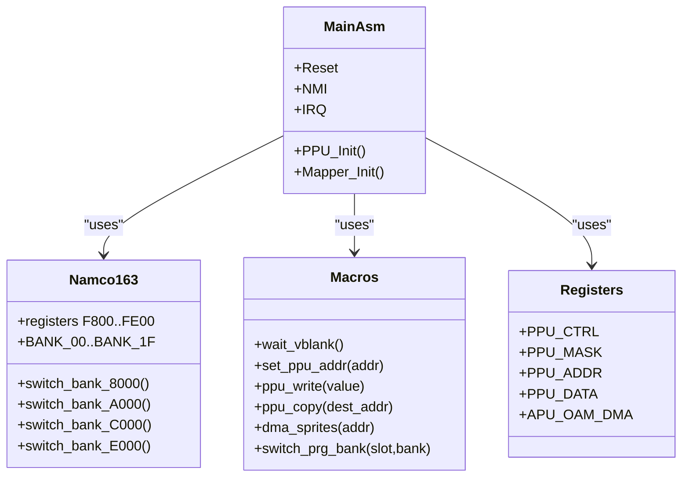
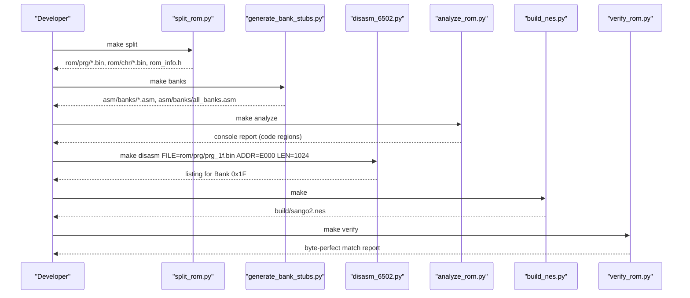
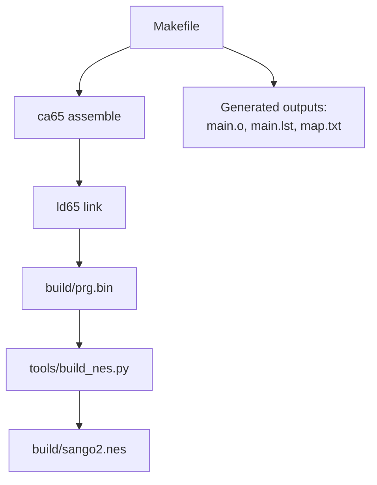
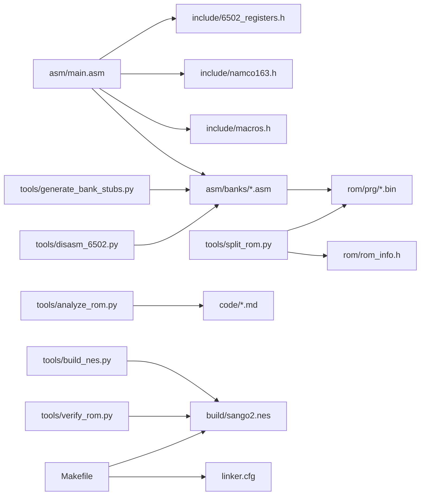

# Project Structure

<cite>
**Referenced Files in This Document**
- [PROJECT.md](file://PROJECT.md)
- [Makefile](file://Makefile)
- [linker.cfg](file://linker.cfg)
- [asm/main.asm](file://asm/main.asm)
- [asm/banks/prg_00.asm](file://asm/banks/prg_00.asm)
- [include/macros.h](file://include/macros.h)
- [include/namco163.h](file://include/namco163.h)
- [include/6502_registers.h](file://include/6502_registers.h)
- [tools/split_rom.py](file://tools/split_rom.py)
- [tools/generate_bank_stubs.py](file://tools/generate_bank_stubs.py)
- [tools/disasm_6502.py](file://tools/disasm_6502.py)
- [tools/analyze_rom.py](file://tools/analyze_rom.py)
- [tools/verify_rom.py](file://tools/verify_rom.py)
- [tools/build_nes.py](file://tools/build_nes.py)
- [code/bank_1f_analysis.md](file://code/bank_1f_analysis.md)
</cite>

## Table of Contents
1. [Introduction](#introduction)
2. [Project Structure](#project-structure)
3. [Core Components](#core-components)
4. [Architecture Overview](#architecture-overview)
5. [Detailed Component Analysis](#detailed-component-analysis)
6. [Dependency Analysis](#dependency-analysis)
7. [Performance Considerations](#performance-considerations)
8. [Troubleshooting Guide](#troubleshooting-guide)
9. [Conclusion](#conclusion)

## Introduction
This document explains the organizational layout of the sango2dasm repository, focusing on how the codebase is structured around a bank-based disassembly pipeline for the Namco-163 (Mapper 19) game Sangokushi 2 - Haou no Tairiku (J). It covers the purpose and relationships of major directories, the modular bank stubs system, hardware abstraction via include files, and the automated analysis pipeline. It also describes the build system and generated outputs, providing both beginner-friendly overviews and technical details for experienced developers.

## Project Structure
The repository follows a clear, modular layout centered on a 32-bank PRG ROM architecture and a reusable disassembly pipeline:

- asm/: Top-level assembly entry point and bank sources
  - asm/main.asm: Entry point (reset/NMI/IRQ vectors) and global code
  - asm/banks/: Bank assembly files — a mix of stub files (prg_00.asm … prg_1f.asm) and fully disassembled combined-pair files:
    - prg_0a_0b.asm: Banks $0A+$0B combined 16KB ($A000-$DFFF) — AI turn processing, province evaluation
    - prg_0c_0d.asm: Banks $0C+$0D combined 16KB ($A000-$DFFF) — officer exchange, strategic command
    - prg_17_18.asm: Banks $17+$18 combined 16KB ($A000-$DFFF) — display and battle systems
    - prg_1d_1e.asm: Banks $1D+$1E combined 16KB ($A000-$DFFF) — domestic affairs, scene renderer
    - prg_1f.asm: Boot bank ($E000-$FFFF) — reset handler, state dispatch, sound engine, math, RNG
- include/: Hardware abstractions, shared macros, and symbolic labels
  - include/6502_registers.h: PPU/APU register definitions
  - include/namco163.h: Mapper constants and bank switching macros
  - include/macros.h: Common 6502 helper macros
  - include/functions.h: Symbolic function and data label definitions (BXX_Name convention, 932 lines)
- rom/: ROM binaries and auto-generated info
  - rom/prg/: 32 x 8KB PRG bank binaries
  - rom/chr/: 32 x 8KB CHR bank binaries
  - rom/rom_info.h: Auto-generated ROM metadata
- tools/: Python scripts implementing the automated analysis pipeline
  - Core pipeline: split_rom.py, generate_bank_stubs.py, disasm_6502.py, analyze_rom.py, build_nes.py, verify_rom.py
  - Bank-specific disassemblers: disasm_prg.py (general), disasm_0a_0b.py, disasm_17_18.py, disasm_1d*.py, disasm_1e*.py, disasm_bank_1f.py
  - Analysis and verification: analyze_*.py, verify_*.py, check_*.py
  - Code transformation: transform_*.py, proc_wrap_general.py, add_procs.py, localize_labels.py, rename_loc_labels.py
- code/: Disassembly and analysis artifacts (markdown reports, function tables)
- build/: Generated outputs from the build system
  - sango2.nes: Final ROM
  - prg.bin: Raw PRG output from the linker
  - main.o, main.lst, map.txt: Object, listing, and map files

### Current Disassembly State
| Bank(s) | File | Status |
|---|---|---|
| $0A+$0B | prg_0a_0b.asm | Fully disassembled (10,427 lines) |
| $0C+$0D | prg_0c_0d.asm | Fully disassembled (8,533 lines) |
| $17+$18 | prg_17_18.asm | Fully disassembled (9,402 lines) |
| $1D+$1E | prg_1d_1e.asm | Fully disassembled (5,965 lines) |
| $1F | prg_1f.asm | Fully disassembled (4,562 lines) |
| $00–$09, $0E–$16, $19–$1C | prg_XX.asm | Stubs (.incbin placeholders) |

**Diagram sources**
- [Makefile:1-102](file://Makefile#L1-L102)
- [linker.cfg:1-55](file://linker.cfg#L1-L55)
- [asm/main.asm:1-141](file://asm/main.asm#L1-L141)
- [asm/banks/prg_00.asm:1-13](file://asm/banks/prg_00.asm#L1-L13)
- [include/namco163.h:1-87](file://include/namco163.h#L1-L87)
- [include/macros.h:1-72](file://include/macros.h#L1-L72)
- [tools/split_rom.py:1-140](file://tools/split_rom.py#L1-L140)
- [tools/generate_bank_stubs.py:1-53](file://tools/generate_bank_stubs.py#L1-L53)
- [tools/disasm_6502.py:1-363](file://tools/disasm_6502.py#L1-L363)
- [tools/analyze_rom.py:1-135](file://tools/analyze_rom.py#L1-L135)
- [tools/build_nes.py:1-58](file://tools/build_nes.py#L1-L58)
- [tools/verify_rom.py:1-73](file://tools/verify_rom.py#L1-L73)

**Section sources**
- [PROJECT.md:14-47](file://PROJECT.md#L14-L47)
- [Makefile:12-29](file://Makefile#L12-L29)

## Core Components
- Bank stubs system: 32 individual PRG bank files under asm/banks/ serve as placeholders for disassembly. Each stub maps to a specific 8KB PRG slot and includes the corresponding rom/prg/prg_xx.bin via .incbin. The system is generated by tools/generate_bank_stubs.py and orchestrated by Makefile targets.
- Hardware abstractions: include/ provides register definitions and mapper macros for the 6502 and Namco-163. These files are included by asm/main.asm and propagated to bank stubs, enabling consistent hardware access across the codebase.
- Automated analysis pipeline: tools/ scripts implement the “disassembly pipeline”:
  - split_rom.py splits the original ROM into 8KB PRG/CHR banks and generates rom_info.h
  - generate_bank_stubs.py creates bank stubs and an all_banks.asm include
  - disasm_6502.py performs basic 6502 disassembly for initial exploration
  - analyze_rom.py identifies code regions and potential entry points
  - build_nes.py constructs a valid NES ROM with iNES header
  - verify_rom.py compares the rebuilt ROM with the original for byte-perfect fidelity
- Build system: Makefile coordinates assembling, linking, and packaging. It invokes ca65 and ld65, manages output artifacts, and exposes targets for splitting ROM, generating bank stubs, disassembling, analyzing, and verification.

Practical navigation tips:
- Start with PROJECT.md to understand the ROM characteristics and bank switching model.
- Use make split to populate rom/prg/ and rom/chr/.
- Use make banks to generate asm/banks/ and include all_banks.asm.
- Begin disassembly with make analyze and then make disasm targeting specific banks (e.g., Bank 0x1F).
- Track progress with make verify against the original ROM.

**Section sources**
- [PROJECT.md:14-47](file://PROJECT.md#L14-L47)
- [PROJECT.md:134-151](file://PROJECT.md#L134-L151)
- [Makefile:50-75](file://Makefile#L50-L75)
- [tools/split_rom.py:38-122](file://tools/split_rom.py#L38-L122)
- [tools/generate_bank_stubs.py:12-47](file://tools/generate_bank_stubs.py#L12-L47)
- [tools/disasm_6502.py:286-334](file://tools/disasm_6502.py#L286-L334)
- [tools/analyze_rom.py:10-128](file://tools/analyze_rom.py#L10-L128)
- [tools/build_nes.py:10-51](file://tools/build_nes.py#L10-L51)
- [tools/verify_rom.py:10-51](file://tools/verify_rom.py#L10-L51)

## Architecture Overview
The architecture centers on a bank-based PRG layout with 32 banks mapped to 4 switchable 8KB slots ($8000-$FFFF). The reset handler resides in Bank 0x1F at $E000-$FFFF and uses a vector table to dispatch to game states. The linker.cfg defines 4 PRG slots and code segments aligned with this mapper model. The include/ directory centralizes hardware abstractions and mapper macros, ensuring consistent bank switching and register access across all code.

**Diagram sources**
- [asm/main.asm:6-141](file://asm/main.asm#L6-L141)
- [include/namco163.h:10-87](file://include/namco163.h#L10-L87)
- [include/macros.h:8-72](file://include/macros.h#L8-L72)
- [linker.cfg:18-54](file://linker.cfg#L18-L54)
- [tools/split_rom.py:99-121](file://tools/split_rom.py#L99-L121)

**Section sources**
- [PROJECT.md:84-117](file://PROJECT.md#L84-L117)
- [linker.cfg:18-54](file://linker.cfg#L18-L54)
- [asm/main.asm:25-141](file://asm/main.asm#L25-L141)

## Detailed Component Analysis

### Bank Stubs System
Purpose:
- Provide a modular, replaceable scaffold for each PRG bank
- Allow incremental disassembly by replacing .incbin with actual code segments
- Enable precise mapping to 8KB PRG slots via linker segments

Structure:
- 32 files named prg_00.asm through prg_1f.asm
- Each file includes a .segment directive for its bank and .incbin of the corresponding rom/prg/prg_xx.bin
- all_banks.asm aggregates all bank stubs for inclusion by the main assembly

Workflow:
- Generate stubs with make banks
- Replace .incbin with disassembled code and proper .segment directives
- Update linker.cfg to add new MEMORY regions and SEGMENTS as banks are disassembled

**Diagram sources**
- [tools/generate_bank_stubs.py:12-47](file://tools/generate_bank_stubs.py#L12-L47)
- [Makefile:38-43](file://Makefile#L38-L43)
- [linker.cfg:32-54](file://linker.cfg#L32-L54)

**Section sources**
- [PROJECT.md:23-24](file://PROJECT.md#L23-L24)
- [PROJECT.md:148-150](file://PROJECT.md#L148-L150)
- [asm/banks/prg_00.asm:1-13](file://asm/banks/prg_00.asm#L1-L13)
- [tools/generate_bank_stubs.py:12-47](file://tools/generate_bank_stubs.py#L12-L47)

### Mapper Macros and Hardware Abstractions
Purpose:
- Encapsulate Namco-163 mapper specifics and 6502 register addresses
- Provide consistent bank switching macros across the codebase

Key elements:
- include/namco163.h: Defines mapper registers, bank indices (BANK_00–BANK_1F), and macros like switch_bank_8000
- include/6502_registers.h: PPU ($2000–$2007), APU ($4000–$401F) register addresses and bit definitions
- include/macros.h: Common macros for PPU/PPU DMA operations and bank switching

Usage:
- asm/main.asm includes these headers and uses switch_bank_* macros during initialization
- Bank stubs inherit these definitions via the include chain

**Diagram sources**
- [include/namco163.h:10-87](file://include/namco163.h#L10-L87)
- [include/macros.h:8-72](file://include/macros.h#L8-L72)
- [include/6502_registers.h](file://include/6502_registers.h)
- [asm/main.asm:104-121](file://asm/main.asm#L104-L121)

**Section sources**
- [PROJECT.md:159-163](file://PROJECT.md#L159-L163)
- [include/namco163.h:10-87](file://include/namco163.h#L10-L87)
- [include/macros.h:8-72](file://include/macros.h#L8-L72)
- [asm/main.asm:104-121](file://asm/main.asm#L104-L121)

### Automated Analysis Pipeline
Purpose:
- Provide a repeatable, script-driven workflow to explore and reconstruct the ROM

Components:
- split_rom.py: Parses iNES header, splits PRG/CHR into 8KB banks, generates rom_info.h, and a combined PRG binary
- generate_bank_stubs.py: Creates bank stubs and all_banks.asm
- disasm_6502.py: Basic 6502 disassembler for quick listings
- analyze_rom.py: Heuristically identifies code regions, JSR/RTI counts, and interrupt vectors
- build_nes.py: Adds iNES header and pads PRG to original size
- verify_rom.py: Byte-by-byte comparison between original and rebuilt ROM

**Diagram sources**
- [Makefile:54-61](file://Makefile#L54-L61)
- [tools/split_rom.py:38-122](file://tools/split_rom.py#L38-L122)
- [tools/generate_bank_stubs.py:12-47](file://tools/generate_bank_stubs.py#L12-L47)
- [tools/analyze_rom.py:10-128](file://tools/analyze_rom.py#L10-L128)
- [tools/disasm_6502.py:336-362](file://tools/disasm_6502.py#L336-L362)
- [tools/build_nes.py:10-51](file://tools/build_nes.py#L10-L51)
- [tools/verify_rom.py:10-51](file://tools/verify_rom.py#L10-L51)

**Section sources**
- [PROJECT.md:134-151](file://PROJECT.md#L134-L151)
- [tools/split_rom.py:38-122](file://tools/split_rom.py#L38-L122)
- [tools/generate_bank_stubs.py:12-47](file://tools/generate_bank_stubs.py#L12-L47)
- [tools/disasm_6502.py:286-334](file://tools/disasm_6502.py#L286-L334)
- [tools/analyze_rom.py:10-128](file://tools/analyze_rom.py#L10-L128)
- [tools/build_nes.py:10-51](file://tools/build_nes.py#L10-L51)
- [tools/verify_rom.py:10-51](file://tools/verify_rom.py#L10-L51)

### Build System Organization
Purpose:
- Compile assembly, link into PRG, package into a valid NES ROM, and produce diagnostic outputs

Key elements:
- Makefile: Defines toolchain paths, directories, source files, and targets
- linker.cfg: Declares 4 PRG slots and code segments aligned with the mapper model
- build/: Generated outputs including sango2.nes, prg.bin, main.o, main.lst, map.txt

Targets:
- make: default target builds the ROM
- make split: splits the original ROM into banks
- make banks: generates bank stubs
- make analyze: runs ROM analysis
- make disasm: disassembles a selected bank
- make verify: compares rebuilt ROM with original
- make clean/distclean: cleans build artifacts

**Diagram sources**
- [Makefile:31-49](file://Makefile#L31-L49)
- [linker.cfg:18-54](file://linker.cfg#L18-L54)
- [tools/build_nes.py:10-51](file://tools/build_nes.py#L10-L51)

**Section sources**
- [PROJECT.md:58-69](file://PROJECT.md#L58-L69)
- [Makefile:31-49](file://Makefile#L31-L49)
- [linker.cfg:18-54](file://linker.cfg#L18-L54)

### Practical Examples
- Start with Bank 0x1F: Use make disasm to disassemble Bank 0x1F from rom/prg/prg_1f.bin starting at $E000. Review the reset handler and vector table to understand dispatch logic.
- Replace stubs: Edit asm/banks/prg_1f.asm to remove .incbin and add actual disassembled code with proper .segment directives. Update linker.cfg to add new segments as needed.
- Verify accuracy: After editing bank stubs, run make verify to ensure byte-perfect match with the original ROM.
- Explore other banks: Use make analyze to identify heavy code banks and prioritize disassembly accordingly.

**Section sources**
- [PROJECT.md:136-150](file://PROJECT.md#L136-L150)
- [tools/disasm_6502.py:336-362](file://tools/disasm_6502.py#L336-L362)
- [tools/analyze_rom.py:119-127](file://tools/analyze_rom.py#L119-L127)

## Dependency Analysis
High-level dependencies:
- asm/main.asm depends on include/ headers and includes all bank stubs
- Bank stubs depend on rom/prg/*.bin via .incbin
- Tools depend on Python runtime and operate on rom/ and asm/ directories
- Makefile orchestrates tool invocations and links to linker.cfg

**Diagram sources**
- [asm/main.asm:6-141](file://asm/main.asm#L6-L141)
- [include/namco163.h:10-87](file://include/namco163.h#L10-L87)
- [include/macros.h:8-72](file://include/macros.h#L8-L72)
- [tools/split_rom.py:38-122](file://tools/split_rom.py#L38-L122)
- [tools/generate_bank_stubs.py:12-47](file://tools/generate_bank_stubs.py#L12-L47)
- [tools/disasm_6502.py:286-334](file://tools/disasm_6502.py#L286-L334)
- [tools/analyze_rom.py:10-128](file://tools/analyze_rom.py#L10-L128)
- [tools/build_nes.py:10-51](file://tools/build_nes.py#L10-L51)
- [tools/verify_rom.py:10-51](file://tools/verify_rom.py#L10-L51)
- [Makefile:38-49](file://Makefile#L38-L49)
- [linker.cfg:18-54](file://linker.cfg#L18-L54)

**Section sources**
- [PROJECT.md:134-151](file://PROJECT.md#L134-L151)
- [Makefile:38-49](file://Makefile#L38-L49)

## Performance Considerations
- Bank switching overhead: Frequent bank switches incur extra instructions and memory accesses. Use bank switching macros and minimize unnecessary switches during tight loops.
- Disassembly throughput: Use tools/disasm_6502.py to quickly explore unknown banks, then focus on high-JSR-count areas identified by tools/analyze_rom.py.
- Build speed: Keep linker.cfg minimal until all banks are disassembled; avoid unnecessary segments to reduce link time.
- Verification cost: Byte-perfect verification is essential for correctness but can be slow on large ROMs; run it after significant changes.

## Troubleshooting Guide
Common issues and remedies:
- Bank stubs not included: Ensure asm/banks/all_banks.asm exists and is included by asm/main.asm. Regenerate with make banks.
- Incorrect bank mapping: Verify linker.cfg segments align with the mapper’s PRG slots. Add new MEMORY regions and SEGMENTS as banks are disassembled.
- Missing ROM binaries: Run make split to regenerate rom/prg/*.bin and rom/chr/*.bin.
- Build errors: Confirm toolchain paths in Makefile and that ca65/ld65 are available. Check that rom_info.h exists after splitting.
- Verification failures: Use tools/verify_rom.py to locate mismatched bytes and adjust disassembly accordingly.

**Section sources**
- [tools/verify_rom.py:10-51](file://tools/verify_rom.py#L10-L51)
- [tools/split_rom.py:99-121](file://tools/split_rom.py#L99-L121)
- [Makefile:38-49](file://Makefile#L38-L49)

## Conclusion
The sango2dasm repository organizes a large, bank-based NES disassembly around a robust pipeline: ROM splitting, bank stub generation, incremental disassembly, and verification. The include/ directory centralizes hardware abstractions, while Makefile and linker.cfg coordinate the build. By following the documented workflow—starting with Bank 0x1F, replacing stubs, updating the linker, and verifying—you can systematically reconstruct the ROM while maintaining byte-perfect fidelity.