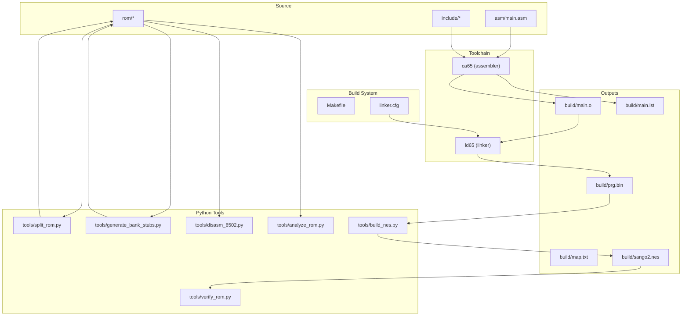
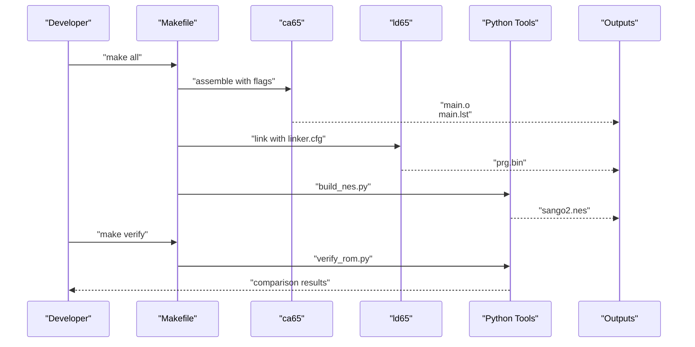
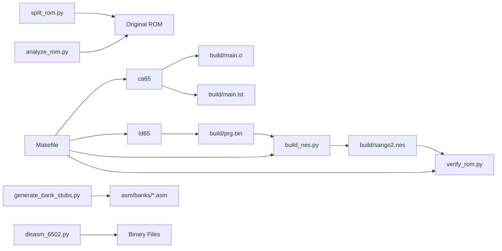

# Toolchain and Dependencies

<cite>
**Referenced Files in This Document**
- [Makefile](file://Makefile)
- [linker.cfg](file://linker.cfg)
- [PROJECT.md](file://PROJECT.md)
- [asm/main.asm](file://asm/main.asm)
- [include/macros.h](file://include/macros.h)
- [include/namco163.h](file://include/namco163.h)
- [tools/build_nes.py](file://tools/build_nes.py)
- [tools/disasm_6502.py](file://tools/disasm_6502.py)
- [tools/analyze_rom.py](file://tools/analyze_rom.py)
- [tools/verify_rom.py](file://tools/verify_rom.py)
- [tools/split_rom.py](file://tools/split_rom.py)
- [tools/generate_bank_stubs.py](file://tools/generate_bank_stubs.py)
</cite>

## Table of Contents
1. [Introduction](#introduction)
2. [Project Structure](#project-structure)
3. [Core Components](#core-components)
4. [Architecture Overview](#architecture-overview)
5. [Detailed Component Analysis](#detailed-component-analysis)
6. [Dependency Analysis](#dependency-analysis)
7. [Performance Considerations](#performance-considerations)
8. [Troubleshooting Guide](#troubleshooting-guide)
9. [Conclusion](#conclusion)
10. [Appendices](#appendices)

## Introduction
This document explains the cc65 development environment and external dependencies required for building and analyzing the project. It covers the assembler and linker versions, installation locations, PATH configuration, and integration with the Makefile build system. It also details the Python 3 dependency used by analysis tools and describes the role of each tool in the disassembly pipeline. Both beginners and experienced developers will find conceptual overviews and technical configuration details, including terminology such as “linker configuration,” “assembly listing,” and “build verification.”

## Project Structure
The project organizes the build around a Makefile-driven workflow that invokes cc65 tools and Python scripts. The cc65 toolchain produces an object file and a raw PRG binary, which is then packaged into a full NES ROM using a Python script. Analysis tools support ROM splitting, bank stub generation, disassembly, and verification against the original ROM.

**Diagram sources**
- [Makefile:1-102](file://Makefile#L1-L102)
- [linker.cfg:1-55](file://linker.cfg#L1-L55)
- [asm/main.asm:1-141](file://asm/main.asm#L1-L141)
- [include/macros.h:1-72](file://include/macros.h#L1-L72)
- [include/namco163.h:1-87](file://include/namco163.h#L1-L87)
- [tools/build_nes.py:1-58](file://tools/build_nes.py#L1-L58)
- [tools/disasm_6502.py:1-363](file://tools/disasm_6502.py#L1-L363)
- [tools/analyze_rom.py:1-135](file://tools/analyze_rom.py#L1-L135)
- [tools/verify_rom.py:1-73](file://tools/verify_rom.py#L1-L73)
- [tools/split_rom.py:1-140](file://tools/split_rom.py#L1-L140)
- [tools/generate_bank_stubs.py:1-53](file://tools/generate_bank_stubs.py#L1-L53)

**Section sources**
- [Makefile:1-102](file://Makefile#L1-L102)
- [PROJECT.md:14-47](file://PROJECT.md#L14-L47)

## Core Components
- cc65 toolchain
  - ca65 assembler v2.19
  - ld65 linker v2.19
- Python 3 runtime for analysis and packaging
- Makefile targets orchestrating the build and analysis tasks

Key responsibilities:
- Assemble source files into an object file and produce an assembly listing
- Link object files according to the linker configuration into a raw PRG binary
- Package the PRG into a full NES ROM with an iNES header
- Analyze ROM structure, split into banks, generate bank stubs, disassemble binaries, and verify byte-for-byte accuracy

**Section sources**
- [PROJECT.md:49-57](file://PROJECT.md#L49-L57)
- [Makefile:4-28](file://Makefile#L4-L28)

## Architecture Overview
The build pipeline integrates cc65 and Python tools through the Makefile. The assembler generates an object file and an assembly listing. The linker consumes the object file and the linker configuration to produce a PRG binary. A Python script adds the iNES header and pads to the correct size. Analysis tools support ROM splitting, bank stub generation, disassembly, and verification.

**Diagram sources**
- [Makefile:30-48](file://Makefile#L30-L48)
- [tools/build_nes.py:10-51](file://tools/build_nes.py#L10-L51)
- [tools/verify_rom.py:10-51](file://tools/verify_rom.py#L10-L51)

**Section sources**
- [Makefile:30-48](file://Makefile#L30-L48)
- [tools/build_nes.py:10-51](file://tools/build_nes.py#L10-L51)
- [tools/verify_rom.py:10-51](file://tools/verify_rom.py#L10-L51)

## Detailed Component Analysis

### cc65 Toolchain Setup and PATH Configuration
- Toolchain executables:
  - ca65: assembler
  - ld65: linker
- Installation and PATH:
  - Installed under a local prefix directory
  - Executables are located in the bin subdirectory of the prefix
  - The Makefile references the toolchain via CC65_HOME and explicit paths to ca65 and ld65
- Practical setup steps:
  - Install cc65 v2.19 to a known prefix (for example, ~/.local/)
  - Ensure the bin directory of the prefix is on PATH so that shell commands can resolve ca65 and ld65
  - Verify installation by running ca65 --version and ld65 --version from the command line

Verification examples:
- Command-line verification:
  - ca65 --version
  - ld65 --version
- Makefile verification:
  - Run make help to confirm targets and tool invocation
  - Run make all to assemble, link, and package the ROM

**Section sources**
- [PROJECT.md:51-57](file://PROJECT.md#L51-L57)
- [Makefile:4-10](file://Makefile#L4-L10)

### Makefile Build Targets and Flags
- Targets:
  - all: builds the final NES ROM
  - split: splits the original ROM into PRG/CHR banks
  - banks: generates bank stub assembly files
  - disasm: disassembles a binary with configurable start address, length, and base address
  - analyze: analyzes ROM structure and prints bank characteristics
  - verify: compares the built ROM with the original
  - clean/distclean: removes build artifacts and optionally ROM dumps
  - help: prints usage and examples
- Flags:
  - CA65_FLAGS includes include directories and enables assembly listing generation
  - LD65_FLAGS references the linker configuration and map file output

Practical examples:
- Build the ROM: make
- Split ROM: make split
- Generate bank stubs: make banks
- Disassemble a bank: make disasm FILE=rom/prg/prg_1f.bin ADDR=E000 LEN=1024
- Analyze ROM: make analyze
- Verify ROM: make verify

**Section sources**
- [Makefile:30-100](file://Makefile#L30-L100)

### Linker Configuration (linker.cfg)
- Purpose:
  - Defines memory regions and segments for the Namco-163 mapper
  - Establishes PRG slots and segment assignments for code and data
- Key elements:
  - MEMORY sections for zero page, RAM, and PRG slots
  - SEGMENTS for code, vectors, and read-only data across multiple banks
- Integration:
  - The Makefile passes the linker configuration to ld65 via LD65_FLAGS
  - As the project evolves, additional banks require updates to MEMORY and SEGMENTS

Practical example:
- Update linker.cfg to add a new bank segment when disassembling additional code

**Section sources**
- [linker.cfg:18-54](file://linker.cfg#L18-L54)
- [Makefile:28](file://Makefile#L28)

### Assembly Listing Generation
- The assembler is configured to produce an assembly listing file during compilation
- The listing file is useful for reviewing symbol definitions, cross-references, and generated bytes alongside source code
- The Makefile sets the listing output path via CA65_FLAGS

Practical example:
- Inspect build/main.lst after running make to review the assembly listing

**Section sources**
- [Makefile:27](file://Makefile#L27)

### Python Analysis Tools
- build_nes.py
  - Adds an iNES header to the PRG binary and pads to the correct size
  - Creates a full ROM with CHR data and appropriate mapper/mirroring flags
- disasm_6502.py
  - Produces ca65-compatible assembly listings from 6502 binaries
  - Supports configurable start address, length, and base address
- analyze_rom.py
  - Parses the ROM header and prints structural information
  - Identifies banks with code-like patterns and interrupt vectors
- verify_rom.py
  - Compares two ROM files byte-by-byte and reports mismatches
- split_rom.py
  - Splits an iNES ROM into PRG and CHR banks
  - Generates rom_info.h and a combined PRG binary for disassembly
- generate_bank_stubs.py
  - Creates assembly stub files for each PRG bank that include the corresponding binary

Practical example:
- Disassemble a bank: python3 tools/disasm_6502.py rom/prg/prg_1f.bin E000 1024 E000

**Section sources**
- [tools/build_nes.py:10-51](file://tools/build_nes.py#L10-L51)
- [tools/disasm_6502.py:286-362](file://tools/disasm_6502.py#L286-L362)
- [tools/analyze_rom.py:10-128](file://tools/analyze_rom.py#L10-L128)
- [tools/verify_rom.py:10-51](file://tools/verify_rom.py#L10-L51)
- [tools/split_rom.py:38-122](file://tools/split_rom.py#L38-L122)
- [tools/generate_bank_stubs.py:12-46](file://tools/generate_bank_stubs.py#L12-L46)

### Build Verification Workflow
- The project’s build verification compares the built ROM with the original to ensure byte-exact fidelity
- The process involves:
  - Building the ROM via make
  - Running make verify to compare the newly built ROM with the original
  - Reviewing mismatch details and iterating on disassembly until accuracy improves

Practical example:
- After editing assembly sources, rebuild and verify: make all && make verify

**Section sources**
- [Makefile:58-61](file://Makefile#L58-L61)
- [tools/verify_rom.py:10-51](file://tools/verify_rom.py#L10-L51)

## Dependency Analysis
The project depends on cc65 toolchain components and Python 3. The Makefile coordinates these dependencies, while the Python tools provide ROM analysis and packaging capabilities.

**Diagram sources**
- [Makefile:30-48](file://Makefile#L30-L48)
- [tools/build_nes.py:10-51](file://tools/build_nes.py#L10-L51)
- [tools/verify_rom.py:10-51](file://tools/verify_rom.py#L10-L51)
- [tools/split_rom.py:38-122](file://tools/split_rom.py#L38-L122)
- [tools/generate_bank_stubs.py:12-46](file://tools/generate_bank_stubs.py#L12-L46)
- [tools/disasm_6502.py:286-362](file://tools/disasm_6502.py#L286-L362)
- [tools/analyze_rom.py:10-128](file://tools/analyze_rom.py#L10-L128)

**Section sources**
- [Makefile:30-48](file://Makefile#L30-L48)
- [tools/build_nes.py:10-51](file://tools/build_nes.py#L10-L51)
- [tools/verify_rom.py:10-51](file://tools/verify_rom.py#L10-L51)
- [tools/split_rom.py:38-122](file://tools/split_rom.py#L38-L122)
- [tools/generate_bank_stubs.py:12-46](file://tools/generate_bank_stubs.py#L12-L46)
- [tools/disasm_6502.py:286-362](file://tools/disasm_6502.py#L286-L362)
- [tools/analyze_rom.py:10-128](file://tools/analyze_rom.py#L10-L128)

## Performance Considerations
- Assembly listing generation can increase build time and disk usage; consider disabling listing for production builds if not needed
- ROM verification compares entire files byte-by-byte; for large ROMs, this step may take noticeable time
- Disassembling large binaries can be CPU-intensive; limit length and focus on hotspots during early stages

[No sources needed since this section provides general guidance]

## Troubleshooting Guide
Common issues and resolutions:
- Tool not found errors
  - Ensure ca65 and ld65 are installed and on PATH
  - Verify the Makefile paths align with your installation prefix
- Incorrect linker configuration
  - Update linker.cfg when adding new banks or segments
  - Confirm segment assignments match the intended memory layout
- Build verification failures
  - Review the mismatch report from the verification tool
  - Iterate on assembly edits and rebuild until accuracy improves
- Disassembly accuracy
  - Use the disassembler with appropriate start addresses and lengths
  - Cross-check with ROM analysis to identify code regions

**Section sources**
- [Makefile:4-10](file://Makefile#L4-L10)
- [linker.cfg:18-54](file://linker.cfg#L18-L54)
- [tools/verify_rom.py:10-51](file://tools/verify_rom.py#L10-L51)
- [tools/disasm_6502.py:286-362](file://tools/disasm_6502.py#L286-L362)
- [tools/analyze_rom.py:10-128](file://tools/analyze_rom.py#L10-L128)

## Conclusion
The project’s toolchain relies on cc65 v2.19 (ca65 and ld65) and Python 3 for analysis and packaging. The Makefile integrates these tools into a cohesive build system, producing an assembly listing, linking to a PRG binary, and packaging a full NES ROM. Python tools support ROM splitting, bank stub generation, disassembly, and verification. Following the setup and verification steps outlined here will enable both beginners and experienced developers to configure the environment and validate build outputs effectively.

[No sources needed since this section summarizes without analyzing specific files]

## Appendices

### Appendix A: Toolchain Installation and PATH Configuration
- Install cc65 v2.19 to a local prefix (for example, ~/.local/)
- Add the bin directory of the prefix to PATH so that shell resolves ca65 and ld65
- Verify installation with command-line checks and Makefile targets

**Section sources**
- [PROJECT.md:51-57](file://PROJECT.md#L51-L57)
- [Makefile:4-10](file://Makefile#L4-L10)

### Appendix B: Build Verification Checklist
- Assemble and link: make all
- Review assembly listing: inspect build/main.lst
- Package ROM: confirm sango2.nes is produced
- Verify against original: make verify
- Iterate on assembly edits until verification succeeds

**Section sources**
- [Makefile:30-48](file://Makefile#L30-L48)
- [tools/verify_rom.py:10-51](file://tools/verify_rom.py#L10-L51)