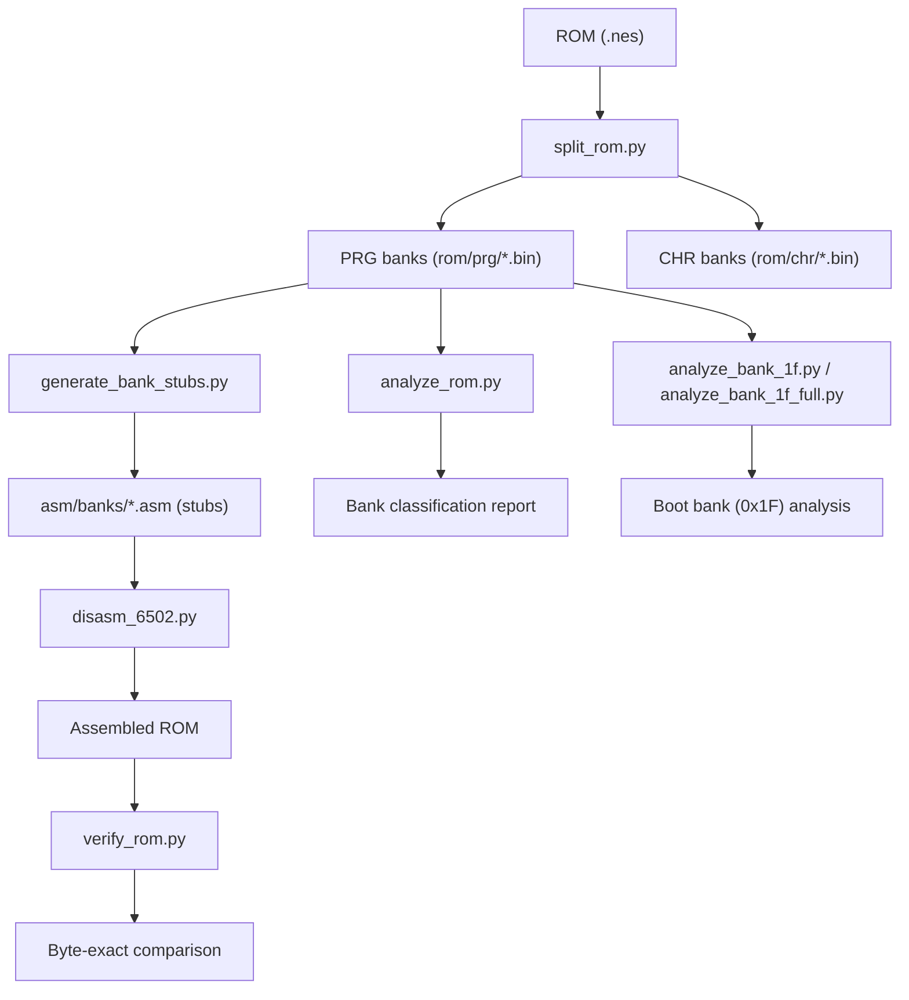
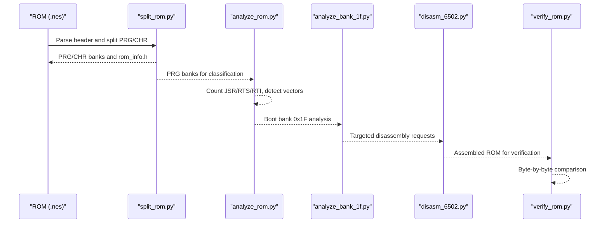
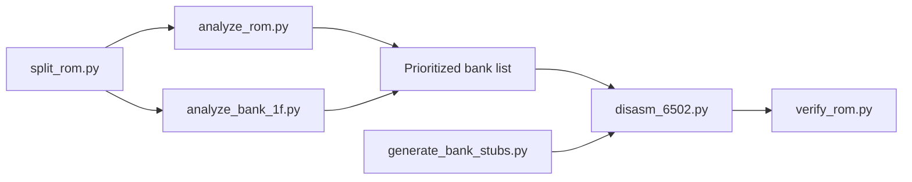
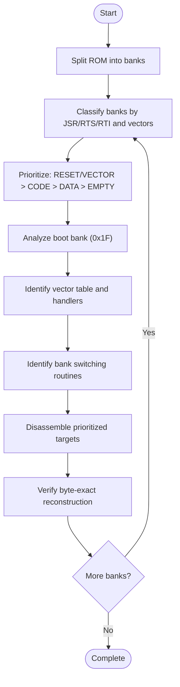

# Bank Characterization and Analysis

<cite>
**Referenced Files in This Document**
- [PROJECT.md](file://PROJECT.md)
- [analyze_rom.py](file://tools/analyze_rom.py)
- [analyze_bank_1f.py](file://tools/analyze_bank_1f.py)
- [analyze_bank_1f_full.py](file://tools/analyze_bank_1f_full.py)
- [disasm_6502.py](file://tools/disasm_6502.py)
- [generate_bank_stubs.py](file://tools/generate_bank_stubs.py)
- [split_rom.py](file://tools/split_rom.py)
- [verify_rom.py](file://tools/verify_rom.py)
- [bank_1f_analysis.md](file://code/bank_1f_analysis.md)
- [bank_1f_plan.md](file://code/bank_1f_plan.md)
- [bank_1f_function_table.md](file://code/bank_1f_function_table.md)
- [key_functions_analysis.md](file://code/key_functions_analysis.md)
</cite>

## Table of Contents
1. [Introduction](#introduction)
2. [Project Structure](#project-structure)
3. [Core Components](#core-components)
4. [Architecture Overview](#architecture-overview)
5. [Detailed Component Analysis](#detailed-component-analysis)
6. [Dependency Analysis](#dependency-analysis)
7. [Performance Considerations](#performance-considerations)
8. [Troubleshooting Guide](#troubleshooting-guide)
9. [Conclusion](#conclusion)
10. [Appendices](#appendices)

## Introduction
This document presents a comprehensive methodology for bank characterization and analysis in the context of the Sangokushi 2 disassembly project. It explains how to identify bank types and their functional roles using quantitative metrics and pattern recognition techniques. The methodology focuses on:
- Quantifying code density via JSR/RTS/RTI counts
- Detecting empty or zero-filled banks
- Recognizing RESET and interrupt vector banks
- Identifying bank switching and dispatch mechanisms
- Prioritizing disassembly based on functional importance

It also documents practical examples of analyzing bank characteristics, interpreting the significance of different patterns, and using these insights to guide disassembly prioritization. Finally, it clarifies how to distinguish executable code, data sections, and empty memory regions based on the analysis results.

## Project Structure
The project is organized around a ROM splitting pipeline, bank stub generation, and analysis tools. The key elements are:
- ROM splitting into PRG/CHR banks
- Bank stub generation for incremental disassembly
- ROM structure analysis to classify banks
- Bank-specific analysis for the boot bank (0x1F)
- Disassembler and verification utilities

**Diagram sources**
- [split_rom.py:38-122](file://tools/split_rom.py#L38-L122)
- [generate_bank_stubs.py:12-52](file://tools/generate_bank_stubs.py#L12-L52)
- [analyze_rom.py:10-128](file://tools/analyze_rom.py#L10-L128)
- [analyze_bank_1f.py:4-157](file://tools/analyze_bank_1f.py#L4-L157)
- [analyze_bank_1f_full.py:4-154](file://tools/analyze_bank_1f_full.py#L4-L154)
- [disasm_6502.py:286-363](file://tools/disasm_6502.py#L286-L363)
- [verify_rom.py:10-73](file://tools/verify_rom.py#L10-L73)

**Section sources**
- [PROJECT.md:14-47](file://PROJECT.md#L14-L47)
- [split_rom.py:38-122](file://tools/split_rom.py#L38-L122)
- [generate_bank_stubs.py:12-52](file://tools/generate_bank_stubs.py#L12-L52)
- [analyze_rom.py:10-128](file://tools/analyze_rom.py#L10-L128)

## Core Components
This section outlines the core tools and their roles in bank characterization and analysis.

- ROM structure analyzer
  - Purpose: Classify banks by code density and vector presence
  - Method: Count JSR/RTS/RTI occurrences, detect non-zero and 0xFF filled regions, and locate vector tables
  - Output: Bank-level indicators such as [CODE], [EMPTY], [ZERO], [0xFF], [RESET], and vector candidates

- Boot bank analyzer (0x1F)
  - Purpose: Identify function boundaries, internal JSR targets, bank switching patterns, and data tables
  - Method: Scan for RTS/RTI markers, JSR targets within bank, STA $F800/$FA00/$FC00/$FE00 patterns, and LDA addr,Y patterns
  - Output: Function list, internal call graph, bank switch operations, and table references

- Disassembler
  - Purpose: Produce readable assembly listings for targeted regions
  - Method: Opcode table-driven disassembly with addressing mode formatting
  - Output: Human-readable assembly with byte-level encodings

- Bank stub generator
  - Purpose: Create assembly stubs for each PRG bank to support incremental disassembly
  - Method: Generate .asm files with .incbin directives and include aggregator
  - Output: Ready-to-edit stubs for each bank

- ROM verification
  - Purpose: Ensure byte-exact rebuild matches the original ROM
  - Method: Byte-by-byte comparison with mismatch reporting
  - Output: Mismatch statistics and pass/fail status

**Section sources**
- [analyze_rom.py:10-128](file://tools/analyze_rom.py#L10-L128)
- [analyze_bank_1f.py:4-157](file://tools/analyze_bank_1f.py#L4-L157)
- [analyze_bank_1f_full.py:4-154](file://tools/analyze_bank_1f_full.py#L4-L154)
- [disasm_6502.py:11-237](file://tools/disasm_6502.py#L11-L237)
- [generate_bank_stubs.py:12-52](file://tools/generate_bank_stubs.py#L12-L52)
- [verify_rom.py:10-73](file://tools/verify_rom.py#L10-L73)

## Architecture Overview
The bank characterization workflow integrates ROM parsing, bank classification, and targeted analysis. The boot bank (0x1F) serves as the primary entry point for understanding dispatch and bank switching.

**Diagram sources**
- [split_rom.py:38-122](file://tools/split_rom.py#L38-L122)
- [analyze_rom.py:10-128](file://tools/analyze_rom.py#L10-L128)
- [analyze_bank_1f.py:4-157](file://tools/analyze_bank_1f.py#L4-L157)
- [disasm_6502.py:286-363](file://tools/disasm_6502.py#L286-L363)
- [verify_rom.py:10-73](file://tools/verify_rom.py#L10-L73)

## Detailed Component Analysis

### ROM Structure Analyzer
The ROM structure analyzer performs bank-level classification using:
- Non-zero byte count (NZ)
- Non-0xFF byte count (N-FF)
- JSR/RTS/RTI counts
- Vector table detection by proximity of plausible addresses
- RESET marker detection via SEI/CLD sequences

Classification criteria:
- [RESET]: Presence of SEI/CLD near $8000
- [CODE]: High JSR count (> threshold)
- [EMPTY]: Very few NZ and N-FF bytes
- [ZERO]: All bytes zero
- [0xFF]: All bytes 0xFF

Vector detection heuristic:
- Scan bank for 3 consecutive addresses that are plausible ($8000–$FFFF) and close in value, indicating a vector table.

**Section sources**
- [analyze_rom.py:10-128](file://tools/analyze_rom.py#L10-L128)

### Boot Bank Analyzer (0x1F)
The boot bank analyzer identifies:
- Vector dispatch table and its entries
- Reset handler and its initialization steps
- Internal function boundaries using RTS/RTI
- Internal JSR targets within the bank
- Bank switching patterns via STA $F800/$FA00/$FC00/$FE00
- Data table patterns via LDA addr,Y

Methodology highlights:
- Function boundary detection: scan for RTS/RTI to delimit functions
- Internal JSR analysis: count and rank targets within $8000–$9FFF
- Bank switching detection: look for STA absolute to switching addresses and preceding LDA immediate
- Table lookup detection: identify LDA addr,Y patterns and their frequencies

Practical example:
- The boot bank contains a vector table at a fixed address and a reset handler that initializes PPU/APU, clears RAM, and dispatches to state handlers based on a counter.

**Section sources**
- [analyze_bank_1f.py:4-157](file://tools/analyze_bank_1f.py#L4-L157)
- [analyze_bank_1f_full.py:4-154](file://tools/analyze_bank_1f_full.py#L4-L154)
- [bank_1f_analysis.md:1-100](file://code/bank_1f_analysis.md#L1-L100)

### Disassembler
The disassembler converts raw binaries into human-readable assembly:
- Opcode table with addressing modes
- Operand formatting for each mode
- Instruction length and cycle estimates
- Support for truncated instructions

Usage:
- Targeted disassembly of specific banks or regions (e.g., boot bank 0x1F)

**Section sources**
- [disasm_6502.py:11-237](file://tools/disasm_6502.py#L11-L237)
- [disasm_6502.py:286-363](file://tools/disasm_6502.py#L286-L363)

### Bank Stub Generator
Generates assembly stubs for each PRG bank:
- Creates individual .asm files with .incbin directives
- Produces an aggregator include file
- Supports incremental replacement with real disassembly

**Section sources**
- [generate_bank_stubs.py:12-52](file://tools/generate_bank_stubs.py#L12-L52)

### ROM Verification
Ensures byte-exact rebuild matches the original:
- Compares two ROMs byte-by-byte
- Reports total mismatches and first mismatch location
- Provides pass/fail status

**Section sources**
- [verify_rom.py:10-73](file://tools/verify_rom.py#L10-L73)

### Practical Examples and Interpretation
- Boot bank (0x1F) classification:
  - High JSR count and presence of RESET marker indicate a heavy code bank
  - Vector table and dispatch logic confirm its role as the boot and dispatch hub
- Bank switching identification:
  - STA $F800/$FA00/$FC00/$FE00 patterns reveal bank switching routines
  - Backward search for LDA immediate provides the bank number
- Data vs. code distinction:
  - LDA addr,Y patterns suggest data tables
  - High JSR/RTI counts with RTS/RTI boundaries indicate code
  - Empty banks show minimal NZ/N-FF counts

Interpretation guidelines:
- CODE banks: prioritize for detailed disassembly due to high instruction counts and potential complexity
- EMPTY/ZERO/0xFF banks: likely unused or padding; lower priority
- RESET banks: critical for understanding initialization and dispatch
- VECTOR banks: contain dispatch tables and handlers; essential for disassembly prioritization

**Section sources**
- [analyze_rom.py:86-112](file://tools/analyze_rom.py#L86-L112)
- [analyze_bank_1f.py:44-68](file://tools/analyze_bank_1f.py#L44-L68)
- [analyze_bank_1f_full.py:62-86](file://tools/analyze_bank_1f_full.py#L62-L86)
- [bank_1f_analysis.md:1-100](file://code/bank_1f_analysis.md#L1-L100)

### Disassembly Prioritization Using Analysis Results
- Start with RESET/VECTOR banks (e.g., boot bank 0x1F) to understand dispatch
- Follow internal JSR targets to map call graphs within the bank
- Identify bank switching routines to plan subsequent bank disassembly
- Classify other banks by JSR/RTS/RTI counts and vector presence to prioritize
- Use stubs to replace .incbin sections incrementally and verify with byte-exact comparison

**Section sources**
- [PROJECT.md:118-151](file://PROJECT.md#L118-L151)
- [analyze_bank_1f_full.py:46-150](file://tools/analyze_bank_1f_full.py#L46-L150)
- [generate_bank_stubs.py:12-52](file://tools/generate_bank_stubs.py#L12-L52)
- [verify_rom.py:10-73](file://tools/verify_rom.py#L10-L73)

## Dependency Analysis
The tools depend on each other in a pipeline:
- split_rom.py produces PRG/CHR banks used by analyze_rom.py and analyze_bank_1f.py
- analyze_rom.py classifies banks for prioritization
- analyze_bank_1f.py focuses on the boot bank’s dispatch and switching
- disasm_6502.py generates listings for targeted regions
- generate_bank_stubs.py creates editable stubs for incremental disassembly
- verify_rom.py ensures accuracy of the reconstructed ROM

**Diagram sources**
- [split_rom.py:38-122](file://tools/split_rom.py#L38-L122)
- [analyze_rom.py:10-128](file://tools/analyze_rom.py#L10-L128)
- [analyze_bank_1f.py:4-157](file://tools/analyze_bank_1f.py#L4-L157)
- [disasm_6502.py:286-363](file://tools/disasm_6502.py#L286-L363)
- [generate_bank_stubs.py:12-52](file://tools/generate_bank_stubs.py#L12-L52)
- [verify_rom.py:10-73](file://tools/verify_rom.py#L10-L73)

**Section sources**
- [split_rom.py:38-122](file://tools/split_rom.py#L38-L122)
- [analyze_rom.py:10-128](file://tools/analyze_rom.py#L10-L128)
- [analyze_bank_1f.py:4-157](file://tools/analyze_bank_1f.py#L4-L157)
- [disasm_6502.py:286-363](file://tools/disasm_6502.py#L286-L363)
- [generate_bank_stubs.py:12-52](file://tools/generate_bank_stubs.py#L12-L52)
- [verify_rom.py:10-73](file://tools/verify_rom.py#L10-L73)

## Performance Considerations
- Bank scanning is linear in bank size; typical 8KB banks process quickly
- Vector detection uses sliding windows; keep window sizes reasonable to avoid false positives
- Disassembly speed depends on instruction count; focus on hotspots (high JSR/RTI banks)
- Verification compares entire ROMs; consider checksums for quick checks during early stages

## Troubleshooting Guide
Common issues and resolutions:
- Incorrect function boundaries:
  - Ensure RTS/RTI detection covers all return instructions
  - Validate that internal JSR targets are within the bank’s address range
- Misidentified vectors:
  - Confirm plausible addresses and proximity thresholds
  - Cross-check with known reset handler and dispatch logic
- Disassembler offset errors:
  - Use base_addr parameter to align file offsets with CPU addresses
  - Verify opcode coverage and handle truncated instructions
- Stub replacement mistakes:
  - Replace .incbin with actual disassembly and update linker segments
  - Use verify_rom.py to catch mismatches early

**Section sources**
- [analyze_bank_1f_full.py:14-44](file://tools/analyze_bank_1f_full.py#L14-L44)
- [disasm_6502.py:286-363](file://tools/disasm_6502.py#L286-L363)
- [key_functions_analysis.md:272-284](file://code/key_functions_analysis.md#L272-L284)

## Conclusion
The bank characterization methodology combines quantitative metrics (JSR/RTS/RTI counts, non-zero/0xFF ratios) with pattern recognition (vector tables, bank switching, data tables) to classify banks and guide disassembly prioritization. Applying this approach systematically—starting with RESET/VECTOR banks, following internal call graphs, and verifying byte-exact reconstruction—ensures accurate and efficient disassembly of complex ROMs like Sangokushi 2.

## Appendices

### Bank Classification Criteria
- [RESET]: SEI/CLD detected near $8000
- [CODE]: High JSR count (> threshold)
- [EMPTY]: Very few NZ and N-FF bytes
- [ZERO]: All bytes zero
- [0xFF]: All bytes 0xFF
- Vector presence: 3 consecutive plausible addresses within a small range

**Section sources**
- [analyze_rom.py:86-112](file://tools/analyze_rom.py#L86-L112)

### Bank Types and Functional Roles
- CODE banks: high instruction counts, likely contain gameplay logic and utilities
- EMPTY/ZERO/0xFF banks: minimal data, often padding or unused regions
- RESET banks: contain initialization and dispatch logic
- VECTOR banks: host dispatch tables and handlers

**Section sources**
- [PROJECT.md:118-133](file://PROJECT.md#L118-L133)

### Practical Disassembly Prioritization Flow

**Diagram sources**
- [split_rom.py:38-122](file://tools/split_rom.py#L38-L122)
- [analyze_rom.py:10-128](file://tools/analyze_rom.py#L10-L128)
- [analyze_bank_1f.py:4-157](file://tools/analyze_bank_1f.py#L4-L157)
- [PROJECT.md:134-151](file://PROJECT.md#L134-L151)
- [verify_rom.py:10-73](file://tools/verify_rom.py#L10-L73)