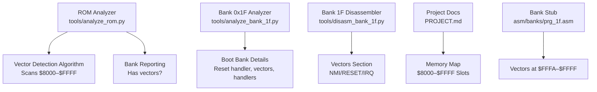
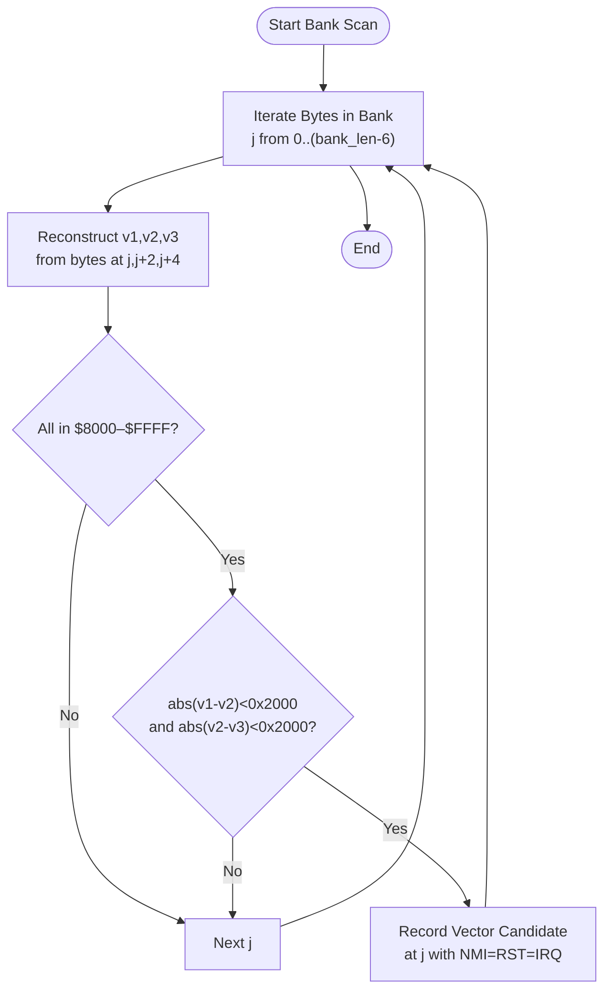
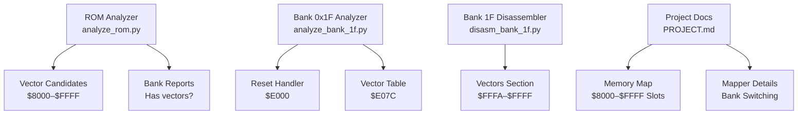

# Interrupt Vector Detection

<cite>
**Referenced Files in This Document**
- [analyze_rom.py](file://tools/analyze_rom.py)
- [disasm_6502.py](file://tools/disasm_6502.py)
- [analyze_bank_1f.py](file://tools/analyze_bank_1f.py)
- [analyze_bank_1f_full.py](file://tools/analyze_bank_1f_full.py)
- [disasm_bank_1f.py](file://tools/disasm_bank_1f.py)
- [PROJECT.md](file://PROJECT.md)
- [rom_info.h](file://rom/rom_info.h)
- [prg_1f.asm](file://asm/banks/prg_1f.asm)
- [prg_1f.asm.bak](file://asm/banks/prg_1f.asm.bak)
- [bank_1f_plan.md](file://code/bank_1f_plan.md)
- [bank_1f_raw.asm](file://code/bank_1f_raw.asm)
</cite>

## Table of Contents
1. [Introduction](#introduction)
2. [Project Structure](#project-structure)
3. [Core Components](#core-components)
4. [Architecture Overview](#architecture-overview)
5. [Detailed Component Analysis](#detailed-component-analysis)
6. [Dependency Analysis](#dependency-analysis)
7. [Performance Considerations](#performance-considerations)
8. [Troubleshooting Guide](#troubleshooting-guide)
9. [Conclusion](#conclusion)

## Introduction
This document explains interrupt vector detection and analysis for the ROM, focusing on identifying NMI, RESET, and IRQ vectors across PRG banks. It details the vector detection algorithm that scans for sequences of addresses within the $8000–$FFFF range, analyzing spacing and relationships between consecutive vectors. It also documents how the analysis identifies the reset vector at $FFE8 in bank 0x1F, the NMI vector at $FFFA, and IRQ/BRK vectors at $FFFE, and how this information traces the game’s startup sequence and reveals bank switching mechanisms.

## Project Structure
The project organizes ROM analysis and disassembly around a set of Python tools and assembly stubs. The vector detection capability is primarily implemented in the ROM analyzer, with supporting disassemblers and bank-specific analyzers that confirm vector locations and handlers.

**Diagram sources**
- [analyze_rom.py:68-111](file://tools/analyze_rom.py#L68-L111)
- [analyze_bank_1f.py:28-43](file://tools/analyze_bank_1f.py#L28-L43)
- [disasm_bank_1f.py:422-433](file://tools/disasm_bank_1f.py#L422-L433)
- [PROJECT.md:70-117](file://PROJECT.md#L70-L117)
- [prg_1f.asm:2863-2869](file://asm/banks/prg_1f.asm#L2863-L2869)

**Section sources**
- [PROJECT.md:1-181](file://PROJECT.md#L1-L181)
- [rom_info.h:1-9](file://rom/rom_info.h#L1-L9)

## Core Components
- ROM Analyzer: Scans each 8KB PRG bank for vector sequences within $8000–$FFFF and reports candidates with NMI/RST/IRQ triplets.
- Bank 0x1F Analyzer: Confirms vector table usage, reset handler behavior, and bank switching patterns in the boot bank.
- Bank 1F Disassembler: Outputs the vectors section at $FFFA–$FFFF with explicit labels for NMI, RESET, and IRQ.
- Project Documentation: Provides memory map and mapper details that contextualize vector locations and bank switching.

**Section sources**
- [analyze_rom.py:68-111](file://tools/analyze_rom.py#L68-L111)
- [analyze_bank_1f.py:28-43](file://tools/analyze_bank_1f.py#L28-L43)
- [disasm_bank_1f.py:422-433](file://tools/disasm_bank_1f.py#L422-L433)
- [PROJECT.md:70-117](file://PROJECT.md#L70-L117)

## Architecture Overview
The vector detection pipeline operates as follows:
- Input: PRG banks (8KB each) from the ROM.
- Processing: For each bank, scan contiguous pairs of bytes to reconstruct 16-bit addresses within $8000–$FFFF. Check three consecutive reconstructed addresses v1, v2, v3 and verify:
  - All addresses fall within $8000–$FFFF.
  - Spacing constraints abs(v1 − v2) and abs(v2 − v3) are less than 0x2000.
- Output: Report vector triplet positions and target addresses for each bank.

**Diagram sources**
- [analyze_rom.py:68-84](file://tools/analyze_rom.py#L68-L84)

**Section sources**
- [analyze_rom.py:68-111](file://tools/analyze_rom.py#L68-L111)

## Detailed Component Analysis

### Vector Detection Algorithm
- Scope: Scans each 8KB PRG bank for 16-bit address triplets within $8000–$FFFF.
- Conditions:
  - All three addresses must be within $8000–$FFFF.
  - Spacing constraints abs(v1 − v2) and abs(v2 − v3) must be less than 0x2000.
- Output: Reports the candidate triplet position and the three target addresses as NMI, RST, and IRQ respectively.

Practical implications:
- Triplets indicate potential interrupt vector tables or dispatch tables.
- In the boot bank (0x1F), this confirms the presence of the NMI/RESET/IRQ vector table at $FFFA–$FFFF.

**Section sources**
- [analyze_rom.py:68-111](file://tools/analyze_rom.py#L68-L111)

### Reset Vector Identification at $FFE8 in Bank 0x1F
- The project documentation states that the reset handler is located at Bank 0x1F, address $E000, and the vector table at $E07C dispatches to game states.
- The vector table at $FFFA–$FFFF contains the NMI, RESET, and IRQ vectors. The RESET vector is at $FFFC and points to the reset handler at $E000 in bank 0x1F.

Interpretation:
- The reset vector at $FFFC points to $E000, which is the reset handler in bank 0x1F.
- The vector table at $E07C is indexed by a counter to select the initial game state.

**Section sources**
- [PROJECT.md:101-117](file://PROJECT.md#L101-L117)
- [prg_1f.asm:2863-2869](file://asm/banks/prg_1f.asm#L2863-L2869)

### NMI Vector at $FFFA and IRQ/BRK Vector at $FFFE
- The vectors section at $FFFA–$FFFF lists:
  - NMI vector at $FFFA pointing to the NMI handler.
  - RESET vector at $FFFC pointing to the reset handler.
  - IRQ/BRK vector at $FFFE pointing to the IRQ handler.

These vectors are emitted by the Bank 1F disassembler and confirmed in the assembly stubs.

**Section sources**
- [disasm_bank_1f.py:422-433](file://tools/disasm_bank_1f.py#L422-L433)
- [prg_1f.asm:2863-2869](file://asm/banks/prg_1f.asm#L2863-L2869)

### Bank Switching Mechanisms and Startup Sequence
- Bank 0x1F is mapped to $E000–$FFFF at boot (fixed boot bank for the mapper).
- The reset handler initializes PPU/APU, clears RAM, sets stack pointer, reads a counter, indexes into the vector table at $E07C, and jumps through an indirect vector.
- Bank switching is performed by writing bank numbers to $F800–$FFFF, selecting which 8KB PRG bank appears in each of the four PRG slots.

Trace of startup sequence:
- CPU boots at $FFFC (RESET vector) and jumps to $E000 (reset handler).
- Reset handler initializes hardware and reads the state counter to select a vector from $E07C.
- The selected vector points to a state handler within bank 0x1F.
- As gameplay progresses, bank switching routines load additional banks into slots for graphics, sound, and other features.

**Section sources**
- [PROJECT.md:70-117](file://PROJECT.md#L70-L117)
- [analyze_bank_1f.py:44-68](file://tools/analyze_bank_1f.py#L44-L68)
- [bank_1f_plan.md:180-212](file://code/bank_1f_plan.md#L180-L212)

### Practical Examples of Interpreting Vector Analysis Results
- Example 1: A bank reports “Vectors at $8000: NMI=$E000 RST=$E000 IRQ=$E000”. Interpretation: The bank contains a vector table at $8000–$8005 with identical targets, indicating a dispatch table or a misalignment in the scan. Investigate surrounding bytes and verify against known vector locations in bank 0x1F.
- Example 2: A bank reports “Vectors at $FFD0: NMI=$F800 RST=$E000 IRQ=$FB2D”. Interpretation: The bank contains a valid vector table near the end of the bank. Confirm that the addresses align with known handlers in bank 0x1F and other banks.
- Example 3: A bank with high JSR/RTI counts and a vector candidate indicates a likely code-heavy bank with a vector table. Cross-reference with the bank 0x1F analyzer to identify dispatch targets and bank switching patterns.

**Section sources**
- [analyze_rom.py:68-111](file://tools/analyze_rom.py#L68-L111)
- [analyze_bank_1f.py:69-111](file://tools/analyze_bank_1f.py#L69-L111)

### Using Vector Detection to Identify Critical System Entry Points
- NMI vector at $FFFA: Points to the NMI handler, which coordinates frame-based tasks like PPU updates and palette changes.
- RESET vector at $FFFC: Points to the reset handler, which initializes the system and selects the initial game state via the vector table.
- IRQ/BRK vector at $FFFE: Points to the IRQ handler, which manages raster effects, CHR bank switching, and mid-frame updates.

These vectors define the system’s runtime entry points and are essential for tracing the startup sequence and understanding the runtime control flow.

**Section sources**
- [disasm_bank_1f.py:422-433](file://tools/disasm_bank_1f.py#L422-L433)
- [bank_1f_plan.md:180-212](file://code/bank_1f_plan.md#L180-L212)

## Dependency Analysis
Vector detection relies on:
- ROM structure and mapper details to interpret address ranges and bank switching.
- Bank 0x1F analysis to confirm vector table usage and reset handler behavior.
- Disassembler outputs to validate vector locations and handler addresses.

**Diagram sources**
- [analyze_rom.py:68-111](file://tools/analyze_rom.py#L68-L111)
- [analyze_bank_1f.py:28-43](file://tools/analyze_bank_1f.py#L28-L43)
- [disasm_bank_1f.py:422-433](file://tools/disasm_bank_1f.py#L422-L433)
- [PROJECT.md:70-117](file://PROJECT.md#L70-L117)

**Section sources**
- [analyze_rom.py:68-111](file://tools/analyze_rom.py#L68-L111)
- [analyze_bank_1f.py:28-43](file://tools/analyze_bank_1f.py#L28-L43)
- [disasm_bank_1f.py:422-433](file://tools/disasm_bank_1f.py#L422-L433)
- [PROJECT.md:70-117](file://PROJECT.md#L70-L117)

## Performance Considerations
- The vector detection algorithm scans each bank linearly, checking every pair of bytes for address triplets. With 8KB banks, this yields O(n) scanning per bank, acceptable for static analysis.
- Spacing checks limit false positives by constraining address proximity, reducing unnecessary downstream analysis.
- For large ROMs, parallelizing bank analysis across multiple processes can improve throughput.

## Troubleshooting Guide
Common issues and resolutions:
- Misaligned vectors: If the algorithm detects vectors at unexpected offsets, verify the bank’s actual layout and check for padding or uninitialized data.
- False positives: Adjust spacing thresholds or cross-check with known vector locations in bank 0x1F to confirm validity.
- Bank switching confusion: Ensure mapper details are correct; the project documentation clarifies that bank 0x1F is fixed at $E000–$FFFF at boot.

**Section sources**
- [PROJECT.md:70-117](file://PROJECT.md#L70-L117)

## Conclusion
Vector detection provides a reliable method to locate NMI, RESET, and IRQ vectors across PRG banks. In this project, the algorithm confirms the presence of vector tables and validates the known locations of NMI/RESET/IRQ handlers in bank 0x1F. Together with bank switching details and the reset handler’s dispatch mechanism, vector analysis enables precise tracing of the game’s startup sequence and runtime control flow.