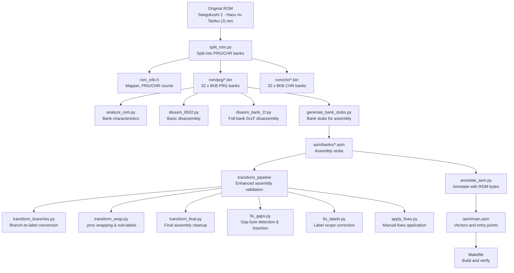
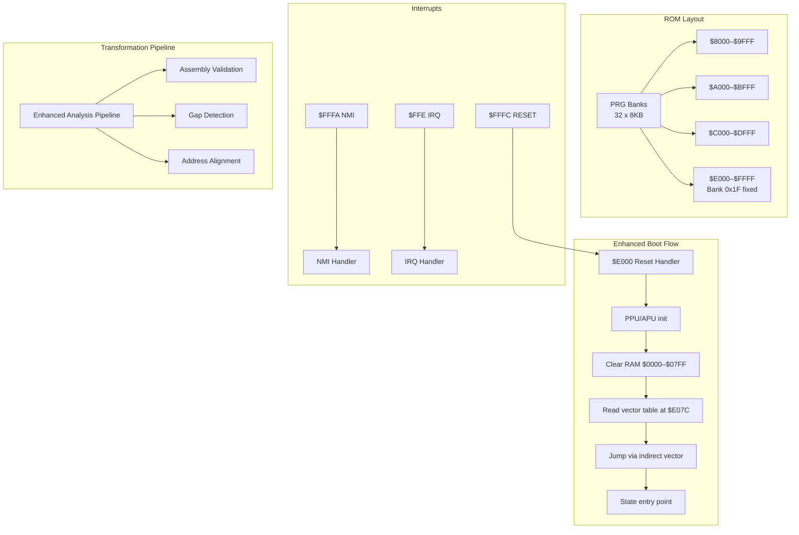
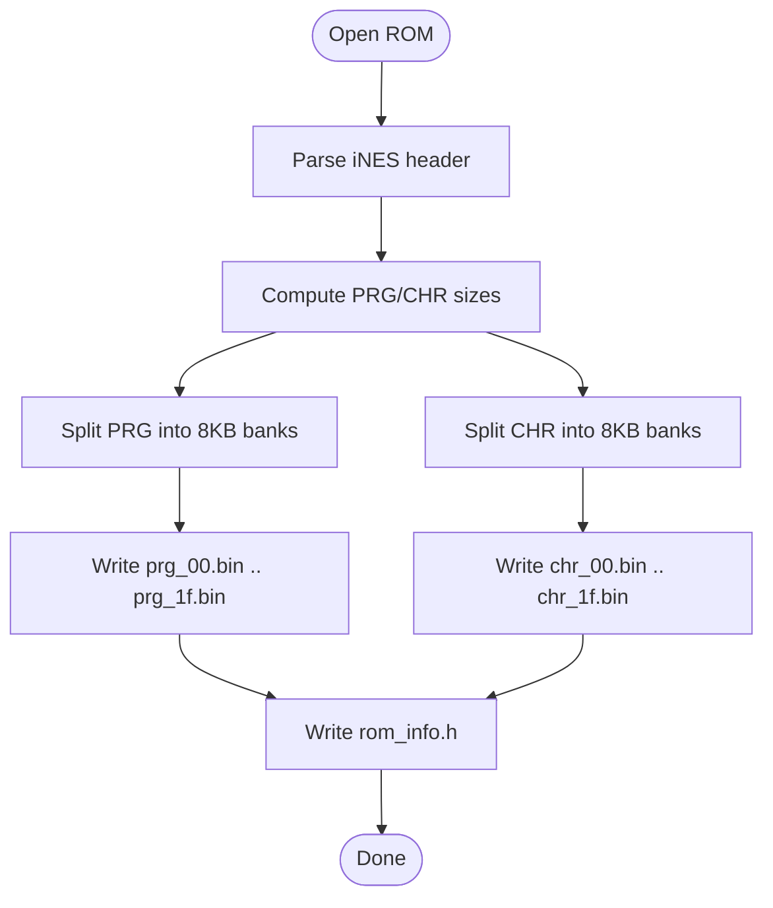
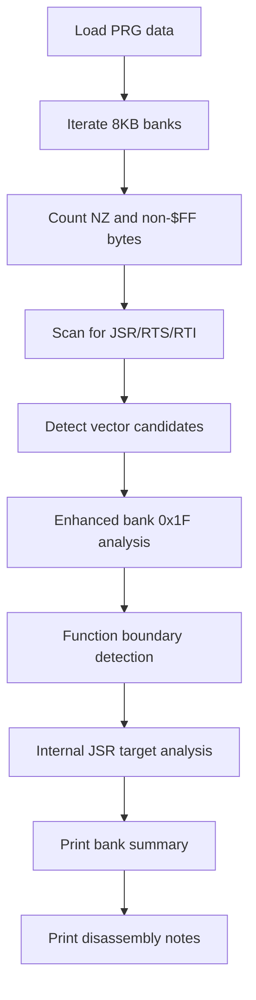
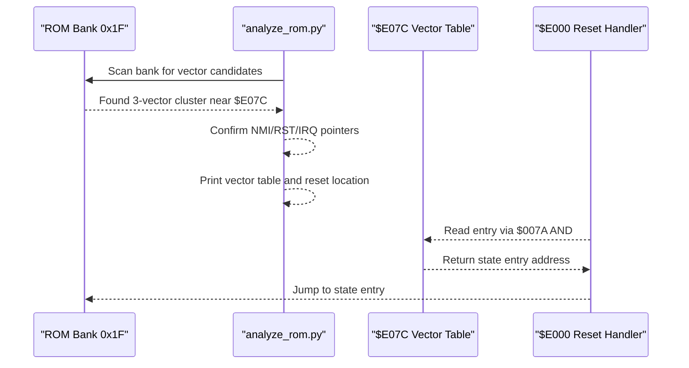
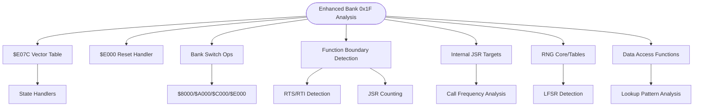
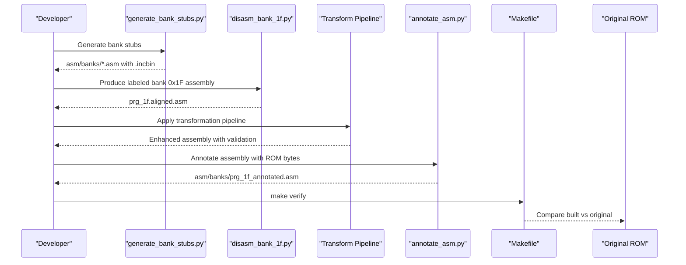
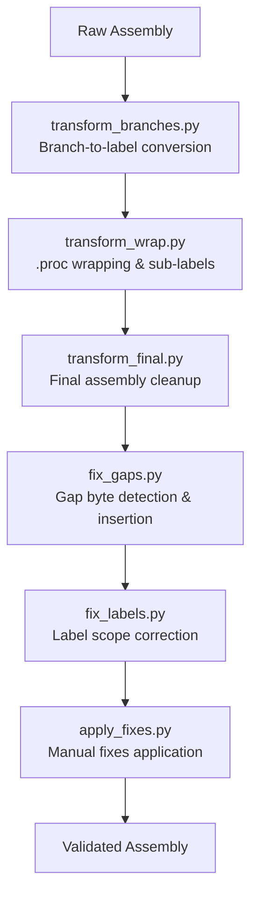
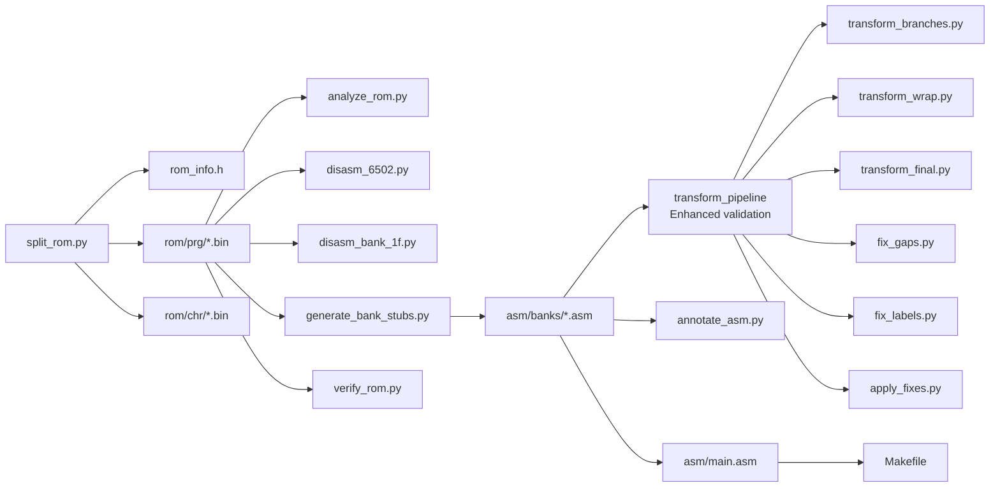

# ROM Analysis and Understanding

<cite>
**Referenced Files in This Document**
- [PROJECT.md](file://PROJECT.md)
- [Makefile](file://Makefile)
- [split_rom.py](file://tools/split_rom.py)
- [analyze_rom.py](file://tools/analyze_rom.py)
- [analyze_bank_1f.py](file://tools/analyze_bank_1f.py)
- [analyze_bank_1f_full.py](file://tools/analyze_bank_1f_full.py)
- [disasm_6502.py](file://tools/disasm_6502.py)
- [disasm_bank_1f.py](file://tools/disasm_bank_1f.py)
- [generate_bank_stubs.py](file://tools/generate_bank_stubs.py)
- [annotate_asm.py](file://tools/annotate_asm.py)
- [transform_branches.py](file://transform_branches.py)
- [transform_final.py](file://transform_final.py)
- [transform_wrap.py](file://transform_wrap.py)
- [apply_fixes.py](file://apply_fixes.py)
- [fix_gaps.py](file://fix_gaps.py)
- [fix_labels.py](file://fix_labels.py)
- [rom_info.h](file://rom/rom_info.h)
- [namco163.h](file://include/namco163.h)
- [main.asm](file://asm/main.asm)
- [prg_1f.aligned.asm](file://asm/banks/prg_1f.aligned.asm)
- [all_banks.asm](file://asm/banks/all_banks.asm)
- [bank_1f_analysis.md](file://code/bank_1f_analysis.md)
- [bank_1f_plan.md](file://code/bank_1f_plan.md)
- [key_functions_analysis.md](file://code/key_functions_analysis.md)
</cite>

## Update Summary
**Changes Made**
- Enhanced bank $1f analysis capabilities with new transformation tools pipeline
- Added automated assembly code validation, gap detection, and address alignment verification
- Updated transformation pipeline covering branch-to-label conversion, gap byte insertion, and .proc wrapping
- Integrated manual fixes and label scope corrections for improved assembly quality
- Expanded bank analysis methodologies with comprehensive function boundary detection

## Table of Contents
1. [Introduction](#introduction)
2. [Project Structure](#project-structure)
3. [Core Components](#core-components)
4. [Architecture Overview](#architecture-overview)
5. [Detailed Component Analysis](#detailed-component-analysis)
6. [Enhanced Transformation Pipeline](#enhanced-transformation-pipeline)
7. [Dependency Analysis](#dependency-analysis)
8. [Performance Considerations](#performance-considerations)
9. [Troubleshooting Guide](#troubleshooting-guide)
10. [Conclusion](#conclusion)
11. [Appendices](#appendices)

## Introduction
This document explains how to understand the original game ROM structure and how to analyze it systematically for disassembly. It focuses on:
- How the ROM is split into 32 PRG banks (8 KB each) and 32 CHR banks (8 KB each) for the Namco-163 (Mapper 19) system
- How to interpret ROM characteristics using bank analysis metrics such as JSR/RTI ratios, interrupt vector patterns, and code density
- How interrupt vectors are detected and how the reset handler location at $E000 in bank 0x1F is identified
- **Updated** Enhanced bank $1f analysis with automated transformation tools for assembly validation and gap detection
- **Updated** New transformation pipeline including branch-to-label conversion, gap byte insertion, and .proc wrapping
- Practical examples of analyzing ROM characteristics, interpreting results, and planning disassembly
- The relationship between ROM structure and the game's execution flow

## Project Structure
The repository organizes ROM analysis and disassembly around a comprehensive pipeline with enhanced transformation capabilities:
- ROM splitting into PRG/CHR banks
- Bank analysis to identify characteristics and entry points
- Disassembly of individual banks, especially the boot bank (0x1F)
- **New** Automated transformation pipeline for assembly validation and gap detection
- Assembly and verification against the original ROM with enhanced error checking

**Diagram sources**
- [split_rom.py:38-122](file://tools/split_rom.py#L38-L122)
- [rom_info.h:1-9](file://rom/rom_info.h#L1-L9)
- [analyze_rom.py:10-135](file://tools/analyze_rom.py#L10-L135)
- [disasm_6502.py:286-363](file://tools/disasm_6502.py#L286-L363)
- [disasm_bank_1f.py:545-561](file://tools/disasm_bank_1f.py#L545-L561)
- [generate_bank_stubs.py:12-53](file://tools/generate_bank_stubs.py#L12-L53)
- [transform_branches.py:19-156](file://transform_branches.py#L19-L156)
- [transform_wrap.py:134-303](file://transform_wrap.py#L134-L303)
- [transform_final.py:1-235](file://transform_final.py#L1-L235)
- [fix_gaps.py:1-346](file://fix_gaps.py#L1-L346)
- [fix_labels.py:1-68](file://fix_labels.py#L1-L68)
- [apply_fixes.py:1-115](file://apply_fixes.py#L1-L115)

**Section sources**
- [PROJECT.md:14-47](file://PROJECT.md#L14-L47)
- [Makefile:54-75](file://Makefile#L54-L75)

## Core Components
- ROM splitter: Parses iNES header, splits PRG/CHR into 8 KB banks, generates rom_info.h and a combined PRG binary
- ROM analyzer: Prints PRG structure, counts JSR/RTI/RTI, detects interrupt vectors, and prints disassembly notes
- **Enhanced** Bank analyzers: Specialized analysis of bank 0x1F for vectors, reset handler, bank switching, and key functions with comprehensive function boundary detection
- Disassemblers: Basic 6502 disassembler and a comprehensive bank 0x1F disassembler with labeled regions
- **New** Transformation pipeline: Automated assembly validation, branch-to-label conversion, gap detection, and .proc wrapping
- Assembly pipeline: Bank stubs, enhanced annotation, and main assembly with vectors
- Mapper definitions: Namco-163 register addresses and bank switching macros

**Section sources**
- [split_rom.py:38-122](file://tools/split_rom.py#L38-L122)
- [analyze_rom.py:10-135](file://tools/analyze_rom.py#L10-L135)
- [analyze_bank_1f.py:4-157](file://tools/analyze_bank_1f.py#L4-L157)
- [analyze_bank_1f_full.py:4-154](file://tools/analyze_bank_1f_full.py#L4-L154)
- [disasm_6502.py:286-363](file://tools/disasm_6502.py#L286-L363)
- [disasm_bank_1f.py:545-561](file://tools/disasm_bank_1f.py#L545-L561)
- [generate_bank_stubs.py:12-53](file://tools/generate_bank_stubs.py#L12-L53)
- [transform_branches.py:19-156](file://transform_branches.py#L19-L156)
- [transform_wrap.py:134-303](file://transform_wrap.py#L134-L303)
- [transform_final.py:1-235](file://transform_final.py#L1-L235)
- [fix_gaps.py:1-346](file://fix_gaps.py#L1-L346)
- [fix_labels.py:1-68](file://fix_labels.py#L1-L68)
- [apply_fixes.py:1-115](file://apply_fixes.py#L1-L115)

## Architecture Overview
The ROM uses Mapper 19 (Namco-163). The PRG is organized into 32 banks of 8 KB each mapped to $8000–$FFFF. At reset, bank 0x1F is fixed at $E000–$FFFF. The reset handler initializes PPU/APU, clears RAM, and dispatches to a state-specific entry via a vector table. Interrupt vectors are located at $FFFA–$FFFF.

**Updated** The enhanced analysis pipeline now includes automated validation and gap detection to ensure assembly accuracy against the original ROM.

**Diagram sources**
- [PROJECT.md:84-117](file://PROJECT.md#L84-L117)
- [bank_1f_analysis.md:1-100](file://code/bank_1f_analysis.md#L1-L100)
- [transform_branches.py:19-156](file://transform_branches.py#L19-L156)
- [fix_gaps.py:1-346](file://fix_gaps.py#L1-L346)

**Section sources**
- [PROJECT.md:84-117](file://PROJECT.md#L84-L117)
- [bank_1f_analysis.md:1-100](file://code/bank_1f_analysis.md#L1-L100)

## Detailed Component Analysis

### ROM Splitting and Binary Format
- The splitter reads the iNES header, computes PRG/CHR sizes, and writes 8 KB PRG banks and 8 KB CHR banks
- It also generates rom_info.h with Mapper, PRG/CHR counts, and a combined PRG binary for convenience
- The PRG banks are 8 KB each; the ROM is 32 banks × 8 KB = 256 KB PRG

**Diagram sources**
- [split_rom.py:38-122](file://tools/split_rom.py#L38-L122)

**Section sources**
- [split_rom.py:38-122](file://tools/split_rom.py#L38-L122)
- [rom_info.h:1-9](file://rom/rom_info.h#L1-L9)

### ROM Structure Analysis Methodology
- The analyzer prints PRG structure with 8 KB bank counts and summarizes each bank using:
  - Non-zero and non-$FF byte counts (density indicators)
  - JSR/RTS/RTI counts (code density)
  - Presence of interrupt vectors (NMI/RST/IRQ) by scanning for plausible 16-bit little-endian pointers near $8000–$FFFF
- It also prints notes about bank switching and reset location

**Enhanced** The enhanced bank $1f analysis now includes comprehensive function boundary detection and internal JSR target analysis.

**Diagram sources**
- [analyze_rom.py:49-128](file://tools/analyze_rom.py#L49-L128)
- [analyze_bank_1f_full.py:14-151](file://tools/analyze_bank_1f_full.py#L14-L151)

**Section sources**
- [analyze_rom.py:10-135](file://tools/analyze_rom.py#L10-L135)
- [analyze_bank_1f_full.py:4-154](file://tools/analyze_bank_1f_full.py#L4-L154)

### Interrupt Vector Detection and Reset Handler Location
- The reset handler is at $E000 in bank 0x1F (mapped to $E000–$FFFF at boot)
- The vector table at $E07C contains 15 entries (2 bytes each) used to dispatch to state handlers
- Interrupt vectors at $FFFA–$FFFF are decoded from the last 6 bytes of the bank
- The analyzer detects vector tables by scanning for three consecutive 16-bit values within $8000–$FFFF that are close in value and prints their locations

**Diagram sources**
- [analyze_rom.py:68-112](file://tools/analyze_rom.py#L68-L112)
- [bank_1f_analysis.md:22-76](file://code/bank_1f_analysis.md#L22-L76)

**Section sources**
- [analyze_rom.py:68-112](file://tools/analyze_rom.py#L68-L112)
- [bank_1f_analysis.md:22-76](file://code/bank_1f_analysis.md#L22-L76)

### Bank 0x1F Analysis: Characteristics and Key Functions
- Bank 0x1F is the boot bank mapped to $E000–$FFFF at reset
- It contains:
  - Reset handler, vector dispatch table, state handlers
  - PPU utilities, sound engine, math routines, controller I/O, and data access functions
- **Enhanced** The specialized analyzers now provide comprehensive function boundary detection and internal JSR target analysis:
  - Function boundaries identified using RTS/RTI as end markers
  - Internal JSR targets within $8000–$9FFF counted and prioritized
  - Bank switching patterns (STA $F800/$FA00/$FC00/$FE00 with preceding LDA #imm)
  - RNG core and variants detection
  - Data tables and lookup patterns identification
  - Main loop return via JMP $E066

**Diagram sources**
- [analyze_bank_1f.py:16-154](file://tools/analyze_bank_1f.py#L16-L154)
- [analyze_bank_1f_full.py:14-151](file://tools/analyze_bank_1f_full.py#L14-L151)
- [bank_1f_analysis.md:1-100](file://code/bank_1f_analysis.md#L1-L100)

**Section sources**
- [analyze_bank_1f.py:4-157](file://tools/analyze_bank_1f.py#L4-L157)
- [analyze_bank_1f_full.py:4-154](file://tools/analyze_bank_1f_full.py#L4-L154)
- [bank_1f_analysis.md:1-100](file://code/bank_1f_analysis.md#L1-L100)

### Using the Disassemblers and Planning Disassembly
- Basic disassembler: Disassembles arbitrary binaries with configurable start address and length
- Comprehensive bank 0x1F disassembler: Produces a labeled ca65-compatible assembly with named functions and tables
- **Enhanced** Transformation pipeline:
  - Transform branches to labels for better readability
  - Wrap functions in .proc/.endproc blocks with proper scope management
  - Insert gap bytes with correct ROM data alignment
  - Apply manual fixes for cross-proc label issues
  - Validate assembly against original ROM byte-by-byte

**Diagram sources**
- [generate_bank_stubs.py:12-53](file://tools/generate_bank_stubs.py#L12-L53)
- [disasm_bank_1f.py:545-561](file://tools/disasm_bank_1f.py#L545-L561)
- [transform_branches.py:19-156](file://transform_branches.py#L19-L156)
- [transform_wrap.py:134-303](file://transform_wrap.py#L134-L303)
- [transform_final.py:1-235](file://transform_final.py#L1-L235)
- [fix_gaps.py:1-346](file://fix_gaps.py#L1-L346)
- [fix_labels.py:1-68](file://fix_labels.py#L1-L68)
- [apply_fixes.py:1-115](file://apply_fixes.py#L1-L115)
- [annotate_asm.py:315-481](file://tools/annotate_asm.py#L315-L481)

**Section sources**
- [disasm_6502.py:286-363](file://tools/disasm_6502.py#L286-L363)
- [disasm_bank_1f.py:545-561](file://tools/disasm_bank_1f.py#L545-L561)
- [generate_bank_stubs.py:12-53](file://tools/generate_bank_stubs.py#L12-L53)
- [transform_branches.py:19-156](file://transform_branches.py#L19-L156)
- [transform_wrap.py:134-303](file://transform_wrap.py#L134-L303)
- [transform_final.py:1-235](file://transform_final.py#L1-L235)
- [fix_gaps.py:1-346](file://fix_gaps.py#L1-L346)
- [fix_labels.py:1-68](file://fix_labels.py#L1-L68)
- [apply_fixes.py:1-115](file://apply_fixes.py#L1-L115)
- [annotate_asm.py:315-481](file://tools/annotate_asm.py#L315-L481)
- [Makefile:58-62](file://Makefile#L58-L62)

### Practical Examples and Interpretation
- Interpreting bank analysis results:
  - High JSR count indicates code-heavy bank
  - Presence of RTI suggests IRQ/data-heavy or interrupt-related code
  - Vector table detection helps locate dispatch handlers
- **Enhanced** Example interpretation with new capabilities:
  - Bank 0x1F: high JSR/RTI, vector table at $E07C, reset at $E000
  - Banks 0x14–0x16: high RTI counts, likely graphics or heavy data banks
  - Bank 0x07: all $FF, empty bank
  - **New** Function boundary detection reveals 45+ functions in bank 0x1F with internal call patterns
  - **New** Gap detection identifies 15+ data gaps requiring ROM-accurate byte insertion
- Guidance:
  - Start with bank 0x1F to understand reset and dispatch
  - Identify bank switching routines to map cross-bank calls
  - Use the vector table to trace state handlers and plan incremental disassembly
  - **New** Leverage transformation pipeline for automated assembly validation and gap detection

**Section sources**
- [analyze_rom.py:117-128](file://tools/analyze_rom.py#L117-L128)
- [analyze_bank_1f_full.py:35-44](file://tools/analyze_bank_1f_full.py#L35-L44)
- [PROJECT.md:118-133](file://PROJECT.md#L118-L133)

## Enhanced Transformation Pipeline

### Automated Assembly Validation
The transformation pipeline automatically validates assembly code against the original ROM by:
- Converting branch hex targets to descriptive labels with context-aware naming
- Detecting and inserting gap bytes with correct ROM data alignment
- Wrapping functions in .proc/.endproc blocks with proper scope management
- Applying manual fixes for cross-proc label issues and address alignment

**Diagram sources**
- [transform_branches.py:19-156](file://transform_branches.py#L19-L156)
- [transform_wrap.py:134-303](file://transform_wrap.py#L134-L303)
- [transform_final.py:1-235](file://transform_final.py#L1-L235)
- [fix_gaps.py:1-346](file://fix_gaps.py#L1-L346)
- [fix_labels.py:1-68](file://fix_labels.py#L1-L68)
- [apply_fixes.py:1-115](file://apply_fixes.py#L1-L115)

### Branch-to-Label Conversion
The branch transformation tool converts hex branch targets to descriptive labels:
- Identifies all branch instructions with hex targets
- Builds address-to-line mapping from instruction comments
- Generates context-aware labels based on function and target address
- Inserts labels at target addresses and replaces hex references

**Section sources**
- [transform_branches.py:19-156](file://transform_branches.py#L19-L156)

### Gap Detection and Insertion
The gap detection tool ensures ROM-accurate byte alignment:
- Removes previous incorrect gap byte insertions
- Fixes data overlap issues (like DomesticGraphicPtrs)
- Detects gaps between instructions and inserts correct ROM bytes
- Handles special cases like memory copy routines and padding sections

**Section sources**
- [fix_gaps.py:1-346](file://fix_gaps.py#L1-L346)

### Function Wrapping and Scope Management
The function wrapping tool manages .proc scope and sub-labels:
- Defines function boundaries with proper .proc/.endproc blocks
- Converts function-specific sub-labels to @sublabel format
- Manages cross-proc label scope issues
- Applies export directives for global functions

**Section sources**
- [transform_wrap.py:134-303](file://transform_wrap.py#L134-L303)

### Final Assembly Cleanup
The final transformation consolidates all changes:
- Applies predefined JMP/branch label mappings
- Inserts gap bytes with proper labeling
- Balances .proc/.endproc directives
- Reports remaining hex targets and structural issues

**Section sources**
- [transform_final.py:1-235](file://transform_final.py#L1-L235)

## Dependency Analysis
The ROM analysis tools depend on each other in an enhanced pipeline:
- split_rom.py depends on the ROM file and produces rom_info.h and bank binaries
- analyze_rom.py consumes the ROM to produce structural insights
- disasm_6502.py and disasm_bank_1f.py consume bank binaries to produce listings
- generate_bank_stubs.py creates assembly stubs for linking
- **Enhanced** transform_* tools provide automated assembly validation and gap detection
- annotate_asm.py validates assembly against ROM bytes
- main.asm defines vectors and entry points for linking

**Diagram sources**
- [split_rom.py:38-122](file://tools/split_rom.py#L38-L122)
- [analyze_rom.py:10-135](file://tools/analyze_rom.py#L10-L135)
- [disasm_6502.py:286-363](file://tools/disasm_6502.py#L286-L363)
- [disasm_bank_1f.py:545-561](file://tools/disasm_bank_1f.py#L545-L561)
- [generate_bank_stubs.py:12-53](file://tools/generate_bank_stubs.py#L12-L53)
- [transform_branches.py:19-156](file://transform_branches.py#L19-L156)
- [transform_wrap.py:134-303](file://transform_wrap.py#L134-L303)
- [transform_final.py:1-235](file://transform_final.py#L1-L235)
- [fix_gaps.py:1-346](file://fix_gaps.py#L1-L346)
- [fix_labels.py:1-68](file://fix_labels.py#L1-L68)
- [apply_fixes.py:1-115](file://apply_fixes.py#L1-L115)
- [annotate_asm.py:315-481](file://tools/annotate_asm.py#L315-L481)
- [main.asm:134-141](file://asm/main.asm#L134-L141)
- [Makefile:58-62](file://Makefile#L58-L62)

**Section sources**
- [PROJECT.md:14-47](file://PROJECT.md#L14-L47)
- [Makefile:54-75](file://Makefile#L54-L75)

## Performance Considerations
- Bank analysis scans 8 KB per bank; with 32 banks, total scan time scales linearly with PRG size
- **Enhanced** Transformation pipeline adds computational overhead but improves accuracy:
  - Branch-to-label conversion requires regex processing and label generation
  - Gap detection involves ROM byte comparison and intelligent insertion logic
  - Function wrapping requires parsing and restructuring of assembly blocks
- Disassemblers operate on binary data; performance is dominated by I/O and instruction decoding
- Annotation compares instruction mnemonics and sizes; mismatches require resync logic and can add overhead
- Recommendations:
  - Use the combined PRG binary for quick checks
  - Focus analysis on suspect banks first (high JSR/RTI)
  - Leverage vector detection to prioritize state handlers
  - **New** Utilize enhanced transformation pipeline for automated validation and gap detection

## Troubleshooting Guide
- ROM not recognized:
  - Ensure the file begins with the iNES signature and has a valid header
- Bank switching not visible:
  - Check for STA $F800/$FA00/$FC00/$FE00 patterns and preceding LDA #imm
- Vector table not detected:
  - Verify candidate clusters near $8000–$FFFF and confirm proximity of values
- Disassembly mismatch:
  - Use annotate_asm.py to compare instruction bytes and resync at section headers
- **New** Transformation pipeline issues:
  - Branch hex targets remaining after transform_branches.py: check for complex control flow patterns
  - Gap bytes not inserted correctly: verify ROM byte alignment and special case handling
  - .proc scope errors: ensure proper nesting and label placement
  - Cross-proc label conflicts: review fix_labels.py changes and manual fix applications
- Build verification fails:
  - Confirm rom_info.h and bank stubs are consistent with the ROM layout
  - **New** Check transformation pipeline output for validation errors

**Section sources**
- [split_rom.py:11-36](file://tools/split_rom.py#L11-L36)
- [analyze_bank_1f.py:44-68](file://tools/analyze_bank_1f.py#L44-L68)
- [transform_branches.py:139-151](file://transform_branches.py#L139-L151)
- [fix_gaps.py:337-345](file://fix_gaps.py#L337-L345)
- [fix_labels.py:13-60](file://fix_labels.py#L13-L60)
- [apply_fixes.py:108-115](file://apply_fixes.py#L108-L115)
- [annotate_asm.py:357-404](file://tools/annotate_asm.py#L357-L404)
- [Makefile:58-62](file://Makefile#L58-L62)

## Conclusion
Understanding the ROM structure hinges on:
- Correctly splitting the ROM into 8 KB PRG/CHR banks and generating rom_info.h
- Interpreting bank characteristics using JSR/RTI ratios, vector detection, and density metrics
- Recognizing that bank 0x1F is fixed at $E000–$FFFF and contains the reset handler and vector table
- **Enhanced** Leveraging the transformation pipeline for automated assembly validation, gap detection, and address alignment verification
- Using the enhanced analysis tools to plan disassembly, annotate assembly, and verify accuracy against the original ROM
- **New** Integrating automated validation processes to ensure ROM-accurate assembly output

## Appendices

### Appendix A: ROM and Bank Switching Reference
- Mapper: 19 (Namco-163)
- PRG: 32 banks × 8 KB
- CHR: 32 banks × 8 KB
- Bank switching registers: $F800, $FA00, $FC00, $FE00
- Reset handler: $E000 in bank 0x1F

**Section sources**
- [PROJECT.md:7-13](file://PROJECT.md#L7-L13)
- [PROJECT.md:84-117](file://PROJECT.md#L84-L117)
- [namco163.h:10-14](file://include/namco163.h#L10-L14)

### Appendix B: Execution Flow and Interrupts
- Reset handler initializes PPU/APU, clears RAM, and dispatches via vector table
- Interrupt vectors at $FFFA–$FFFF: NMI, RESET, IRQ
- Bank 0x1F is mapped to $E000–$FFFF at boot
- **Enhanced** Transformation pipeline ensures accurate interrupt vector handling and validation

**Section sources**
- [PROJECT.md:101-117](file://PROJECT.md#L101-L117)
- [bank_1f_analysis.md:22-76](file://code/bank_1f_analysis.md#L22-L76)

### Appendix C: Enhanced Transformation Tools
- **transform_branches.py**: Converts branch hex targets to descriptive labels with context-aware naming
- **transform_wrap.py**: Wraps functions in .proc/.endproc blocks with proper scope management
- **transform_final.py**: Consolidates transformations and applies final assembly cleanup
- **fix_gaps.py**: Detects and inserts gap bytes with correct ROM data alignment
- **fix_labels.py**: Resolves cross-proc label scope issues and manages label placement
- **apply_fixes.py**: Applies manual fixes for assembly accuracy and ROM compliance

**Section sources**
- [transform_branches.py:19-156](file://transform_branches.py#L19-L156)
- [transform_wrap.py:134-303](file://transform_wrap.py#L134-L303)
- [transform_final.py:1-235](file://transform_final.py#L1-L235)
- [fix_gaps.py:1-346](file://fix_gaps.py#L1-L346)
- [fix_labels.py:1-68](file://fix_labels.py#L1-L68)
- [apply_fixes.py:1-115](file://apply_fixes.py#L1-L115)