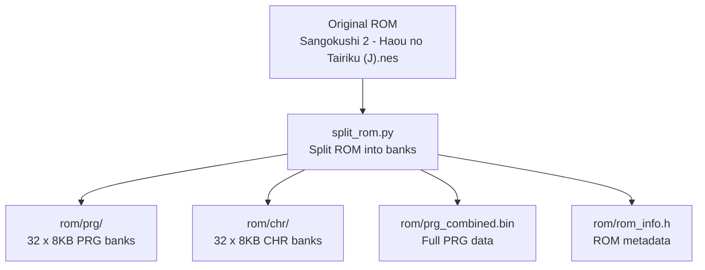
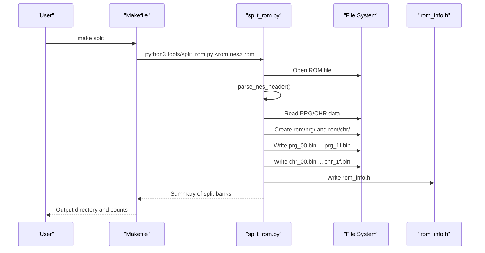
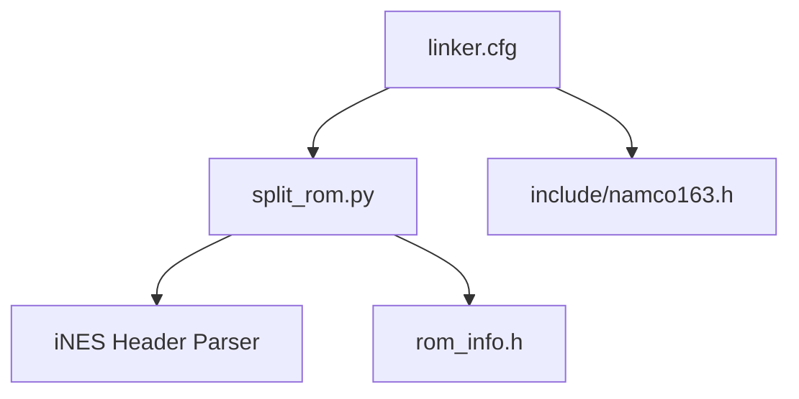

# ROM Splitting Process

<cite>
**Referenced Files in This Document**
- [split_rom.py](file://tools/split_rom.py)
- [analyze_rom.py](file://tools/analyze_rom.py)
- [verify_rom.py](file://tools/verify_rom.py)
- [build_nes.py](file://tools/build_nes.py)
- [disasm_6502.py](file://tools/disasm_6502.py)
- [generate_bank_stubs.py](file://tools/generate_bank_stubs.py)
- [PROJECT.md](file://PROJECT.md)
- [Makefile](file://Makefile)
- [linker.cfg](file://linker.cfg)
- [namco163.h](file://include/namco163.h)
- [rom_info.h](file://rom/rom_info.h)
- [all_banks.asm](file://asm/banks/all_banks.asm)
- [prg_1f.asm](file://asm/banks/prg_1f.asm)
</cite>

## Table of Contents
1. [Introduction](#introduction)
2. [Project Structure](#project-structure)
3. [Core Components](#core-components)
4. [Architecture Overview](#architecture-overview)
5. [Detailed Component Analysis](#detailed-component-analysis)
6. [Dependency Analysis](#dependency-analysis)
7. [Performance Considerations](#performance-considerations)
8. [Troubleshooting Guide](#troubleshooting-guide)
9. [Conclusion](#conclusion)
10. [Appendices](#appendices)

## Introduction
This document explains the automated ROM splitting and bank extraction process for the Namco-163 (Mapper 19) NES ROM. It covers how PRG and CHR data are separated into individual 8KB banks, the binary extraction methodology (header parsing, trainer handling, page counting), and the resulting file naming and storage organization. It also provides practical examples for running the ROM splitter, verifying extraction results, understanding the relationship between extracted banks and the original ROM structure, and guidance for organizing extracted banks for analysis and disassembly workflows.

## Project Structure
The project organizes ROM splitting and analysis tools alongside the disassembly infrastructure. The ROM splitting pipeline produces:
- PRG banks: 32 x 8KB files named prg_00.bin through prg_1f.bin
- CHR banks: 32 x 8KB files named chr_00.bin through chr_1f.bin
- A combined PRG binary for disassembler input
- An auto-generated header file with ROM metadata

**Diagram sources**
- [split_rom.py:38-122](file://tools/split_rom.py#L38-L122)
- [PROJECT.md:28-32](file://PROJECT.md#L28-L32)

**Section sources**
- [PROJECT.md:14-47](file://PROJECT.md#L14-L47)
- [Makefile:54-56](file://Makefile#L54-L56)

## Core Components
- ROM header parser: Validates iNES signature, extracts mapper, PRG/CHR page counts, mirroring, and trainer presence.
- Bank splitter: Divides PRG and CHR data into 8KB banks, respecting header/trainer offsets.
- Output generator: Creates PRG/CHR directories, writes bank files, and generates rom_info.h and prg_combined.bin.
- Analysis tool: Provides ROM structure analysis and bank characteristics for planning disassembly.
- Verification tool: Compares rebuilt ROM with original byte-for-byte to validate accuracy.
- Disassembler: Produces ca65 assembly listings from 6502 binaries for targeted bank analysis.
- Build tool: Adds iNES header and pads PRG to match original ROM size for testing.

**Section sources**
- [split_rom.py:11-122](file://tools/split_rom.py#L11-L122)
- [analyze_rom.py:10-128](file://tools/analyze_rom.py#L10-L128)
- [verify_rom.py:10-51](file://tools/verify_rom.py#L10-L51)
- [disasm_6502.py:286-334](file://tools/disasm_6502.py#L286-L334)
- [build_nes.py:10-51](file://tools/build_nes.py#L10-L51)

## Architecture Overview
The ROM splitting process follows a straightforward pipeline: read the ROM, parse the header, extract PRG/CHR data, split into 8KB banks, and write outputs. The Makefile integrates this into the project workflow, enabling quick splitting and subsequent analysis.

**Diagram sources**
- [Makefile:54-56](file://Makefile#L54-L56)
- [split_rom.py:38-122](file://tools/split_rom.py#L38-L122)

## Detailed Component Analysis

### ROM Header Parsing and Extraction
The header parser validates the iNES signature and decodes mapper, PRG/CHR page counts, mirroring, battery, trainer, and four-screen flags. It computes PRG and CHR sizes in bytes and determines the header/trainer offset for extracting PRG data.

Key behaviors:
- Validates magic bytes and calculates mapper from flags.
- Computes PRG size as pages × 16KB and CHR size as pages × 8KB.
- Adjusts PRG start offset if a trainer is present.

**Section sources**
- [split_rom.py:11-36](file://tools/split_rom.py#L11-L36)

### Bank Division Methodology
The splitter divides PRG and CHR data into 8KB banks:
- PRG banks: 32 banks (256KB total) mapped to $8000-$FFFF via 8KB slots.
- CHR banks: 32 banks (256KB total) mapped to PPU VRAM.

Naming convention:
- PRG: prg_00.bin through prg_1f.bin
- CHR: chr_00.bin through chr_1f.bin

Storage organization:
- PRG banks under rom/prg/
- CHR banks under rom/chr/
- rom_info.h contains mapper, PRG/CHR bank counts
- prg_combined.bin contains the full PRG data for disassembler input

**Section sources**
- [split_rom.py:69-122](file://tools/split_rom.py#L69-L122)
- [PROJECT.md:28-32](file://PROJECT.md#L28-L32)

### ROM Analysis and Planning
The analysis tool prints ROM metadata and performs a per-bank analysis:
- Counts non-zero and non-$FF bytes
- Identifies code markers (e.g., SEI/CLD sequences)
- Counts JSR/RTS/RTI occurrences
- Detects interrupt vectors within banks
- Provides guidance for disassembly order (e.g., start with bank 0x1F)

This helps plan which banks to disassemble first and how to organize the linker configuration.

**Section sources**
- [analyze_rom.py:10-128](file://tools/analyze_rom.py#L10-L128)
- [PROJECT.md:118-133](file://PROJECT.md#L118-L133)

### Bank Stub Generation for Disassembly
To support incremental disassembly, bank stubs are generated:
- 32 .asm stub files under asm/banks/, each including the corresponding PRG bank binary
- all_banks.asm includes all stubs for convenience
- Bank stubs use segments aligned with the linker configuration

This enables replacing stubs with real disassembled code as analysis progresses.

**Section sources**
- [generate_bank_stubs.py:12-46](file://tools/generate_bank_stubs.py#L12-L46)
- [all_banks.asm:1-38](file://asm/banks/all_banks.asm#L1-L38)

### Disassembler for Targeted Analysis
The 6502 disassembler converts binary banks into ca65 assembly listings:
- Supports configurable start address, length, and base address mapping
- Handles truncated instructions gracefully
- Outputs human-readable listings for focused analysis

Useful for examining specific areas (e.g., reset handler at $E000 in bank 0x1F).

**Section sources**
- [disasm_6502.py:286-334](file://tools/disasm_6502.py#L286-L334)

### ROM Verification Workflow
After building or modifying code, compare the rebuilt ROM with the original:
- Byte-by-byte comparison with first mismatches reported
- Accuracy percentage calculation
- Useful for validating correctness and tracking progress

**Section sources**
- [verify_rom.py:10-51](file://tools/verify_rom.py#L10-L51)

### Build Pipeline Integration
The Makefile orchestrates the entire workflow:
- make split: splits ROM into banks
- make analyze: runs ROM analysis
- make banks: generates bank stubs
- make disasm: disassembles a specific bank
- make verify: compares rebuilt ROM with original
- make: builds the final ROM with iNES header

**Section sources**
- [Makefile:54-69](file://Makefile#L54-L69)
- [Makefile:83-100](file://Makefile#L83-L100)

## Dependency Analysis
The ROM splitting process depends on the iNES header format and the Namco-163 mapper configuration. The linker configuration defines how 8KB banks map to CPU addresses, which informs how extracted banks relate to runtime memory.

**Diagram sources**
- [split_rom.py:11-36](file://tools/split_rom.py#L11-L36)
- [linker.cfg:18-54](file://linker.cfg#L18-L54)
- [namco163.h:10-14](file://include/namco163.h#L10-L14)

**Section sources**
- [linker.cfg:18-54](file://linker.cfg#L18-L54)
- [namco163.h:10-14](file://include/namco163.h#L10-L14)

## Performance Considerations
- The splitter reads the entire ROM into memory once, then iterates over PRG/CHR data to write 8KB chunks. This is efficient for typical ROM sizes.
- Bank analysis scans each 8KB bank linearly, counting bytes and searching for patterns. For 32 banks, this is fast and suitable for interactive development.
- Disassembler performance scales with input size; limit length for targeted analysis.

## Troubleshooting Guide
Common issues and resolutions:
- Corrupted ROM or invalid iNES header
  - Symptom: Header parsing raises an error or mapper detection fails.
  - Resolution: Verify the ROM file integrity and ensure it is a valid iNES file.
  - Section sources
    - [split_rom.py:13-14](file://tools/split_rom.py#L13-L14)

- Incorrect header information (mapper, PRG/CHR pages)
  - Symptom: Unexpected bank counts or mismatched sizes.
  - Resolution: Confirm the ROM uses Mapper 19 (Namco-163) and check the header fields.
  - Section sources
    - [split_rom.py:21-25](file://tools/split_rom.py#L21-L25)

- Trainer present but not handled
  - Symptom: PRG data appears offset by 512 bytes.
  - Resolution: The splitter automatically accounts for trainer presence; ensure the ROM has the trainer flag set if applicable.
  - Section sources
    - [split_rom.py:57-58](file://tools/split_rom.py#L57-L58)

- Bank naming and organization confusion
  - Symptom: Missing or misnamed bank files.
  - Resolution: Ensure the output directory exists and the script runs successfully; verify rom_info.h for correct counts.
  - Section sources
    - [split_rom.py:63-67](file://tools/split_rom.py#L63-L67)
    - [split_rom.py:100-109](file://tools/split_rom.py#L100-L109)

- Disassembly order and bank switching
  - Symptom: Difficulty understanding which bank to disassemble first.
  - Resolution: Start with bank 0x1F (reset handler) and follow the vector dispatch table; use bank switching macros from include/namco163.h.
  - Section sources
    - [PROJECT.md:101-116](file://PROJECT.md#L101-L116)
    - [namco163.h:68-86](file://include/namco163.h#L68-L86)

- Verification failures
  - Symptom: Non-zero mismatches after rebuilding.
  - Resolution: Use the verification tool to locate first mismatch and adjust disassembly or linker configuration accordingly.
  - Section sources
    - [verify_rom.py:32-51](file://tools/verify_rom.py#L32-L51)

## Conclusion
The ROM splitting process automates extraction of PRG and CHR data into 32 x 8KB banks, preserving the original ROM’s structure and enabling targeted disassembly. By integrating header parsing, bank division, and metadata generation, the workflow supports iterative analysis and verification. Following the recommended disassembly order and using the provided tools ensures accurate reconstruction and analysis of the ROM.

## Appendices

### Practical Examples

- Running the ROM splitter
  - Command: make split
  - Expected output: rom/prg/ and rom/chr/ populated with 32 banks each, rom_info.h generated, and prg_combined.bin created.
  - Section sources
    - [Makefile:54-56](file://Makefile#L54-L56)
    - [split_rom.py:124-136](file://tools/split_rom.py#L124-L136)

- Verifying extraction results
  - Command: make verify
  - Expected outcome: Byte-by-byte comparison with original ROM; zero mismatches indicate successful extraction and reconstruction.
  - Section sources
    - [Makefile:58-61](file://Makefile#L58-L61)
    - [verify_rom.py:10-51](file://tools/verify_rom.py#L10-L51)

- Understanding bank-to-memory mapping
  - Bank 0x1F maps to $E000-$FFFF at boot; other banks are mapped via $F800-$FFFF registers.
  - Section sources
    - [PROJECT.md:84-99](file://PROJECT.md#L84-L99)
    - [namco163.h:10-14](file://include/namco163.h#L10-L14)

- Organizing extracted banks for analysis
  - Use bank stubs to replace with disassembled code incrementally.
  - Update linker.cfg to add segments for each bank as you disassemble.
  - Section sources
    - [generate_bank_stubs.py:12-46](file://tools/generate_bank_stubs.py#L12-L46)
    - [linker.cfg:32-54](file://linker.cfg#L32-L54)

- Starting the disassembly workflow
  - Disassemble bank 0x1F first (reset handler at $E000).
  - Follow the vector dispatch table to identify other code-heavy banks.
  - Section sources
    - [PROJECT.md:134-150](file://PROJECT.md#L134-L150)
    - [prg_1f.asm:74-148](file://asm/banks/prg_1f.asm#L74-L148)