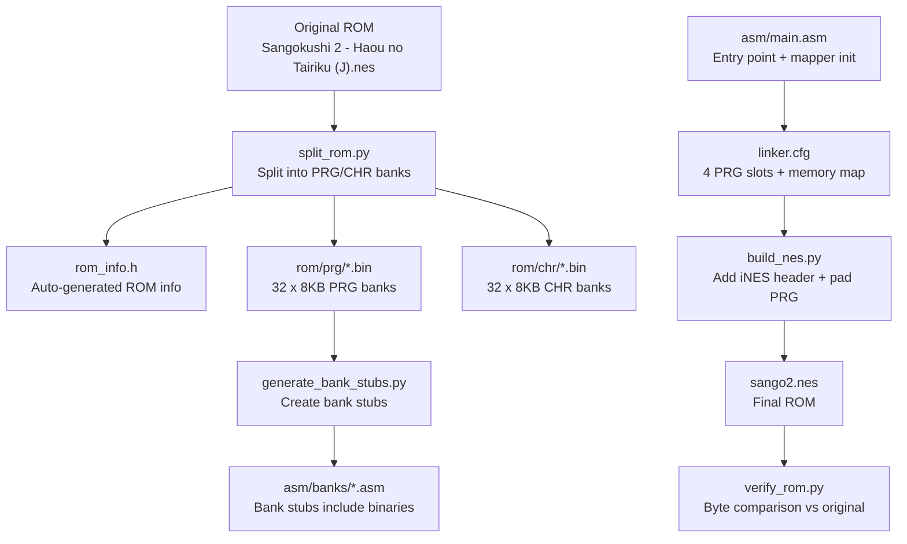
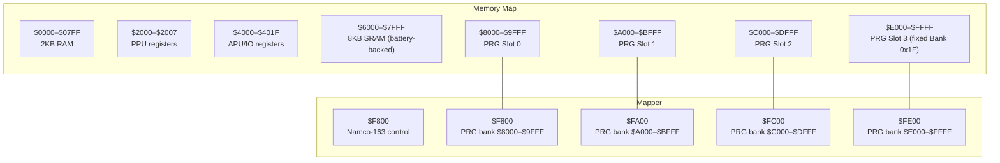
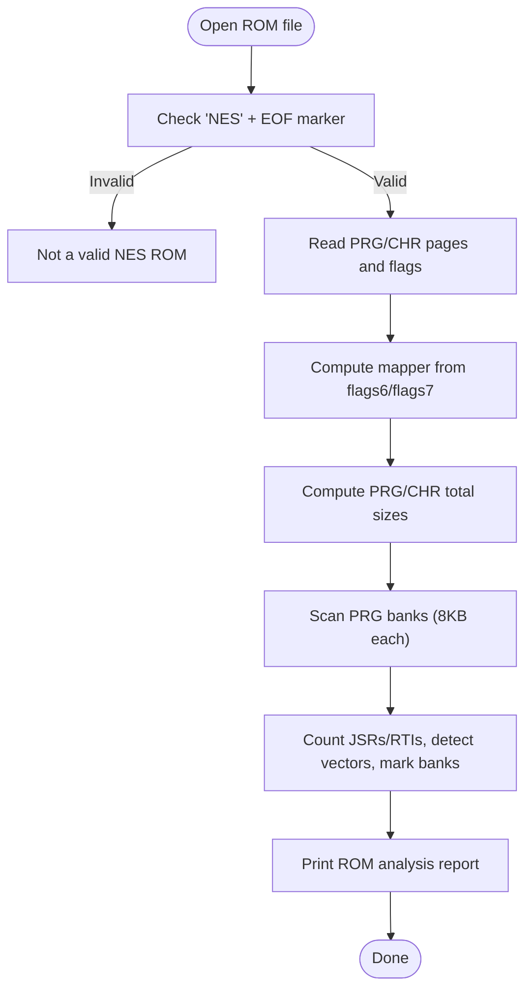
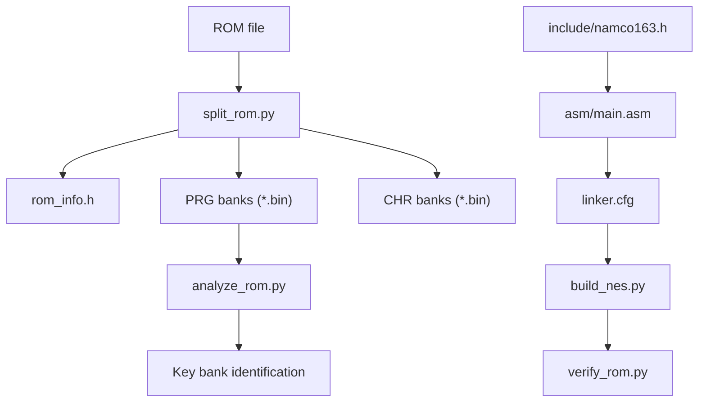

# ROM Structure Overview

<cite>
**Referenced Files in This Document**
- [PROJECT.md](file://PROJECT.md)
- [rom/rom_info.h](file://rom/rom_info.h)
- [tools/split_rom.py](file://tools/split_rom.py)
- [tools/analyze_rom.py](file://tools/analyze_rom.py)
- [tools/build_nes.py](file://tools/build_nes.py)
- [tools/verify_rom.py](file://tools/verify_rom.py)
- [include/namco163.h](file://include/namco163.h)
- [linker.cfg](file://linker.cfg)
- [asm/main.asm](file://asm/main.asm)
- [Makefile](file://Makefile)
- [asm/banks/prg_1f.asm](file://asm/banks/prg_1f.asm)
</cite>

## Table of Contents
1. [Introduction](#introduction)
2. [Project Structure](#project-structure)
3. [Core Components](#core-components)
4. [Architecture Overview](#architecture-overview)
5. [Detailed Component Analysis](#detailed-component-analysis)
6. [Dependency Analysis](#dependency-analysis)
7. [Performance Considerations](#performance-considerations)
8. [Troubleshooting Guide](#troubleshooting-guide)
9. [Conclusion](#conclusion)

## Introduction
This document explains the NES ROM structure for Sangokushi 2 - Haou no Tairiku (J) with a focus on the iNES header parsing process, mapper identification (Namco-163), PRG/CHR bank organization, and memory layout implications for the 6502 processor. It also documents how the ROM is structured for 8KB bank switching, why Bank 0x1F is prioritized for initial analysis, and how the execution flow depends on the mapper’s fixed bank mapping.

## Project Structure
The repository organizes the ROM analysis and disassembly pipeline around:
- Tools for splitting ROMs, analyzing structure, building NES ROMs, and verifying byte-for-byte matches
- Header definitions for the Namco-163 mapper and 6502 registers
- Linker configuration defining 4 PRG slots and memory map
- Assembly entry points and bank stubs for 32 PRG banks

**Diagram sources**
- [tools/split_rom.py:38-122](file://tools/split_rom.py#L38-L122)
- [rom/rom_info.h:1-9](file://rom/rom_info.h#L1-L9)
- [tools/build_nes.py:10-51](file://tools/build_nes.py#L10-L51)
- [linker.cfg:18-55](file://linker.cfg#L18-L55)
- [tools/verify_rom.py:10-51](file://tools/verify_rom.py#L10-L51)

**Section sources**
- [PROJECT.md:14-47](file://PROJECT.md#L14-L47)
- [Makefile:50-75](file://Makefile#L50-L75)

## Core Components
- iNES header parser: Reads magic bytes, PRG/CHR page counts, flags, and computes mapper number and mirroring
- ROM splitter: Parses header, extracts PRG/CHR, splits into 8KB banks, generates rom_info.h
- ROM analyzer: Scans PRG banks for code markers, vectors, and identifies key banks
- Mapper definitions: Namco-163 register addresses and bank switching macros
- Linker configuration: Defines 4 PRG slots ($8000–$FFFF) and memory map
- Build pipeline: Assembles, links, adds iNES header, and verifies against original

**Section sources**
- [tools/split_rom.py:11-36](file://tools/split_rom.py#L11-L36)
- [tools/analyze_rom.py:10-128](file://tools/analyze_rom.py#L10-L128)
- [include/namco163.h:10-86](file://include/namco163.h#L10-L86)
- [linker.cfg:18-55](file://linker.cfg#L18-L55)
- [tools/build_nes.py:10-51](file://tools/build_nes.py#L10-L51)

## Architecture Overview
The ROM uses the Namco-163 (mapper 19) with 8KB bank switching. The 6502 can access 256KB PRG ROM across 32 banks and 256KB CHR ROM across 32 banks. The memory map defines 4 PRG slots, each 8KB, mapped to $8000–$FFFF. At boot, Bank 0x1F is fixed in PRG slot 3 ($E000–$FFFF), while the other slots are switchable via mapper registers.

**Diagram sources**
- [PROJECT.md:70-116](file://PROJECT.md#L70-L116)
- [include/namco163.h:10-14](file://include/namco163.h#L10-L14)
- [linker.cfg:4-16](file://linker.cfg#L4-L16)

## Detailed Component Analysis

### iNES Header Parsing and Mapper Identification
The iNES header is parsed to extract:
- Magic bytes: “NES” + EOF marker
- PRG pages (16KB each)
- CHR pages (8KB each)
- Mapper number: combination of upper nibble from flags7 and upper nibble from flags6
- Mirroring: horizontal or vertical
- Battery presence: yes/no

The ROM analyzer prints the mapper, PRG/CHR sizes, mirroring, and battery status, then scans each 8KB PRG bank for code indicators (e.g., SEI/CLD sequences, JSR/RTS/RTI counts), and detects interrupt vectors within banks.

**Diagram sources**
- [tools/analyze_rom.py:10-128](file://tools/analyze_rom.py#L10-L128)
- [tools/split_rom.py:11-36](file://tools/split_rom.py#L11-L36)

**Section sources**
- [tools/analyze_rom.py:10-128](file://tools/analyze_rom.py#L10-L128)
- [tools/split_rom.py:11-36](file://tools/split_rom.py#L11-L36)

### PRG/CHR Page Counts and Bank Sizes
- PRG ROM: 32 banks × 8KB each = 256KB
- CHR ROM: 32 banks × 8KB each = 256KB
- Bank size: 8KB for PRG banks; 8KB for CHR banks
- PRG page count: 32 banks (from rom_info.h and analysis)
- CHR page count: 32 banks (from rom_info.h and analysis)

These sizes are derived from the ROM header and confirmed by the auto-generated rom_info.h and the ROM analyzer.

**Section sources**
- [PROJECT.md:8-12](file://PROJECT.md#L8-L12)
- [rom/rom_info.h:2-8](file://rom/rom_info.h#L2-L8)
- [tools/analyze_rom.py:42-102](file://tools/analyze_rom.py#L42-L102)

### Memory Layout Implications for the 6502
- RAM: $0000–$07FF (2KB)
- PPU registers: $2000–$2007
- APU/IO registers: $4000–$401F
- SRAM: $6000–$7FFF (8KB, battery-backed)
- PRG slots: 4 × 8KB windows at $8000–$FFFF
- Fixed bank: PRG slot 3 ($E000–$FFFF) is Bank 0x1F at boot
- Bank switching: Writes to $F800–$FFFF select banks for each slot

This layout determines where code and data live and how the 6502 accesses them during execution.

**Section sources**
- [PROJECT.md:70-116](file://PROJECT.md#L70-L116)
- [linker.cfg:4-16](file://linker.cfg#L4-L16)

### Namco-163 Mapper and 8KB Bank Switching
- Mapper: 19 (Namco-163)
- Bank switching registers:
  - $F800 → PRG bank for $8000–$9FFF
  - $FA00 → PRG bank for $A000–$BFFF
  - $FC00 → PRG bank for $C000–$DFFF
  - $FE00 → PRG bank for $E000–$FFFF (fixed to Bank 0x1F at boot)
- Macros: switch_bank_8000, switch_bank_A000, switch_bank_C000, switch_bank_E000

The mapper enables dynamic loading of code/data across the 4 PRG slots, allowing the game to manage larger codebases than would fit in a single 8KB window.

**Section sources**
- [PROJECT.md:84-116](file://PROJECT.md#L84-L116)
- [include/namco163.h:10-86](file://include/namco163.h#L10-L86)

### Execution Flow and Why Bank 0x1F Is Prioritized
- Reset handler is located at Bank 0x1F, address $E000
- The reset routine initializes PPU/APU, clears RAM, and reads a vector table at $E07C to dispatch to the current game state
- PRG slot 3 is fixed to Bank 0x1F at boot, so the reset vector and dispatch logic are always reachable
- Other banks are loaded dynamically via bank switching macros

This makes Bank 0x1F the logical starting point for reverse engineering the game’s control flow.

**Section sources**
- [PROJECT.md:101-116](file://PROJECT.md#L101-L116)
- [asm/banks/prg_1f.asm:74-148](file://asm/banks/prg_1f.asm#L74-L148)

### Practical Examples: Interpreting ROM Header Information
- Mapper identification: Combine flags6 and flags7 to compute mapper number; confirm mapper 19 (Namco-163)
- PRG/CHR sizes: Multiply page counts by 16KB and 8KB respectively
- Mirroring and battery: Read flags6 bits to determine mirroring type and battery presence
- Bank scanning: Use JSR/RTI counts and vector detection to identify code-heavy banks and potential entry points

These steps are implemented in the ROM analyzer and splitter.

**Section sources**
- [tools/analyze_rom.py:15-40](file://tools/analyze_rom.py#L15-L40)
- [tools/split_rom.py:21-36](file://tools/split_rom.py#L21-L36)

### Relationship Between ROM Structure and Execution Flow
- Bank 0x1F contains the reset handler and dispatch table; it must be present for boot
- Bank switching is used to load state-specific code into PRG slots
- The linker configuration assigns segments to PRG slots, enabling incremental disassembly
- The build pipeline creates a ROM with the correct header and sizes, and verification compares the rebuilt ROM to the original

**Section sources**
- [PROJECT.md:118-150](file://PROJECT.md#L118-L150)
- [linker.cfg:32-55](file://linker.cfg#L32-L55)
- [tools/build_nes.py:10-51](file://tools/build_nes.py#L10-L51)
- [tools/verify_rom.py:10-51](file://tools/verify_rom.py#L10-L51)

## Dependency Analysis
The ROM analysis pipeline depends on:
- ROM header parsing and bank splitting
- Bank scanning and classification
- Mapper definitions and bank switching macros
- Linker configuration and assembly entry points
- Build and verification scripts

**Diagram sources**
- [tools/split_rom.py:38-122](file://tools/split_rom.py#L38-L122)
- [tools/analyze_rom.py:10-128](file://tools/analyze_rom.py#L10-L128)
- [include/namco163.h:64-86](file://include/namco163.h#L64-L86)
- [asm/main.asm:25-121](file://asm/main.asm#L25-L121)
- [linker.cfg:18-55](file://linker.cfg#L18-L55)
- [tools/build_nes.py:10-51](file://tools/build_nes.py#L10-L51)
- [tools/verify_rom.py:10-51](file://tools/verify_rom.py#L10-L51)

**Section sources**
- [Makefile:50-75](file://Makefile#L50-L75)

## Performance Considerations
- Bank scanning: The analyzer processes 32 banks of 8KB each; optimizing vector detection and instruction counting can reduce runtime
- Disassembly: Using the disassembler with appropriate base addresses ensures accurate mapping of CPU addresses to file offsets
- Linking: Properly assigning segments to PRG slots avoids unnecessary padding and improves load performance

[No sources needed since this section provides general guidance]

## Troubleshooting Guide
- Invalid ROM: If the header check fails, the file is not a valid NES ROM
- Size mismatch: The verify script reports mismatches and accuracy percentage; use this to track progress
- Incorrect mapper: Confirm mapper number from flags6/flags7 and ensure rom_info.h reflects the correct mapper
- Bank switching: Ensure bank switching macros are used correctly and that Bank 0x1F remains fixed in PRG slot 3

**Section sources**
- [tools/analyze_rom.py:16-18](file://tools/analyze_rom.py#L16-L18)
- [tools/verify_rom.py:22-51](file://tools/verify_rom.py#L22-L51)
- [tools/split_rom.py:21-36](file://tools/split_rom.py#L21-L36)

## Conclusion
Sangokushi 2 uses the Namco-163 (mapper 19) with 32 PRG banks (8KB each) and 32 CHR banks (8KB each). The iNES header parsing and ROM analysis tools provide reliable identification of mapper, sizes, and bank characteristics. Bank 0x1F is fixed in PRG slot 3 at boot and contains the reset handler and dispatch logic, making it the ideal starting point for disassembly. The linker configuration and mapper macros define how code is loaded into PRG slots, enabling dynamic execution flow across the 256KB PRG ROM.