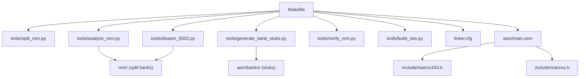
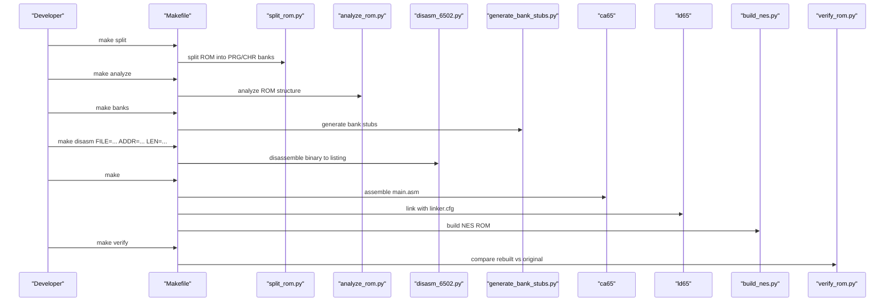
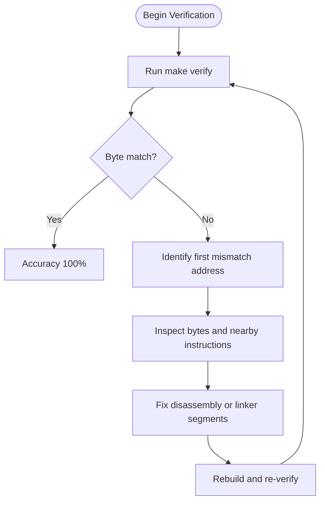
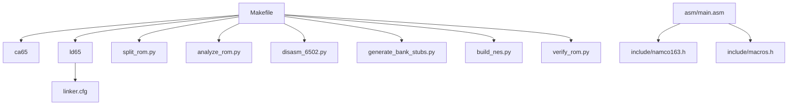

# Troubleshooting and FAQ

<cite>
**Referenced Files in This Document**
- [PROJECT.md](file://PROJECT.md)
- [Makefile](file://Makefile)
- [linker.cfg](file://linker.cfg)
- [tools/split_rom.py](file://tools/split_rom.py)
- [tools/analyze_rom.py](file://tools/analyze_rom.py)
- [tools/disasm_6502.py](file://tools/disasm_6502.py)
- [tools/generate_bank_stubs.py](file://tools/generate_bank_stubs.py)
- [tools/verify_rom.py](file://tools/verify_rom.py)
- [tools/build_nes.py](file://tools/build_nes.py)
- [asm/main.asm](file://asm/main.asm)
- [include/namco163.h](file://include/namco163.h)
- [include/macros.h](file://include/macros.h)
- [code/bank_1f_analysis.md](file://code/bank_1f_analysis.md)
</cite>

## Table of Contents
1. [Introduction](#introduction)
2. [Project Structure](#project-structure)
3. [Core Components](#core-components)
4. [Architecture Overview](#architecture-overview)
5. [Detailed Component Analysis](#detailed-component-analysis)
6. [Dependency Analysis](#dependency-analysis)
7. [Performance Considerations](#performance-considerations)
8. [Troubleshooting Guide](#troubleshooting-guide)
9. [Conclusion](#conclusion)
10. [Appendices](#appendices)

## Introduction
This Troubleshooting and FAQ section focuses on resolving common issues encountered during ROM analysis, disassembly, and build processes for the Sangokushi 2 - Haou no Tairiku (J) disassembly project. It covers toolchain installation and PATH configuration, cc65 version compatibility, disassembly pitfalls (incorrect bank assignments, missing cross-references, assembly errors), build system problems (linker configuration, memory mapping conflicts, verification failures), debugging techniques for disassembly accuracy, handling ROM corruption and incomplete analysis results, and frequently asked questions about scope, timeline expectations, and contributions. Guidance is grounded in the repository’s documented toolchain, Makefile targets, linker configuration, and analysis utilities.

## Project Structure
The project is organized around a Makefile-driven workflow, Python-based analysis and disassembly tools, cc65-based assembly, and a linker configuration tailored to the Namco-163 mapper. Key directories and files include:
- Build orchestration via Makefile targets
- ROM splitting and analysis utilities
- Disassembler for 6502 binaries
- Bank stub generation and verification scripts
- Linker configuration for 4 PRG slots
- Assembly entry points and mapper macros
- Bank 0x1F analysis and function tables

**Diagram sources**
- [Makefile:1-102](file://Makefile#L1-L102)
- [tools/split_rom.py:1-140](file://tools/split_rom.py#L1-L140)
- [tools/analyze_rom.py:1-135](file://tools/analyze_rom.py#L1-L135)
- [tools/disasm_6502.py:1-363](file://tools/disasm_6502.py#L1-L363)
- [tools/generate_bank_stubs.py:1-53](file://tools/generate_bank_stubs.py#L1-L53)
- [tools/verify_rom.py:1-73](file://tools/verify_rom.py#L1-L73)
- [tools/build_nes.py:1-58](file://tools/build_nes.py#L1-L58)
- [linker.cfg:1-55](file://linker.cfg#L1-L55)
- [asm/main.asm:1-141](file://asm/main.asm#L1-L141)
- [include/namco163.h:1-87](file://include/namco163.h#L1-L87)
- [include/macros.h:1-72](file://include/macros.h#L1-L72)

**Section sources**
- [PROJECT.md:14-47](file://PROJECT.md#L14-L47)
- [Makefile:1-102](file://Makefile#L1-L102)

## Core Components
- Toolchain: cc65 (ca65, ld65) installed to a local prefix and referenced via Makefile variables. Ensure the cc65 bin directory is on PATH so the Makefile can invoke ca65 and ld65.
- ROM splitting: tools/split_rom.py parses the iNES header and splits PRG/CHR into 8KB banks, generating rom_info.h and a combined PRG file for analysis.
- ROM analysis: tools/analyze_rom.py prints mapper, PRG/CHR sizes, mirroring, battery presence, and per-bank statistics (JSR/RTS/RTI counts, vector candidates, RESET markers).
- Disassembler: tools/disasm_6502.py disassembles 6502 binaries into ca65-compatible listings with support for start/base addresses and length.
- Bank stubs: tools/generate_bank_stubs.py creates .asm stubs for each PRG bank, each including the corresponding binary via .incbin.
- Build pipeline: Makefile orchestrates assembling, linking, and building the final ROM with tools/build_nes.py.
- Verification: tools/verify_rom.py compares rebuilt ROM with the original byte-by-byte and reports mismatches and accuracy.
- Linker configuration: linker.cfg defines 4 PRG slots ($8000-$FFFF) and segments for banked code and data.

**Section sources**
- [PROJECT.md:49-69](file://PROJECT.md#L49-L69)
- [Makefile:4-28](file://Makefile#L4-L28)
- [tools/split_rom.py:38-122](file://tools/split_rom.py#L38-L122)
- [tools/analyze_rom.py:10-128](file://tools/analyze_rom.py#L10-L128)
- [tools/disasm_6502.py:286-334](file://tools/disasm_6502.py#L286-L334)
- [tools/generate_bank_stubs.py:12-46](file://tools/generate_bank_stubs.py#L12-L46)
- [tools/build_nes.py:10-51](file://tools/build_nes.py#L10-L51)
- [tools/verify_rom.py:10-51](file://tools/verify_rom.py#L10-L51)
- [linker.cfg:18-54](file://linker.cfg#L18-L54)

## Architecture Overview
The build and analysis pipeline integrates Python tools with cc65. The Makefile coordinates targets for splitting, analyzing, disassembling, generating stubs, assembling, linking, building, verifying, and cleaning.

**Diagram sources**
- [Makefile:30-75](file://Makefile#L30-L75)
- [tools/split_rom.py:38-122](file://tools/split_rom.py#L38-L122)
- [tools/analyze_rom.py:68-69](file://tools/analyze_rom.py#L68-L69)
- [tools/generate_bank_stubs.py:50-52](file://tools/generate_bank_stubs.py#L50-L52)
- [tools/disasm_6502.py:336-362](file://tools/disasm_6502.py#L336-L362)
- [tools/build_nes.py:10-51](file://tools/build_nes.py#L10-L51)
- [tools/verify_rom.py:53-69](file://tools/verify_rom.py#L53-L69)

## Detailed Component Analysis

### Toolchain Installation and PATH Configuration
Common issues:
- cc65 executables not found: Ensure /home/zero/.local/bin is on PATH so ca65 and ld65 are executable from anywhere.
- Conflicting cc65 installations: Prefer the locally installed version referenced by Makefile variables CC65_HOME, CA65, LD65.
- Version mismatch symptoms: If assembly fails or link errors occur, confirm ca65/ld65 versions align with documented expectations.

Resolutions:
- Add the cc65 bin directory to PATH in your shell profile (.bashrc or .zshrc) as indicated in the project documentation.
- Verify tool availability with which ca65 and which ld65.
- If multiple versions exist, adjust PATH precedence or use absolute paths in Makefile overrides.

**Section sources**
- [PROJECT.md:51-56](file://PROJECT.md#L51-L56)
- [Makefile:7-10](file://Makefile#L7-L10)

### ROM Splitting and Bank Generation
Common issues:
- Missing or inaccessible ROM file: The splitter expects a valid iNES file; errors are raised if the file is not found or not a valid ROM.
- Unexpected mapper or bank counts: Confirm the ROM header mapper and PRG/CHR page counts match expectations.

Resolutions:
- Run make split with the correct ROM filename and ensure it exists in the repository root.
- Review printed header details and bank counts to validate correctness.
- Regenerate bank stubs with make banks after splitting.

**Section sources**
- [tools/split_rom.py:11-36](file://tools/split_rom.py#L11-L36)
- [tools/split_rom.py:124-139](file://tools/split_rom.py#L124-L139)
- [Makefile:54-56](file://Makefile#L54-L56)
- [Makefile:50-52](file://Makefile#L50-L52)

### ROM Analysis and Bank Identification
Common issues:
- Misinterpreted vector tables: The analyzer flags vector-like sequences; misreads can occur if the wrong base address is used.
- Overly broad “CODE” markers: Some banks may appear code-heavy but contain data or padding.

Resolutions:
- Use make analyze to review per-bank statistics and vector candidates.
- Cross-reference flagged vectors with disassembly outputs and bank switching routines.
- Focus on banks with RESET markers and high JSR counts for prioritization.

**Section sources**
- [tools/analyze_rom.py:10-128](file://tools/analyze_rom.py#L10-L128)
- [PROJECT.md:118-133](file://PROJECT.md#L118-L133)

### Disassembly Workflow and Bank 0x1F
Common issues:
- Incorrect bank assignment: Disassembling the wrong bank or using wrong start addresses leads to garbage or non-executable output.
- Missing cross-references: Bank-switched calls and data require careful tracking across banks.
- Assembly errors: Using wrong addressing modes or missing segments in linker configuration causes link failures.

Resolutions:
- Start with Bank 0x1F at $E000-$E100 as documented.
- Follow the dispatch table at $E07C and trace call targets to identify additional banks.
- Replace .incbin stubs with actual disassembly and update linker.cfg with appropriate segments.
- Use the provided macros and include files to ensure correct bank switching and register definitions.

**Section sources**
- [PROJECT.md:134-151](file://PROJECT.md#L134-L151)
- [PROJECT.md:101-117](file://PROJECT.md#L101-L117)
- [code/bank_1f_analysis.md:1-20](file://code/bank_1f_analysis.md#L1-L20)
- [include/namco163.h:68-86](file://include/namco163.h#L68-L86)

### Disassembler Behavior and Addressing Modes
Common issues:
- Truncated instructions: Disassembly stops early if the input file ends mid-instruction.
- Relative branch targets: Ensure correct calculation of relative targets based on instruction length.
- Unknown opcodes: The disassembler falls back to .byte directives for unknown bytes.

Resolutions:
- Provide sufficient length to cover the desired region.
- Validate relative branches and adjust base/start addresses as needed.
- Review truncated instruction warnings and pad or re-examine the input.

**Section sources**
- [tools/disasm_6502.py:286-334](file://tools/disasm_6502.py#L286-L334)
- [tools/disasm_6502.py:336-362](file://tools/disasm_6502.py#L336-L362)

### Bank Stub Generation and Replacement
Common issues:
- Stubs still include .incbin: Assemblies will include raw binary instead of disassembled code.
- Missing segments: Linker fails if segments for new banks are not declared.

Resolutions:
- After generating stubs, edit each prg_XX.asm to remove .incbin and insert disassembled code with proper .segment directives.
- Update linker.cfg to add new segments for each bank as you disassemble.
- Keep all_banks.asm synchronized with the current set of bank stubs.

**Section sources**
- [tools/generate_bank_stubs.py:12-46](file://tools/generate_bank_stubs.py#L12-L46)
- [linker.cfg:32-54](file://linker.cfg#L32-L54)
- [Makefile:50-52](file://Makefile#L50-L52)

### Build Pipeline and Verification Failures
Common issues:
- Linker configuration errors: Missing segments or incorrect memory regions cause link failures.
- Memory mapping conflicts: Overlapping segments or incorrect slot assignments lead to unexpected code placement.
- Verification mismatches: Byte differences between original and rebuilt ROM indicate disassembly or linker issues.

Resolutions:
- Ensure linker.cfg reflects all bank segments and correct load regions.
- Verify that bank switching macros and register definitions are included in assembly.
- Run make verify to identify mismatch locations and iterate on disassembly until accuracy improves.

**Section sources**
- [Makefile:37-48](file://Makefile#L37-L48)
- [tools/build_nes.py:10-51](file://tools/build_nes.py#L10-L51)
- [tools/verify_rom.py:10-51](file://tools/verify_rom.py#L10-L51)
- [linker.cfg:18-54](file://linker.cfg#L18-L54)

### Debugging Disassembly Accuracy and Verification Mismatches
Systematic approach:
- Start with Bank 0x1F and the dispatch table at $E07C. Confirm the reset handler and vector dispatch logic.
- Replace stubs incrementally and rebuild to catch issues early.
- Use make verify to pinpoint first mismatch location and inspect the surrounding bytes.
- For bank-switched calls, ensure correct bank assignments and that the target code is present in the linked segments.

**Diagram sources**
- [tools/verify_rom.py:10-51](file://tools/verify_rom.py#L10-L51)
- [PROJECT.md:134-151](file://PROJECT.md#L134-L151)

## Dependency Analysis
The Makefile orchestrates dependencies among Python tools and cc65. The linker configuration defines memory regions and segments used by the assembly.

**Diagram sources**
- [Makefile:30-75](file://Makefile#L30-L75)
- [linker.cfg:18-54](file://linker.cfg#L18-L54)
- [asm/main.asm:6-8](file://asm/main.asm#L6-L8)
- [include/namco163.h:1-4](file://include/namco163.h#L1-L4)
- [include/macros.h:1-4](file://include/macros.h#L1-L4)

**Section sources**
- [Makefile:30-75](file://Makefile#L30-L75)
- [linker.cfg:18-54](file://linker.cfg#L18-L54)
- [asm/main.asm:6-8](file://asm/main.asm#L6-L8)

## Performance Considerations
- Large ROM analysis: The analyzer scans all PRG banks; for very large projects, consider running targeted analyses on subsets of banks.
- Disassembly speed: Limit disasm length with LEN and focus on high-priority banks (RESET, dispatch, heavy JSR counts).
- Build iterations: Keep linker.cfg minimal until all banks are integrated; add segments incrementally to reduce link errors and rebuild time.
- Verification overhead: Run verification after major disassembly updates to catch regressions early.

## Troubleshooting Guide

### Toolchain and PATH Issues
- Symptom: make fails with “command not found” for ca65 or ld65.
- Resolution: Ensure /home/zero/.local/bin is on PATH and reload shell profile. Confirm with which ca65 and which ld65.

**Section sources**
- [PROJECT.md:51-56](file://PROJECT.md#L51-L56)
- [Makefile:7-10](file://Makefile#L7-L10)

### cc65 Version Compatibility
- Symptom: Link errors or unexpected behavior.
- Resolution: Use the documented cc65 versions (ca65 V2.19, ld65 V2.19) as installed from source to ~/.local/.

**Section sources**
- [PROJECT.md:51-56](file://PROJECT.md#L51-L56)

### ROM Splitting Problems
- Symptom: “File not found” or invalid ROM header.
- Resolution: Verify the ROM filename exists and is a valid iNES file. Re-run make split and check printed header details.

**Section sources**
- [tools/split_rom.py:124-139](file://tools/split_rom.py#L124-L139)
- [Makefile:54-56](file://Makefile#L54-L56)

### Disassembly Challenges
- Symptom: Garbage output or truncated instructions.
- Resolution: Provide correct start address and length. For Bank 0x1F, use ADDR=E000 and appropriate LEN. Review truncated instruction warnings and pad/re-examine input.

**Section sources**
- [PROJECT.md:134-151](file://PROJECT.md#L134-L151)
- [tools/disasm_6502.py:286-334](file://tools/disasm_6502.py#L286-L334)

### Bank Assignment and Cross-References
- Symptom: Calls to bank-switched routines not resolving or incorrect targets.
- Resolution: Identify bank switching routines and register writes. Use the provided macros and include files to ensure correct bank switching.

**Section sources**
- [include/namco163.h:68-86](file://include/namco163.h#L68-L86)
- [PROJECT.md:134-151](file://PROJECT.md#L134-L151)

### Linker Configuration and Memory Mapping
- Symptom: Link errors about undefined symbols or overlapping segments.
- Resolution: Add new MEMORY regions and SEGMENTS for each bank as you disassemble. Ensure segments match the intended load regions.

**Section sources**
- [linker.cfg:18-54](file://linker.cfg#L18-L54)
- [PROJECT.md:152-158](file://PROJECT.md#L152-L158)

### Verification Failures
- Symptom: Non-zero mismatches or accuracy below expected thresholds.
- Resolution: Inspect first mismatch address, fix disassembly or linker segments, rebuild, and re-run verification.

**Section sources**
- [tools/verify_rom.py:10-51](file://tools/verify_rom.py#L10-L51)

### ROM Corruption and Incomplete Analysis
- Symptom: Unexpected zeros, FF blocks, or empty banks.
- Resolution: Investigate the per-bank statistics from make analyze. Treat banks with high zero/FF content as likely data or padding and avoid disassembling unless patterns emerge.

**Section sources**
- [tools/analyze_rom.py:10-128](file://tools/analyze_rom.py#L10-L128)

### Unexpected Disassembly Output
- Symptom: Misinterpreted vectors or non-executable sequences.
- Resolution: Cross-check vector candidates with the dispatch table and bank switching routines. Adjust base addresses and lengths accordingly.

**Section sources**
- [tools/analyze_rom.py:68-128](file://tools/analyze_rom.py#L68-L128)
- [code/bank_1f_analysis.md:54-77](file://code/bank_1f_analysis.md#L54-L77)

### Frequently Asked Questions
- What is the project scope?
  - The project disassembles Sangokushi 2 - Haou no Tairiku (J) using cc65 and a bank-stubbed approach with Namco-163 mapper support.
- What is the expected timeline?
  - The project status indicates disassembly has not started; iterative work is planned with verification to track progress.
- How do I contribute?
  - Follow the documented workflow: split ROM, analyze, disassemble, replace stubs, update linker.cfg, build, and verify. Submit incremental improvements with clear rationale.

**Section sources**
- [PROJECT.md:165-181](file://PROJECT.md#L165-L181)

## Conclusion
By following the documented toolchain, Makefile targets, and analysis workflow, most issues related to ROM analysis, disassembly, and build processes can be resolved systematically. Start with ROM splitting and analysis, focus on Bank 0x1F and dispatch logic, replace stubs with accurate disassembly, update linker configuration incrementally, and use verification to maintain accuracy. For persistent issues, leverage the troubleshooting steps and consult the referenced files for precise configuration and behavior.

## Appendices

### Quick Reference: Makefile Targets and Usage
- make: Build the final ROM
- make split: Split ROM into PRG/CHR banks
- make analyze: Analyze ROM structure and print per-bank statistics
- make banks: Generate PRG bank stubs
- make disasm FILE=rom/prg/prg_XX.bin ADDR=XXXX LEN=256: Disassemble a binary
- make verify: Compare rebuilt ROM with original
- make clean/distclean: Remove build artifacts/all generated files

**Section sources**
- [PROJECT.md:58-69](file://PROJECT.md#L58-L69)
- [Makefile:82-101](file://Makefile#L82-L101)