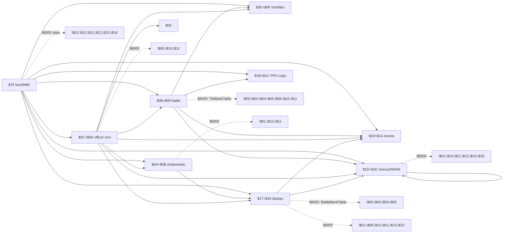

# PRG Bank Switch Linkage Map

Sangokushi 2 - Haou no Tairiku (J) / Namco-163 (Mapper 19)

Maps every PRG bank-switching call site found in `prg_1f.asm` and the five
disassembled bank pairs (`prg_08_09`, `prg_0a_0b`, `prg_0c_0d`, `prg_17_18`,
`prg_1d_1e`) to its target bank(s).

Raw per-line scan data: [bank_switch_scan_raw.txt](bank_switch_scan_raw.txt)
(generated by `tools/scan_bank_links.py`).

---

## 1. Switching primitives (all in bank $1F)

| Primitive | Addr | Windows affected | Shadow RAM |
|---|---|---|---|
| `SwitchBankAC_B` | $F237 | $A000 = Y, $C000 = Y+1 | $00E2 / $00E3 (slot B) |
| `SwitchBankAC_A` | $F24B | $A000 = Y, $C000 = Y+1 | $00DF / $00E0 (slot A) |
| `SwitchBank8_B`  | $F25F | $8000 = Y | $00E1 (slot B) |
| `SwitchBank8_A`  | $F266 | $8000 = Y | $00DE (slot A) |
| `BankedCallbackTrampoline` | $EE07 | $A000/$C000 via slot B, then JMP to inline `.word` target | saves caller bank to $0058 |
| `BankedCallbackReturn` | $EE4D | restores slot B from stack (pulled saved bank) | — |
| `BankSwitch` | $E51F | **CHR only** (8-byte config $E0/$E1 pages); no PRG effect | $00E6-$00ED |

Notes:

- Effective PRG bank = `Y & $1F` (32 x 8KB banks). Callers usually pass
  `Y = $2x` (slot-A context) or `Y = $3x` (slot-B context); bit 5 is
  electrically ignored. `$A000` writes additionally set bits 6-7 (`ORA #$C0`,
  CHR-RAM disable).
- Trampoline calling convention: `LDY #bank; JSR BankedCallbackTrampoline;
  .word target`. The target routine must end in `JSR/JMP BankedCallbackReturn`
  (the trampoline pushes `$EE4C` and the saved bank below the target's return
  address).
- Two independent "slots" exist so NMI can restore context: `NmiHandler`
  ($F800) re-writes registers from slot-B shadows $E1/$E2/$E3; `NmiEpilogue`
  ($F88D) restores slot-A shadows $DE/$DF/$E0 before RTI.

---

## 2. Linkage matrix (source -> target)

`$xx+$yy` = 16KB pair in $A000/$C000. `$xx @$8000` = 8KB window.

| Source | Targets in $A000/$C000 | Targets in $8000 |
|---|---|---|
| **$1F** (boot, states, NMI) | $08+$09, $0A+$0B, $0C+$0D, $0E+$0F, $17+$18, $19+$1A, $1B+$1C, $1D+$1E | $02 (sound), $10, $11, $12, $15, $16 |
| **$08+$09** (battle/AI) | $0E (trampoline), $1B+$1C, $1D+$1E, $19 (trampoline) | $00, $03, $04, $05 (terrain, via TileBankTable), $06, $10, $11 |
| **$0A+$0B** (AI turn/domestic) | $17+$18 (trampoline, 1 call) | $01 (sprites), $10, $11 |
| **$0C+$0D** (officer turn/march) | $00, $08+$09, $0A+$0B, $0E, $17+$18, $19, $1D+$1E (all trampolines) | $06, $10, $11 |
| **$17+$18** (display/domestic) | $19 (trampoline), $1D+$1E (trampoline) | $00, $03, $04, $05 (battle scene, via BattleBankTable), $01, $06, $10, $11, $14, $15 (sprites) |
| **$1D+$1E** (menus/SRAM) | $1D+$1E (self trampoline) | $01, $10, $11, $12, $13 (PosDataBankTable), $16 |

Undisassembled banks referenced as targets: $00-$07, $0E-$16, $19-$1C.

---

## 3. Per-source detail

### 3.1 Bank $1F (prg_1f.asm)

**Reset / state machine** (`LDY #imm ; JSR SwitchBankAC_*`):

| Caller | Y | Target pair | Purpose |
|---|---|---|---|
| State_NewGameInit $E110 | $37 | $17+$18 | `B17_18_PpuCopyRaw` display |
| State_NewGameInit $E118, $E134 | $3D | $1D+$1E | SRAM flag / `B1D_1E_MenuUpdate` |
| State_RandomDisplay2A $E182 | $2A | $0A+$0B | `B17_18_PpuWriteRle`-equivalent in $0A |
| State_KingdomSelect $E19A | $37 | $17+$18 | `B17_18_DataRecordLoader` |
| State_KingdomSelect $E1A9 | $2C | $0C+$0D | `B0C_0D_OfficerTransferCalc_Entry` (scenario mode) |
| State_KingdomSelect $E1B4 | $28 | $08+$09 | `B17_18_PpuCopyRaw`-equivalent in $08 (normal mode) |
| State_KingdomSelect $E1D9 | $3D | $1D+$1E | `B1D_1E_StateHandler` |
| State_RandomDisplay28 $E226 | $28 | $08+$09 | PPU RLE display |
| State_DomesticAffairs $E247 | $37 | $17+$18 | display |
| State_DomesticAffairs $E24F, $E27B | $3D | $1D+$1E | domestic dispatch |
| DomesticActionLookup $E2BB | $37 | $17+$18 | action graphics by $0544 |
| State_BattlePhase $E315, $E31D, $E34C | $37 / $3D | $17+$18 / $1D+$1E | battle status |
| DisplayInit $E372 | $3D | $1D+$1E | bank display |
| State_TerritoryView $E3B2, $E3BA, $E3CD | $37 / $3D | $17+$18 / $1D+$1E | map view |
| State_AdvisorCouncil $E424, $E42C..$E447 | $37 / $3D | $17+$18 / $1D+$1E | council dialogue |
| State_TurnSummary $E492, $E49A, $E4AA | $37 / $3D | $17+$18 / $1D+$1E | turn report |

**$8000 window from $1F:**

| Caller | Y | Bank | Purpose |
|---|---|---|---|
| State_NewGameInit $E0E9 | $30 | $10 | data read after pointer setup |
| State_BattlePhase $E2FC | $30 | $10 | battle data |
| State_TerritoryView $E38B | $35 | $15 | map graphics |
| State_AdvisorCouncil $E3FD | $32 | $12 | advisor tiles |
| State_TurnSummary $E479 | $36 | $16 | report tiles |
| GetNameDisplayScale $F30D | $30 | $10 | name width data |
| GetOfficerRomRecordAddr $F389 | $31 | $11 | officer records |
| SoundNotePlayer $E60B | $22 | $02 | wavetable/note data |

**NMI sub-dispatch** ($EE53): bit4-7 of $007E trigger `LDY #$3D;
SwitchBankAC_B; JMP` into bank $1D jump-table entries:

| $007E bit | Target |
|---|---|
| bit3 | $1D $A00C `B1D_1E_MapDisplaySetup` |
| bit2 | $1D $A006 `B1D_1E_VRAMBufferWrite` |
| bit1 | $1D $A012 `B1D_1E_FlushTileBuffer` |
| bit0 | $1D $A000 `B1D_1E_PPUTileRender` |

**NMI state handlers** ($F87B table, per `addr_game_state`): every handler
starts with `$0E+$0F` (Y=$2E, shared font/tile data), then state-specific
pairs, finally re-selects the pair the interrupted code was using:

| Handler | Additional pairs touched |
|---|---|
| NmiState2_MapScreen | $1D+$1E, $1B+$1C |
| NmiState3_Battle | $17+$18, $19+$1A, $0C+$0D, $1D+$1E |
| NmiState4_Menu | ($0E+$0F only) |
| NmiState5_Diplomacy | $17+$18, $1D+$1E |
| NmiState6_Event | $0A+$0B |
| NmiState7_Strategy | $1D+$1E, $08+$09 |
| NmiState8_Officer | $1D+$1E, $17+$18 |
| NmiHandler_Busy | $0E+$0F |

### 3.2 Banks $08+$09 (prg_08_09.asm)

**$8000 data access (slot A unless noted):** $06 (AiTurnProcess, BattleSetup),
$10 (AiTurnProcess, BattleSetup, BattlePhaseProcess, UpdateOfficerCoords,
AiOfficerActionDispatch, SetupPostBattleState), $11 (AiTurnProcess, BattleSetup,
UpdateOfficerCoords, BattleCasualtyResolution, DrawStratagemTargetMarkers).

**Dynamic:** `GetTileTerrainClamped::@GetTileTerrain` ($B71C) reads
`TileBankTable` ($B8BB, zone-indexed): values $20/$23/$24/$25 -> physical
banks **$00/$03/$04/$05** hold the 16x16 terrain detail maps.

**Trampoline calls out:**

| Caller | Y | Target |
|---|---|---|
| AiOfficerActionDispatch $C1FC, $C2D1 | $3B | $1B+$1C $A003 (`B17_18_PpuCopyRaw`-equiv) |
| BattleAttritionRound $CE1B | $2E | $0E $A006 (tile write w/ offset) |
| BattleResult_PickEntry $D896 | $3D | $1D+$1E `B1D_1E_OfficerDisplay_Lookup` |
| BattleResult_InspectEntry/Finalize, BattleResultMenuPoll | $39 | $19 $A000 (RLE PPU writer) |
| BattleResultMenuPoll $D93D | $39 | $19 $A012 (battle dispatch) |

### 3.3 Banks $0A+$0B (prg_0a_0b.asm)

- **$8000 slot A**: $10 x16 (record/province data across the AI turn:
  ScanMatchData, FindBestEnemyProvince, InitNewGameContext,
  EvalProvinceAbsorption, AiTurnDispatch, CalcActionProb,
  OfficerSearchAndEvaluate, FindBestOfficerByCategory,
  CountValidPlayerProvinces, CollectEnemyProvinces/X, BuildAdjacencyBitmap),
  $11 x2 (EvaluateAndMarkOfficer, ReadBankedRecordField).
- **$8000 slot B**: $01 (Y=$21) for StateSpriteAnim and DrawSelectionSprites
  (sprite/animation data).
- **Trampoline**: CallDomesticDisplay $D72C, Y=$37 -> $17+$18
  `CheckGameStart::OfficerAssignEntry` ($A021).

### 3.4 Banks $0C+$0D (prg_0c_0d.asm)

All outbound $A000/$C000 traffic uses the trampoline. Jump-table entry =
`$A000 + 3*idx`.

| Caller | Y | Target bank | Target entry |
|---|---|---|---|
| ExchangeFrameUpdate $A00E | $28 | $08 | $A012 (battle status panel) |
| (exchange preamble) $A015 | $28 | $08 | $A021 (map scroll update) |
| (exchange preamble) $A022 | $20 | **$00** | $A015 (undisassembled) |
| Phase_Input $A0E8 | $3D | $1D | $A027 `B1D_1E_ProvinceDataHandler` |
| OfficerDetail_RenderWait $A257, $A262 | $39 | $19 | $A000 / $A012 |
| MoveState_CheckDest $A4D0 | $28 | $08 | $A027 (result scene init) |
| MoveState_Select $A579 | $2E | $0E | $A006 (tile write) |
| MoveState_Select $A5BB | $3D | $1D | $A027 |
| CommandState_Init $A8BB | $28 | $08 | $A01B (build command list) |
| CommandState_Cancel $AADD | $3D | $1D | $A027 |
| ExecStratagem_WinOver $B3AD | $2A | $0A | $A006 `B0A_0B_ArmyValueCalc_Entry` |
| ApplyLoyaltyChange $B62A | $2E | $0E | $A009 (display scroll loop) |
| ApplyLoyaltyChange $B63D | $28 | $08 | $A02A (slot clear) |
| ApplyGoldChange $B6EA | $2E | $0E | $A006 |
| OfficerTurnState_Confirm $BCF8 | $3D | $1D | $A027 |
| OfficerTurn_EndTurn $BE0C | $28 | $08 | $A00F (attrition round) |
| OfficerTurn_SwitchRuler $BE69 | $28 | $08 | $A00C (casualty resolution) |
| OfficerMarchDispatch $BFA0, $C016, $C158 | $3D | $1D | $A027 |
| MainLoopDispatch $C1FE | $28 | $08 | $A009 (AI officer action dispatch) |
| ArmyDeployDispatch $C360, $C39C | $39 | $19 | $A000 / $A012 |
| OfficerExchangeDispatch $C73D | $28 | $08 | $A018 (validate special officer) |
| OfficerTransferCalc $C7AF | $2E | $0E | $A009 |
| OfficerTransferCalc $C7D5 | $28 | $08 | $A02A |
| OfficerTransferCalc $C815, $C880 | $2A | $0A | $A00C (DistanceClamp) / $A006 (ArmyValueCalc) |
| ExchangeScene $D4F5 | $28 | $08 | $A006 (battle phase process) |
| ExchangeScene $D72E, $DB6D | $37 | $17 | $A012 (battle dispatch) |
| ExchangeScene $D7B5 | $37 | $17 | $A018 (advisor tiles) |
| ExchangeScene $D7E0, $D827, $D847 | $37 | $17 | $A015 (overlay window) |
| ExchangeScene $DC45 | $39 | $19 | $A000 |
| ExchangeScene $DF12 | $28 | $08 | $A018 |

**$8000:** $06 x4 (ArmyDeployDispatch), $10 (ProvinceSelect_InitList,
OfficerExchangeSelectDispatch, ExchangeScene x2), $11 (RecalcExchangeStats,
ExchangeScene x3).

### 3.5 Banks $17+$18 (prg_17_18.asm)

**Trampoline calls out:**

| Caller | Y | Target |
|---|---|---|
| TroopAssign_SelectTarget, SingleCombat_Init, SingleCombat_PlayerAction, EventCutscene_Init, EventCutscene2_Init | $3D | $1D $A030 `B1D_1E_OfficerDisplay_Render` |
| EventCutscene2_LoadData | $3D | $1D $A033 `B1D_1E_OfficerNameDisplay` |
| Diplomacy_ShowMenu, DomAction_InitOfficerDisplay, DomAction_UpdateOfficerDisplay, BattleResultMenuPoll-style | $39 | $19 $A012 |
| EventCutscene_LoadOverlay x2, DomAction_RenderOfficerEntry, DomAction_UpdateOfficerDisplay, DomAction_ScrollOfficerList, SetupMenuPtr | $39 | $19 $A000 (RLE PPU writer) |

**$8000 window:**

| Caller | Bank | Notes |
|---|---|---|
| DomesticDisplay, AnimSeq_PlayFrames | $01 | animation frames |
| DomesticActionDispatch, ScrollPanel_LoadRow | $06 | domestic action/panel data |
| DomAction_BuildOfficerList | $10 | officer list data |
| DomesticAffairs_BuildSpriteData | $11 | sprite data |
| BattleDispatch::BattleResolve, OverlayWindow (LoadOverlayPrimary) | **dynamic** | `BattleBankTable` ($A822): idx 0-31 -> $20, 32-55 -> $23, 56-63 -> $25, 64-95 -> $24, 96-119 -> $25; physical banks **$00, $03, $05, $04, $05** hold battle scene tiles/overlays |
| DrawSpriteFromBank | $14 / $15 | bit7 of A selects set A ($34) vs set B ($35) |

### 3.6 Banks $1D+$1E (prg_1d_1e.asm)

**$8000 window:**

| Caller | Bank | Notes |
|---|---|---|
| MenuUpdate, OfficerListHandler, ScenePageCopy, SramInit, StateHandler | $10 | menu/scene data |
| SetupBankedData, StateHandler, SramInit | $11 | banked data |
| MenuRenderer | $16 | renderer tiles |
| OfficerParamDisp | $01 | officer param graphics |
| MenuUpdate `CmdDrawName*` handlers | save/restore | `LDA cur_bank_8000 ($E1); PHA`, switch to $10 or dynamic bank from command stream (`LDA ($A6),Y`), then `PLA; TAY; JSR B1F_SwitchBank8_B` to restore |
| MenuUpdate (sprite pos) | **dynamic** | `PosDataBankTable` ($A6A7): $33/$32 -> physical **$13/$12** |

**Trampoline:** OfficerDisplay_Lookup $A89B and DomesticMenu_Return $C95D,
Y=$3D -> self pair, $A015 `B1D_1E_LoadScenarioData`.

---

## 4. Target-bank roles (inferred)

| Bank | Role (as observed) |
|---|---|
| $00 | terrain detail maps + battle scene tiles (idx 0-31); $0C/$0D calls its $A015 entry |
| $01 | sprite/animation data ($8000 data-only usage) |
| $02 | sound note/wavetable data (SoundNotePlayer) |
| $03-$05 | terrain/battle scene tile maps (zones) |
| $06 | AI + domestic action data |
| $08+$09 | battle engine (disassembled) - also used as PPU-copy provider at boot |
| $0A+$0B | AI turn / domestic engine (disassembled) |
| $0C+$0D | officer turn / march / command engine (disassembled) |
| $0E+$0F | shared font/tile + display-scroll helpers (NMI + $0C/$0D) |
| $10 | record/menu/province data (heaviest $8000 data bank) |
| $11 | officer records / sprite data |
| $12/$13 | sprite position data (PosDataBankTable), advisor tiles |
| $14/$15 | battle sprites (DrawSpriteFromBank), territory tiles |
| $16 | turn summary / menu renderer tiles |
| $17+$18 | display engine (disassembled) |
| $19+$1A | event/cutscene PPU helpers (RLE writer at $A000, dispatch at $A012) |
| $1B+$1C | PPU raw copy helper ($A003) |
| $1D+$1E | menus / domestic dispatch / SRAM (disassembled) |
| $1F | fixed boot bank: state machine, NMI, sound, primitives |

---

## 5. Linkage graph

Solid edges = $A000/$C000 pair switches (SwitchBankAC / trampoline);
dotted edges = $8000-window data access.
