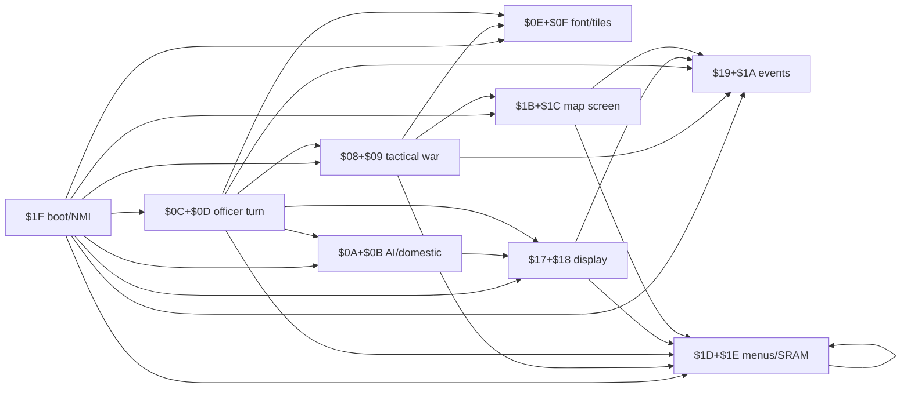
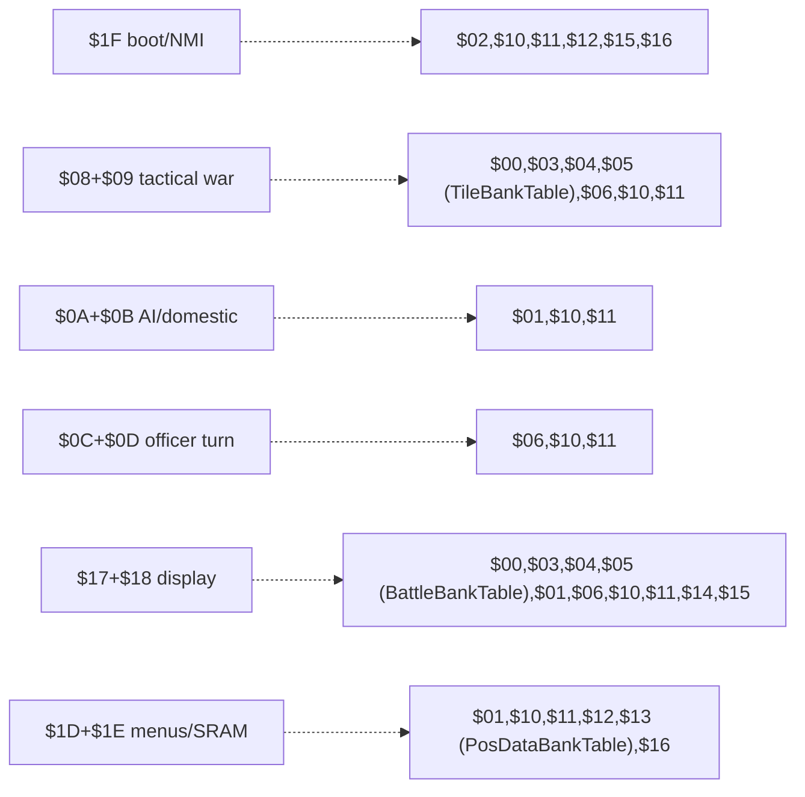

# PRG Bank Switch Linkage Map

Sangokushi 2 - Haou no Tairiku (J) / Namco-163 (Mapper 19)

Maps every PRG bank-switching call site found in `prg_1f.asm` and the
disassembled bank pairs (`prg_08_09`, `prg_0a_0b`, `prg_0c_0d`, `prg_17_18`,
`prg_1b_1c`, `prg_1d_1e`) to its target bank(s).

There are exactly two families of PRG switch primitives, with disjoint
effects:

- **Code PRG switches** — `SwitchBankAC_A` / `SwitchBankAC_B` and
  `BankedCallbackTrampoline`. These change the code banks mapped at
  $A000-$FFFF ($A000-$DFFF switchable; $E000-$FFFF = fixed bank $1F).
- **Data PRG switches** — `SwitchBank8_A` / `SwitchBank8_B`. These change
  only the $8000-$9FFF window (data lookup). They do **not** change code
  banks $A000-$FFFF.

Raw per-line scan data: [bank_switch_scan_raw.txt](bank_switch_scan_raw.txt)
(generated by `tools/scan_bank_links.py`; successor tool
`tools/find_undisassembled_targets.py`).

---

## 1. Switching primitives (all in fixed bank $1F)

### 1.1 Code PRG bank switches ($A000-$FFFF)

| Primitive | Addr | Windows affected | Shadow RAM |
|---|---|---|---|
| `SwitchBankAC_B` | $F237 | $A000 = Y, $C000 = Y+1 | $00E2 / $00E3 (slot B) |
| `SwitchBankAC_A` | $F24B | $A000 = Y, $C000 = Y+1 | $00DF / $00E0 (slot A) |
| `BankedCallbackTrampoline` | $EE07 | $A000/$C000 via `SwitchBankAC_B` (slot B), then JMP to inline `.word` target | saves caller bank ($00E2) to $0058 |
| `BankedCallbackReturn` | $EE4D | pulls saved bank from stack, restores slot B via `SwitchBankAC_B` | — |

Implementation notes:

- Effective PRG bank = `Y & $1F` (32 x 8KB banks; bit 5+ is electrically
  ignored by the mapper). Callers usually pass `Y = $2x` (slot-A context)
  or `Y = $3x` (slot-B context).
- `SwitchBankAC_*` writes `NAMCO_PRG_C000` ($F000) with the raw bank number
  (Y+1), then writes `NAMCO_PRG_A000` ($E800) with `bank | $C0` — bits 6-7
  disable CHR-RAM for that window.
- `BankedCallbackTrampoline` calling convention:
  `LDY #bank; JSR BankedCallbackTrampoline; .word target`. It reads the
  caller's current slot-B $A000 bank from $00E2 (so trampoline calls always
  run in slot-B context), pushes `$EE4C` and the saved bank below the
  target's return address, then JMPs to the `.word` target in the new bank.
  The target routine must end in `JSR/JMP BankedCallbackReturn` to restore
  the caller's bank before RTS.
- `.word` targets such as $A000/$A003/$A015 are entry points in **other**
  banks (resolved from Y via `& $1F`), never addresses in the calling file.
- Two independent "slots" exist so NMI can restore context: `NmiHandler`
  ($F800) re-writes registers from slot-B shadows $E1/$E2/$E3;
  `NmiEpilogue` ($F88D) restores slot-A shadows $DE/$DF/$E0 before RTI.

### 1.2 Data PRG bank switches ($8000 window only)

| Primitive | Addr | Window affected | Shadow RAM |
|---|---|---|---|
| `SwitchBank8_B` | $F25F | $8000 = Y | $00E1 (slot B) |
| `SwitchBank8_A` | $F266 | $8000 = Y | $00DE (slot A) |

- Single `STY NAMCO_PRG_8000` ($E000) plus shadow save — nothing else.
- These switches **never** touch code banks $A000-$FFFF; the $8000 window is
  used purely to read data tables/graphics from the selected bank.

### 1.3 Not a PRG switch

| Routine | Addr | Effect |
|---|---|---|
| `BankSwitch` | $E51F | **CHR only** (8-byte config $E0/$E1 pages); no PRG effect | (shadow $00E6-$00ED) |

---

## 2. Code-bank linkage matrix (SwitchBankAC / trampoline)

$A000/$C000 16KB-pair targets. `$xx+$yy` = pair; `$xx` = $A000 window only.
Only bank $1F calls `SwitchBankAC_A/B` directly; every other bank reaches
code in other banks exclusively through `BankedCallbackTrampoline`.

| Source | Code targets in $A000/$C000 | Mechanism |
|---|---|---|
| **$1F** (boot, states, NMI) | $08+$09, $0A+$0B, $0C+$0D, $0E+$0F, $17+$18, $19+$1A, $1B+$1C, $1D+$1E | direct `SwitchBankAC_A/B` |
| **$08+$09** (tactical war/AI) | $0E, $19, $1B+$1C, $1D+$1E | trampoline |
| **$0A+$0B** (AI turn/domestic) | $17+$18 | trampoline (1 call) |
| **$0C+$0D** (officer turn/march) | $08+$09, $0A+$0B, $0E, $17+$18, $19, $1D+$1E | trampoline |
| **$17+$18** (display/domestic) | $19, $1D+$1E | trampoline |
| **$1B+$1C** (map screen) | $19, $1D+$1E | trampoline |
| **$1D+$1E** (menus/SRAM) | $1D+$1E (self pair) | trampoline |

Undisassembled code targets referenced via trampoline: $0E, $19. Bank $00 is
not a code target — the site once suspected of calling it ($0C $A022) was
verified against ROM bytes: `LDY #$28` -> bank $08, `.word $A015` =
`B08_09_StratagemTargetMarker_Entry` (`JMP DrawStratagemTargetMarkers` in
bank $08).

---

## 3. Data-bank linkage matrix (SwitchBank8, $8000 window)

Single 8KB bank targets. Never affects code banks.

| Source | Data banks in $8000 |
|---|---|
| **$1F** (boot, states, NMI) | $02 (sound), $10, $11, $12, $15, $16 |
| **$08+$09** (tactical war/AI) | $00, $03, $04, $05 (terrain, via `TileBankTable`), $06, $10, $11 |
| **$0A+$0B** (AI turn/domestic) | $01 (slot B, sprites), $10, $11 |
| **$0C+$0D** (officer turn/march) | $06, $10, $11 |
| **$17+$18** (display/domestic) | $00, $03, $04, $05 (battle scene, via `BattleBankTable`), $01, $06, $10, $11, $14/$15 (sprites, `DrawSpriteFromBank`) |
| **$1D+$1E** (menus/SRAM) | $01, $10, $11, $12/$13 (via `PosDataBankTable`), $16 |

Dynamic $8000 tables: `TileBankTable` ($B8BB in $08), `BattleBankTable`
($A822 in $17), `PosDataBankTable` ($A6A7 in $1D), `DrawSpriteFromBank`
(bit7 of A selects $14 vs $15 in $17).

---

## 4. Per-source detail

### 4.1 Bank $1F (prg_1f.asm)

**Code switches** — direct `LDY #imm ; JSR SwitchBankAC_*`:

| Caller | Y | Target pair | Purpose |
|---|---|---|---|
| State_NewGameInit $E110 | $37 | $17+$18 | `B17_18_PpuCopyRaw` display |
| State_NewGameInit $E118, $E134 | $3D | $1D+$1E | SRAM flag / `B1D_1E_MenuUpdate` |
| State_RandomDisplay2A $E182 | $2A | $0A+$0B | `B17_18_PpuWriteRle`-equivalent in $0A |
| State_KingdomSelect $E19A | $37 | $17+$18 | `B17_18_DataRecordLoader` |
| State_KingdomSelect $E1A9 | $2C | $0C+$0D | `B0C_0D_OfficerTransferCalc_Entry` (scenario mode) |
| State_KingdomSelect $E1B4 | $28 | $08+$09 | `B17_18_PpuCopyRaw`-equivalent in $08 (normal mode) |
| State_KingdomSelect $E1D9 | $3D | $1D+$1E | `B1D_1E_StateHandler` |
| State_RandomDisplay28 $E226 | $28 | $08+$09 | PPU RLE display |
| State_DomesticAffairs $E247 | $37 | $17+$18 | display |
| State_DomesticAffairs $E24F, $E27B | $3D | $1D+$1E | domestic dispatch |
| DomesticActionLookup $E2BB | $37 | $17+$18 | action graphics by $0544 |
| State_BattlePhase $E315, $E31D, $E34C | $37 / $3D | $17+$18 / $1D+$1E | battle status |
| DisplayInit $E372 | $3D | $1D+$1E | bank display |
| State_TerritoryView $E3B2, $E3BA, $E3CD | $37 / $3D | $17+$18 / $1D+$1E | map view |
| State_AdvisorCouncil $E424, $E42C..$E447 | $37 / $3D | $17+$18 / $1D+$1E | council dialogue |
| State_TurnSummary $E492, $E49A, $E4AA | $37 / $3D | $17+$18 / $1D+$1E | turn report |

**Data switches** — $8000 window (`SwitchBank8_A/B`):

| Caller | Y | Bank | Purpose |
|---|---|---|---|
| State_NewGameInit $E0E9 | $30 | $10 | data read after pointer setup |
| State_BattlePhase $E2FC | $30 | $10 | battle data |
| State_TerritoryView $E38B | $35 | $15 | map graphics |
| State_AdvisorCouncil $E3FD | $32 | $12 | advisor tiles |
| State_TurnSummary $E479 | $36 | $16 | report tiles |
| GetNameDisplayScale $F30D | $30 | $10 | name width data |
| GetOfficerRomRecordAddr $F389 | $31 | $11 | officer records |
| SoundNotePlayer $E60B | $22 | $02 | wavetable/note data |

**NMI sub-dispatch** ($EE53): bit4-7 of $007E trigger `LDY #$3D;
SwitchBankAC_B; JMP` into bank $1D jump-table entries:

| $007E bit | Target |
|---|---|
| bit3 | $1D $A00C `B1D_1E_MapDisplaySetup` |
| bit2 | $1D $A006 `B1D_1E_VRAMBufferWrite` |
| bit1 | $1D $A012 `B1D_1E_FlushTileBuffer` |
| bit0 | $1D $A000 `B1D_1E_PPUTileRender` |

**NMI state handlers** ($F87B table, per `addr_game_state`): every handler
starts with `$0E+$0F` (Y=$2E, shared font/tile data), then state-specific
pairs, finally re-selects the pair the interrupted code was using:

| Handler | Additional pairs touched |
|---|---|
| NmiState2_MapScreen | $1D+$1E, $1B+$1C |
| NmiState3_Battle | $17+$18, $19+$1A, $0C+$0D, $1D+$1E |
| NmiState4_Menu | ($0E+$0F only) |
| NmiState5_Diplomacy | $17+$18, $1D+$1E |
| NmiState6_Event | $0A+$0B |
| NmiState7_Strategy | $1D+$1E, $08+$09 |
| NmiState8_Officer | $1D+$1E, $17+$18 |
| NmiHandler_Busy | $0E+$0F |

### 4.2 Banks $08+$09 (prg_08_09.asm — tactical war layer)

Per `docs/manual_kb/terminology.md`, this bank implements the army-level
Tactical/War layer (war setup, tactical AI, attrition, war results), not the
piece-based Battle Mode sub-scenario. Procedure names use the `War*` prefix.

**Code switches (trampoline):**

| Caller | Y | Target |
|---|---|---|
| AiOfficerActionDispatch $C1FC, $C2D1 | $3B | $1B+$1C $A003 -> ActionDeltaInputPoll ($DA02, war-scene action delta input) |
| WarAttritionRound $CE1B | $2E | $0E $A006 (tile write w/ offset) |
| WarResult_PickEntry $D896 | $3D | $1D+$1E `B1D_1E_OfficerDisplay_Lookup` |
| WarResult_InspectEntry/Finalize, WarResultMenuPoll | $39 | $19 $A000 (RLE PPU writer) |
| WarResultMenuPoll $D93D | $39 | $19 $A012 (war-result dispatch) |

**Data switches ($8000, slot A unless noted):** $06 (AiTurnProcess,
WarSetup), $10 (AiTurnProcess, WarSetup, WarPhaseProcess,
UpdateOfficerCoords, AiOfficerActionDispatch, SetupPostWarState), $11
(AiTurnProcess, WarSetup, UpdateOfficerCoords,
WarCasualtyResolution, DrawStratagemTargetMarkers).

**Dynamic:** `GetTileTerrainClamped::@GetTileTerrain` ($B71C) reads
`TileBankTable` ($B8BB, zone-indexed): values $20/$23/$24/$25 -> physical
banks **$00/$03/$04/$05** hold the 16x16 terrain detail maps.

### 4.3 Banks $0A+$0B (prg_0a_0b.asm)

**Code switch (trampoline):** CallDomesticDisplay $D72C, Y=$37 -> $17+$18
`CheckGameStart::OfficerAssignEntry` ($A021).

**Data switches ($8000):**

- Slot A: $10 x16 (record/province data across the AI turn:
  ScanMatchData, FindBestEnemyProvince, InitNewGameContext,
  EvalProvinceAbsorption, AiAction_DomesticTurn, CalcActionProb,
  OfficerSearchAndEvaluate, FindBestOfficerByCategory,
  CountDefendedBorderProvinces, CollectEnemyBorderProvinces/X, BuildAdjacencyBitmap),
  $11 x2 (EvaluateAndMarkOfficer, ReadBankedRecordField).
- Slot B: $01 (Y=$21) for StateSpriteAnim and DrawSelectionSprites
  (sprite/animation data).

### 4.4 Banks $0C+$0D (prg_0c_0d.asm)

**Code switches (trampoline).** All outbound $A000/$C000 traffic uses the
trampoline. Jump-table entry = `$A000 + 3*idx`.

| Caller | Y | Target bank | Target entry |
|---|---|---|---|
| ExchangeFrameUpdate $A00E | $28 | $08 | $A012 (war status panel) |
| (exchange preamble) $A015 | $28 | $08 | $A021 (map scroll update) |
| (exchange preamble) $A022 | $28 | $08 | $A015 `B08_09_StratagemTargetMarker_Entry` (DrawStratagemTargetMarkers) |
| Phase_Input $A0E8 | $3D | $1D | $A027 `B1D_1E_ProvinceDataHandler` |
| OfficerDetail_RenderWait $A257, $A262 | $39 | $19 | $A000 / $A012 |
| MoveState_CheckDest $A4D0 | $28 | $08 | $A027 (war result scene init) |
| MoveState_Select $A579 | $2E | $0E | $A006 (tile write) |
| MoveState_Select $A5BB | $3D | $1D | $A027 |
| CommandState_Init $A8BB | $28 | $08 | $A01B (build command list) |
| CommandState_Cancel $AADD | $3D | $1D | $A027 |
| ExecStratagem_Enticement $B3AD | $2A | $0A | $A006 `B0A_0B_ArmyValueCalc_Entry` |
| ApplyLoyaltyChange $B62A | $2E | $0E | $A009 (display scroll loop) |
| ApplyLoyaltyChange $B63D | $28 | $08 | $A02A (slot clear) |
| ApplyGoldChange $B6EA | $2E | $0E | $A006 |
| OfficerTurnState_Confirm $BCF8 | $3D | $1D | $A027 |
| OfficerTurn_EndTurn $BE0C | $28 | $08 | $A00F (attrition round) |
| OfficerTurn_SwitchRuler $BE69 | $28 | $08 | $A00C (casualty resolution) |
| OfficerMarchDispatch $BFA0, $C016, $C158 | $3D | $1D | $A027 |
| MainLoopDispatch $C1FE | $28 | $08 | $A009 (AI officer action dispatch) |
| ArmyDeployDispatch $C360, $C39C | $39 | $19 | $A000 / $A012 |
| OfficerExchangeDispatch $C73D | $28 | $08 | $A018 (validate special officer) |
| OfficerTransferCalc $C7AF | $2E | $0E | $A009 |
| OfficerTransferCalc $C7D5 | $28 | $08 | $A02A |
| OfficerTransferCalc $C815, $C880 | $2A | $0A | $A00C (DistanceClamp) / $A006 (ArmyValueCalc) |
| ExchangeScene $D4F5 | $28 | $08 | $A006 (war phase process) |
| ExchangeScene $D72E, $DB6D | $37 | $17 | $A012 (battle dispatch) |
| ExchangeScene $D7B5 | $37 | $17 | $A018 (advisor tiles) |
| ExchangeScene $D7E0, $D827, $D847 | $37 | $17 | $A015 (overlay window) |
| ExchangeScene $DC45 | $39 | $19 | $A000 |
| ExchangeScene $DF12 | $28 | $08 | $A018 |

**Data switches ($8000):** $06 x4 (ArmyDeployDispatch), $10
(ProvinceSelect_InitList, OfficerExchangeSelectDispatch, ExchangeScene x2),
$11 (RecalcExchangeStats, ExchangeScene x3).

### 4.5 Banks $17+$18 (prg_17_18.asm)

**Code switches (trampoline):**

| Caller | Y | Target |
|---|---|---|
| DuelCmd_RoundSetup, Surrender_Init, DuelPursue_Init, DuelPursue_SetupPursuer, TacticDialog_Init (all via `B1F_BankedCallbackTrampoline`) | $3D | $1D $A030 `B1D_1E_OfficerDisplay_Render` |
| TacticDialog_LoadName | $3D | $1D $A033 `B1D_1E_OfficerNameDisplay` |
| Diplomacy_ShowMenu, DuelData_ShowCard, StrategyCommand_InitOfficerDisplay, StrategyCommand_UpdateOfficerDisplay | $39 | $19 $A012 `B19_1A_OfficerCardAnimStep_Entry` |
| TacticDialog_LoadCards x2, SetupMenuPtr, StrategyCommand_UpdateOfficerDisplay (2nd call), StrategyCommand_ScrollOfficerList | $39 | $19 $A000 `B19_1A_OfficerCardRender_Entry` (RLE PPU writer) |

**Data switches ($8000):**

| Caller | Bank | Notes |
|---|---|---|
| DomesticDisplay, AnimSeq_PlayFrames | $01 | animation frames |
| DomesticActionDispatch, ScrollPanel_LoadRow | $06 | domestic action/panel data |
| DomAction_BuildOfficerList | $10 | officer list data |
| DomesticAffairs_BuildSpriteData | $11 | sprite data |
| BattleDispatch::BattleResolve, OverlayWindow (LoadOverlayPrimary) | **dynamic** | `BattleBankTable` ($A822): idx 0-31 -> $20, 32-55 -> $23, 56-63 -> $25, 64-95 -> $24, 96-119 -> $25; physical banks **$00, $03, $05, $04, $05** hold battle scene tiles/overlays |
| DrawSpriteFromBank | $14 / $15 | bit7 of A selects set A ($34) vs set B ($35) |

### 4.6 Banks $1D+$1E (prg_1d_1e.asm)

**Code switch (trampoline):** OfficerDisplay_Lookup $A89B and
DomesticMenu_Return $C95D, Y=$3D -> self pair, $A015
`B1D_1E_LoadScenarioData`.

**Data switches ($8000):**

| Caller | Bank | Notes |
|---|---|---|
| MenuUpdate, OfficerListHandler, ScenePageCopy, SramInit, StateHandler | $10 | menu/scene data |
| SetupBankedData, StateHandler, SramInit | $11 | banked data |
| MenuRenderer | $16 | renderer tiles |
| OfficerParamDisp | $01 | officer param graphics |
| MenuUpdate `CmdDrawName*` handlers | save/restore | `LDA cur_bank_8000 ($E1); PHA`, switch to $10 or dynamic bank from command stream (`LDA ($A6),Y`), then `PLA; TAY; JSR B1F_SwitchBank8_B` to restore |
| MenuUpdate (sprite pos) | **dynamic** | `PosDataBankTable` ($A6A7): $33/$32 -> physical **$13/$12** |

### 4.7 Banks $1B+$1C (prg_1b_1c.asm, partially decoded)

**Called from bank $1F (code switch):** NmiState2_MapScreen ($F8EF) switches
Y=$3B and JSR $A000 -> `MapScreenFrameUpdate` ($A00C): per-frame map-screen
update (ruler marker sprites via `MapRulerMarkerDraw` $DE83, animated
province sprites via `MapProvinceSpriteRefresh` $DF35, then frame-state
dispatch by $0400 through `B1F_CallbackDispatcher`). Entry $A000 is a stub
aliasing $A00C; $A003/$A006/$A009 jump to ActionDeltaInputPoll ($DA02) /
OfficerSelectDialogPoll ($D64A) / $DF25.

**Code switches out (trampoline, from MapScreenFrameUpdate and its
frame-state table $A025-$A044):**

| Caller | Y | Target |
|---|---|---|
| MapScreenFrameUpdate $A014 | $39 | $19 $A02A (MapProvinceDirtyMark: marks pending province $0402 in dirty bitmap $04E0-$04E3) |
| frame state $0B handler $A047 | $39 | $19 $A003 |
| frame state $0C handler $A04F | $39 | $19 $A021 |
| frame state 9 handler $A057 | $39 | $19 $A006 |
| frame state $0A handler $A05F | $39 | $19 $A009 |
| frame state $0D handler $A067 | $39 | $19 $A00C |
| frame state $0E handler $A06F | $3D | $1D $A039 `B1D_1E_SceneRenderer` |
| frame state $0F handler $A077 | $39 | $19 $A01E |

**Note:** bank $19 entry stubs are 3-byte JMPs ($A000->$CE1F, $A003->$A033,
$A006->$C773, $A009->$A296, $A00C->$AD81, $A01E->$C435, $A021->$AFE5,
$A02A->MapProvinceDirtyMark); several are shared with battle overlay usage.
The $04E0-$04E3 dirty bitmap is set by bank $19 $A02A and consumed/cleared
each frame by `MapProvinceSpriteRefresh`.

---

## 5. Target-bank roles (inferred)

### 5.1 Code banks (mapped at $A000/$C000 via SwitchBankAC / trampoline)

| Bank | Role (as observed) |
|---|---|
| $1F | fixed boot bank: state machine, NMI, sound, all switch primitives |
| $08+$09 | tactical war engine (disassembled) - also used as PPU-copy provider at boot |
| $0A+$0B | AI turn / domestic engine (disassembled) |
| $0C+$0D | officer turn / march / command engine (disassembled) |
| $0E+$0F | shared font/tile + display-scroll helpers (NMI + $0C/$0D) |
| $17+$18 | display engine (disassembled) |
| $19+$1A | event/cutscene PPU helpers (RLE writer at $A000, dispatch at $A012) |
| $1B+$1C | map screen: per-frame update (ruler marker + province sprites + frame-state machine, $A000/$A00C), war-scene action delta input ($A003 -> ActionDeltaInputPoll $DA02, called from banks $08+$09 AiOfficerActionDispatch) |
| $1D+$1E | menus / domestic dispatch / SRAM (disassembled) |

### 5.2 Data banks (mapped at $8000 via SwitchBank8 only)

| Bank | Role (as observed) |
|---|---|
| $00-$07 | data assets: terrain detail maps, battle scene tiles, sprite/animation frames (kept as .incbin stubs, not disassembled; no code callers — reached only via the $8000 window) |
| $02 | sound note/wavetable data (SoundNotePlayer) |
| $06 | AI + domestic action data |
| $10 | record/menu/province data (heaviest $8000 data bank) |
| $11 | officer records / sprite data |
| $12/$13 | sprite position data (PosDataBankTable), advisor tiles |
| $14/$15 | battle sprites (DrawSpriteFromBank), territory tiles |
| $16 | turn summary / menu renderer tiles |

---

## 6. Linkage graphs

### 6.1 Code-bank linkage (SwitchBankAC / BankedCallbackTrampoline)

### 6.2 Data-bank access ($8000 window via SwitchBank8)

Solid edges = code-bank pair switches ($A000/$C000, SwitchBankAC /
trampoline); dotted edges = $8000-window data access (SwitchBank8), which
never affects code banks $A000-$FFFF.
