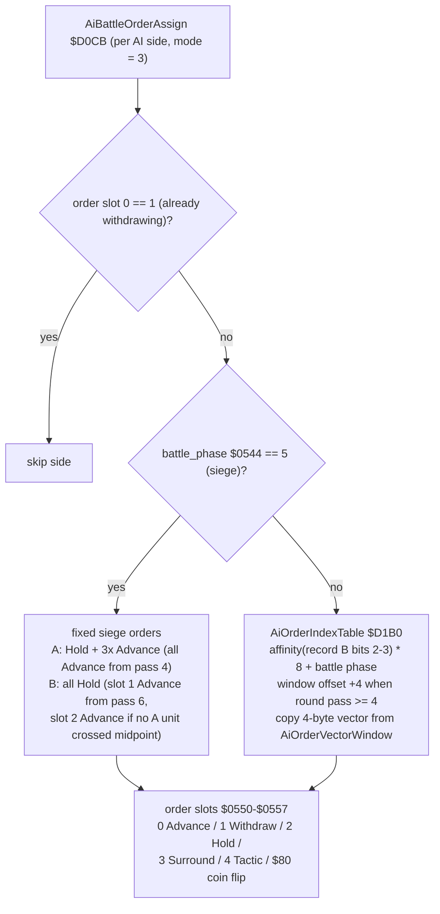
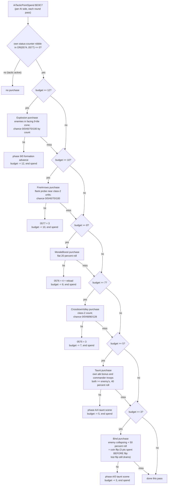
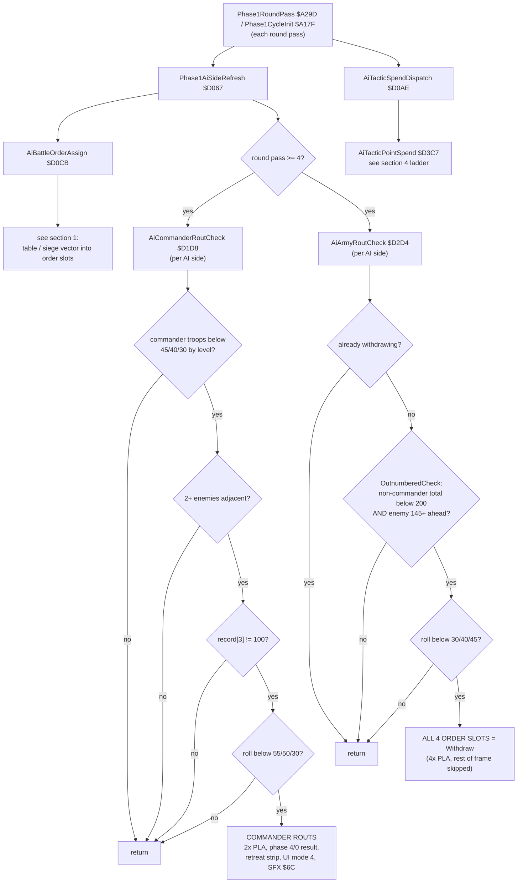

# Battle AI Decision Tree — prg_0e_0f.asm

Decision-tree summary of the AI battle model in `asm/banks/prg_0e_0f.asm` (battle overlay bank pair, banks $0E/$0F). Companion to `code/tactical_ai_decision_tree.md`, which covers the war-layer AI in `prg_08_09.asm` (AiTurnProcess); this document covers the **Battle Mode** side director: the per-round-pass AI that assigns battle orders, evaluates routs, and spends tactic points.

All addresses are ROM addresses ($D0xx region lives in the fixed/$C000-mapped half of the bank pair). RAM names follow the `btl_*` equates documented in `code/prg_0e_0f_ram_map.md`.

## Overview

The battle AI is a **per-round-pass co-routine** layered on top of `BattleOverlayDispatch` ($A030). Every round pass, the phase-1 round machinery (`Phase1RoundPass` $A29D, `Phase1CycleInit` $A17F) invokes two AI entry points for each side whose control mode ($0562 side A / $0563 side B) equals 3 (AI-controlled):

1. `Phase1AiSideRefresh` ($D067) — order assignment + rout checks
2. `AiTacticSpendDispatch` ($D0AE) — tactic-point purchase ladder

Design style: a **budget-driven, most-expensive-first utility ladder with positional gates** (tile probes around the commander) and per-game-level random thresholds, not a scripted tree. Retreat/rout decisions are one-shot and deliberately pop return addresses (PLA chains) to terminate or redirect the rest of the round pass.

Side A and side B run the identical logic, parameterized by roster base Y = 0 / $0B. The only asymmetry is a ROM artifact in the commander-rout strip setup (side B writes its own commander id into both strip slots).

## Entry points

| Address | Procedure | Called from |
|---|---|---|
| $D067 | `Phase1AiSideRefresh` | Phase1CycleInit $A17F, Phase1RoundPass $A29D |
| $D0AE | `AiTacticSpendDispatch` | Phase1RoundPass $A29A |
| $D0CB | `AiBattleOrderAssign` | Phase1AiSideRefresh |
| $D1D8 | `AiCommanderRoutCheck` | Phase1AiSideRefresh (round pass >= 4) |
| $D2D4 | `AiArmyRoutCheck` | Phase1AiSideRefresh (round pass >= 4) |
| $D32A | `BattleOutnumberedCheck` | AiArmyRoutCheck, @BindPurchase |
| $D3C7 | `AiTacticPointSpend` | AiTacticSpendDispatch |

## Key RAM

| RAM | Name | Role |
|---|---|---|
| $0544 | `battle_phase` | battle phase id (5 = siege) |
| $0545 | `btl_scan_col` | scan cursor / roster base (0 = side A, $0B = side B) |
| $0548 | `btl_frame_counter` | budget mirror / adjacent-enemy count (proc-local reuse) |
| $0549 | `btl_acting_unit` | acting side (0/1) |
| $0550-$0553 | `btl_order_slots_a` | side A order slots 0-3 |
| $0554-$0557 | `btl_order_slots_b` | side B order slots 0-3 |
| $0562/$0563 | `btl_input_mode_a/b` | control mode (3 = AI) |
| $0572/$0573 | `btl_point_budget_a/b` | tactic point budget per side |
| $0574-$0577 | `btl_status_ctr0..3` | packed status counters (per side: A = low nibble, B = high nibble) |
| $057A | `btl_round_pass` | round-pass counter |
| $057C | `btl_side_index` | AI side index (0/1) |
| $05AC/$05B7 | `btl_troops_a/b` | commander troop count per side |
| $05C2/$05CD | `btl_roster_code_a/b` | per-unit roster codes (low nibble = unit class, high nibble = side tag) |
| $0570/$0571 | `btl_edge_bonus_a/b` | commander-column attack bonus per side |
| $6F02 | (game level) | game-level index used by all threshold tables |

## 1. Order assignment — AiBattleOrderAssign ($D0CB)

- Skips sides already withdrawing (order slot 0 == 1).
- Loads the commander's officer record (`B1F_GetOfficerRecordAddr`) and indexes `AiOrderIndexTable` ($D1B0) by `army affinity (record[$B] bits 2-3) * 8 + battle_phase $0544`; the table entry is an offset into `AiOrderVectorWindow` ($D1C8) from which a 4-byte order vector is copied into the side's order slots. From round pass >= 4, the window offset shifts +4 (more aggressive vectors).
- Siege battles (`battle_phase == 5`) bypass the table:
  - Side A: `Hold + 3x Advance` (all Advance from pass 4).
  - Side B: all `Hold` (slot 1 Advance from pass 6; slot 2 flips to Advance when no side-A unit column has crossed the midpoint, i.e. all >= $08).
- Order slot values: 0 = Advance, 1 = Withdraw, 2 = Hold, 3 = Surround, 4 = Tactic, $80 = coin flip between Advance/Hold (rerolled in `Phase1NextActorSelect`).
- Quirk: the `$80` sentinel is unhandled in `@OrderResolve`'s index table; it indexes the window with it and reads code bytes at $D248 as order values (behaves like Advance).

## 2. Commander rout check — AiCommanderRoutCheck ($D1D8)

Runs per AI side from round pass >= 4 (Y = 0 / $0B). The commander routs only when **all** gates pass:

| Gate | Test |
|---|---|
| Troops | commander troop count `$05AC[$0545]` below @RoutThresholds[$6F02] = 45/40/30 (by game level) |
| Pressure | 2+ enemy units on the four orthogonal neighbour tiles (Phase2StepTileProbe) |
| Loyalty | commander officer record field [3] != 100 (100 = never routs) |
| Roll | `B1F_RandomBelowThreshold(100)` below @RoutThresholds+3 = 55/50/30 (by game level) |

On success it drops its own return and `Phase1AiSideRefresh`'s return (2x PLA), runs `B1F_BankPpuInit` + SFX $6C, and **forces the phase 4 battle result** (phase/sub = 4/0, retreat strip $0514-$0517 mode 3, UI mode 4 via `B1F_SetUI4` $7D).

ROM asymmetry: side A writes its own commander $0560 into $042C/$0514 and the enemy $0561 into $0516; side B writes its own commander $0561 into both slots.

## 3. Army rout check — AiArmyRoutCheck ($D2D4)

Runs per AI side from round pass >= 4. Skips sides already withdrawing (order slot 0 == 1, with a ROM-artifact mirror branch at $D2E3). When `BattleOutnumberedCheck` ($D32A) reports:

- the side's **non-commander** troop total (slots 1-$A / $B-$14, active slots only) below 200 ($C8), **and**
- the enemy total exceeds it by at least 145 (own + $90 still below enemy),

then a `B1F_RandomBelowThreshold(100)` roll below @RoutRollThreshold[$6F02] = 30/40/45 routs the whole army: 4x PLA drops the call chain up to Phase1RoundPass's caller (rest of the frame skipped) and **all four order slots are set to Withdraw (1)**.

`BattleOutnumberedCheck` returns Y = 0 when collapsing, $FF when safe; totals are swapped internally when $0545 != 0 (side B context) so "own" always describes the acting side.

## 4. Tactic-point spend — AiTacticPointSpend ($D3C7)

The AI counterpart of the phase-8 point-spend panel, run by `AiTacticSpendDispatch` for every AI side after each round pass (X = side index 0/1, Y = roster base 0/$0B).

Gate: the side's packed status counters $0574-$0577 are OR-combined; the side's own nibble (low = side A, high = side B) must be zero — **no purchase while a timed tactic effect is still running**.

The side's tactic-point budget $0572[$057C] is mirrored to $0548 and walked down the **purchase ladder, most expensive first** (costs match the phase-8 panel rows). A successful purchase deducts its cost and pops both its own and the ladder's return (2x PLA), ending the side's spend for this pass — **at most one purchase per side per pass**.

| Cost | Purchase | Gate / odds | Effect |
|---|---|---|---|
| $0C | @ExplosionPurchase | enemies in the commander's facing 9-tile zone (zone selected by roster-code high nibble / side tag); roll below @ExplosionSuccessChance[count] = 0/0/40/70/100 (from 2 enemies) | phase 9 sub 0 (formation advance), UI $F1, budget -= 12 |
| $0A | @FireArrowsPurchase | enemies near the side's class-2 units (@FlankProbe, 9 long-range probes per class-2 unit); same 0/0/40/70/100 chance table | `Phase8RowFireArrows::Apply`: $0577 = 3, budget -= 10 |
| $08 | @MoraleBoostPurchase | flat 20% roll (roll below $14) | `Phase8RowMoraleBoost::Apply`: $0576 = 4 + periodic reload advance, budget -= 8 |
| $07 | @CrossbowVolleyPurchase | class-2 unit count via @ClassCount; roll below @CrossbowVolleyClassCountChance = 0/0/48/80/128 (guaranteed from 4 units) | `Phase8RowCrossbowVolley::Apply`: $0575 = 3, budget -= 7 |
| $05 | @TauntPurchase | own attack bonus $0570[$057C] >= enemy's **and** own commander troops >= enemy's, then roll below 40 (40%) | phase $A sub 4 (taunt scene, skips opening beat), budget -= 5 |
| $03 | @BindPurchase | enemy army collapsing (BattleOutnumberedCheck against the flipped roster base) + 50% roll + a final coin flip | phase $A sub 0 (taunt scene, grants $0574 = 4), budget -= 3 |

Quirk: in @BindPurchase the 3 points are deducted **before** the final `B1F_RandomByte` coin flip, so a lost flip still drains the budget.

The purchases reuse the Phase8 row effects without their panel UI. Row identities are confirmed against the manual's battle tactics list (`docs/manual_kb/06-reference-tables.md`): row 0 = Bind (Jubaku), row 1 = Taunt (Chouhatsu), row 2 = CrossbowVolley, row 3 = MoraleBoost (Shiki Koujou), row 4 = FireArrows, row 5 = Explosion (Bakuen).

## Full decision tree

## Design notes

- **No scripted tree**: decisions are utility-style — tile probes (positional pressure) + per-game-level threshold tables + random rolls, gated by a resource budget (tactic points).
- **One-shot escalation**: rout outcomes are irreversible within the pass; they hijack the 6502 return stack (PLA chains) instead of returning a status, which is why they end the spend/frame immediately.
- **Symmetry**: side A and side B share the exact code paths (roster base 0/$0B parameterization); documented asymmetries are ROM artifacts, not design.
- **Manual correspondence**: the six tactic purchases map 1:1 to the six phase-8 panel rows and, by cost, likely to the manual's battle tactics (Chouhatsu/Jubaku/Do/Shiki Koujou/Hiya/Bakuen).
