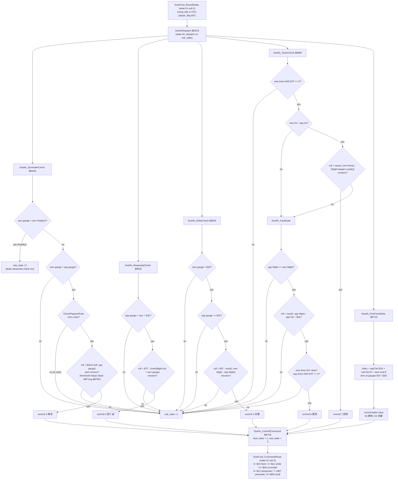

# Duel AI Decision Tree — prg_17_18.asm

Decision-tree summary of the CPU duelist's command selection in `asm/banks/prg_17_18.asm` (duel module bank pair, banks $17/$18). Companion to `code/battle_ai_decision_tree.md` (Battle Mode side director), `code/tactical_ai_decision_tree.md` (war-layer AI), and `code/strategy_ai_decision_tree.md` (strategy-layer AI, `prg_0a_0b.asm`); this document covers the **one-on-one duel (一騎討ち) AI**: the priority ladder the CPU walks each round to pick between 降参 (surrender), 捨て身の攻撃 (desperate attack), 攻撃 (strike), 説得 (persuade), 罵倒 (insult), and the 牽制/攻撃 fallback.

All addresses are ROM addresses in the $B5xx-$B8xx window of the bank pair. RAM names follow the duel-module equates (`duel_state` $04A8, `sub_state` $04A9, `active_player_slot` $04AA, `player_officer_id_0` $04AD, `player_action_timer_0` $B5 area $04B5, `war_side_strength_0` $04B1/$04B2, `duel_command_code` $04BF). Officer record fields: +0 = 体力 Vitality, +1 = 武力 Might, +2 = 知力 Intelligence, +3 = 忠誠度 Loyalty, +4 = 人徳 Virtue.

## Overview

The duel AI is a **fixed-priority gate ladder with random roll exits**, run once per CPU round. `DuelAiDispatch` ($B5C8, duel state $02) is entered from `DuelCmd_RoundSetup` (state $01 sub 0) when the acting side is CPU-controlled (player_flag bit7 set). It dispatches on `sub_state` (0-4) via `B1F_CallbackDispatcher` over an inline 5-entry pointer table; every check that fails advances `sub_state` by 1 (SurrenderCheck's "healthy" exit advances by 2), so the ladder always walks to completion and the last stage, `DuelAi_PickFeintStrike`, **always commits a command**.

Design style: not a utility budget like the battle AI — a strict if/else ladder where each stage is "danger gate AND attribute gate AND nonzero-threshold random roll". Rolls use `B1F_RandomBelow100` (returned via tail-`JMP` from every threshold helper); a threshold of 0 means the stage can never fire.

Priority order (most desperate first):

1. 降参 surrender (code 3)
2. 捨て身の攻撃 desperate attack (code 6)
3. 攻撃 strike when cornered (code 2)
4. 説得 persuade, then 罵倒 insult (codes 7 / 8)
5. fallback 牽制/攻撃 pick from the strength-tier table (codes 0 / 2)

A committed command goes through `DuelAi_CommitCommand` ($B7A8): `duel_state` = 1, `sub_state` = 3, which re-enters `DuelCmd_CommandRoute` (state $01 sub 3) so the command takes the exact same routing path as a player-issued command:

| Code | Command | Routed to |
|---|---|---|
| 0 | 牽制 feint | state $10 (FeintScene) + panel $23 |
| 2 | 攻撃 strike | state $11 (StrikeScene) + panel $21 |
| 3 | 降参 surrender | state $06 (Surrender_Execute, CheckPlayerIsRuler gate) |
| 6 | 捨て身の攻撃 desperate | state $12 (DesperateScene) + panel $24 |
| 7 | 説得 persuade | state $07 (PersuadeRollEvent) |
| 8 | 罵倒 insult | state $08 (InsultResolve_Exec) |

## Entry points

| Address | Procedure | Role |
|---|---|---|
| $B5C8 | `DuelAiDispatch` | state $02 dispatcher, 5-entry inline table |
| $B5D8 | `DuelAi_SurrenderCheck` | stage 0: surrender gate |
| $B626 | `DuelAi_DesperateCheck` | stage 1: desperate attack gate |
| $B659 | `DuelAi_StrikeCheck` | stage 2: cornered-strike gate |
| $B689 | `DuelAi_TacticCheck` | stage 3: persuade / insult gates |
| $B719 | `DuelAi_PickFeintStrike` | stage 4: fallback tier table pick |
| $B7A8 | `DuelAi_CommitCommand` | commit `duel_command_code`, return to router |
| $B7B3 | `DuelAi_SurrenderThreshold` | $8C − (Loyalty + own gauge), floored (dead code, see §1) |
| $B7DD | `DuelAi_DesperateThreshold` | $7C − (max(Might, Intelligence) + own gauge), floored |
| $B816 | `DuelAi_StrikeThreshold` | $32 − max(0, own Might − opp Might), floored |
| $B851 | `DuelAi_PersuadeThreshold` | max(0, (own Int + own Virtue) − (own Might + target Loyalty)) |
| $B89B | `DuelAi_InsultThreshold` | max(0, target Might − target Intelligence) + $0A |

## Key facts

- **Strength gauges**: `war_side_strength_0` $04B1/$04B2 are one-byte side gauges snapshotted from each commander's officer record +0 (Vitality) at duel start (`DuelScene_InitOfficers` $B16F) and decremented only by duel losses. "Own" = `war_side_strength_0[active_player_slot]`, "opponent" = `war_side_strength_0[slot EOR 1]`.
- **Scratch cell $0010/$0011**: every AI proc keeps its comparison value in $0010 (and $0011 where a second accumulator is needed). Each threshold helper stores the computed threshold in $0010 before tail-jumping to `B1F_RandomBelow100`, so the caller's `CMP $0010` after the call compares the roll against the threshold.
- **Round timers**: `player_action_timer_0` per slot; low 7 bits = rounds until the officer can use 戦術, bit 7 = insult cooldown. TacticCheck only runs when the acting officer's timer has expired.

## 1. SurrenderCheck — 降参 (code 3)

All gates must pass:

| Gate | Test |
|---|---|
| Weakened | own gauge < own Vitality/2 (record +0, `LSR`) |
| Behind | own gauge < opponent gauge |
| Disposable | `CheckPlayerIsRuler` ($D262) returns carry clear (a ruler never surrenders) |
| Roll | `B1F_RandomBelow100` roll below the threshold in $0010, which must be nonzero |

**ROM bug**: `DuelAi_SurrenderThreshold` ($B7B3) tail-`JMP`s to `B1F_GetOfficerRecordAddr` ($B7BF) instead of `JSR`, so the threshold computation ($8C − (Loyalty + own gauge), floored at 0; code at $B7C2-$B7DA) is **unreachable**. The record address helper `RTS`s straight back to SurrenderCheck, leaving $0010 holding the **opponent gauge** written before the call. The effective live behavior is therefore: *surrender fires when the roll lands below the opponent's current gauge* (and that gauge is nonzero).

Exit paths: the first gate failing (gauge ≥ Vitality/2, i.e. still healthy) advances `sub_state` **+2**, skipping the desperate check as well; every later failure advances +1.

## 2. DesperateCheck — 捨て身の攻撃 (code 6)

| Gate | Test |
|---|---|
| Badly behind | opponent gauge > own gauge + $1E |
| Roll | roll below `DuelAi_DesperateThreshold` = $7C − (max(Might, Intelligence) + own gauge), floored at 0; threshold nonzero |

Note the **max**: the `CMP`/`BCC` pair keeps the larger of record +1 (Might) and record +2 (Intelligence) — a strong officer is less likely to gamble everything.

## 3. StrikeCheck — cornered 攻撃 (code 2)

| Gate | Test |
|---|---|
| Wounded | own gauge < $1E |
| Enemy healthy | opponent gauge ≥ $32 |
| Roll | roll below `DuelAi_StrikeThreshold` = $32 − max(0, own Might − opponent Might); threshold nonzero |

$0010 is never written in StrikeCheck itself — the threshold arrives via `DuelAi_StrikeThreshold`. A Might advantage shrinks the firing window; a disadvantage raises it toward $32.

## 4. TacticCheck — 説得 (7) then 罵倒 (8)

Entry gate: own round timer (`player_action_timer_0[slot] AND $7F`) must be 0 — otherwise the whole stage is skipped (+1). The persuade gate runs first; the insult gate runs only when persuade did not fire.

**Persuade gate (code 7)** — all must pass:

| Gate | Test |
|---|---|
| Smarter | own Intelligence > opponent Intelligence (opp Int ≥ own Int fails) |
| Roll | roll below `DuelAi_PersuadeThreshold` = max(0, (own Int + own Virtue) − (own Might + target Loyalty)); threshold nonzero |

(The threshold subtracts the CPU's **own** Might — a bruiser is a worse talker — and the target's Loyalty; the same inputs that drive the player-facing 216-entry `PersuadeEventTable` math, but with a much simpler formula.)

**Insult gate (code 8)** — all must pass:

| Gate | Test |
|---|---|
| Provoked target | opponent Might ≥ own Might (the CPU only taunts rivals it does not out-muscle) |
| Roll | roll below `DuelAi_InsultThreshold` = max(0, opponent Might − opponent Intelligence) + $0A |
| No cooldown | own timer bit 7 clear |
| Target idle | opponent timer AND $7F == 0 |

## 5. PickFeintStrike — fallback 牽制 (0) / 攻撃 (2)

Always commits. Indexes the 72-byte `DuelAi_FeintStrikeTable` ($B760):

```
index = oppTier * $18 + ownTier * 8 + B1F_RandomMod8
oppTier: gauge < $1F -> 0, < $3D -> 1, else 2 (same cuts for ownTier)
table value: $00 = 牽制 (feint), $02 = 攻撃 (strike)
```

Attack probability per (opponent, own) tier — the AI presses harder when behind and toys with a weak opponent when ahead:

| opp \ own | weak (<$1F) | mid (<$3D) | strong (≥$3D) |
|---|---|---|---|
| **weak** | 5/8 攻撃 | 3/8 | 2/8 |
| **mid** | 6/8 | 4/8 | 3/8 |
| **strong** | 7/8 | 5/8 | 4/8 |

## Full decision tree



## Design notes

- **Ladder, not search**: the CPU has no lookahead — each round it re-evaluates the same static gates from the two gauges and the two officer records. All "strategy" lives in the gate constants ($1E/$32/$1F/$3D) and the threshold formulas.
- **Desperation ordering**: the most irreversible commands (surrender, desperate attack) are checked first and only while badly hurt, so a healthy CPU falls straight through to the tactic and tier stages.
- **Symmetric routing**: the AI commits command codes rather than acting directly; `DuelCmd_CommandRoute` cannot tell an AI command from a player's, so resolution (scenes, damage, persuade/insult math) is shared code.
- **One dead path**: the surrender threshold formula ($8C − (Loyalty + own gauge)) is unreachable because of the `JMP`-instead-of-`JSR` at $B7BF; the shipped game effectively rolls against the opponent's gauge. The unreachable code is retained in the disassembly and marked with a note.
- **Tier-table psychology**: the fallback matrix gives the trailing duelist up to 7/8 strikes and the leading duelist up to 6/8 feints — attrition-friendly play that stretches the duel while the gauges are lopsided.
