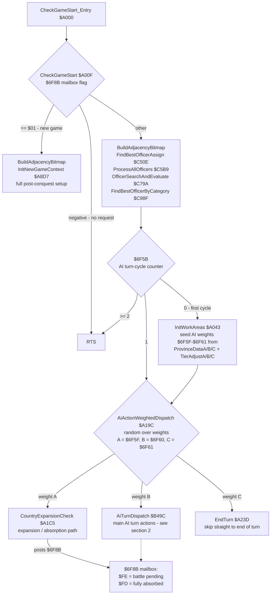
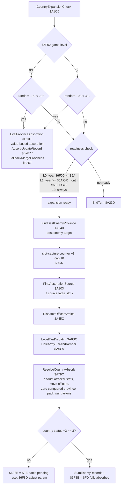
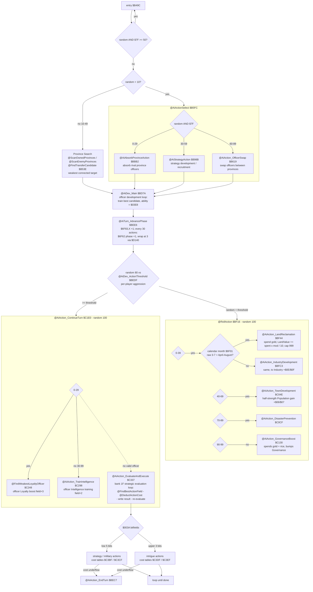
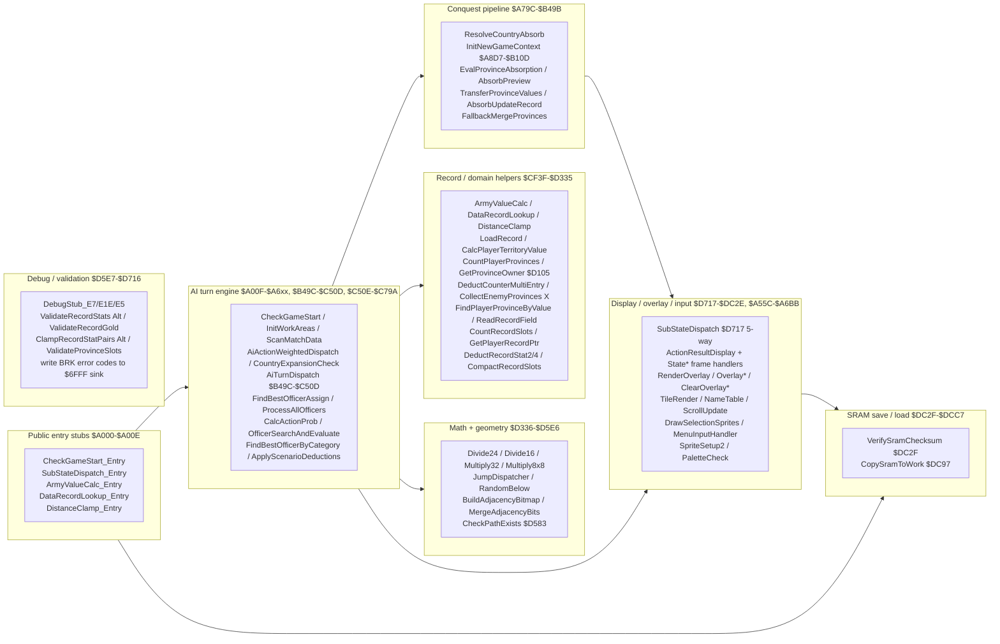

# prg_0a_0b.asm — Strategy-Mode AI architecture

Bank pair `$0A/$0B` (`$A000-$DFFF`) implements the **Strategy Mode AI**: the
per-country turn engine that expands territory, manages officers and
resources, and posts its results back to the map screen through the `$6F8B`
strategy-layer request mailbox. Naming follows
`docs/manual_kb/terminology.md` (Country / Province / Officer / Strategy /
Intrigue). All decisions below are verified against the ROM bytes.

Related documents:

- `code/ai_decision_tree.md` — the **war/battle** AI decision tree
  (`AiTurnProcess`, prg_08_09); this file covers the strategy-layer AI.
- `code/cpu_ram_map.md` — WRAM `$6Fxx` semantic map (updated with the 0a_0b
  aliases pinned during this review).
- `memory/project_tech_stack/strategy-layer-request-mailbox-protocol.md` —
  the `$6F8B` handshake contract.

---

## 1. Top-level AI decision flow

`$6F5B` (`sram_counter`) is incremented once per `InitWorkAreas` pass, so the
AI does one weight-seeding cycle, one weighted-action cycle, then idles until
the map screen calls again.

---

## 2. CountryExpansionCheck — expansion / conquest gate

---

## 3. AiTurnDispatch — main AI turn decision tree

`AiTurnDispatch` ($B49C-$C50D, `.endproc` must sit immediately before
`Proc_C50E`) is one `.proc` with ~30 nested `@`-labels. The full workflow is
documented in the proc header; the decision tree:

Per-player aggression thresholds (`@AiDev_ActionThreshold`, random-80):
P0 `$14` (25% extra action), P1 `$32` (63%), P2 `$28` (50%), P3 `$1E` (38%),
P4 `$28` (50%), P5 `$3C` (75%), P6 `$32` (63%).

---

## 4. File structure

Bank `$0A` maps at `$A000-$BFFF`, bank `$0B` at `$C000-$DFFF`; the file is one
unit with two linker segments (`CODE_BANK0A` / `CODE_BANK0B`, config
`tools/test_0a_0b.cfg`, verified by `tools/verify_0a_0b.py`).

### Proc inventory (start addresses)

| Group | Procs |
|-------|-------|
| Public stubs | `CheckGameStart_Entry` $A000, `SubStateDispatch_Entry` $A003, `ArmyValueCalc_Entry` $A006, `DataRecordLookup_Entry` $A009, `DistanceClamp_Entry` $A00C |
| AI engine | `CheckGameStart` $A00F, `InitWorkAreas` $A043, `ScanMatchData` $A0D3, `AiActionWeightedDispatch` $A19C, `CountryExpansionCheck` $A1C5, `EndTurn` $A23D, `FindBestEnemyProvince` $A240, `FindAbsorptionSource` $A303, `DispatchOfficerArmies` $A45C, `ArmyDispatch` $A481, `AiTurnDispatch` $B49C, `FindBestOfficerAssign` $C50E, `ProcessAllOfficers` $C5B9, `CalcActionProb` $C66F, `OfficerSearchAndEvaluate` $C79A, `FindBestOfficerByCategory` $C98F, `ApplyScenarioDeductions` $CD68, `BracketDeductArmy` $CEDD |
| Conquest | `ResolveCountryAbsorb` $A79C, `InitNewGameContext` $A8D7, `EvalProvinceAbsorption` $B10E, `AbsorbPreview` $B1F9, `TransferProvinceValues` $B1FD, `AbsorbUpdateRecord` $B287, `FallbackMergeProvinces` $B357 |
| Tier / render | `LevelTierDispatch` $A6BC, `CalcArmyTierAndRender` $A6C9, `CalcTierWorkPtr` $A74A, `TileRender` $A55C, `NameTable` $A60C |
| Record helpers | `ArmyValueCalc` $CF3F, `DataRecordLookup` $CF7C, `DistanceClamp` $D00C, `LoadRecord` $D03A, `CalcPlayerTerritoryValue` $D05D, `CountPlayerProvinces` $D080, `CountValidPlayerProvinces` $D0AA, `GetProvinceOwner` $D105, `DeductCounterMultiEntry` $D12D, `CollectEnemyProvinces` $D1A4, `CollectEnemyProvincesX` $D1F4, `FindPlayerProvinceByValue` $D249, `ReadRecordField` $D283, `ReadBankedRecordField` $D2D3, `CountRecordSlots` $D304, `GetPlayerRecordPtr` $D319, `DeductRecordStat2` $D36F, `DeductRecordStat4` $D3A9, `CompactRecordSlots` $D3DD |
| Math / geometry | `Divide24` $D336, `Divide16` $D40F, `Multiply32` $D438, `Multiply8x8` $D471, `JumpDispatcher` $D494, `RandomBelow` $D4AD, `BuildAdjacencyBitmap` $D4CB, `MergeAdjacencyBits` $D53E, `CheckPathExists` $D583 |
| Debug / validation | `DebugStub_E7` $D5E7, `ValidateRecordStats` $D5E8, `DebugStub_1E` $D61E, `ValidateRecordStatsAlt` $D61F, `ClampRecordStatPairs` $D655, `ValidateRecordGold` $D688, `ClampRecordStatPairsAlt` $D69D, `DebugStub_E5` $D6E5, `ValidateProvinceSlots` $D6E6 |
| Display / overlay | `SubStateDispatch` $D717, `CallStrategyModeDisplay` $D72A, `StackFill` $D732, `FillStackLoop` $D73C, `ActionResultDisplay` $D74C, `StateWait64Frames` $D799, `StateScrollDown` $D7BD, `StateSpriteAnim` $D7EC, `StateSetupParams` $D83B, `StatePaletteUpdate` $D856, `StateSetupMenu` $D890, `StateTileScroll` $D8AD, `StateWriteText` $D8D9, `StateWaitInput` $D8F8, `SkipToTileScroll` $D90D, `RenderOverlay` $D99C, `OverlayInit` $D9A8, `OverlayFillRows` $D9D0, `OverlayCommit` $DA1B, `ClearOverlay` $DA7E, `ClearOverlayInit` $DA95, `ClearOverlayMenu` $DAA6, `ClearOverlayWait` $DAFD, `ClearOverlayCopyText` $DB2B, `ClearOverlayConfirm` $DB7B, `ClearOverlayExit` $DBC1, `ClearOverlayCancel` $DBF1, `ScrollUpdate` $DCC8, `ScrollDigitWriter` $DD0F, `DrawSelectionSprites` $DD34, `WriteSingleSprite` $DD53, `MenuInputHandler` $DD79, `SpriteSetup2` $DEAF, `PaletteCheck` $DF4C |
| SRAM | `VerifySramChecksum` $DC2F, `CopySramToWork` $DC97 |

---

## 5. `$6Fxx` SRAM cells used by this bank

Review result (cross-checked against `code/cpu_ram_map.md`):

| Cell | Equate / meaning in prg_0a_0b | Notes |
|------|-------------------------------|-------|
| `$6F00` | `sram_game_year` — calendar year − 100 | Seeded `$59` (year 189) at new game (prg_1d_1e `$DE59`); expansion gate `>= $5A`; demo year tick reuse |
| `$6F01` | `sram_game_month` — calendar month − 1 | Troop reinforcement in April–August (raw 3–7); level-1 expansion gate `>= 6` (July+); demo rotation step reuse |
| `$6F02` | `sram_game_level` — difficulty 0-2 | Indexes ProvinceDataA/B/C, TierAdjustA/B/C, LevelTierDispatch, LevelActionModifiers |
| `$6F03` | `sram_player_id` — acting country slot | Owner comparisons, `@AiDev_ActionThreshold` index (`& 7`), `@ScanProvinceOwnership` |
| `$6F07-$6F3E` | Country records, 7 × 8 B (stride 8) | Read via `GetPlayerRecordPtr`/`B1F_GetCountryDataPtr`; status byte +3 gates the final absorption path |
| `$6F43` | latched result parameter | `ClearOverlayMenu` `$DAF4` |
| `$6F44` | absorbed-officer display flag | `$B783`, `$BD04` |
| `$6F5B` | `sram_counter` — AI turn-cycle counter | Dispatch selector in `CheckGameStart` |
| `$6F5D` | `sram_action_budget` — AI action-point budget | Decremented per action via `DeductCounterMultiEntry` |
| `$6F5E` | AI province cursor | Reset by `@AiTurn_AdvancePhase`, read by every action handler |
| `$6F5F-$6F61` | AI action weights A/B/C (`sram_ai_weight_a/b/c` proc-local) | Seeded by `InitWorkAreas`, consumed by `AiActionWeightedDispatch` |
| `$6F62` | AI global phase / per-officer active flag (`$6F62,Y`) | Advances every 30 actions; wraps at 3 with a game-state transition through `$D140` |
| `$6F73-$6F78` | per-owner "has provinces" marks; army-pool accumulators in `InitNewGameContext` | Dual use, documented in cpu_ram_map.md |
| `$6F8B` | `sram_game_start_flag` — strategy-layer mailbox | `$FE` battle pending, `$FD` fully absorbed posted here |
| `$6F8C` | `sram_continue_flag` — post-conquest context (0 = new-game setup) | Read/written by `InitNewGameContext` |
| `$6F8D` | `sram_absorb_adjust` — absorption adjustment parameter | Written `$AE96`, drives `ApplyScenarioDeductions` and `×4/10` scaling |
| `$6FFF` | BRK debug error-code sink | Validate routines only; outside the `$6000-$6FFD` save snapshot |

---

## 6. Review corrections applied (2026-09)

1. `$6F00`/`$6F01` were commented as "development counter" / "sub-phase
   counter" (and once as "game state"). Cross-bank evidence (prg_19_1a
   `$B9C5`/`$C3EC` reign-year/calendar comments, prg_1d_1e new-game seed
   `$59`/`$00`) proves they are the **calendar year (−100)** and **month
   (−1)** cells. Comments fixed; `sram_game_year`/`sram_game_month` equates
   added and used at the four read sites.
2. The Level-1 expansion readiness comment said `year >= 90 AND month >= 6`;
   the code implements **OR** (`BCS @expansionReady` after each check). Fixed
   in the proc header and inline.
3. `@AiAction_StatBranch` "game state 3-7" corrected to **calendar month
   4-8 (raw 3-7)** — the AI reinforces troops in spring/summer, supplies
   otherwise.
4. `$6FFF` documented as the BRK error-code sink in all five validate proc
   headers; `$6F8C`/`$6F8D`, `$6F44`, `$6F73-$6F78` aliases recorded in
   `code/cpu_ram_map.md`.
5. Terminology audit: zero stale tokens (`kingdom`, `domestic`, `entity`,
   `character`) remain — the earlier glossary alignment pass is intact.
6. Province-record "morale" deep dive (2026-09): the field does not exist in
   the game. `+$06/$07` is **Population 人口 (stored ÷100)** — proven by the
   ROM seed table (`docs/province_data.md`, bank `$30` `$8C00`, 32 B/record)
   and the human castle-development command (`prg_1b_1c.asm`
   `CastleDevFieldOffsetTable`: `+$08` land, `+$0E` industry, `+$06`
   population, `+$0A` disaster prevention). The whole province record table in
   `code/cpu_ram_map.md` was realigned: Rice `+$04/$05`, LandValue `+$08/$09`,
   DisasterPrevention `+$0A`, Governance `+$0B`, ReserveTroops `+$0C/$0D`
   (cap 10000), Industry `+$0E/$0F`, Treasure `+$10`, RevoltCooldown `+$1B`.
7. AI action renames (proc-local `@`-labels, byte-neutral; ca65 error set
   unchanged): `@AiAction_ReinforceTroops`→`@AiAction_LandReclamation`,
   `@AiAction_ReinforceSupplies`→`@AiAction_IndustryDevelopment`,
   `@AiAction_BoostMorale`→`@AiAction_TownDevelopment`,
   `@AiAction_SmallStatBoost`→`@AiAction_DisasterPrevention`,
   `@AiAction_CompositeBoost`→`@AiAction_GovernanceBoost`,
   `@AiAction_ManageOfficerLoyalty`→`@AiAction_TrainIntelligence` (targets
   officer `+$02` Intelligence, not Loyalty),
   `@AddLoyaltyBonus_*`→`@AddGovernanceBump_*` (bumps province `+$0B`
   Governance, matching `CastleDevFieldAddCapped`).
8. Gain-formula corrections: the development actions **spend resources
   first** — `DeductRecordStat2` deducts `base + random($24)` from Gold
   (`+$02/$03`), `DeductRecordStat4` does the same on Rice (`+$04/$05`);
   the added amount is `spent × level_mod / 10` (TownDevelopment halves it;
   GovernanceBoost divides gold+rice spend by `mod[6]`). The old
   "(province_idx × $0E × mod)" comments misread the calling convention.

Verification: standalone `ca65` on this file produces the identical
pre-existing error set (48 duplicate-symbol errors, line numbers shifted
only); all edits are comments, equate definitions, or equal-valued equate
substitutions, so assembled bytes are unchanged.
