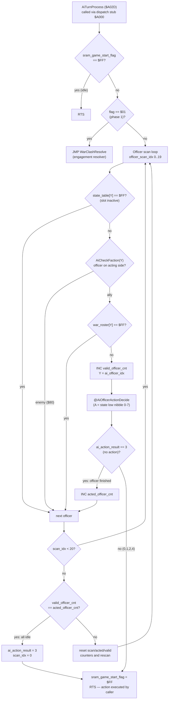
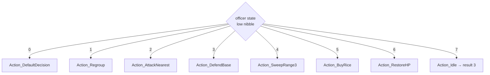
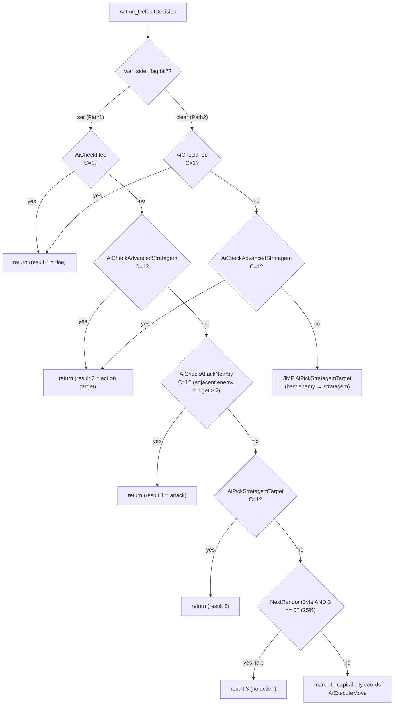
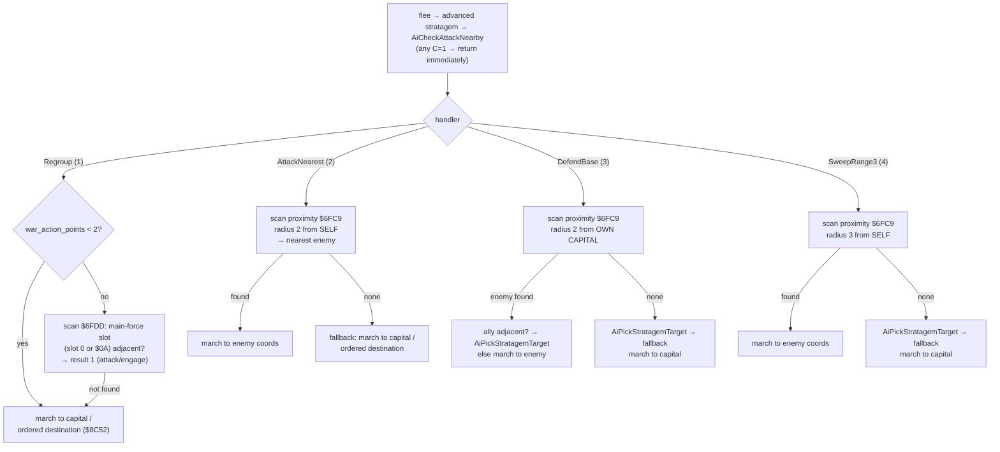
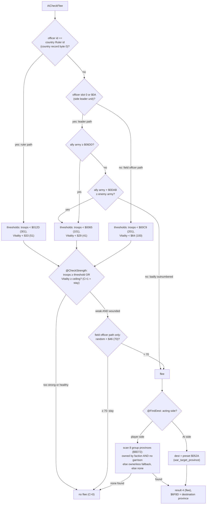
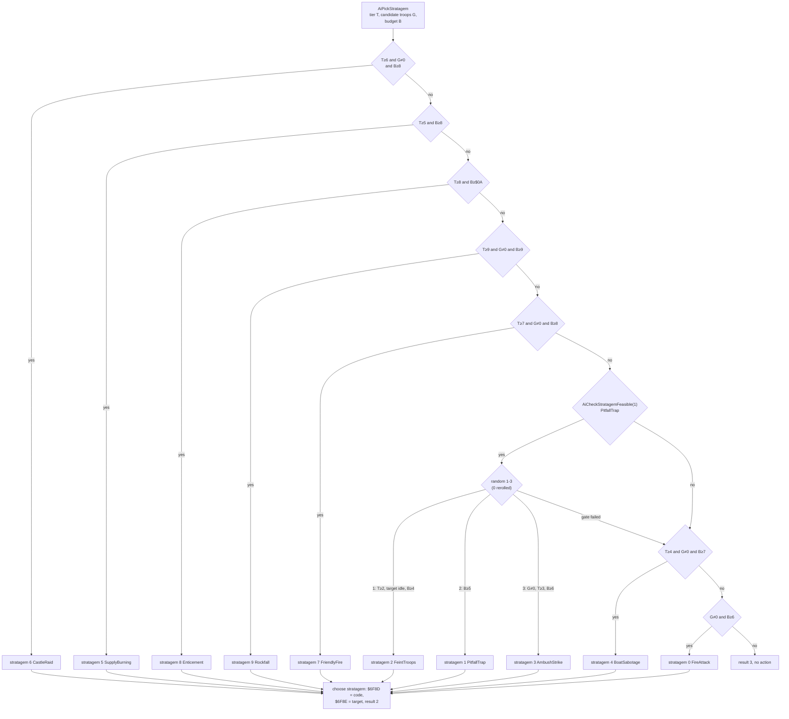
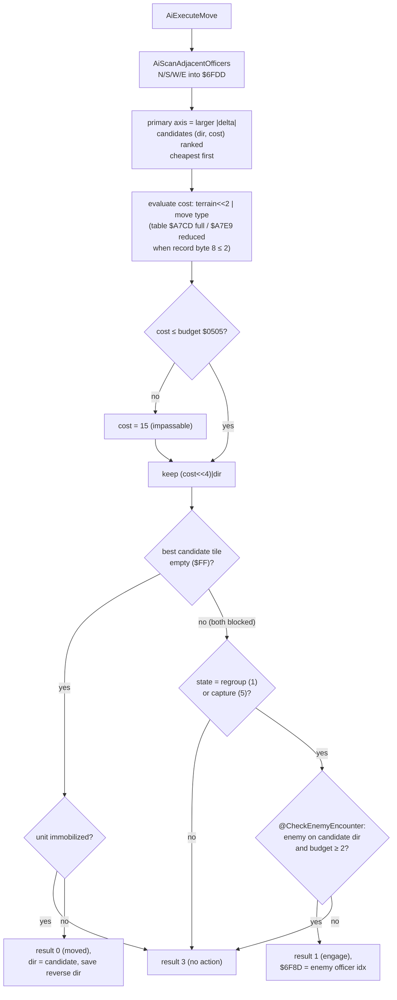

# Battle AI Decision Tree — prg_08_09.asm (`AiTurnProcess`, $A02D–$B12F)

Source: `asm/banks/prg_08_09.asm`, `.proc AiTurnProcess` and its nested helpers.
All decisions below are reconstructed from the byte-exact disassembly.

## Key inputs

| RAM | Meaning |
|-----|---------|
| `sram_game_start_flag` ($6F8B) | Turn state: `$FF` = turn complete/idle, `$01` = phase 1 (→ `WarClashResolve`) |
| `war_side_flag` ($0504) | Acting side (bit7 = AI side acting) |
| `war_action_points` ($0505) | AI action budget (attacking costs 2; stratagems cost 4–$0C) |
| `war_faction_pair` ($0507) | lo = side0 faction, hi = side1 faction |
| `officer_state_table` ($6FA1,Y) | Officer state; **low nibble = AI action type 0–7** |
| `ai_action_result` ($6F8F) | Result code: 0=moved, 1=attack/engage, 2=act on target (stratagem), 3=no action, 4=flee |
| `ai_officer_idx` ($6F8C), `ai_target_slot` ($6F8D), `ai_target_officer` ($6F8E) | Current officer / chosen action code or direction / target officer slot |

## Master decision tree

## Action-type dispatch (`@AiOfficerActionDecide`, $A099)

The officer state's **low nibble** selects one of 8 handlers through the inline
`CallbackDispatcher` table at $A0A1:

| Nibble | Handler | Behavior |
|--------|---------|----------|
| 0 | `Action_DefaultDecision` | Priority chain: flee → advanced stratagem → attack → stratagem vs best enemy → random idle → march |
| 1 | `Action_Regroup` | Rejoin main force / march to capital or ordered destination |
| 2 | `Action_AttackNearest` | Attack nearest enemy within range 2 of self |
| 3 | `Action_DefendBase` | Intercept nearest enemy within range 2 of own capital |
| 4 | `Action_SweepRange3` | Attack nearest enemy within range 3 of self |
| 5 | `Action_BuyRice` | March to ordered province ($9BA4); on arrival **buy rice with gold** (up to 70% of remaining gold) |
| 6 | `Action_RestoreHP` | March to province entry+4, pay 50 gold, heal random 0–10 (cap at base HP) |
| 7 | `Action_Idle` | Result 3 (no action) |

## Action 0: Default decision priority chain ($A0B1)

## Actions 1–4: common sub-chain and scans

All of `Action_Regroup`, `Action_AttackNearest`, `Action_DefendBase`,
`Action_SweepRange3` first run the same **flee → stratagem → adjacent-attack**
cascade, then diverge:

## Action 5/6: buy rice and heal (arrive → effect)

- **BuyRice ($A329):** march to `$9BA4[$050E*3]` (bank $31). When
  `ai_action_result == 0` (arrived): set state nibble to 7 (done), then
  **buy rice with gold** — verified rice-for-gold transaction:
  `rice_needed = troops * 4 / 1000 * days_remaining` (AiComputeBattleStats,
  i.e. consumption for the rest of the 30-day month); `shortfall =
  rice_needed - remaining_rice` ($0522); `gold_cost = shortfall * 100 /
  ProvinceRiceBuyRate[$050E]` ($8FC0 bank $30 — the same buy-rate table as
  the market, rice per 100 gold: 68, 0, 86, 57, 79, 0, ...); spending is
  capped at `remaining_gold * 7 / 10` ($0526). Affordable → gold -= cost,
  rice += shortfall; otherwise → spend the whole 70% cap (`gold -= cap`,
  `rice += cap * rate / 100`). War resources were verified via war setup
  (prg_0a_0b $A84E: province record +2/+3 gold → $0526, +4/+5 rice → $0522),
  the war-end write-back, and the market states of AiOfficerActionDispatch.
- **RestoreHP ($A507):** march to `$9BA4[$050E*3 + 4]`. When arrived: abort if
  faction gold < 50, else deduct 50 gold, roll `random & $0F` (reroll ≥ $0B →
  0–10), boost HP +$23 offset, clamp to banked base record HP. State nibble → 7.

## `AiCheckFlee` ($AF0D) — retreat decision tree

## `AiCheckAdvancedStratagem` ($AAF8) — caster gates and advanced stratagems ($0A–$0F)

Self gates: officer record **field +2 (rating) ≥ $5C** and **field +11 high
nibble (rank) ≥ 3**. Then candidates = enemies within radius 5, sorted by
troop strength (strongest first). Per candidate, try stratagems $0A–$0F
(ChainLink/TenfoldAmbush/FloodAttack/RepeatingCrossbow/Inferno/MysticalStasis)
in order; each additionally requires `AiCheckStratagemFeasible`:

| Stratagem | Rank gate | Officer-table group | Extra condition | Budget ($0505) |
|--------|-----------|-------------------|-----------------|----------------|
| $0A | ≥ 3 | offset $00 | candidate idle (immobilized low nibble = 0) | ≥ 9 |
| $0B | ≥ 3 | offset $00 | — | ≥ $0A |
| $0C | ≥ 4 | offset $0B | candidate has troops | ≥ $0A |
| $0D | ≥ 4 | offset $0B | candidate has troops | ≥ 8 |
| $0E | ≥ 5 | offset $11 | candidate has troops | ≥ $0C |
| $0F | ≥ 6 | self officer id == $6D | candidate state high nibble clear | ≥ $0A |

Success → result 2, `$6F8D` = stratagem code, `$6F8E` = target officer.
`AiAdvancedStratagemOfficerTable` ($AC65) lists eligible self **officer ids**
per rank group ($FF-terminated); the caster's id (from `war_roster`) must be
listed. Stratagem 8 (Enticement, 籠絡) is NOT part of this routine — it is
requested only by `AiPickStratagem` (tier ≥ 8, budget ≥ $0A).

## `AiPickStratagemTarget` + `AiPickStratagem` ($A95C/$A9CF) — stratagem target + code selection

1. **Rating tier** from record field +2: `< $28`→1, `< $3C`→3, `< $4B`→5,
   `< $55`→7, else 9.
2. Scan enemies within radius 5 (`AiFindNearbyOfficers`), compact and sort by
   troop strength (`AiSortNearbyOfficers`, strongest first).
3. For each candidate, run the feasibility cascade below. The **first candidate**
   with any feasible stratagem wins (result 2); the code is whatever the cascade
   picks — there is no best-stratagem search across candidates.

Every stratagem code is finally gated by `AiCheckStratagemFeasible` ($AC7B), which
computes terrain at the **target** ($0028) and at **self** ($0029) and
dispatches per stratagem:

| Code | Stratagem | Feasibility condition (terrain: 0=woods, 2=plains, 3=water, 4=mountain, 5=castle) |
|------|-----------|-----------------------------------------------------------------------------------|
| 0 | FireAttack 火攻 | target terrain = 0 or 2 |
| 1 | PitfallTrap 陷阱 | target terrain = 0 or 4 |
| 2 | FeintTroops 虚兵 | (alias of 1) |
| 3 | AmbushStrike 要击 | (alias of 1) |
| 4 | BoatSabotage 乱水 | target terrain = 3 |
| 5 | SupplyBurning 火箭 | target slot = faction base (0 or $0A) |
| 6 | CastleRaid 伪击转杀 | target terrain = 5 AND self adjacent to target |
| 7 | FriendlyFire 共杀 | target terrain = 0 or 4 AND enemy adjacent to target |
| 8 | Enticement 笼络 | target terrain ≠ 5 AND target record +3 < $32 |
| 9 | Rockfall 落石 | self terrain = 4 or 5 AND target adjacent to self AND target terrain = 5 |
| 10 | ChainLink 连环 | target terrain = 3 AND an adjacent enemy officer stands on terrain 3 |
| 11 | TenfoldAmbush 十面埋伏 | self terrain = 0 AND (record +9 ≠ 0 or record +8 ≥ $64) AND faction $04D8 slot empty |
| 12 | FloodAttack 水攻 | (alias of 10) |
| 13 | RepeatingCrossbow 連弩 | self terrain = 5 AND target adjacent to self |
| 14 | Inferno 劫火 | target terrain ≠ 5 AND an adjacent enemy officer NOT on terrain 5 |
| 15 | MysticalStasis 奇门遁甲 | target terrain ≠ 5 AND (record +1 ≥ $55 or record +2 ≥ $55) AND record +9 ≥ 2 AND record +8 ≥ $BC |

## `AiExecuteMove` ($A60C) — movement engine

Input: target ($0020,$0021). Output: `ai_action_result` (0/1/3), direction in
`ai_target_slot` ($6F8D), step cost in `ai_move_cost` ($6F97).

## Support routines

- **AiScanAdjacentOfficers** ($A837): fills `$6FDD-$6FE0` with N/S/W/E
  occupant = officer index | faction bit ($80 = enemy), `$FF` = empty.
- **AiCheckFaction** ($A944): enemy iff bit7($0504) ≠ bit7($0628,Y); returns
  $80/$00. (Byte-identical duplicate at $CC92 must remain for ROM parity.)
- **AiFindNearbyOfficers** ($A8D3): radius scan into `$6FC9` —
  bit7 = enemy, bits0-6 = Manhattan distance.
- **AiSortNearbyOfficers** ($AE93): compacts enemy slots, bubble-sorts by
  16-bit troop count (record +8/+9), strongest first.
- **AiComputeArmyStats** ($B067) / **AiComputeBattleStats** ($B0B8): ally/enemy
  16-bit troop totals; battle stats time-scaled by `total * 4 / 1000 *
  days_remaining` where `days_remaining = $1E − war_round_counter`.
