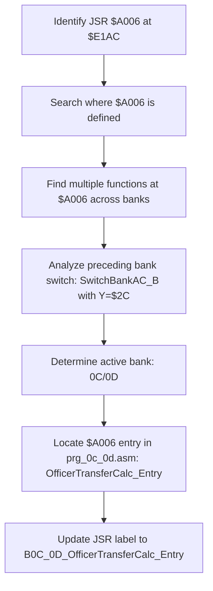

# Correcting cross-bank JSR references using context-aware symbol resolution

- **Category:** task_summary_experience
- **Memory ID:** 8190fd89-feb7-40c5-a00e-a117f0cbf5ec
- **Keywords:** bank switching, symbol resolution, JSR reference, context-aware labeling

## Content

## Task Description
Update the JSR at $E1AC to use the correct function name (`B0C_0D_OfficerTransferCalc_Entry`) based on active bank context after `SwitchBankAC_B`.

## Execution Process

## Task Summary
Successfully corrected symbolic reference from `B17_18_PpuWriteTileOffset` to `B0C_0D_OfficerTransferCalc_Entry`, ensuring accurate representation of the intended function call within the proper bank context. Binary output remains unchanged; only source clarity improved.
