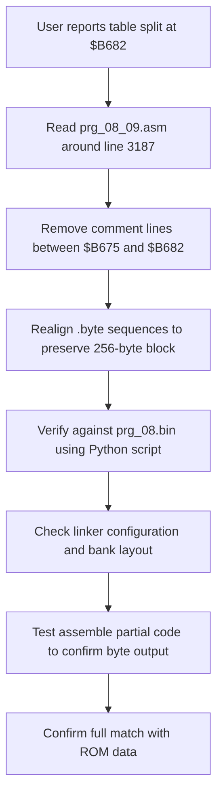

# Fix ROM table fragmentation in disassembly

- **Category:** task_summary_experience
- **Memory ID:** 9c0c5344-7d0e-49a5-8d6f-0fbce4ef5d46
- **Keywords:** ROM table, disassembly fix, byte alignment, ca65, binary verification

## Content

## Task description
Fix the incorrectly split 256-byte table in prg_08_09.asm that spans $B5E5–$B6E4 by removing spurious comment lines and ensuring contiguous .byte directives.

## Execution process

## Task summary
Successfully merged the fragmented table by removing incorrect comments and realigning .byte statements. Verified through direct binary comparison that the assembled output matches the original ROM exactly (256 bytes, full match). Ensured no unintended changes were introduced.
